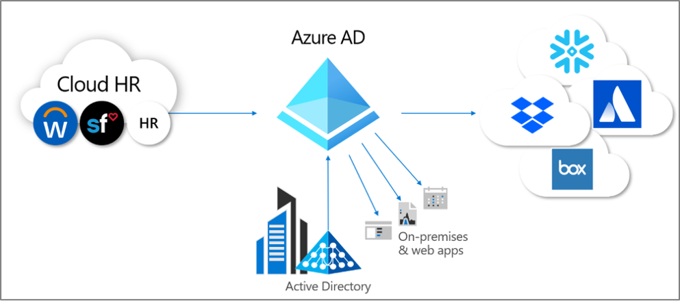
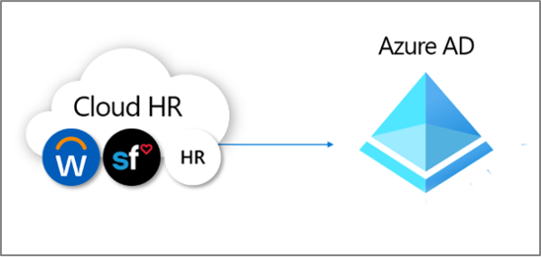
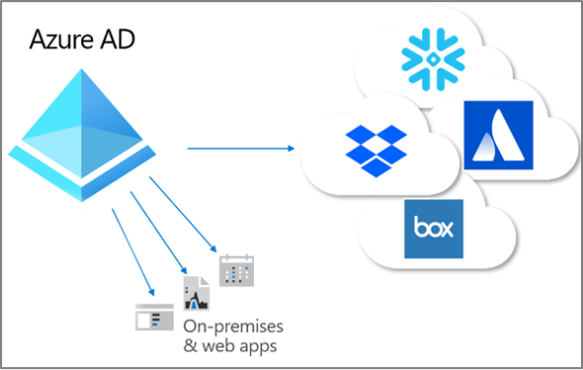
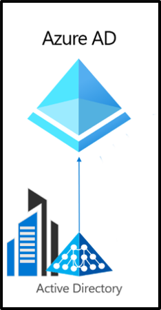

# What is provisioning?

Provisioning and deprovisioning are the processes that ensure consistency of digital identities across multiple systems.  These processes are typically leveraged as part of [identity lifecycle management](what-is-identity-lifecycle-management.md).

**Provisioning** is the processes of creating an identity in a target system based on certain conditions.  **De-provisioning** is the process of removing the identity from the target system, when conditions are no longer met. **Synchronization** is the process of keeping the provisioned object, up to date, so that the source object and target object are similar.

For example, when a new employee joins your organization, that employee is entered in to the HR system.  At that point, provisioning **from** HR **to** Azure Active Directory (Azure AD) can create a corresponding user account in Azure AD. Applications which query Azure AD can see the account for that new employee.  If there are applications that do not use Azure AD, then provisioning **from** Azure AD **to** those applications' databases, ensures that the user will be able to access all of the applications that the user needs access to.  This process allows the user to start work and have access to the applications and systems they need on day one.  Similarly, when their properties, such as their department or employment status, change in the HR system, synchronization of those updates from the HR system to Azure AD, and furthermore to other applications and target databases, ensures consistency.

Azure AD currently provides three areas of automated provisioning.  They are:  

- Provisioning from an external non-directory authoritative system of record to Azure AD, via **[HR-driven provisioning](#hr-driven-provisioning)**  
- Provisioning from Azure AD to applications, via **[App provisioning](#app-provisioning)**  
- Provisioning between Azure AD and Active Directory domain services, via **[inter-directory provisioning](#inter-directory-provisioning)** 

## HR-driven provisioning

Provisioning from HR to Azure AD involves the creation of objects, typically user identities representing each employee, but in some cases other objects representing departments or other structures, based on the information that is in your HR system.  

The most common scenario would be, when a new employee joins your company, they are entered into the HR system.  Once that occurs, they are automatically provisioned as a new user in Azure AD, without needing administrative involvement for each new hire.  In general, provisioning from HR can cover the following scenarios.

- **Hiring new employees** - When a new employee is added to a HR system, a user account is automatically created in Active Directory, Azure AD, and optionally in the directories for other  applications supported by Azure AD, with write-back of the email address to the HR system.
- **Employee attribute and profile updates** - When an employee record is updated in that HR system (such as their name, title, or manager), their user account will be automatically updated in Active Directory, Azure AD, and optionally other applications supported by Azure AD.
- **Employee terminations** - When an employee is terminated in HR, their user account is automatically blocked from sign in or removed in Active Directory, Azure AD, and in other applications.
- **Employee rehires** - When an employee is rehired in cloud HR, their old account can be automatically reactivated or re-provisioned (depending on your preference).

There are three deployment options for HR-driven provisioning with Azure AD:

1. For organizations with a single subscription to Workday or SuccessFactors, and do not use Active Directory
1. For organizations with a single subscription to Workday or SuccessFactors, and have both Active Directory and Azure AD
1. For organizations with multiple HR systems, or an on-premises HR system such as SAP, Oracle eBusiness or PeopleSoft

For more information, see [What is HR driven provisioning?](what-is-hr-driven-provisioning.md)

## App provisioning

In Azure AD, the term **[app provisioning](https://docs.microsoft.com/azure/active-directory/manage-apps/user-provisioning)** refers to automatically creating copies of user identities in the applications that users need access to, for applications that have their own data store, distinct from Azure AD or Active Directory. In addition to creating user identities, app provisioning includes the maintenance and removal of user identities from those apps, as the user's status or roles change. Common scenarios include provisioning an Azure AD user into applications like [Dropbox](https://docs.microsoft.com/azure/active-directory/saas-apps/dropboxforbusiness-provisioning-tutorial), [Salesforce](https://docs.microsoft.com/azure/active-directory/saas-apps/salesforce-provisioning-tutorial), [ServiceNow](https://docs.microsoft.com/azure/active-directory/saas-apps/servicenow-provisioning-tutorial), as each of these applications have their own user repository distinct from Azure AD.

For more information, see [What is app provisioning?](what-is-app-provisioning.md)

## Inter-directory provisioning

Many organizations rely upon both Active Directory and Azure AD, and may have applications connected to Active Directory, such as on-premises file servers.

As many organizations historically have deployed HR-driven provisioning on-premises, they may already have user identities for all their employees in Active Directory.   The most common scenario for inter-directory provisioning is when a user already in Active Directory is provisioned into Azure AD.  This provisioning is usually accomplished by Azure AD Connect sync or Azure AD Connect cloud provisioning. 

In addition, organizations may wish to also provision to on-premises systems from Azure AD.  For example, an organization may have brought guests into the Azure AD directory, but those guests will need access to on-premises Windows Integrated Authentication (WIA) based web applications via the app proxy.  This requires the provisioning of on-premises AD accounts for those users in Azure AD.

For more information, see [What is inter-directory provisioning?](what-is-inter-directory-provisioning.md)

 
## Next steps 
- [What is identity lifecycle management?](what-is-identity-lifecycle-management.md)
- [What is HR driven provisioning?](what-is-hr-driven-provisioning.md)
- [What is app provisioning?](what-is-app-provisioning.md)
- [What is inter-directory provisioning?](what-is-inter-directory-provisioning.md)
