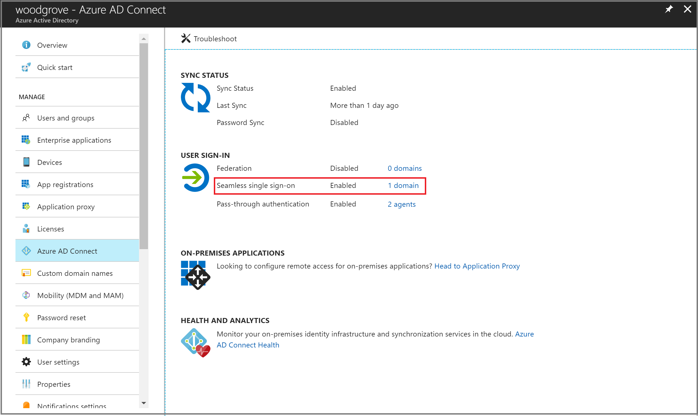
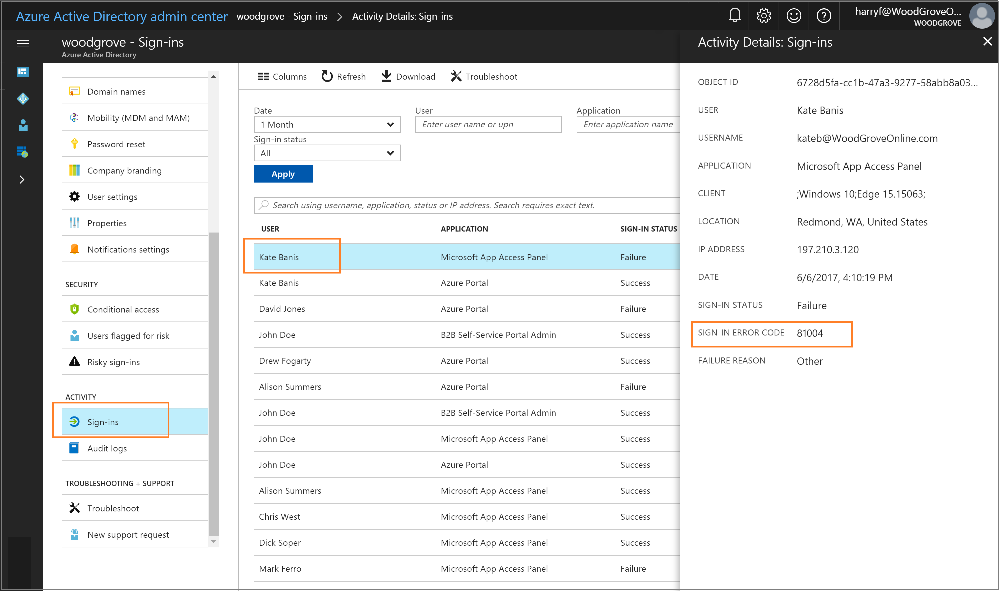

# Troubleshoot Azure Active Directory Seamless Single Sign-On

This article helps you find troubleshooting information about common problems regarding Azure Active Directory (Azure AD) Seamless Single Sign-On (Seamless SSO).

## Known issues

- In a few cases, enabling Seamless SSO can take up to 30 minutes.
- If you disable and re-enable Seamless SSO on your tenant, users will not get the single sign-on experience till their cached Kerberos tickets, typically valid for 10 hours, have expired.
- Microsoft Edge browser support is not available.
- If Seamless SSO succeeds, the user does not have the opportunity to select **Keep me signed in**. Due to this behavior, [SharePoint and OneDrive mapping scenarios](https://support.microsoft.com/help/2616712/how-to-configure-and-to-troubleshoot-mapped-network-drives-that-connec) don't work.
- Office 365 Win32 clients (Outlook, Word, Excel, and others) with versions 16.0.8730.xxxx and above are supported using a non-interactive flow. Other versions are not supported; on those versions, users will enter their usernames, but not passwords, to sign-in. For OneDrive, you will have to activate the [OneDrive silent config feature](https://techcommunity.microsoft.com/t5/Microsoft-OneDrive-Blog/Previews-for-Silent-Sync-Account-Configuration-and-Bandwidth/ba-p/120894) for a silent sign-on experience.
- Seamless SSO doesn't work in private browsing mode on Firefox.
- Seamless SSO doesn't work in Internet Explorer when Enhanced Protected mode is turned on.
- Seamless SSO doesn't work on mobile browsers on iOS and Android.
- If a user is part of too many groups in Active Directory, the user's Kerberos ticket will likely be too large to process, and this will cause Seamless SSO to fail. Azure AD HTTPS requests can have headers with a maximum size of 50 KB; Kerberos tickets need to be smaller than that limit to accommodate other Azure AD artifacts (typically, 2 - 5 KB) such as cookies. Our recommendation is to reduce user's group memberships and try again.
- If you're synchronizing 30 or more Active Directory forests, you can't enable Seamless SSO through Azure AD Connect. As a workaround, you can [manually enable](#manual-reset-of-the-feature) the feature on your tenant.
- Adding the Azure AD service URL (https://autologon.microsoftazuread-sso.com) to the Trusted sites zone instead of the Local intranet zone *blocks users from signing in*.
- Seamless SSO uses the **RC4_HMAC_MD5** encryption type for Kerberos. Disabling the use of the **RC4_HMAC_MD5** encryption type in your Active Directory settings will break Seamless SSO. In your Group Policy Management Editor tool ensure that the policy value for **RC4_HMAC_MD5** under **Computer Configuration -> Windows Settings -> Security Settings -> Local Policies -> Security Options -> "Network Security: Configure encryption types allowed for Kerberos"** is **enabled**. In addition, Seamless SSO can't use other encryption types, so ensure that they are **disabled**.

## Check status of feature

Ensure that the Seamless SSO feature is still **Enabled** on your tenant. You can check the status by going to the **Azure AD Connect** pane in the [Azure Active Directory admin center](https://aad.portal.azure.com/).



Click through to see all the AD forests that have been enabled for Seamless SSO.


## Sign-in failure reasons in the Azure Active Directory admin center (needs a Premium license)

If your tenant has an Azure AD Premium license associated with it, you can also look at the [sign-in activity report](../reports-monitoring/concept-sign-ins.md) in the [Azure Active Directory admin center](https://aad.portal.azure.com/).



Browse to **Azure Active Directory** > **Sign-ins** in the [Azure Active Directory admin center](https://aad.portal.azure.com/), and then select a specific user's sign-in activity. Look for the **SIGN-IN ERROR CODE** field. Map the value of that field to a failure reason and resolution by using the following table:

|Sign-in error code|Sign-in failure reason|Resolution
| --- | --- | ---
| 81001 | User's Kerberos ticket is too large. | Reduce the user's group memberships and try again.
| 81002 | Unable to validate the user's Kerberos ticket. | See the [troubleshooting checklist](#troubleshooting-checklist).
| 81003 | Unable to validate the user's Kerberos ticket. | See the [troubleshooting checklist](#troubleshooting-checklist).
| 81004 | Kerberos authentication attempt failed. | See the [troubleshooting checklist](#troubleshooting-checklist).
| 81008 | Unable to validate the user's Kerberos ticket. | See the [troubleshooting checklist](#troubleshooting-checklist).
| 81009 | Unable to validate the user's Kerberos ticket. | See the [troubleshooting checklist](#troubleshooting-checklist).
| 81010 | Seamless SSO failed because the user's Kerberos ticket has expired or is invalid. | The user needs to sign in from a domain-joined device inside your corporate network.
| 81011 | Unable to find the user object based on the information in the user's Kerberos ticket. | Use Azure AD Connect to synchronize the user's information into Azure AD.
| 81012 | The user trying to sign in to Azure AD is different from the user that is signed in to the device. | The user needs to sign in from a different device.
| 81013 | Unable to find the user object based on the information in the user's Kerberos ticket. |Use Azure AD Connect to synchronize the user's information into Azure AD. 

## Troubleshooting checklist

Use the following checklist to troubleshoot Seamless SSO problems:

- Ensure that the Seamless SSO feature is enabled in Azure AD Connect. If you can't enable the feature (for example, due to a blocked port), ensure that you have all the [prerequisites](how-to-connect-sso-quick-start.md#step-1-check-the-prerequisites) in place.
- If you have enabled both [Azure AD Join](../active-directory-azureadjoin-overview.md) and Seamless SSO on your tenant, ensure that the issue is not with Azure AD Join. SSO from Azure AD Join takes precedence over Seamless SSO if the device is both registered with Azure AD and domain-joined. With SSO from Azure AD Join the user sees a sign-in tile that says "Connected to Windows".
- Ensure that the Azure AD URL (https://autologon.microsoftazuread-sso.com) is part of the user's Intranet zone settings.
- Ensure that the corporate device is joined to the Active Directory domain. The device _doesn't_ need to be [Azure AD Joined](../active-directory-azureadjoin-overview.md) for Seamless SSO to work.
- Ensure that the user is logged on to the device through an Active Directory domain account.
- Ensure that the user's account is from an Active Directory forest where Seamless SSO has been set up.
- Ensure that the device is connected to the corporate network.
- Ensure that the device's time is synchronized with the time in both Active Directory and the domain controllers, and that they are within five minutes of each other.
- Ensure that the `AZUREADSSOACC` computer account is present and enabled in each AD forest that you want Seamless SSO enabled. If the computer account has been deleted or is missing, you can use [PowerShell cmdlets](#manual-reset-of-the-feature) to re-create them.
- List the existing Kerberos tickets on the device by using the `klist` command from a command prompt. Ensure that the tickets issued for the `AZUREADSSOACC` computer account are present. Users' Kerberos tickets are typically valid for 10 hours. You might have different settings in Active Directory.
- If you disabled and re-enabled Seamless SSO on your tenant, users will not get the single sign-on experience till their cached Kerberos tickets have expired.
- Purge existing Kerberos tickets from the device by using the `klist purge` command, and try again.
- To determine if there are JavaScript-related problems, review the console logs of the browser (under **Developer Tools**).
- Review the [domain controller logs](#domain-controller-logs).

### Domain controller logs

If you enable success auditing on your domain controller, then every time a user signs in through Seamless SSO, a security entry is recorded in the event log. You can find these security events by using the following query. (Look for event **4769** associated with the computer account **AzureADSSOAcc$**.)

```
	<QueryList>
	  <Query Id="0" Path="Security">
	<Select Path="Security">*[EventData[Data[@Name='ServiceName'] and (Data='AZUREADSSOACC$')]]</Select>
	  </Query>
	</QueryList>
```

## Manual reset of the feature

If troubleshooting didn't help, you can manually reset the feature on your tenant. Follow these steps on the on-premises server where you're running Azure AD Connect.

### Step 1: Import the Seamless SSO PowerShell module

1. First, download, and install [Azure AD PowerShell](https://docs.microsoft.com/powershell/azure/active-directory/overview).
2. Browse to the `%programfiles%\Microsoft Azure Active Directory Connect` folder.
3. Import the Seamless SSO PowerShell module by using this command: `Import-Module .\AzureADSSO.psd1`.

### Step 2: Get the list of Active Directory forests on which Seamless SSO has been enabled

1. Run PowerShell as an administrator. In PowerShell, call `New-AzureADSSOAuthenticationContext`. When prompted, enter your tenant's global administrator credentials.
2. Call `Get-AzureADSSOStatus`. This command provides you with the list of Active Directory forests (look at the "Domains" list) on which this feature has been enabled.

### Step 3: Disable Seamless SSO for each Active Directory forest where you've set up the feature

1. Call `$creds = Get-Credential`. When prompted, enter the domain administrator credentials for the intended Active Directory forest.

   > [!NOTE]
   > We use the Domain Administrator's username, provided in the User Principal Names (UPN) (johndoe@contoso.com) format or the domain qualified sam-account name (contoso\johndoe or contoso.com\johndoe) format, to find the intended AD forest. If you use domain qualified sam-account name, we use the domain portion of the username to [locate the Domain Controller of the Domain Administrator using DNS](https://social.technet.microsoft.com/wiki/contents/articles/24457.how-domain-controllers-are-located-in-windows.aspx). If you use UPN instead, we [translate it to a domain qualified sam-account name](https://docs.microsoft.com/windows/desktop/api/ntdsapi/nf-ntdsapi-dscracknamesa) before locating the appropriate Domain Controller.

2. Call `Disable-AzureADSSOForest -OnPremCredentials $creds`. This command removes the `AZUREADSSOACC` computer account from the on-premises domain controller for this specific Active Directory forest.
3. Repeat the preceding steps for each Active Directory forest where you’ve set up the feature.

### Step 4: Enable Seamless SSO for each Active Directory forest

1. Call `Enable-AzureADSSOForest`. When prompted, enter the domain administrator credentials for the intended Active Directory forest.

   > [!NOTE]
   > We use the Domain Administrator's username, provided in the User Principal Names (UPN) (johndoe@contoso.com) format or the domain qualified sam-account name (contoso\johndoe or contoso.com\johndoe) format, to find the intended AD forest. If you use domain qualified sam-account name, we use the domain portion of the username to [locate the Domain Controller of the Domain Administrator using DNS](https://social.technet.microsoft.com/wiki/contents/articles/24457.how-domain-controllers-are-located-in-windows.aspx). If you use UPN instead, we [translate it to a domain qualified sam-account name](https://docs.microsoft.com/windows/desktop/api/ntdsapi/nf-ntdsapi-dscracknamesa) before locating the appropriate Domain Controller.

2. Repeat the preceding step for each Active Directory forest where you want to set up the feature.

### Step 5. Enable the feature on your tenant

To turn on the feature on your tenant, call `Enable-AzureADSSO -Enable $true`.
