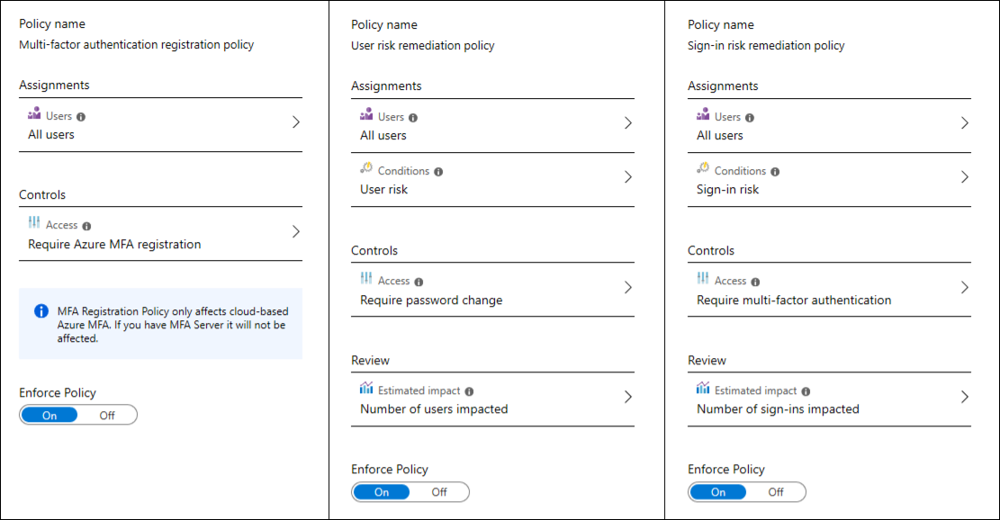
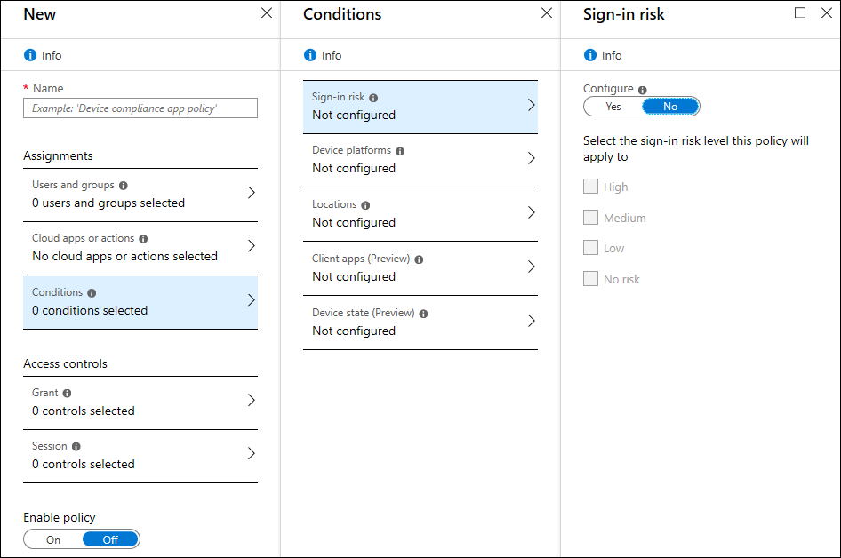

# Identity Protection policies

Azure Active Directory Identity Protection includes three default policies that administrators can choose to enable. These policies include limited customization but are applicable to most organizations. All of the policies allow for excluding users such as your [emergency access or break-glass administrator accounts](../roles/security-emergency-access.md).

## Azure MFA registration policy

Identity Protection can help organizations roll out Azure Multi-Factor Authentication (MFA) using a Conditional Access policy requiring registration at sign-in. Enabling this policy is a great way to ensure new users in your organization have registered for MFA on their first day. Multi-factor authentication is one of the self-remediation methods for risk events within Identity Protection. Self-remediation allows your users to take action on their own to reduce helpdesk call volume.

More information about Azure Multi-Factor Authentication can be found in the article, [How it works: Azure Multi-Factor Authentication](../authentication/concept-mfa-howitworks.md).

## Sign-in risk policy

Identity Protection analyzes signals from each sign-in, both real-time and offline, and calculates a risk score based on the probability that the sign-in wasn't performed by the user. Administrators can make a decision based on this risk score signal to enforce organizational requirements. Administrators can choose to block access, allow access, or allow access but require multi-factor authentication.

If risk is detected, users can perform multi-factor authentication to self-remediate and close the risky sign-in event to prevent unnecessary noise for administrators.

> [!NOTE] 
> Users must have previously registered for Azure Multi-Factor Authentication before triggering the sign-in risk policy.

### Custom Conditional Access policy

Administrators can also choose to create a custom Conditional Access policy including sign-in risk as an assignment condition. More information about risk as a condition in a Conditional Access policy can be found in the article, [Conditional Access: Conditions](../conditional-access/concept-conditional-access-conditions.md#sign-in-risk)

## User risk policy

Identity Protection can calculate what it believes is normal for a user's behavior and use that to base decisions for their risk. User risk is a calculation of probability that an identity has been compromised. Administrators can make a decision based on this risk score signal to enforce organizational requirements. Administrators can choose to block access, allow access, or allow access but require a password change using [Azure AD self-service password reset](../authentication/howto-sspr-deployment.md).

If risk is detected, users can perform self-service password reset to self-remediate and close the user risk event to prevent unnecessary noise for administrators.

> [!NOTE] 
> Users must have previously registered for self-service password reset before triggering the user risk policy.

## Next steps

- [Enable Azure AD self-service password reset](../authentication/howto-sspr-deployment.md)

- [Enable Azure Multi-Factor Authentication](../authentication/howto-mfa-getstarted.md)

- [Enable Azure Multi-Factor Authentication registration policy](howto-identity-protection-configure-mfa-policy.md)

- [Enable sign-in and user risk policies](howto-identity-protection-configure-risk-policies.md)
