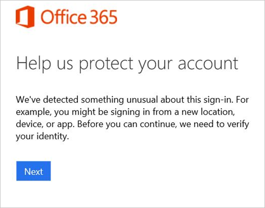
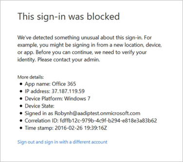
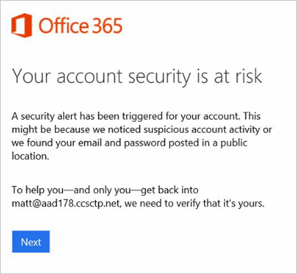
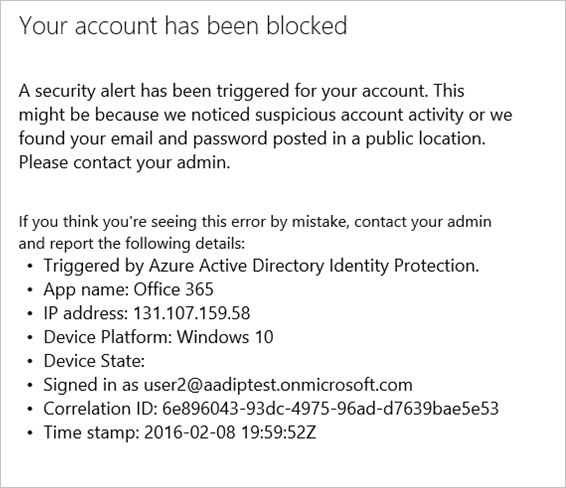

# User experiences with Azure AD Identity Protection

With Azure Active Directory Identity Protection, you can:

* Require users to register for Azure Multi-Factor Authentication (MFA)
* Automate remediation of risky sign-ins and compromised users

All of the Identity Protection policies have an impact on the sign in experience for users. Allowing users to register for and use tools like Azure MFA and self-service password reset can lessen the impact. These tools along with the appropriate policy choices gives users a self-remediation option when they need it.

## Multi-factor authentication registration

Enabling the Identity Protection policy requiring multi-factor authentication registration and targeting all of your users, will make sure that they have the ability to use Azure MFA to self-remediate in the future. Configuring this policy gives your users a 14-day period where they can choose to register and at the end are forced to register. The experience for users is outlined below. More information can be found in the end-user documentation in the article, [Overview for two-factor verification and your work or school account](../user-help/user-help-two-step-verification-overview.md).

### Registration interrupt

1. At sign-in to any Azure AD-integrated application, the user gets a notification about the requirement to set up the account for multi-factor authentication. This policy is also triggered in the Windows 10 Out of Box Experience for new users with a new device.
   
    

1. Complete the guided steps to register for Azure Multi-Factor Authentication and complete your sign-in.

## Risky sign-in remediation

When an administrator has configured a policy for sign-in risks, the affected users are notified when they try to sign in and trigger the policies risk level. 

### Risky sign-in self-remediation

1. The user is informed that something unusual was detected about their sign-in, such as signing in from a new location, device, or app.
   
    

1. The user is required to prove their identity by completing Azure MFA with one of their previously registered methods. 

### Risky sign-in administrator unblock

Administrators can choose to block users upon sign-in depending on their risk level. To get unblocked, end users must contact their IT staff, or they can try signing in from a familiar location or device. Self-remediation by performing multi-factor authentication is not an option in this case.

IT staff can follow the instructions in the section [Unblocking users](howto-identity-protection-remediate-unblock.md#unblocking-based-on-sign-in-risk) to allow users to sign back in.

## Risky user remediation

When a user risk policy has been configured, users who meet the user risk level probability of compromise must go through the user compromise recovery flow before they can sign in. 

### Risky user self-remediation

1. The user is informed that their account security is at risk because of suspicious activity or leaked credentials.
   
    

1. The user is required to prove their identity by completing Azure MFA with one of their previously registered methods. 
1. Finally, the user is forced to change their password using self-service password reset since someone else may have had access to their account.

## Risky sign-in administrator unblock

Administrators can choose to block users upon sign-in depending on their risk level. To get unblocked, end users must contact their IT staff. Self-remediation by performing multi-factor authentication and self-service password reset is not an option in this case.

IT staff can follow the instructions in the section [Unblocking users](howto-identity-protection-remediate-unblock.md#unblocking-based-on-user-risk) to allow users to sign back in.

## See also

- [Remediate risks and unblock users](howto-identity-protection-remediate-unblock.md)

- [Azure Active Directory Identity Protection](../active-directory-identityprotection.md) 
