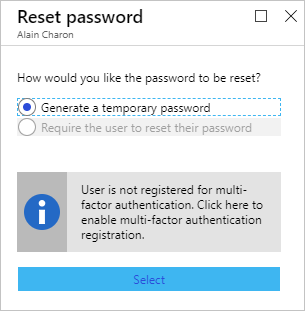

# How To: Close active risk events

With [risk events](../reports-monitoring/concept-risk-events.md), Azure Active Directory detects indicators for potentially compromised user accounts. As an administrator, you want to get all risk events closed, so that the affected users are no longer at risk.

This article gives you an overview of the additional options you have to close active risk events.

## Options to close risk events 

The status of a risk event is either **active** or **closed**. All active risk events contribute to the calculation of a value called user risk level. The user risk level is an indicator (low, medium, high) for the probability that an account has been compromised. 

To close active risk events, you have the following options:

- Require password reset with a user risk policy
- Manual password reset
- Dismiss all risk events 
- Close individual risk events manually

## Require password reset with a user risk policy

By configuring the [user risk Conditional Access policy](howto-user-risk-policy.md), you can require a password change if a specified user risk level has been automatically detected. 

A password reset closes all active risks events of the related user and brings the identity back into a safe state. Using a user risk policy is the preferred method to close active risk events because this method is automated. There is no interaction required between the affected user and help desk or an administrator.

However, using a user risk policy is not always applicable. This applies, for example, to:

- Users that have not been registered for multi-factor authentication (MFA).
- Users with active risk events that have been deleted.
- An investigation that reveals that a reported risk event has been performed by the legitimate user.

## Manual password reset

If requiring a password reset using a user risk policy is not an option, you can get all risk events for a user closed with a manual password reset.

The related dialog provides two different methods to reset a password:

**Generate a temporary password** - By generating a temporary password, you can immediately bring an identity back into a safe state. This method requires interacting with the affected users because they need to know what the temporary password is. You can, for example, send the new temporary password to an alternate email address for the user or to the user's manager. Because the password is temporary, the user is prompted to change the password during the next sign-in.

**Require the user to reset password** - Requiring the users to reset passwords enables self-recovery without contacting help desk or an administrator. Like in the case of a user risk policy, this method only applies to users that are registered for MFA. For users that have not been registered for MFA yet, this option isn't available.

## Dismiss all risk events

If a password reset is not an option for you, you can also dismiss all risk events. 

When you click **Dismiss all events**, all events are closed and the affected user is no longer at risk. However, because this method doesn't have an impact on the existing password, it doesn't bring the related identity back into a safe state. The preferred use case for this method is a deleted user with active risk events. 

## Close individual risk events manually

You can close individual risk events manually. By closing risk events manually, you can lower the user risk level. Typically, risk events are closed manually in response to a related investigation. For example, when talking to a user reveals that an active risk event is not required anymore. 
 
When closing risk events manually, you can choose to take any of the following actions to change the status of a risk event:

- **Resolve** - If after investigating a risk event, you took an appropriate remediation action outside Identity Protection, and you believe that the risk event should be considered closed, mark the event as Resolved. Resolved events will set the risk event’s status to Closed and the risk event will no longer contribute to user risk.
- **Mark as false-positive** - In some cases, you may investigate a risk event and discover that it was incorrectly flagged as a risky. You can help reduce the number of such occurrences by marking the risk event as False-positive. This will help the machine learning algorithms to improve the classification of similar events in the future. The status of false-positive events is to Closed and they will no longer contribute to user risk.
- **Ignore** - If you have not taken any remediation action, but want the risk event to be removed from the active list, you can mark a risk event Ignore and the event status will be Closed. Ignored events do not contribute to user risk. This option should only be used under unusual circumstances.
- **Reactivate** - Risk events that were manually closed (by choosing Resolve, False positive, or Ignore) can be reactivated, setting the event status back to Active. Reactivated risk events contribute to the user risk level calculation. Risk events closed through remediation (such as a secure password reset) cannot be reactivated.

## Next steps

To get an overview of Azure AD Identity Protection, see the [Azure AD Identity Protection overview](overview.md).
