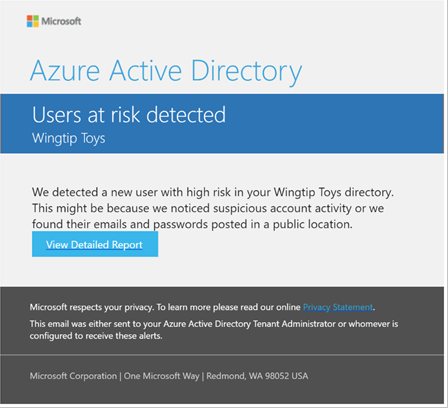
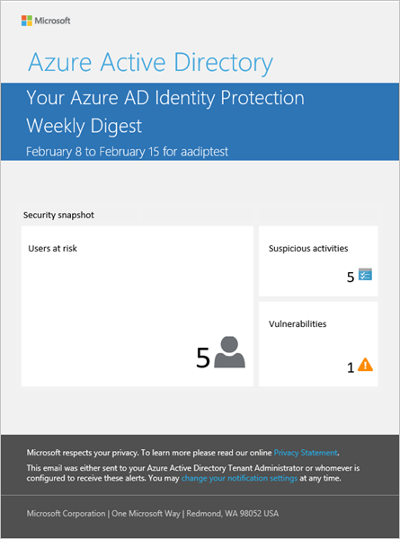

# Azure Active Directory Identity Protection notifications

Azure AD Identity Protection sends two types of automated notification emails to help you manage user risk and risk detections:

- Users at risk detected email
- Weekly digest email

This article provides you with an overview of both notification emails.

## Users at risk detected email

In response to a detected account at risk, Azure AD Identity Protection generates an email alert with **Users at risk detected** as subject. The email includes a link to the **[Users flagged for risk](../reports-monitoring/concept-user-at-risk.md)** report. As a best practice, you should immediately investigate the users at risk.

The configuration for this alert allows you to specify at what user risk level you want the alert to be generated. The email will be generated when the user's risk level reaches what you have specified; however, you will not receive new users at risk detected email alerts for this user after they move to this user risk level. For example, if you set the policy to alert on medium user risk and your user John moves to medium risk, you will receive the users at risk detected email for John. However, you will not receive a second user at risk detected alert if John then moves to high risk or has additional risk detections.

### Configure users at risk detected alerts

As an administrator, you can set:

- **The user risk level that triggers the generation of this email** - By default, the risk level is set to “High” risk.
- **The recipients of this email** - By default, recipients include all Global Admins. Global Admins can also add other Global Admins, Security Admins, Security Readers as recipients.
   - Optionally you can **Add additional emails to receive alert notifications** this feature is a preview and users defined must have the appropriate permissions to view the linked reports in the Azure portal.

Configure the users at risk email in the **Azure portal** under **Azure Active Directory** > **Security** > **Identity Protection** > **Users at risk detected alerts**.

## Weekly digest email

The weekly digest email contains a summary of new risk detections.  
It includes:

- Users at risk
- Suspicious activities
- Detected vulnerabilities
- Links to the related reports in Identity Protection

By default, recipients include all Global Admins. Global Admins can also add other Global Admins, Security Admins, Security Readers as recipients.

### Configure weekly digest email

As an administrator, you can switch sending a weekly digest email on or off and choose the users assigned to receive the email.

Configure the weekly digest email in the **Azure portal** under **Azure Active Directory** > **Security** > **Identity Protection** > **Weekly digest**.

## See also

- [Azure Active Directory Identity Protection](../active-directory-identityprotection.md)
