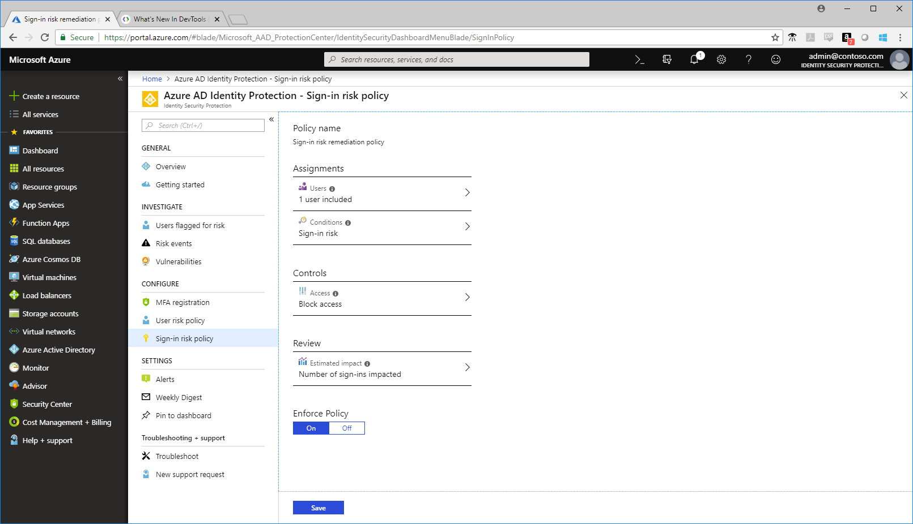
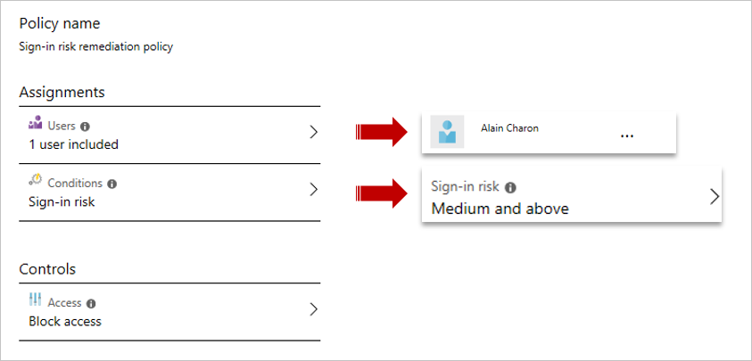
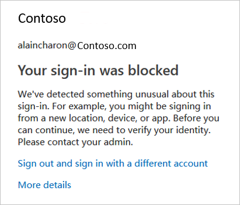

# Quickstart: Block access when a session risk is detected with Azure Active Directory Identity Protection  

To keep your environment protected, you might want to block suspicious users from signing in. Azure Active Directory (Azure AD) Identity Protection analyzes each sign-in and calculates the likelihood that a sign-in attempt was not performed by the legitimate owner of a user account. The likelihood (low, medium, high) is indicated in form of a calculated value called sign-in risk level. By setting the sign-in risk condition, you can configure a sign-in risk conditional access policy to respond to specific sign-in risk levels. 

This quickstart shows how to configure a sign-in risk conditional access policy that blocks a sign-in when a medium and above sign-in risk level has been detected. 

If you don't have an Azure subscription, create a [free account](https://azure.microsoft.com/free/?WT.mc_id=A261C142F) before you begin.

## Prerequisites 

To complete the scenario in this tutorial, you need:

- **Access to an Azure AD Premium P2 edition** - Azure AD Identity Protection is an Azure AD Premium P2 feature. 

- **Identity Protection** - The scenario in this quickstart requires Identity Protection to be enabled. If you don't know how to enable Identity Protection, see [Enabling Azure Active Directory Identity Protection](../identity-protection/enable.md).

- **Tor Browser** - The [Tor Browser](https://www.torproject.org/projects/torbrowser.html.en) is designed to help you preserve your privacy online. Identity Protection detects a sign-in from a Tor Browser as **sign-ins from anonymous IP addresses**, which has a medium risk level. For more information, see [Azure Active Directory risk events](../reports-monitoring/concept-risk-events.md).  

- **A test account called Alain Charon** - If you don't know how to create a test account, see [Add a new user](../fundamentals/add-users-azure-active-directory.md#add-a-new-user).

## Test your sign-in 

The goal of this step is to make sure that your test account can access your tenant using the Tor Browser.

**To test your sign-in:**

1. Sign in to your [Azure portal](https://portal.azure.com) as **Alain Charon**.

2. Sign out. 

## Create your conditional access policy 

The scenario in this quickstart uses a sign-in from a Tor Browser to generate a detected **Sign-ins from anonymous IP addresses** risk event. The risk level of this risk event is medium. To respond to this risk event, you set the sign-in risk condition to medium. 

This section shows how to create the required sign-in risk conditional access policy. In your policy, set:

|Setting |Value|
|---     | --- |
| Users  | Alain Charon  |
| Conditions | Sign-in risk, Medium and above |
| Controls | Block access |
 

 

**To configure your conditional access policy:**

1. Sign in to your [Azure portal](https://portal.azure.com) as global administrator.

2. Go to the [Azure AD Identity Protection page](https://portal.azure.com/#blade/Microsoft_AAD_ProtectionCenter/IdentitySecurityDashboardMenuBlade/Overview).
 
3. On the **Azure AD Identity Protection** page, in the **Configure** section, click **Sign-in risk policy**.
 
4. On the policy page, in the **Assignments** section, click **Users**.

5. On the **Users** page, click **Select users**.

6. On the **Select users** page, select **Alain Charon**, and then click **Select**.

7. On the **Users** page, click **Done**. 

8. On the policy page, in the **Assignments** section, click **Conditions**.

9. On the **Conditions** page, click **Sign-in risk**.

10. On the **Sign-in risk** page, select **Medium and above**, and then click **Select**. 

11. On the **Conditions** page, click **Done**.

12. On the policy page, in the **Controls** section, click **Access**.

13. On the **Access** page, click **Allow access**, select **Require multi-factor authentication**, and then click **Select**.

14. On the policy page, click **Save**.  

## Test your conditional access policy

To test your policy, try to sign-in to your [Azure portal](https://portal.azure.com) as **Alan Charon** using the Tor Browser. Your sign-in attempt should be blocked by your conditional access policy.

## Clean up resources

When no longer needed, delete the test user, the Tor Browser and disable the sign-in risk conditional access policy:

- If you don't know how to delete an Azure AD user, see [How to add or delete users](../fundamentals/add-users-azure-active-directory.md#delete-a-user).

- For instructions to remove the Tor Browser, see [Uninstalling](https://tb-manual.torproject.org/uninstalling/).

