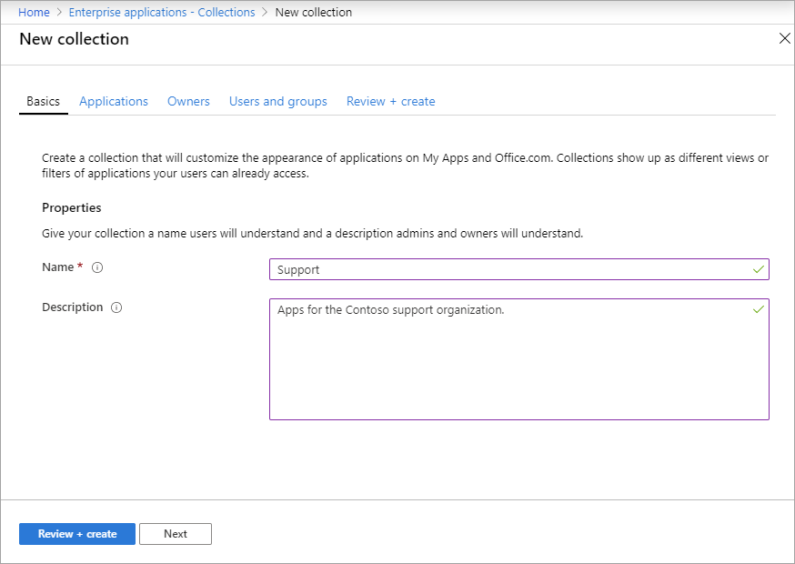
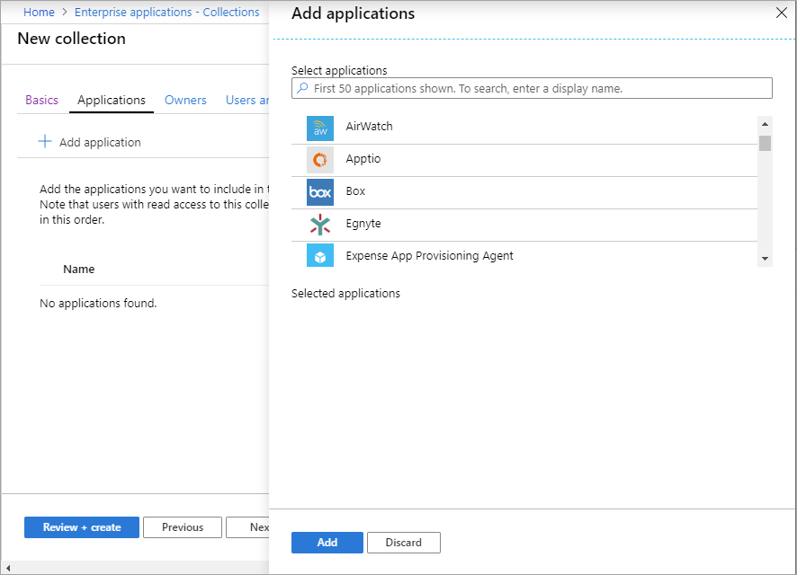
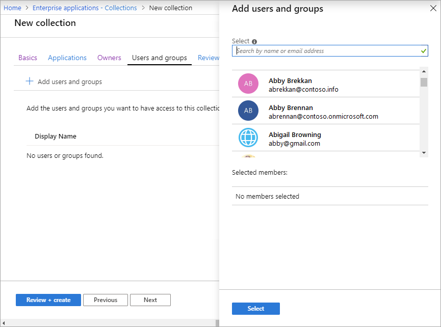

# Create collections on the My Apps portal

Your users can use the My Apps portal to view and start the cloud-based applications they have access to. By default, all the applications a user can access are listed together on a single page. To better organize this page for your users, if you have an Azure AD Premium P1 or P2 license you can set up collections. With a collection, you can group together applications that are related (for example, by job role, task, or project) and display them on a separate tab. A collection essentially applies a filter to the applications a user can already access, so the user sees only those applications in the collection that have been assigned to them.

> [!NOTE]
> This article covers how an admin can enable and create collections. For information for the end user about how to use the My Apps portal and collections, see [Access and use collections](../user-help/my-applications-portal-workspaces.md).

## Enable the latest My Apps features

1. Open the [**Azure portal**](https://portal.azure.com/) and sign in as a user administrator or Global Administrator.

2. Go to **Azure Active Directory** > **User settings**.

3. Under **User feature previews**, select **Manage user feature preview settings**.

4. Under **Users can use preview features for My Apps**, choose one of the following options:
   * **Selected** - Enables the features for a specific group. Use the **Select a group** option to select the group for which you want to enable the features.  
   * **All** - Enables the features for all users.

> [!NOTE]
> To open the My Apps portal, users can use the link `https://myapps.microsoft.com` or the customized link for your organization, such as `https://myapps.microsoft.com/contoso.com`. After you enable the new My Apps experience, the **An updated My Applications experience is available** banner will display at the top of the My Apps page, and users can select **Try it** to view the new experience. To stop using the new experience, users can select **Yes** from the **Leave new experience** banner at the top of the page.

## Create a collection

To create a collection, you must have an Azure AD Premium P1 or P2 license.

1. Open the [**Azure portal**](https://portal.azure.com/) and sign in as an admin with an Azure AD Premium P1 or P2 license.

2. Go to **Azure Active Directory** > **Enterprise Applications**.

3. Under **Manage**, select **Collections**.

4. Select **New collection**. In the **New collection** page, enter a **Name** for the collection (we recommend not using "collection" in the name. Then enter a **Description**.

   

5. Select the **Applications** tab. Select **+ Add application**, and then in the **Add applications** page, select all the applications you want to add to the collection, or use the **Search** box to find applications.

   

6. When you're finished adding applications, select **Add**. The list of selected applications appears. You can use the up arrows to change the order of applications in the list. To move an application down or to delete it from the collection, select the **More** menu (**...**).

7. Select the **Owners** tab. Select **+ Add users and groups**, and then in the **Add users and groups** page, select the users or groups you want to assign ownership to. When you're finished selecting users and groups, choose **Select**.

9. Select the **Users and groups** tab. Select **+ Add users and groups**, and then in the **Add users and groups** page, select the users or groups you want to assign the collection to. Or use the **Search** box to find users or groups. When you're finished selecting users and groups, choose **Select**.

   

11. Select **Review + Create**. The properties for the new collection appear.

## View audit logs

The Audit logs record My Apps collections operations, including collection creation end-user actions. The following events are generated from My Apps:

* Create collection
* Edit collection
* Delete collection
* Launch an application (end user)
* Self-service application adding (end user)
* Self-service application deletion (end user)

You can access audit logs in the [Azure portal](https://portal.azure.com) by selecting **Azure Active Directory** > **Enterprise Applications** > **Audit logs** in the Activity section. For **Service**, select **My Apps**.

## Get support for My Account pages

From the My Apps page, a user can select **My account** > **View my account** to open their account settings. On the Azure AD **My Account** page, users can manage their security info, devices, passwords, and more. They can also access their Office account settings.

In case you need to submit a support request for an issue with the Azure AD account page or the Office account page, follow these steps so your request is routed properly: 

* For issues with the **Azure AD "My Account"** page, open a support request from within the Azure portal. Go to **Azure portal** > **Azure Active Directory** > **New support request**.

* For issues with the **Office "My account"** page, open a support request from within the Microsoft 365 admin center. Go to **Microsoft 365 admin center** > **Support**. 

## Next steps
[End-user experiences for applications in Azure Active Directory](end-user-experiences.md)