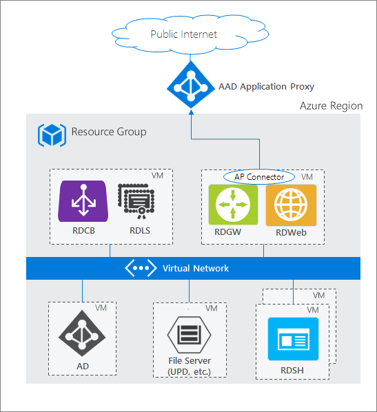
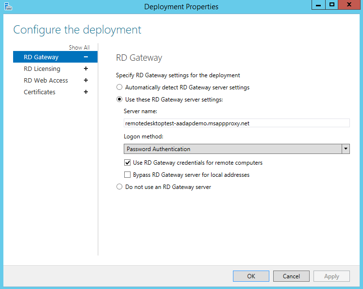

# Publish Remote Desktop with Azure AD Application Proxy

Remote Desktop Service and Azure AD Application Proxy work together to improve the productivity of workers who are away from the corporate network. 

The intended audience for this article is:
- Current Application Proxy customers who want to offer more applications to their end users by publishing on-premises applications through Remote Desktop Services.
- Current Remote Desktop Services customers who want to reduce the attack surface of their deployment by using Azure AD Application Proxy. This scenario gives a set of two-step verification and Conditional Access controls to RDS.

## How Application Proxy fits in the standard RDS deployment

A standard RDS deployment includes various Remote Desktop role services running on Windows Server. Looking at the [Remote Desktop Services architecture](/windows-server/remote/remote-desktop-services/Desktop-hosting-logical-architecture), there are multiple deployment options. Unlike other RDS deployment options, the [RDS deployment with Azure AD Application Proxy](/windows-server/remote/remote-desktop-services/Desktop-hosting-logical-architecture) (shown in the following diagram) has a permanent outbound connection from the server running the connector service. Other deployments leave open inbound connections through a load balancer.



In an RDS deployment, the RD Web role and the RD Gateway role run on Internet-facing machines. These endpoints are exposed for the following reasons:
- RD Web provides the user a public endpoint to sign in and view the various on-premises applications and desktops they can access. Upon selecting a resource, an RDP connection is created using the native app on the OS.
- RD Gateway comes into the picture once a user launches the RDP connection. The RD Gateway handles encrypted RDP traffic coming over the internet and translates it to the on-premises server that the user is connecting to. In this scenario, the traffic the RD Gateway is receiving comes from the Azure AD Application Proxy.

>[!TIP]
>If you haven't deployed RDS before, or want more information before you begin, learn how to [seamlessly deploy RDS with Azure Resource Manager and Azure Marketplace](/windows-server/remote/remote-desktop-services/rds-in-azure).

## Requirements

- Both the RD Web and RD Gateway endpoints must be located on the same machine, and with a common root. RD Web and RD Gateway are published as a single application with Application Proxy so that you can have a single sign-on experience between the two applications.
- You should already have [deployed RDS](/windows-server/remote/remote-desktop-services/rds-in-azure), and [enabled Application Proxy](application-proxy-add-on-premises-application.md). Ensure you have satisfied the pre-requisites to enable Application Proxy, such as installing the connector, opening required ports and URLS, and enabling TLS 1.2 on the server.
- Your end users must use a compatible browser to connect to RD Web or the RD Web client. For more details see [Support for client configurations](#support-for-other-client-configurations).
- When publishing RD Web, it is recommended to use the same internal and external FQDN. If the internal and external FQDNs are different then you should disable Request Header Translation to avoid the client receiving invalid links.
- If you are using RD Web on Internet Explorer, you will need to enable the RDS ActiveX add-on.
- If you are using the RD Web client, you will need to use the Application Proxy [connector version 1.5.1975 or later](./application-proxy-release-version-history.md).
- For the Azure AD pre-authentication flow, users can only connect to resources published to them in the **RemoteApp and Desktops** pane. Users can't connect to a desktop using the **Connect to a remote PC** pane.
- If you are using Windows Server 2019, you may need to disable HTTP2 protocol. For more information, see [Tutorial: Add an on-premises application for remote access through Application Proxy in Azure Active Directory](application-proxy-add-on-premises-application.md).

## Deploy the joint RDS and Application Proxy scenario

After setting up RDS and Azure AD Application Proxy for your environment, follow the steps to combine the two solutions. These steps walk through publishing the two web-facing RDS endpoints (RD Web and RD Gateway) as applications, and then directing traffic on your RDS to go through Application Proxy.

### Publish the RD host endpoint

1. [Publish a new Application Proxy application](application-proxy-add-on-premises-application.md) with the following values:
   - Internal URL: `https://<rdhost>.com/`, where `<rdhost>` is the common root that RD Web and RD Gateway share.
   - External URL: This field is automatically populated based on the name of the application, but you can modify it. Your users will go to this URL when they access RDS.
   - Preauthentication method: Azure Active Directory
   - Translate URL headers: No
2. Assign users to the published RD application. Make sure they all have access to RDS, too.
3. Leave the single sign-on method for the application as **Azure AD single sign-on disabled**.

   >[!Note]
   >Your users are asked to authenticate once to Azure AD and once to RD Web, but they have single sign-on to RD Gateway.

4. Select **Azure Active Directory**, and then **App Registrations**. Choose your app from the list.
5. Under **Manage**, select **Branding**.
6. Update the **Home page URL** field to point to your RD Web endpoint (like `https://<rdhost>.com/RDWeb`).

### Direct RDS traffic to Application Proxy

Connect to the RDS deployment as an administrator and change the RD Gateway server name for the deployment. This configuration ensures that connections go through the Azure AD Application Proxy service.

1. Connect to the RDS server running the RD Connection Broker role.
2. Launch **Server Manager**.
3. Select **Remote Desktop Services** from the pane on the left.
4. Select **Overview**.
5. In the Deployment Overview section, select the drop-down menu and choose **Edit deployment properties**.
6. In the RD Gateway tab, change the **Server name** field to the External URL that you set for the RD host endpoint in Application Proxy.
7. Change the **Logon method** field to **Password Authentication**.

   

8. Run this command for each collection. Replace *\<yourcollectionname\>* and *\<proxyfrontendurl\>* with your own information. This command enables single sign-on between RD Web and RD Gateway, and optimizes performance:

   ```
   Set-RDSessionCollectionConfiguration -CollectionName "<yourcollectionname>" -CustomRdpProperty "pre-authentication server address:s:<proxyfrontendurl>`nrequire pre-authentication:i:1"
   ```

   **For example:**
   ```
   Set-RDSessionCollectionConfiguration -CollectionName "QuickSessionCollection" -CustomRdpProperty "pre-authentication server address:s:https://remotedesktoptest-aadapdemo.msappproxy.net/`nrequire pre-authentication:i:1"
   ```
   >[!NOTE]
   >The above command uses a backtick in "`nrequire".

9. To verify the modification of the custom RDP properties as well as view the RDP file contents that will be downloaded from RDWeb for this collection, run the following command:
    ```
    (get-wmiobject -Namespace root\cimv2\terminalservices -Class Win32_RDCentralPublishedRemoteDesktop).RDPFileContents
    ```

Now that you've configured Remote Desktop, Azure AD Application Proxy has taken over as the internet-facing component of RDS. You can remove the other public internet-facing endpoints on your RD Web and RD Gateway machines.

### Enable the RD Web Client
If you also want users to be able to use the RD Web Client follow steps at [Set up the Remote Desktop web client for your users](/windows-server/remote/remote-desktop-services/clients/remote-desktop-web-client-admin) to enable this.

The Remote Desktop web client lets users access your organization's Remote Desktop infrastructure through a HTML5-compatible web browser such as Microsoft Edge, Internet Explorer 11, Google Chrome, Safari, or Mozilla Firefox (v55.0 and later).

## Test the scenario

Test the scenario with Internet Explorer on a Windows 7 or 10 computer.

1. Go to the external URL you set up, or find your application in the [MyApps panel](https://myapps.microsoft.com).
2. You are asked to authenticate to Azure Active Directory. Use an account that you assigned to the application.
3. You are asked to authenticate to RD Web.
4. Once your RDS authentication succeeds, you can select the desktop or application you want, and start working.

## Support for other client configurations

The configuration outlined in this article is for access to RDS via RD Web or the RD Web Client. If you need to, however, you can support other operating systems or browsers. The difference is in the authentication method that you use.

| Authentication method | Supported client configuration |
| --------------------- | ------------------------------ |
| Pre-authentication    | RD Web-  Windows 7/10 using Internet Explorer* or [Edge Chromium IE mode](/deployedge/edge-ie-mode) + RDS ActiveX add-on |
| Pre-authentication    | RD Web Client- HTML5-compatible web browser such as Microsoft Edge, Internet Explorer 11, Google Chrome, Safari, or Mozilla Firefox (v55.0 and later) |
| Passthrough | Any other operating system that supports the Microsoft Remote Desktop application |

*Edge Chromium IE mode is required when the My Apps portal is used for accessing the Remote Desktop app.  

The pre-authentication flow offers more security benefits than the passthrough flow. With pre-authentication you can use Azure AD authentication features like single sign-on, Conditional Access, and two-step verification for your on-premises resources. You also ensure that only authenticated traffic reaches your network.

To use passthrough authentication, there are just two modifications to the steps listed in this article:
1. In [Publish the RD host endpoint](#publish-the-rd-host-endpoint) step 1, set the Preauthentication method to **Passthrough**.
2. In [Direct RDS traffic to Application Proxy](#direct-rds-traffic-to-application-proxy), skip step 8 entirely.

## Next steps
- [Enable remote access to SharePoint with Azure AD Application Proxy](application-proxy-integrate-with-sharepoint-server.md)
- [Security considerations for accessing apps remotely by using Azure AD Application Proxy](application-proxy-security.md)
- [Best practices for load balancing multiple app servers](application-proxy-high-availability-load-balancing.md#best-practices-for-load-balancing-among-multiple-app-servers)
