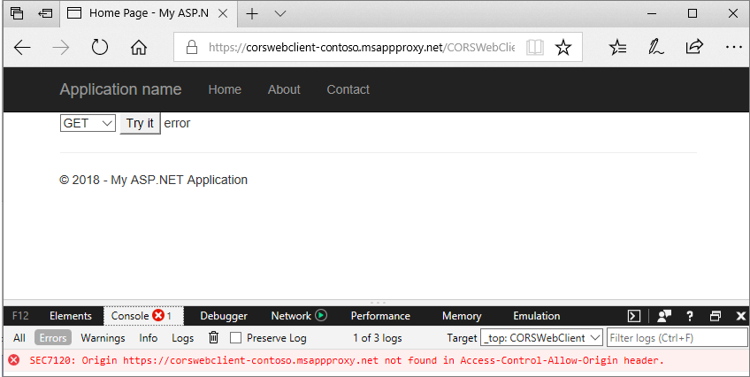
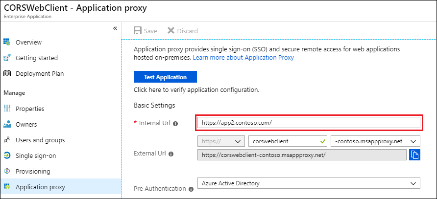

# Understand and solve Azure Active Directory Application Proxy CORS issues

[Cross-origin resource sharing (CORS)](http://www.w3.org/TR/cors/) can sometimes present challenges for the apps and APIs you publish through the Azure Active Directory Application Proxy. This article discusses Azure AD Application Proxy CORS issues and solutions.

Browser security usually prevents a web page from making AJAX requests to another domain. This restriction is called the *same-origin policy*, and prevents a malicious site from reading sensitive data from another site. However, sometimes you might want to let other sites call your web API. CORS is a W3C standard that lets a server relax the same-origin policy and allow some cross-origin requests while rejecting others.

## Understand and identify CORS issues

Two URLs have the same origin if they have identical schemes, hosts, and ports ([RFC 6454](https://tools.ietf.org/html/rfc6454)), such as:

-   http:\//contoso.com/foo.html
-   http:\//contoso.com/bar.html

The following URLs have different origins than the previous two:

-   http:\//contoso.net - Different domain
-   http:\//contoso.com:9000/foo.html - Different port
-   https:\//contoso.com/foo.html - Different scheme
-   http:\//www.contoso.com/foo.html - Different subdomain

Same-origin policy prevents apps from accessing resources from other origins unless they use the correct access control headers. If the CORS headers are absent or incorrect, cross-origin requests fail. 

You can identify CORS issues by using browser debug tools:

1. Launch the browser and browse to the web app.
1. Press **F12** to bring up the debug console.
1. Try to reproduce the transaction, and review the console message. A CORS violation produces a console error about origin.

In the following screenshot, selecting the **Try It** button caused a CORS error message that https:\//corswebclient-contoso.msappproxy.net wasn't found in the Access-Control-Allow-Origin header.

## CORS challenges with Application Proxy

The following example shows a typical Azure AD Application Proxy CORS scenario. The internal server hosts a **CORSWebService** web API controller, and a **CORSWebClient** that calls **CORSWebService**. There's an AJAX request from **CORSWebClient** to **CORSWebService**.

The CORSWebClient app works when you host it on-premises, but either fails to load or errors out when published through Azure AD Application Proxy. If you published the CORSWebClient and CORSWebService apps separately as different apps through Application Proxy, the two apps are hosted at different domains. An AJAX request from CORSWebClient to CORSWebService is a cross-origin request, and it fails.

## Solutions for Application Proxy CORS issues

You can resolve the preceding CORS issue in any one of several ways.

### Option 1: Set up a custom domain

Use an Azure AD Application Proxy [custom domain](https://docs.microsoft.com/azure/active-directory/active-directory-application-proxy-custom-domains) to publish from the same origin, without having to make any changes to app origins, code, or headers. 

### Option 2: Publish the parent directory

Publish the parent directory of both apps. This solution works especially well if you have only two apps on the web server. Instead of publishing each app separately, you can publish the common parent directory, which results in the same origin.

The following examples show the portal Azure AD Application Proxy page for the CORSWebClient app.  When the **Internal URL** is set to *contoso.com/CORSWebClient*, the app can't make successful requests to the *contoso.com/CORSWebService* directory, because they're cross-origin. 

Instead, set the **Internal URL** to publish the parent directory, which includes both the *CORSWebClient* and *CORSWebService* directories:

The resulting app URLs effectively resolve the CORS issue:

- https:\//corswebclient-contoso.msappproxy.net/CORSWebService
- https:\//corswebclient-contoso.msappproxy.net/CORSWebClient

### Option 3: Update HTTP headers

Add a custom HTTP response header on the web service to match the origin request. For websites running in Internet Information Services (IIS), use IIS Manager to modify the header:

This modification doesn't require any code changes. You can verify it in the Fiddler traces:

**Post the Header Addition**\
HTTP/1.1 200 OK\
Cache-Control: no-cache\
Pragma: no-cache\
Content-Type: text/plain; charset=utf-8\
Expires: -1\
Vary: Accept-Encoding\
Server: Microsoft-IIS/8.5 Microsoft-HTTPAPI/2.0\
**Access-Control-Allow-Origin: https://corswebclient-contoso.msappproxy.net**\
X-AspNet-Version: 4.0.30319\
X-Powered-By: ASP.NET\
Content-Length: 17

### Option 4: Modify the app

You can change your app to support CORS by adding the Access-Control-Allow-Origin header, with appropriate values. The way to add the header depends on the app's code language. Changing the code is the least recommended option, because it requires the most effort.

### Option 5: Extend the lifetime of the access token

Some CORS issues can't be resolved, such as when your app redirects to *login.microsoftonline.com* to authenticate, and the access token expires. The CORS call then fails. A workaround for this scenario is to extend the lifetime of the access token, to prevent it from expiring during a user’s session. For more information about how to do this, see [Configurable token lifetimes in Azure AD](../develop/active-directory-configurable-token-lifetimes.md).

## See also
- [Tutorial: Add an on-premises application for remote access through Application Proxy in Azure Active Directory](application-proxy-add-on-premises-application.md) 
- [Plan an Azure AD Application Proxy deployment](application-proxy-deployment-plan.md) 
- [Remote access to on-premises applications through Azure Active Directory Application Proxy](application-proxy.md) 
