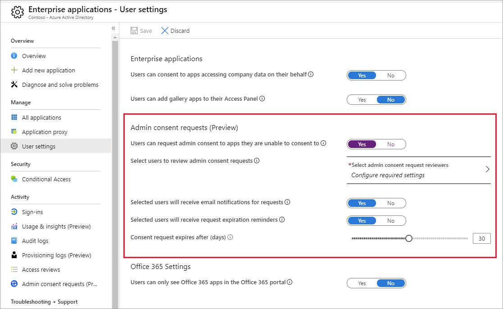
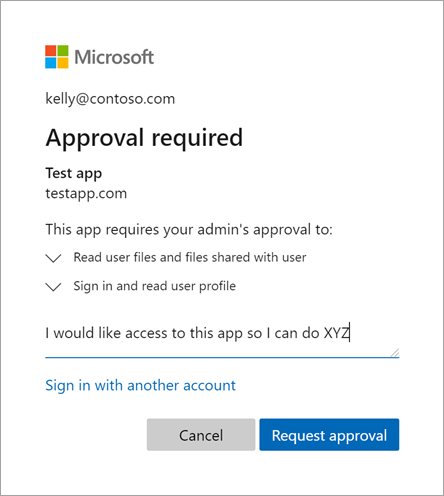
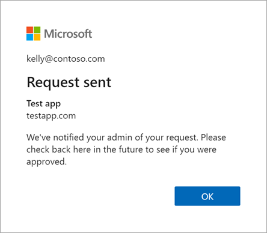

# Configure the admin consent workflow (preview)

This article describes how to enable the admin consent workflow (preview) feature, which gives end users a way to request access to applications that require admin consent.

Without an admin consent workflow, a user in a tenant where user consent is disabled will be blocked when they try to access any app that requires permissions to access organizational data. The user sees a generic error message that says they're unauthorized to access the app and they should ask their admin for help. But often, the user doesn't know who to contact, so they either give up or create a new local account in the application. Even when an admin is notified, there isn't always a streamlined process to help the admin grant access and notify their users.
 
The admin consent workflow gives admins a secure way to grant access to applications that require admin approval. When a user tries to access an application but is unable to provide consent, they can send a request for admin approval. The request is sent via email to admins who have been designated as reviewers. A reviewer takes action on the request, and the user is notified of the action.

To approve requests, a reviewer must be a global administrator, cloud application administrator, or application administrator. The reviewer must already have one of these admin roles assigned; simply designating them as a reviewer doesn't elevate their privileges.

## Enable the admin consent workflow

To enable the admin consent workflow and choose reviewers:

1. Sign in to the [Azure portal](https://portal.azure.com) as a global administrator.
2. Click **All services** at the top of the left-hand navigation menu. The **Azure Active Directory Extension** opens.
3. In the filter search box, type "**Azure Active Directory**" and select **the Azure Active Directory** item.
4. From the navigation menu, click **Enterprise applications**. 
5. Under **Manage**, select **User settings**.
6. Under **Admin consent requests (Preview)**, set **Users can request admin consent to apps they are unable to consent to** to **Yes**.

   
 
6. Configure the following settings:

   * **Select users to review admin consent requests**. Select reviewers for this workflow from a set of users that have the global administrator, cloud application administrator, and application administrator roles.
   * **Selected users will receive email notifications for requests**. Enable or disable email notifications to the reviewers when a request is made.  
   * **Selected users will receive request expiration reminders**. Enable or disable reminder email notifications to the reviewers when a request is about to expire.  
   * **Consent request expires after (days)**. Specify how long requests stay valid.

7. Select **Save**. It can take up to an hour for the feature to become enabled.

> [!NOTE]
> You can add or remove reviewers for this workflow by modifying the **Select admin consent requests reviewers** list. Note that a current limitation of this feature is that reviewers can retain the ability to review requests that were made while they were designated as a reviewer.

## How users request admin consent

After the admin consent workflow is enabled, users can request admin approval for an application they're unauthorized to consent to. The following steps describe user's experience when requesting approval. 

1. The user attempts to sign in to the application.

2. The **Approval required** message appears. The user types a justification for needing access to the app, and then selects **Request approval**.

   

3. A **Request sent** message confirms that the request was submitted to the admin. If the user sends several requests, only the first request is submitted to the admin.

   

 4. The user receives an email notification when their request is approved, denied, or blocked. 

## Review and take action on admin consent requests

To review the admin consent requests and take action:

1. Sign in to the [Azure portal](https://portal.azure.com) as one of the registered reviewers of the admin consent workflow.
2. Select **All services** at the top of the left-hand navigation menu. The **Azure Active Directory Extension** opens.
3. In the filter search box, type "**Azure Active Directory**" and select the **Azure Active Directory** item.
4. From the navigation menu, click **Enterprise applications**.
5. Under **Activity**, select **Admin consent requests (Preview)**.

   > [!NOTE]
   > Reviewers will only see admin requests that were created after they were designated as a reviewer.

1. Select the application that is being requested.
2. Review details about the request:  

   * To see who is requesting access and why, select the **Requested by** tab.
   * To see what permissions are being requested by the application, select **Review permissions and consent**.

8. Evaluate the request and take the appropriate action:

   * **Approve the request**. To approve a request, grant admin consent to the application. Once a request is approved, all requestors are notified that they have been granted access.  
   * **Deny the request**. To deny a request, you must provide a justification that will be provided to all requestors. Once a request is denied, all requestors are notified that they have been denied access to the application. Denying a request won't prevent users from requesting admin consent to the app again in the future.  
   * **Block the request**. To block a request, you must provide a justification that will be provided to all requestors. Once a request is blocked, all requestors are notified they've been denied access to the application. Blocking a request creates a service principal object for the application in your tenant in a disabled state. Users won't be able to request admin consent to the application in the future.
 
## Email notifications
 
If configured, all reviewers will receive email notifications when:

* A new request has been created
* A request has expired
* A request is nearing the expiration date  
 
Requestors will receive email notifications when:

* They submit a new request for access
* Their request has expired
* Their request has been denied or blocked
* Their request has been approved
 
## Audit logs 
 
The table below outlines the scenarios and audit values available for the admin consent workflow. 

> [!NOTE]
> The user context of the audit actor is currently missing in all scenarios. This is a known limitation in the preview version.

|Scenario  |Audit Service  |Audit Category  |Audit Activity  |Audit Actor  |Audit log limitations  |
|---------|---------|---------|---------|---------|---------|
|Admin enabling the consent request workflow        |Access Reviews           |UserManagement           |Create governance policy template          |App context            |Currently you cannot find the user context            |
|Admin disabling the  consent request workflow       |Access Reviews           |UserManagement           |Delete governance policy template          |App context            |Currently you cannot find the user context           |
|Admin updating the consent workflow configurations        |Access Reviews           |UserManagement           |Update governance policy template          |App context            |Currently you cannot find the user context           |
|End user creating an admin consent request for an app       |Access Reviews           |Policy         |Create request           |App context            |Currently you cannot find the user context           |
|Reviewers approving an admin consent request       |Access Reviews           |UserManagement           |Approve all requests in business flow          |App context            |Currently you cannot find the user context or the app ID that was granted admin consent.           |
|Reviewers denying an admin consent request       |Access Reviews           |UserManagement           |Approve all requests in business flow          |App context            | Currently you cannot find the user context of the actor that denied an admin consent request          |

## FAQ 

**I turned on this workflow, but when testing out the functionality, why can’t I see the new “Approval required” prompt allowing me to request access?**

After turning on the feature, it may take up to 60 minutes for end users to see the update. You can verify that the configuration has properly taken effect by viewing the **EnableAdminConsentRequests** value in the `https://graph.microsoft.com/beta/settings` API.

**As a reviewer, why can’t I see all pending requests?**

Reviewers can only see admin requests that were created after they were designated as a reviewer. So if you were recently added as a reviewer, you won't see any requests that were created before your assignment.

**As a reviewer, why do I see multiple requests for the same application?**
  
If an application developer has configured their app to use static and dynamic consent to request access to their end user’s data, you'll see two admin consent requests. One request represents the static permissions, and the other represents the dynamic permissions.

**As a requestor, can I check the status of my request?**  

No, for now requestors are only able to get updates via email notifications.

**As a reviewer, is it possible to approve the application, but not for everyone?**
 
If you're concerned about granting admin consent and allowing all users in the tenant to use the application, we recommend that you deny the request. Then manually grant admin consent by restricting access to the application by requiring user assignment, and assigning users or groups to the application. For more information, see [Methods for assigning users and groups](methods-for-assigning-users-and-groups.md).

## Next steps

For more information on consenting to applications, see [Azure Active Directory consent framework](../develop/consent-framework.md).

[Consent and Integrating Apps to AzureAD](../develop/quickstart-v1-integrate-apps-with-azure-ad.md)

[Consent and Permissioning for AzureAD v2.0 converged Apps](../develop/active-directory-v2-scopes.md)

[AzureAD StackOverflow](https://stackoverflow.com/questions/tagged/azure-active-directory)
