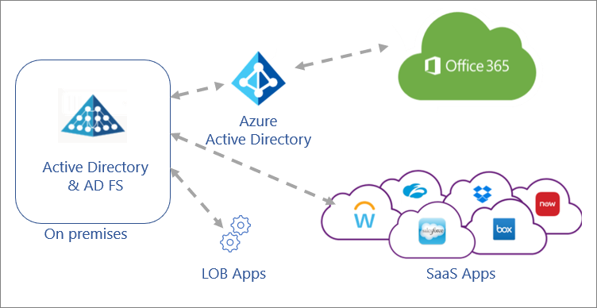
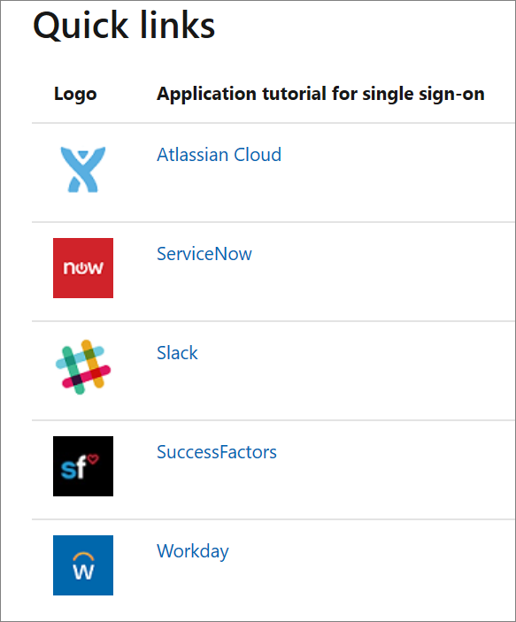
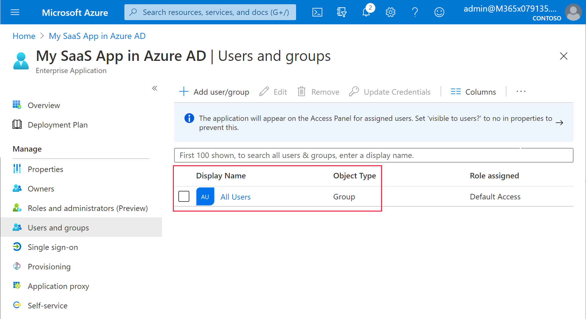
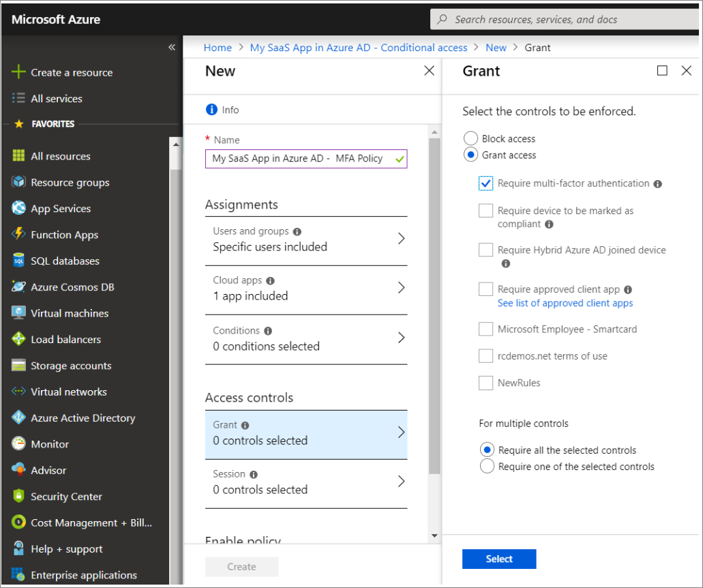
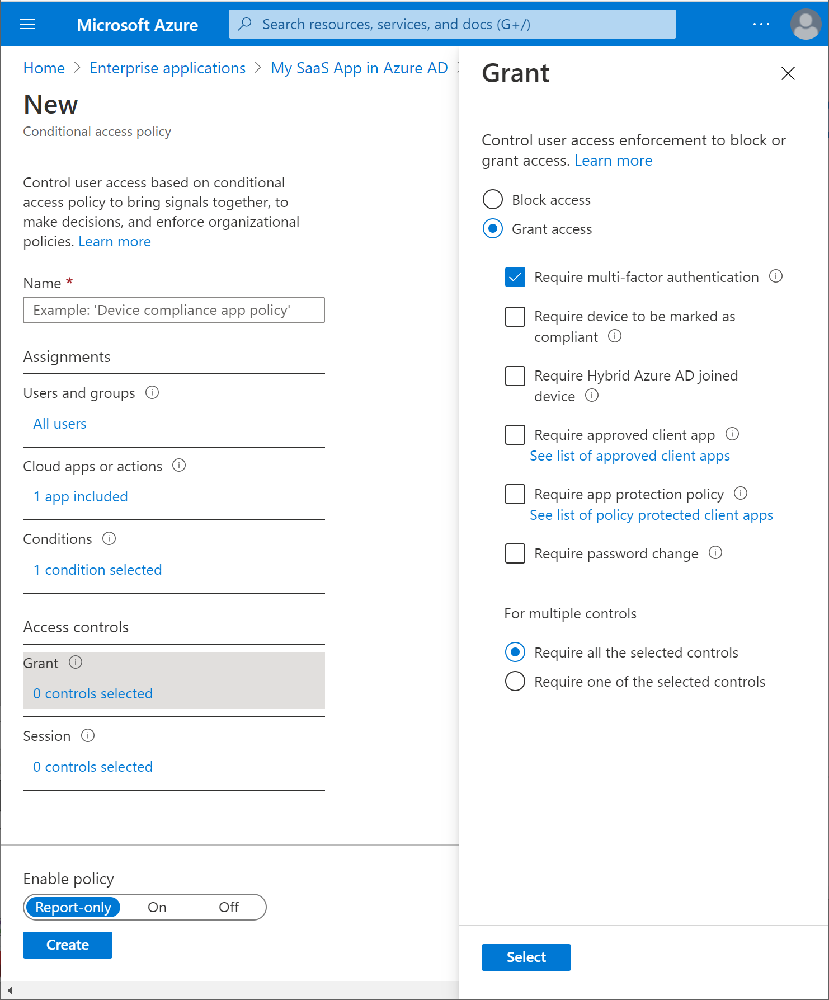
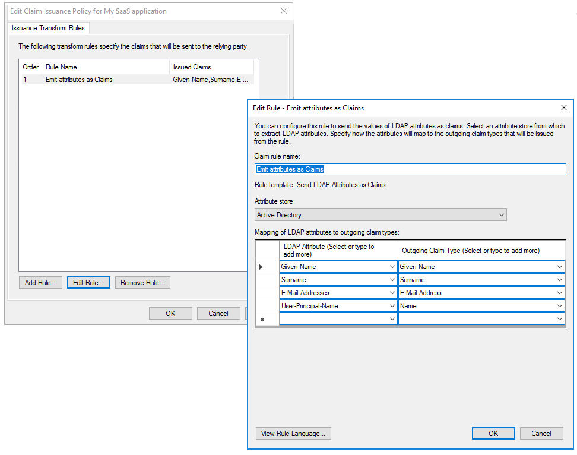
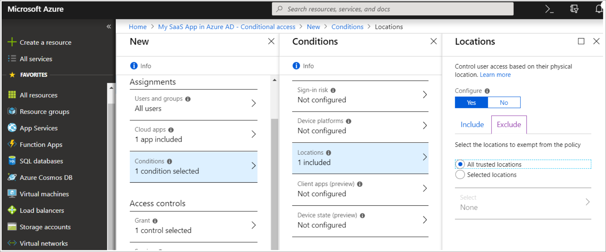

# Moving application authentication from Active Directory Federation Services to Azure Active Directory

[Azure Active Directory (Azure AD)](https://docs.microsoft.com/azure/active-directory/fundamentals/active-directory-whatis) offers a universal identity platform that provides your people, partners, and customers a single identity to access applications and collaborate from any platform and device. Azure AD has a [full suite of identity management capabilities](https://docs.microsoft.com/azure/active-directory/fundamentals/active-directory-whatis). Standardizing your application (app) authentication and authorization to Azure AD enables the benefits these capabilities provide.

> [!TIP]
> This article is written for a developer audience. Project managers and administrators planning an application's move to Azure AD should consider reading our [Migrating application authentication to Azure AD](https://aka.ms/migrateapps/whitepaper) white paper (PDF).

## Introduction

If you have an on-premises directory that contains user accounts, you likely have many applications to which users authenticate. Each of these apps is configured for users to access using their identities.

Users may also authenticate directly with your on-premises Active Directory. Active Directory Federation Services (AD FS) is a standards based on-premises identity service. AD FS extends the ability to use single sign-on (SSO) functionality between trusted business partners without requiring users to sign-in separately to each application. This is known as Federation.

Many organizations have Software as a Service (SaaS) or custom Line-of-Business (LOB) apps federated directly to AD FS, alongside Microsoft 365 and Azure AD-based apps.

**To increase application security, your goal is to have a single set of access controls and policies across your on-premises and cloud environments**.

## Types of apps to migrate

Migrating all your application authentication to Azure AD is optimal, as it gives you a single control plane for identity and access management.

Your applications may use modern or legacy protocols for authentication. Consider first migrating applications that use modern authentication protocols (such as SAML and Open ID Connect). These apps can be reconfigured to authenticate with Azure AD via either a built-in connector in our App Gallery, or by registering the application in Azure AD. Apps using older protocols can be integrated using [Application Proxy](https://docs.microsoft.com/azure/active-directory/manage-apps/what-is-application-proxy).

For more information, see [What types of applications can I integrate with Azure AD](https://docs.microsoft.com/azure/active-directory/manage-apps/what-is-application-management)?

You can use the [AD FS application activity report to migrate applications to Azure AD](https://docs.microsoft.com/azure/active-directory/manage-apps/migrate-adfs-application-activity) if you have [Azure AD Connect Health enabled](https://docs.microsoft.com/azure/active-directory/hybrid/how-to-connect-health-adfs).

### The migration process

During the process of moving your app authentication to Azure AD, adequately test your apps and configuration. We recommend that you continue to use existing test environments for migration testing moving to the production environment. If a test environment is not currently available, you can set one up using [Azure App Service](https://azure.microsoft.com/services/app-service/) or [Azure Virtual Machines](https://azure.microsoft.com/free/virtual-machines/search/?OCID=AID2000128_SEM_lHAVAxZC&MarinID=lHAVAxZC_79233574796345_azure%20virtual%20machines_be_c__1267736956991399_kwd-79233582895903%3Aloc-190&lnkd=Bing_Azure_Brand&msclkid=df6ac75ba7b612854c4299397f6ab5b0&ef_id=XmAptQAAAJXRb3S4%3A20200306231230%3As&dclid=CjkKEQiAhojzBRDg5ZfomsvdiaABEiQABCU7XjfdCUtsl-Abe1RAtAT35kOyI5YKzpxRD6eJS2NM97zw_wcB), depending on the architecture of the application.

You may choose to set up a separate test Azure AD tenant to use as you develop your app configurations.

Your migration process may look like this:

**Stage 1 – Current state: Production app authenticating with AD FS**

**Stage 2 – OPTIONAL: Test instance of app pointing to test Azure tenant**

Update the configuration to point your test instance of the app to a test Azure AD tenant, and make any required changes. The app can be tested with users in the test Azure AD tenant. During the development process, you can use tools such as [Fiddler](https://www.telerik.com/fiddler) to compare and verify requests and responses.

If setting up a separate test tenant isn't feasible, skip this stage and stand up a test instance of an app and point it to your production Azure AD tenant as described in Stage 3 below.

**Stage 3 – Test app pointing to production Azure tenant**

Update the configuration to point your test instance of the app to your production instance of Azure. You can now test with users in your production instance. If necessary review the section of this article on transitioning users.

**Stage 4 – Production app pointing to production AD tenant**

Update the configuration of your production application to point to your production Azure tenant.

 Apps that authenticate with AD FS may use Active Directory groups for permissions. Use [Azure AD Connect sync](https://docs.microsoft.com/azure/active-directory/hybrid/how-to-connect-sync-whatis) to synchronize identity data between your on-premises environment and Azure AD before you begin migration. Verify those groups and membership before migration so that you can grant access to the same users when the application is migrated.

### Line of business (LOB) apps

LOB apps are developed internally by your organization or available as a standard packaged product that's installed in your data center. Examples include apps built on Windows Identity Foundation and SharePoint apps (not SharePoint Online).

LOB apps that use OAuth 2.0, OpenID Connect, or WS-Federation can be integrated with Azure AD as [app registrations](../develop/quickstart-register-app.md). Integrate custom apps that use SAML 2.0 or WS-Federation as [non-gallery applications](https://docs.microsoft.com/azure/active-directory/manage-apps/add-non-gallery-app) on the enterprise applications page in the [Azure portal](https://portal.azure.com/).

## SAML-based single sign-On

Apps that use SAML 2.0 for authentication can be configured for [SAML-based single sign-on](https://docs.microsoft.com/azure/active-directory/manage-apps/what-is-single-sign-on) (SAML-based SSO). With [SAML-based SSO](https://docs.microsoft.com/azure/active-directory/manage-apps/what-is-single-sign-on), you can map users to specific application roles based on rules that you define in your SAML claims.

To configure a SaaS application for SAML-based single sign-on, see [Configure SAML-based single sign-on](https://docs.microsoft.com/azure/active-directory/manage-apps/configure-single-sign-on-non-gallery-applications).

Many SaaS applications have an [application-specific tutorial](https://docs.microsoft.com/azure/active-directory/saas-apps/tutorial-list) that step you through the configuration for SAML-based single sign-on.

Some apps can be migrated easily. Apps with more complex requirements, such as custom claims, might require additional configuration in Azure AD and/or Azure AD Connect. For information about supported claims mappings, see [Claims mapping in Azure Active Directory](https://docs.microsoft.com/azure/active-directory/develop/active-directory-claims-mapping).

Keep in mind the following limitations when mapping attributes:

* Not all attributes that can be issued in AD FS will show up in Azure AD as attributes to emit to SAML tokens, even if those attributes are synced. When you edit the attribute, the Value dropdown list will show you the different attributes that are available in Azure AD. Check [Azure AD Connect sync](https://docs.microsoft.com/azure/active-directory/hybrid/how-to-connect-sync-whatis) configuration to ensure that a required attribute--for example, samAccountName--is being synced to Azure AD. You can use the extension attributes to emit any claim that isn't part of the standard user schema in Azure AD.

* In the most common scenarios, only the NameID claim and other common user identifier claims are required for an app. To determine if any additional claims are required, examine what claims you're issuing from AD FS.

* Not all claims can be issues as some claims are protected in Azure AD.

* The ability to use encrypted SAML tokens is now in preview. See [How to: customize claims issued in the SAML token for enterprise applications](https://docs.microsoft.com/azure/active-directory/develop/active-directory-saml-claims-customization).

### Software as a service (SaaS) apps

If your user's sign in to SaaS apps such as Salesforce, ServiceNow, or Workday, and are integrated with AD FS, you're using federated sign-on for SaaS apps.

Most SaaS applications can already be configured in Azure AD. Microsoft has many preconfigured connections to SaaS apps in the  [Azure AD app gallery](https://azuremarketplace.microsoft.com/marketplace/apps/category/azure-active-directory-apps), which will make your transition easier. SAML 2.0 applications can be integrated with Azure AD via the Azure AD app gallery or as [non-gallery applications](https://docs.microsoft.com/azure/active-directory/manage-apps/add-non-gallery-app).

Apps that use OAuth 2.0 or OpenID Connect can be integrated with Azure AD similarly as [app registrations](../develop/quickstart-register-app.md). Apps that use legacy protocols can use [Azure AD Application Proxy](https://docs.microsoft.com/azure/active-directory/manage-apps/application-proxy) to authenticate with Azure AD.

For any issues with onboarding your SaaS apps, you can contact the [SaaS Application Integration support alias](mailto:SaaSApplicationIntegrations@service.microsoft.com).

**SAML signing certificates for SSO**: Signing certificates are an important part of any SSO deployment. Azure AD creates the signing certificates to establish SAML-based federated SSO to your SaaS applications. Once you add either gallery or non-gallery applications, you'll configure the added application using the federated SSO option. See [Manage certificates for federated single sign-on in Azure Active Directory](https://docs.microsoft.com/azure/active-directory/manage-apps/manage-certificates-for-federated-single-sign-on).

### Apps and configurations that can be moved today

Apps that you can move easily today include SAML 2.0 apps that use the standard set of configuration elements and claims:

* User Principal Name

* Email address

* Given name

* Surname

* Alternate attribute as SAML **NameID**, including the Azure AD mail attribute, mail prefix, employee ID, extension attributes 1-15, or on-premises **SamAccountName** attribute. For more information, see [Editing the NameIdentifier claim](https://docs.microsoft.com/azure/active-directory/develop/active-directory-saml-claims-customization).

* Custom claims.

The following require additional configuration steps to migrate to Azure AD:

* Custom authorization or Multi-Factor Authentication (MFA) rules in AD FS. You configure them by using the [Azure AD Conditional Access](https://docs.microsoft.com/azure/active-directory/active-directory-conditional-access-azure-portal) feature.

* Apps with multiple Reply URL endpoints. You configure them in Azure AD by using PowerShell or in the Azure portal interface.

* WS-Federation apps such as SharePoint apps that require SAML version 1.1 tokens. You can configure them manually using PowerShell. You can also add a pre-integrated generic template for SharePoint and SAML 1.1 applications from the gallery. We support the SAML 2.0 protocol.

* Complex claims issuance transforms rules. For information about supported claims mappings, see:
   *  [Claims mapping in Azure Active Directory](https://docs.microsoft.com/azure/active-directory/develop/active-directory-claims-mapping)
   * [Customizing claims issued in the SAML token for enterprise applications in Azure Active Directory](https://docs.microsoft.com/azure/active-directory/develop/active-directory-saml-claims-customization)

### Apps and configurations not supported in Azure AD today

Apps that require the following capabilities can't be migrated today.

**Protocol capabilities**

* Support for the WS-Trust ActAs pattern

* SAML artifact resolution

* Signature verification of signed SAML requests
‎Note that signed requests are accepted, but the signature is not verified.
‎Given that Azure AD will only return the token to endpoints preconfigured in the application, signature verification is likely not required in most cases.

**Claims in token capabilities**

* Claims from attribute stores other than the Azure AD directory, unless that data is synced to Azure AD. For more information, see the [Azure AD synchronization API overview](https://docs.microsoft.com/graph/api/resources/synchronization-overview?view=graph-rest-beta).

* Issuance of directory multiple-value attributes. For example, we can't issue a multivalued claim for proxy addresses at this time.

## Map app settings from AD FS to Azure AD

Migration starts with assessing how the application is configured on-premises and mapping that configuration to Azure AD. AD FS and Azure AD work similarly, so the concepts of configuring trust, sign-in and sign-out URLs, and identifiers apply in both cases. Document the AD FS configuration settings of your applications so that you can easily configure them in Azure AD.

### Map app configuration settings

The following table describes some of the most common mapping of settings between an AD FS Relying Party Trust to Azure AD Enterprise Application:

* AD FS – Find the setting in the AD FS Relying Party Trust for the app. Right-click the relying party and select Properties.

* Azure AD– The setting is configured within [Azure portal](https://portal.azure.com/) in each application's Single sign-on properties.

| Configuration setting| AD FS| How to configure in Azure AD| SAML Token |
| - | - | - | - |
| **App sign-on URL** 
The URL for the user to sign-in to the app in a Service Provider (SP)-initiated SAML flow.| N/A| Open Basic SAML Configuration from SAML based sign-on| N/A |
| **App reply URL** 
The URL of the app from the identity provider's (IdP's) perspective. The IdP sends the user and token here after the user has signed in to the IdP.  ‎This is also known as **SAML assertion consumer endpoint**.| Select the **Endpoints** tab| Open Basic SAML Configuration from SAML based sign-on| Destination element in the SAML token. Example value: `https://contoso.my.salesforce.com` |
| **App sign-out URL** 
This is the URL to which "sign-out cleanup" requests are sent when a user signs out from an app. The IdP sends the request to sign out the user from all other apps as well.| Select the **Endpoints** tab| Open Basic SAML Configuration from SAML based sign-on| N/A |
| **App identifier** 
This is the app identifier from the IdP's perspective. The sign-in URL value is often used for the identifier (but not always).  ‎Sometimes the app calls this the "entity ID."| Select the **Identifiers** tab|Open Basic SAML Configuration from SAML based sign-on| Maps to the **Audience** element in the SAML token. |
| **App federation metadata** 
This is the location of the app's federation metadata. The IdP uses it to automatically update specific configuration settings, such as endpoints or encryption certificates.| Select the **Monitoring** tab| N/A. Azure AD doesn't support consuming application federation metadata directly. You can manually import the federation metadata.| N/A |
| **User Identifier/ Name ID** 
Attribute that is used to uniquely indicate the user identity from Azure AD or AD FS to your app.  ‎This attribute is typically either the UPN or the email address of the user.| Claim rules. In most cases, the claim rule issues a claim with a type that ends with the NameIdentifier.| You can find the identifier under the header **User Attributes and Claims**. By default, the UPN is used| Maps to the **NameID** element in the SAML token. |
| **Other claims** 
Examples of other claim information that is commonly sent from the IdP to the app include First Name, Last Name, Email address, and group membership.| In AD FS, you can find this as other claim rules on the relying party.| You can find the identifier under the header **User Attributes & Claims**. Select **View** and edit all other user attributes.| N/A |

### Map Identity Provider (IdP) settings

Configure your applications to point to Azure AD versus AD FS for SSO. Here, we're focusing on SaaS apps that use the SAML protocol. However, this concept extends to custom LOB apps as well.

> [!NOTE]
> The configuration values for Azure AD follows the pattern where your Azure Tenant ID replaces {tenant-id} and the Application ID replaces {application-id}. You find this information in the [Azure portal](https://portal.azure.com/) under Azure Active Directory > Properties:

* Select Directory ID to see your Tenant ID.

* Select Application ID to see your Application ID.

 At a high-level, map the following key SaaS apps configuration elements to Azure AD.

| Element| Configuration Value |
| - | - |
| Identity provider issuer| https:\//sts.windows.net/{tenant-id}/ |
| Identity provider login URL| [https://login.microsoftonline.com/{tenant-id}/saml2](https://login.microsoftonline.com/{tenant-id}/saml2) |
| Identity provider logout URL| [https://login.microsoftonline.com/{tenant-id}/saml2](https://login.microsoftonline.com/{tenant-id}/saml2) |
| Federation metadata location| [https://login.windows.net/{tenant-id}/federationmetadata/2007-06/federationmetadata.xml?appid={application-id}](https://login.windows.net/{tenant-id}/federationmetadata/2007-06/federationmetadata.xml?appid={application-id}) |

### Map SSO settings for SaaS apps

SaaS apps need to know where to send authentication requests and how to validate the received tokens. The following table describes the elements to configure SSO settings in the app, and their values or locations within AD FS and Azure AD

| Configuration setting| AD FS| How to configure in Azure AD |
| - | - | - |
| **IdP Sign-on URL** 
Sign-on URL of the IdP from the app's perspective (where the user is redirected for login).| The AD FS sign-on URL is the AD FS federation service name followed by "/adfs/ls/." 
For example: `https://fs.contoso.com/adfs/ls/`| Replace {tenant-id} with your tenant ID. 
 ‎For apps that use the SAML-P protocol: [https://login.microsoftonline.com/{tenant-id}/saml2](https://login.microsoftonline.com/{tenant-id}/saml2) 
‎For apps that use the WS-Federation protocol: [https://login.microsoftonline.com/{tenant-id}/wsfed](https://login.microsoftonline.com/{tenant-id}/wsfed) |
| **IdP sign-out URL**
Sign-out URL of the IdP from the app's perspective (where the user is redirected when they choose to sign out of the app).| The sign-out URL is either the same as the sign-on URL, or the same URL with "wa=wsignout1.0" appended. For example: `https://fs.contoso.com/adfs/ls/?wa=wsignout1.0`| Replace {tenant-id} with your tenant ID.
For apps that use the SAML-P protocol:
[https://login.microsoftonline.com/{tenant-id}/saml2](https://login.microsoftonline.com/{tenant-id}/saml2) 
 ‎For apps that use the WS-Federation protocol: [https://login.microsoftonline.com/common/wsfederation?wa=wsignout1.0](https://login.microsoftonline.com/common/wsfederation?wa=wsignout1.0) |
| **Token signing certificate**
The IdP uses the private key of the certificate to sign issued tokens. It verifies that the token came from the same IdP that the app is configured to trust.| Find the AD FS token signing certificate in AD FS Management under **Certificates**.| Find it in the Azure portal in the application's **Single sign-on properties** under the header **SAML Signing Certificate**. There, you can download the certificate for upload to the app.  
‎If the application has more than one certificate, you can find all certificates in the federation metadata XML file. |
| **Identifier/ "issuer"**
Identifier of the IdP from the app's perspective (sometimes called the "issuer ID").
‎In the SAML token, the value appears as the Issuer element.| The identifier for AD FS is usually the federation service identifier in AD FS Management under **Service > Edit Federation Service Properties**. For example: `http://fs.contoso.com/adfs/services/trust`| Replace {tenant-id} with your tenant ID.
https:\//sts.windows.net/{tenant-id}/ |
| **IdP federation metadata**
Location of the IdP's publicly available federation metadata. (Some apps use federation metadata as an alternative to the administrator configuring URLs, identifier, and token signing certificate individually.)| Find the AD FS federation metadata URL in AD FS Management under **Service > Endpoints > Metadata > Type: Federation Metadata**. For example: `https://fs.contoso.com/FederationMetadata/2007-06/FederationMetadata.xml`| The corresponding value for Azure AD follows the pattern [https://login.microsoftonline.com/{TenantDomainName}/FederationMetadata/2007-06/FederationMetadata.xml](https://login.microsoftonline.com/{TenantDomainName}/FederationMetadata/2007-06/FederationMetadata.xml). Replace {TenantDomainName} with your tenant's name in the format "contoso.onmicrosoft.com."   
For more information, see [Federation metadata](https://docs.microsoft.com/azure/active-directory/azuread-dev/azure-ad-federation-metadata). |

## Represent AD FS security policies in Azure AD

When moving your app authentication to Azure AD, create mappings from existing security policies to their equivalent or alternative variants available in Azure AD. Ensuring that these mappings can be done while meeting security standards required by your app owners will make the rest of the app migration significantly easier.

For each rule type and its examples, we suggest here how the rule looks like in AD FS, the AD FS rule language equivalent code, and how this map in Azure AD.

### Map authorization rules

The following are examples of types of authorization rules in AD FS, and how you can map them to Azure AD:

#### Example 1: Permit access to all users

Permit Access to All Users looks like in AD FS:

This maps to Azure AD in one of the following ways:

In the [Azure portal](https://portal.azure.com/):
* Option 1: Set User assignment required to No 

    Note that setting the User assignment required switch to Yes requires that users be assigned to the application to gain access. When set to No, all users have access. This switch does not control what shows for users in the My Apps experience.

* Option 2: In the Users and groups tab, assign your application to the "All Users" automatic group. 

You must [enable Dynamic Groups](https://docs.microsoft.com/azure/active-directory/users-groups-roles/groups-create-rule) in your Azure AD tenant for the default 'All Users' group to be available.

   

#### Example 2: Allow a group explicitly

Explicit group authorization in AD FS:

This is how the rule maps to Azure AD:

In the [Azure portal](https://portal.azure.com/), you will first [create a user group](https://docs.microsoft.com/azure/active-directory/fundamentals/active-directory-groups-create-azure-portal) that corresponds to the group of users from AD FS, and then assign app permissions to that group:

#### Example 3: Authorize a specific user

Explicit user authorization in AD FS:

This is how the rule maps to Azure AD:

In the [Azure portal](https://portal.azure.com/), add a user to the app through the Add Assignment tab of the app as shown below:

### Map Multi-Factor Authentication rules

An on-premise deployment of [Multi-Factor Authentication (MFA)](https://docs.microsoft.com/azure/active-directory/authentication/multi-factor-authentication) and AD FS will still work after the migration because you are federated with AD FS. However, consider migrating to Azure's built-in MFA capabilities that are tied into Azure AD's Conditional Access workflows.

The following are examples of types of MFA rules in AD FS, and how you can map them to Azure AD based on different conditions:

MFA rule settings in AD FS:

#### Example 1: Enforce MFA based on users/groups

The User/Groups selector is a rule that allows you to enforce MFA on a per-Groups (Group SID) or a per-user (Primary SID) basis. Apart from the User/Groups assignments, all additional checkboxes in the AD FS MFA configuration UI function as additional rules that are evaluated after the User/Groups rule is enforced.

Specify MFA rules for a user or a group in Azure AD:

1. Create a [new conditional access policy](https://docs.microsoft.com/azure/active-directory/authentication/tutorial-enable-azure-mfa?toc=/azure/active-directory/conditional-access/toc.json&bc=/azure/active-directory/conditional-access/breadcrumb/toc.json).

2. Select **Assignments**. Add the user(s) or group(s) you want to enforce MFA on.

3. Configure the **Access controls** options as shown below:
‎

 #### Example 2: Enforce MFA for unregistered devices

Specify MFA rules for unregistered devices in Azure AD:

1. Create a [new conditional access policy](https://docs.microsoft.com/azure/active-directory/authentication/tutorial-enable-azure-mfa?toc=/azure/active-directory/conditional-access/toc.json&bc=/azure/active-directory/conditional-access/breadcrumb/toc.json).

2. Set the **Assignments** to **All users**.

3. Configure the **Access controls** options as shown below:
‎

When you set the For multiple controls option to Require one of the selected controls, it means that if any one of the conditions specified by the checkbox are fulfilled by the user, they will be granted access to your app.

#### Example 3: Enforce MFA based on location

Specify MFA rules based on a user's location in Azure AD:

1. Create a [new conditional access policy](https://docs.microsoft.com/azure/active-directory/authentication/tutorial-enable-azure-mfa?toc=/azure/active-directory/conditional-access/toc.json&bc=/azure/active-directory/conditional-access/breadcrumb/toc.json).

1. Set the **Assignments** to **All users**.

1. [Configure named locations in Azure AD](https://docs.microsoft.com/azure/active-directory/active-directory-named-locations) otherwise federation from inside your corporate network is trusted.

1. Configure the **Conditions rules** to specify the locations for which you would like to enforce MFA.

5. Configure the **Access controls** options as shown below:

### Map Emit attributes as Claims rule

Here is an example of how attributes are mapped in AD FS:

This is how the rule maps to Azure AD:

In the [Azure portal](https://portal.azure.com/), select **Enterprise Applications**, **Single sign-on**, and add **SAML Token Attributes** as shown below:

### Map built-In access control policies

AD FS 2016 has several built-in access control policies that you can choose from:

To implement built-in policies in Azure AD, you can use a [new conditional access policy](https://docs.microsoft.com/azure/active-directory/authentication/tutorial-enable-azure-mfa?toc=/azure/active-directory/conditional-access/toc.json&bc=/azure/active-directory/conditional-access/breadcrumb/toc.json) and configure the access controls, or you can use the custom policy designer in AD FS 2016 to configure access control policies. The Rule Editor has an exhaustive list of Permit and Except options that can help you make all kinds of permutations.

In this table, we've listed some useful Permit and Except options and how they map to Azure AD.

| Option | How to configure Permit option in Azure AD?| How to configure Except option in Azure AD? |
| - | - | - |
| From specific network| Maps to [Named Location](https://docs.microsoft.com/azure/active-directory/reports-monitoring/quickstart-configure-named-locations) in Azure AD| Use the **Exclude** option for [trusted locations](https://docs.microsoft.com/azure/active-directory/conditional-access/location-condition) |
| From specific groups| [Set a User/Groups Assignment](https://docs.microsoft.com/azure/active-directory/manage-apps/assign-user-or-group-access-portal)| Use the **Exclude** option in Users and Groups |
| From Devices with Specific Trust Level| Set this from the 'Device State' control under Assignments -> Conditions| Use the **Exclude** option under Device State Condition and Include **All devices** |
| With Specific Claims in the Request| This setting can't be migrated| This setting can't be migrated |

An example of how to configure the Exclude option for trusted locations in the Azure portal:

## Transition users from AD FS to Azure AD

### Sync AD FS groups in Azure AD

When you map authorization rules, apps that authenticate with AD FS may use Active Directory groups for permissions. In such a case, use [Azure AD Connect](https://go.microsoft.com/fwlink/?LinkId=615771) to sync these groups with Azure AD before migrating the applications. Make sure that you verify those groups and membership before migration so that you can grant access to the same users when the application is migrated.

For more information, see [Prerequisites for using Group attributes synchronized from Active Directory](https://docs.microsoft.com/azure/active-directory/hybrid/how-to-connect-fed-group-claims).

### Setup user self-provisioning

Some SaaS applications support the ability to self-provision users when they first sign-in to the application. In Azure Active Directory (Azure AD), the term app provisioning refers to automatically creating user identities and roles in the cloud ([SaaS](https://azure.microsoft.com/overview/what-is-saas/)) applications that users need access to. Users that are migrated will already have an account in the SaaS application. Any new users added after the migration will need to be provisioned. Test [SaaS app provisioning](https://docs.microsoft.com/azure/active-directory/app-provisioning/user-provisioning) once the application is migrated.

### Sync external users in Azure AD

Your existing external users may be set up in two main ways within AD FS:

#### External users with a local account within your organization

You will continue to be able to use these accounts in the same way that your internal user accounts work. These external user accounts have a principle name within your organization, although the account's email may point externally. As you progress with your migration, you can take advantage of the benefits that [Azure AD B2B](https://docs.microsoft.com/azure/active-directory/b2b/what-is-b2b) offers by migrating these users to use their own corporate identity when such an identity is available. This streamlines the sign-in process for those users, as they're often signed in with their own corporate logon. Your organization's administration will be eased as well, by no longer having to manage accounts for external users.

#### Federated external Identities

If you are currently federating with an external organization, you have a few approaches to take:

* [Add Azure Active Directory B2B collaboration users in the Azure portal](https://docs.microsoft.com/azure/active-directory/b2b/add-users-administrator). You can proactively send B2B collaboration invites from the Azure AD administrative portal to the partner organization for individual members to continue using the apps and assets they're used to.

* [Create a self-service B2B sign-up workflow](https://docs.microsoft.com/azure/active-directory/b2b/self-service-portal) that generates a request for individual users at your partner organization using the B2B invitation API.

No matter how your existing external users are configured, they likely have permissions that are associated with their account, either in group membership or specific permissions. Evaluate whether these permissions need to be migrated or cleaned up. Accounts within your organization that represent an external user need to be disabled once the user has been migrated to an external identity. The migration process should be discussed with your business partners, as there may be an interruption in their ability to connect to your resources.

## Migrate and test your apps

Follow the migration process detailed in this article.

Then go to the [Azure portal](https://aad.portal.azure.com/) to test if the migration was a success. Follow the instructions below:
1. Select **Enterprise Applications** > **All applications** and find your app from the list.

1. Select **Manage** > **Users and groups** to assign at least one user or group to the app.

1. Select **Manage** > **Conditional Access**. Review your list of policies and ensure that you are not blocking access to the application with a [conditional access policy](https://docs.microsoft.com/azure/active-directory/active-directory-conditional-access-azure-portal).

Depending on how you configure your app, verify that SSO works properly.

| Authentication type| Testing |
| - | - |
| OAuth / OpenID Connect| Select **Enterprise applications > Permissions** and ensure you have consented to the application to be used in your organization in the user settings for your app.
‎ |
| SAML-based SSO| Use the [Test SAML Settings](https://docs.microsoft.com/azure/active-directory/develop/howto-v1-debug-saml-sso-issues) button found under **Single Sign-On**.
‎ |
| Password-Based SSO| Download and install the [MyApps Secure Sign](https://docs.microsoft.com/azure/active-directory/user-help/active-directory-saas-access-panel-introduction)[-](https://docs.microsoft.com/azure/active-directory/user-help/active-directory-saas-access-panel-introduction)[in Extension](https://docs.microsoft.com/azure/active-directory/user-help/active-directory-saas-access-panel-introduction). This extension helps you start any of your organization's cloud apps that require you to use an SSO process.
‎ |
| Application Proxy| Ensure your connector is running and assigned to your application. Visit the [Application Proxy troubleshooting guide](https://docs.microsoft.com/azure/active-directory/manage-apps/application-proxy-troubleshoot) for further assistance.
‎ |

> [!NOTE]
> Cookies from the old AD FS environment will still be persistent on the user's machines. These cookies might cause problems with the migration as users could be directed to the old AD FS login environment versus the new Azure AD login. You may need to clear the user browser cookies manually or using a script. You can also use the System Center Configuration Manager or a similar platform.

### Troubleshoot

If there are any errors from the test of the migrated applications, troubleshooting might be the first step before falling back to the existing AD FS Relying Parties. See [How to debug SAML-based single sign-on to applications in Azure Active Directory](https://docs.microsoft.com/azure/active-directory/azuread-dev/howto-v1-debug-saml-sso-issues).

### Rollback migration

If the migration fails, we recommend that you leave the existing Relying Parties on the AD FS servers and remove access to the Relying Parties. This will allow for a quick fallback if needed during the deployment.

### End-user communication

While the planned outage window itself can be minimal, you should still plan on communicating these timeframes proactively to employees while making the cut-over from AD FS to Azure AD. Ensure that your app experience has a Feedback button, or pointers to your helpdesk for issues.

Once deployment is complete, you can send communication informing the users of the successful deployment and remind them of any new steps that they need to take.

* Instruct users to use [My Apps](https://myapps.microsoft.com) to access all the migrated applications.

* Remind users they might need to update their MFA settings.

* If Self-Service Password Reset is deployed, users might need to update or verify their authentication methods. See [MFA](https://aka.ms/mfatemplates) and [SSPR](https://aka.ms/ssprtemplates) end-user communication templates.

Communication to external users: This group of users are usually the most critically impacted in case of issues. This is especially true if your security posture dictates a different set of Conditional Access rules or risk profiles for external partners. Ensure that external partners are aware of the cloud migration schedule and have a timeframe during which they are encouraged to participate in a pilot deployment that tests out all flows unique to external collaboration. Finally, ensure they have a way to access your helpdesk in case of breaking issues.

## Next Steps
Read  [Migrating application authentication to Azure AD](https://aka.ms/migrateapps/whitepaper)

Set up [Conditional Access](https://docs.microsoft.com/azure/active-directory/conditional-access/overview) and [MFA](https://docs.microsoft.com/azure/active-directory/authentication/concept-mfa-howitworks)
