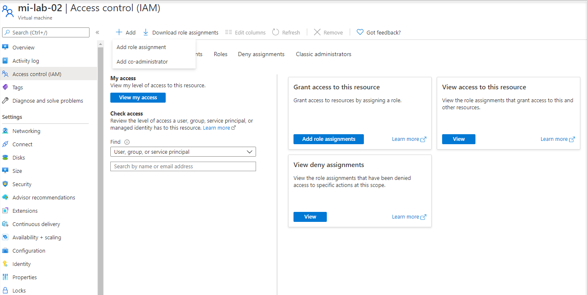

# Assign a managed identity access to a resource by using the Azure portal

[!INCLUDE [preview-notice](../../../includes/active-directory-msi-preview-notice.md)]

After you've configured an Azure resource with a managed identity, you can give the managed identity access to another resource, just like any security principal. This article shows you how to give an Azure virtual machine or virtual machine scale set's managed identity access to an Azure storage account, by using the Azure portal.

## Prerequisites

- If you're unfamiliar with managed identities for Azure resources, check out the [overview section](overview.md). **Be sure to review the [difference between a system-assigned and user-assigned managed identity](overview.md#how-does-it-work)**.
- If you don't already have an Azure account, [sign up for a free account](https://azure.microsoft.com/free/) before continuing.

## Use RBAC to assign a managed identity access to another resource

After you've enabled managed identity on an Azure resource, such as an [Azure VM](qs-configure-portal-windows-vm.md) or [Azure VMSS](qs-configure-portal-windows-vmss.md):

1. Sign in to the [Azure portal](https://portal.azure.com) using an account associated with the Azure subscription under which you have configured the managed identity.

2. Navigate to the desired resource on which you want to modify access control. In this example, we are giving an Azure virtual machine access to a storage account, so we navigate to the storage account.

3. Select the **Access control (IAM)** page of the resource, and select **+ Add role assignment**. Then specify the **Role**, **Assign access to**, and specify the corresponding **Subscription**. Under the search criteria area, you should see the resource. Select the resource, and select **Save**. 

     
     
## Next steps

- [Managed identity for Azure resources overview](overview.md)
- To enable managed identity on an Azure virtual machine, see [Configure managed identities for Azure resources on a VM using the Azure portal](qs-configure-portal-windows-vm.md).
- To enable managed identity on an Azure virtual machine scale set, see [Configure managed identities for Azure resources on a virtual machine scale set using the Azure portal](qs-configure-portal-windows-vmss.md).

