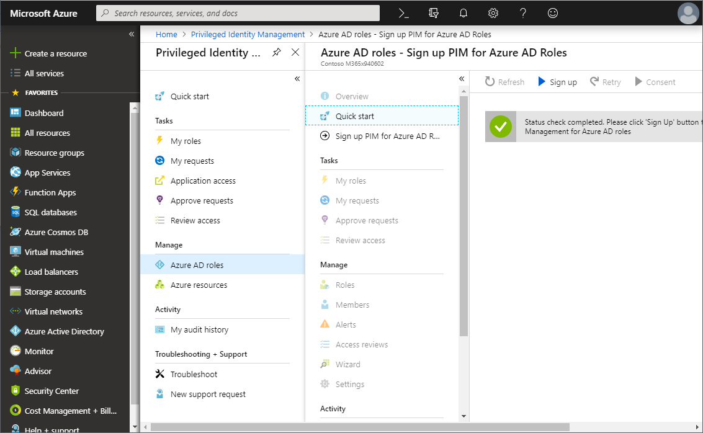
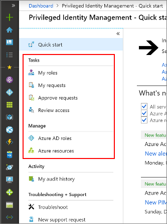
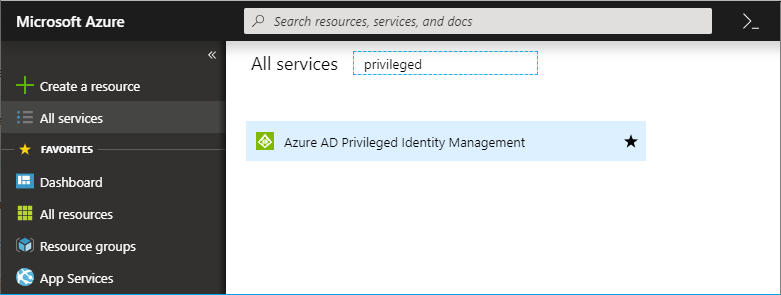
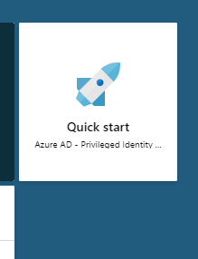

# Start using Privileged Identity Management

With Privileged Identity Management (PIM), you can manage, control, and monitor access within your Azure Active Directory (Azure AD) organization. This scope includes access to Azure resources, Azure AD, and other Microsoft online services like Office 365 or Microsoft Intune.

This article describes how to enable and get started using Privileged Identity Management.

## Prerequisites

To use Privileged Identity Management, you must have one of the following licenses:

- Azure AD Premium P2
- Enterprise Mobility + Security (EMS) E5

For more information, see [License requirements to use Privileged Identity Management](subscription-requirements.md).

## Sign up PIM for Azure AD roles

Once you have enabled Privileged Identity Management for your directory, you'll need to sign up Privileged Identity Management to manage Azure AD roles.

1. Open **Azure AD Privileged Identity Management**.

1. Select **Azure AD roles**.

    

1. Select **Sign up**.

1. In the message that appears, click **Yes** to sign up Privileged Identity Management to manage Azure AD roles.

    

    When sign up completes, the Azure AD options will be enabled. You might need to refresh the portal.

    For information about how to discover and select the Azure resources to protect with Privileged Identity Management, see [Discover Azure resources to manage in Privileged Identity Management](pim-resource-roles-discover-resources.md).

## Navigate to your tasks

Once Privileged Identity Management is set up, you can start your identity management tasks.

| Task + Manage | Description |
| --- | --- |
| **My roles**  | Displays a list of eligible and active roles assigned to you. This is where you can activate any assigned eligible roles. |
| **My requests** | Displays your pending requests to activate eligible role assignments. |
| **Approve requests** | Displays a list of requests to activate eligible roles by users in your directory that you are designated to approve. |
| **Review access** | Lists active access reviews you are assigned to complete, whether you're reviewing access for yourself or someone else. |
| **Azure AD roles** | Displays a dashboard and settings for privileged role administrators to manage Azure AD role assignments. This dashboard is disabled for anyone who isn't a privileged role administrator. These users have access to a special dashboard titled My view. The My view dashboard only displays information about the user accessing the dashboard, not the entire tenant. |
| **Azure resources** | Displays a dashboard and settings for privileged role administrators to manage Azure resource role assignments. This dashboard is disabled for anyone who isn't a privileged role administrator. These users have access to a special dashboard titled My view. The My view dashboard only displays information about the user accessing the dashboard, not the entire tenant. |

## Add a PIM tile to the dashboard

To make it easier to open Privileged Identity Management, add a Privileged Identity Management tile to your Azure portal dashboard.

1. Sign in to the [Azure portal](https://portal.azure.com/).

1. Select **All services** and find the **Azure AD Privileged Identity Management** service.

    

1. Select the Privileged Identity Management Quickstart.

1. Check **Pin blade to dashboard** to pin the Privileged Identity Management Quickstart blade to the dashboard.

    

    On the Azure dashboard, you'll see a tile like this:

    

## Next steps

- [Assign Azure AD roles in Privileged Identity Management](pim-how-to-add-role-to-user.md)
- [Discover Azure resources to manage in Privileged Identity Management](pim-resource-roles-discover-resources.md)
