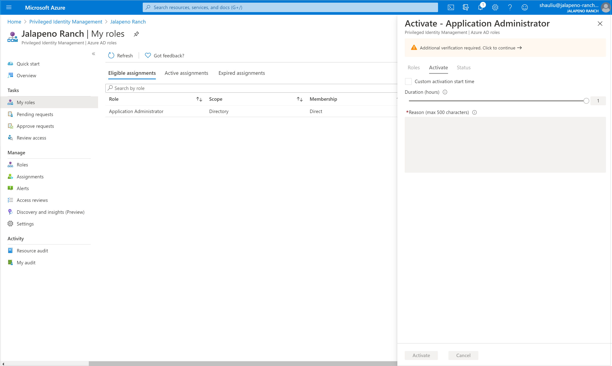
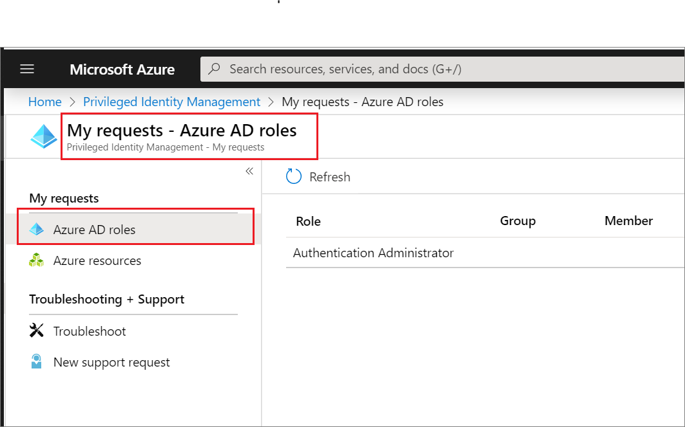
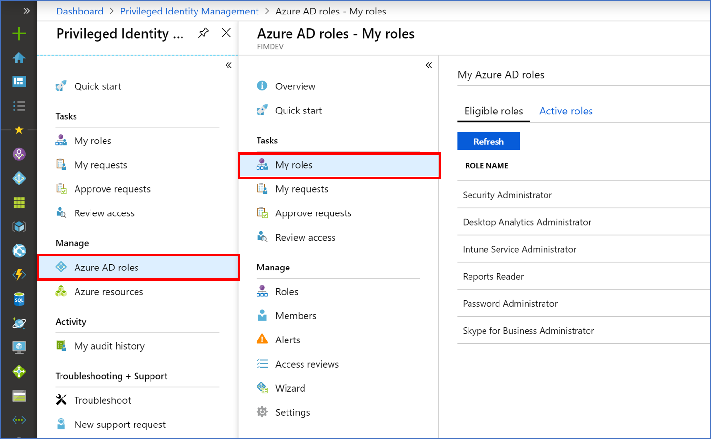
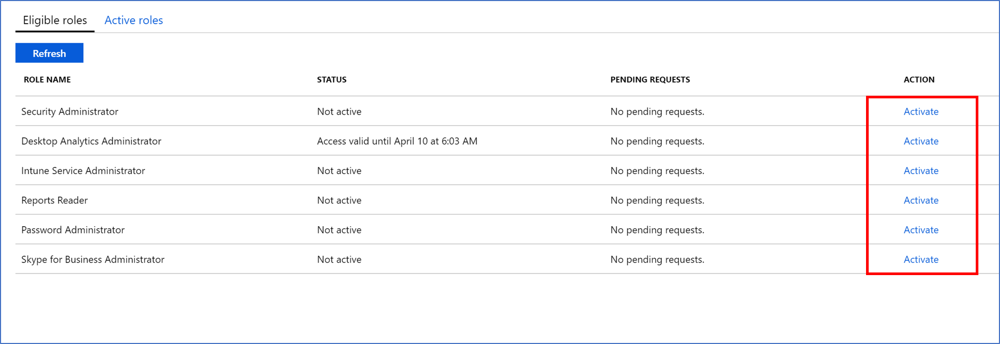
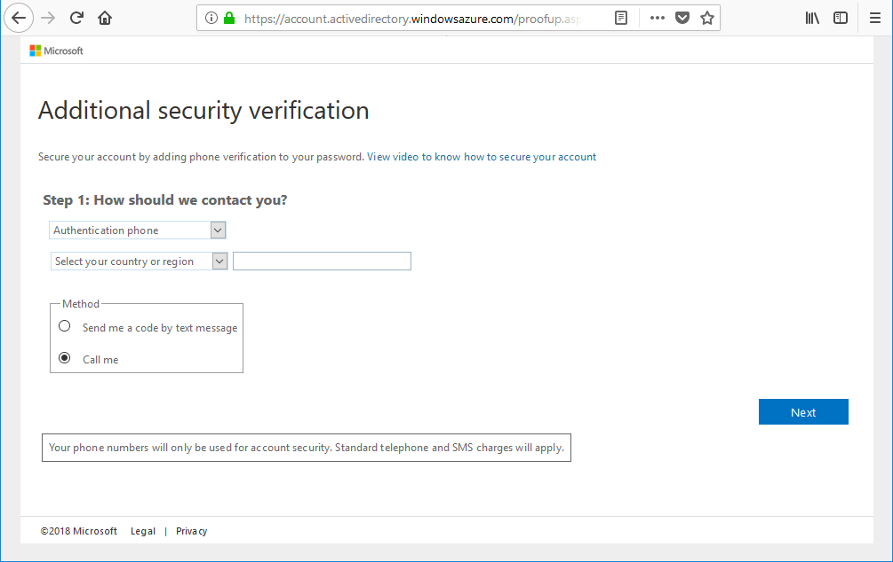
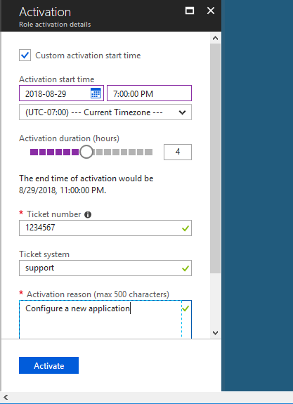
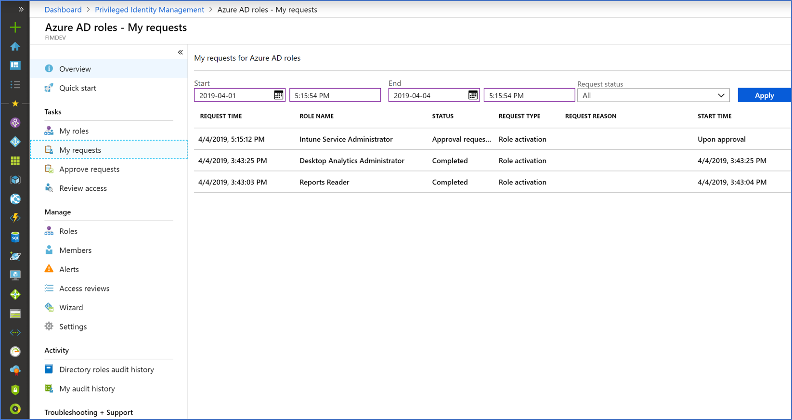
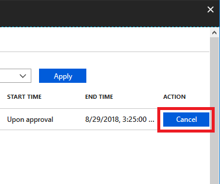

# Activate my Azure AD roles in PIM

Azure Active Directory (Azure AD) Privileged Identity Management (PIM) simplifies how enterprises manage privileged access to resources in Azure AD and other Microsoft online services like Microsoft 365 or Microsoft Intune.  

If you have been made eligible for an administrative role, then you must activate the role assignment when you need to perform privileged actions. For example, if you occasionally manage Microsoft 365 features, your organization's privileged role administrators may not make you a permanent Global Administrator, since that role impacts other services, too. Instead, they make you eligible for Azure AD roles such as Exchange Online Administrator. You can request to activate that role when you need its privileges, and then you'll have administrator control for a predetermined time period.

This article is for administrators who need to activate their Azure AD role in Privileged Identity Management.

## Determine your version of PIM

Beginning in November 2019, the Azure AD roles portion of Privileged Identity Management is being updated to a new version that matches the experiences for Azure resource roles. This creates additional features as well as [changes to the existing API](azure-ad-roles-features.md#api-changes). While the new version is being rolled out, which procedures that you follow in this article depend on version of Privileged Identity Management you currently have. Follow the steps in this section to determine which version of Privileged Identity Management you have. After you know your version of Privileged Identity Management, you can select the procedures in this article that match that version.

1. Sign in to the [Azure portal](https://portal.azure.com/) with the [Privileged role administrator](../roles/permissions-reference.md#privileged-role-administrator) role.
1. Open **Azure AD Privileged Identity Management**. If you have a banner on the top of the overview page, follow the instructions in the **New version** tab of this article. Otherwise, follow the instructions in the **Previous version** tab.

    

# [New version](#tab/new)

## Activate a role for new version

When you need to assume an Azure AD role, you can request activation by opening **My roles** in Privileged Identity Management.

1. Sign in to the [Azure portal](https://portal.azure.com/).

1. Open **Azure AD Privileged Identity Management**. For information about how to add the Privileged Identity Management tile to your dashboard, see [Start using Privileged Identity Management](pim-getting-started.md).

1. Select **My roles**, and then select **Azure AD roles** to see a list of your eligible Azure AD roles.

    

1. In the **Azure AD roles** list, find the role you want to activate.

    

1. Select **Activate** to open the Activate page.

    

1. If your role requires multi-factor authentication, select **Verify your identity before proceeding**. You only have to authenticate once per session.

    

1. Select **Verify my identity** and follow the instructions to provide additional security verification.

    

1. If you want to specify a reduced scope, select **Scope** to open the filter pane. On the filter pane, you can specify the Azure AD resources that you need access to. It's a best practice to request access to only the resources you need.

1. If necessary, specify a custom activation start time. The Azure AD role would be activated after the selected time.

1. In the **Reason** box, enter the reason for the activation request.

1. Select **Activate**.

    If the [role requires approval](pim-resource-roles-approval-workflow.md) to activate, a notification will appear in the upper right corner of your browser informing you the request is pending approval.

    

## View the status of your requests for new version

You can view the status of your pending requests to activate.

1. Open Azure AD Privileged Identity Management.

1. Select **My requests** to see a list of your Azure AD role and Azure resource role requests.

    

1. Scroll to the right to view the **Request Status** column.

## Cancel a pending request for new version

If you do not require activation of a role that requires approval, you can cancel a pending request at any time.

1. Open Azure AD Privileged Identity Management.

1. Select **My requests**.

1. For the role that you want to cancel, select the **Cancel** link.

    When you select Cancel, the request will be canceled. To activate the role again, you will have to submit a new request for activation.

   

## Troubleshoot for new version

### Permissions are not granted after activating a role

When you activate a role in Privileged Identity Management, the activation may not instantly propagate to all portals that require the privileged role. Sometimes, even if the change is propagated, web caching in a portal may result in the change not taking effect immediately. If your activation is delayed, here is what you should do.

1. Sign out of the Azure portal and then sign back in.

1. In Privileged Identity Management, verify that you are listed as the member of the role.

# [Previous version](#tab/previous)

## Activate a role (previous version)

When you need to take on an Azure AD role, you can request activation by using the **My roles** navigation option in Privileged Identity Management.

1. Sign in to the [Azure portal](https://portal.azure.com/).

1. Open **Azure AD Privileged Identity Management**. For information about how to add the Privileged Identity Management tile to your dashboard, see [Start using Privileged Identity Management](pim-getting-started.md).

1. Click **Azure AD roles**.

1. Click **My roles** to see a list of your eligible Azure AD roles.

    

1. Find a role that you want to activate.

    

1. Click **Activate** to open the Role activation details pane.

1. If your role requires multi-factor authentication (MFA), click **Verify your identity before proceeding**. You only have to authenticate once per session.

    

1. Click **Verify my identity** and follow the instructions to provide additional security verification.

    

1. Click **Activate** to open the Activation pane.

    

1. If necessary, specify a custom activation start time.

1. Specify the activation duration.

1. In the **Activation reason** box, enter the reason for the activation request. Some roles require you to supply a trouble ticket number.

    

1. Click **Activate**.

    If the role does not require approval, an **Activation status** pane appears that displays the status of the activation.

    

    Once all the stages are complete, click the **Sign out** link to sign out of the Azure portal. When you sign back in to the portal, you can now use the role.

    If the [role requires approval](./azure-ad-pim-approval-workflow.md) to activate, an Azure notification will appear in the upper right corner of your browser informing you the request is pending approval.

## View the status of your requests (previous version)

You can view the status of your pending requests to activate.

1. Open Azure AD Privileged Identity Management.

1. Click **Azure AD roles**.

1. Click **My requests** to see a list of your requests.

    

## Deactivate a role (previous version)

Once a role has been activated, it automatically deactivates when its time limit (eligible duration) is reached.

If you complete your administrator tasks early, you can also deactivate a role manually in Azure AD Privileged Identity Management.

1. Open Azure AD Privileged Identity Management.

1. Click **Azure AD roles**.

1. Click **My roles**.

1. Click **Active roles** to see your list of active roles.

1. Find the role you're done using and then click **Deactivate**.

## Cancel a pending request (previous version)

If you do not require activation of a role that requires approval, you can cancel a pending request at any time.

1. Open Azure AD Privileged Identity Management.

1. Click **Azure AD roles**.

1. Click **My requests**.

1. For the role that you want to cancel, click the **Cancel** button.

    When you click Cancel, the request will be canceled. To activate the role again, you will have to submit a new request for activation.

   

## Troubleshoot (previous version)

### Permissions are not granted after activating a role

When you activate a role in Privileged Identity Management, the activation may not instantly propagate to all portals that require the privileged role. Sometimes, even if the change is propagated, web caching in a portal may result in the change not taking effect immediately. If your activation is delayed, here is what you should do.

1. Sign out of the Azure portal and then sign back in.

    When you activate an Azure AD role, you will see the stages of your activation. Once all the stages are complete, you will see a **Sign out** link. You can use this link to sign out. This will solve most cases for activation delay.

1. In Privileged Identity Management, verify that you are listed as the member of the role.

 ---

## Next steps

- [Activate my Azure AD roles in Privileged Identity Management](pim-how-to-activate-role.md)
