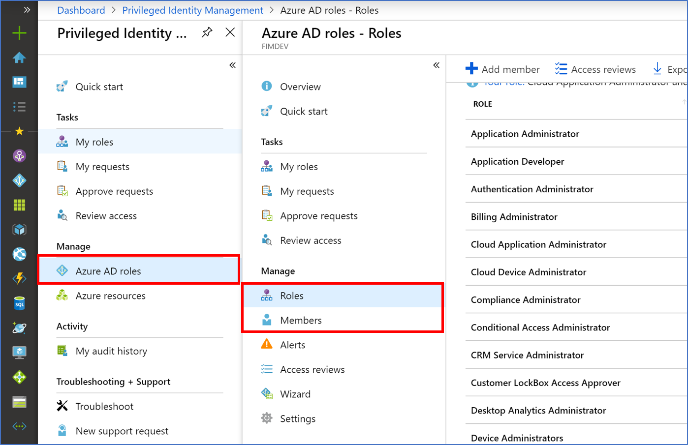
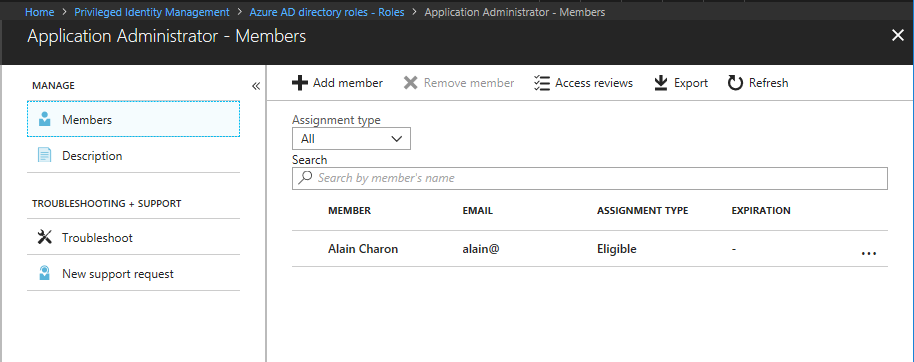
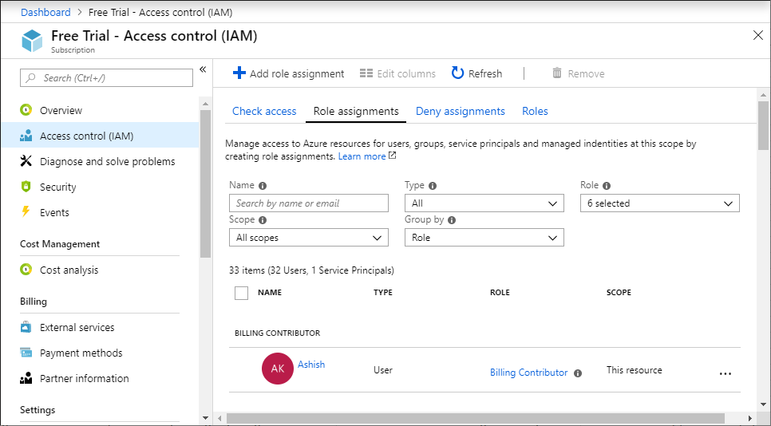
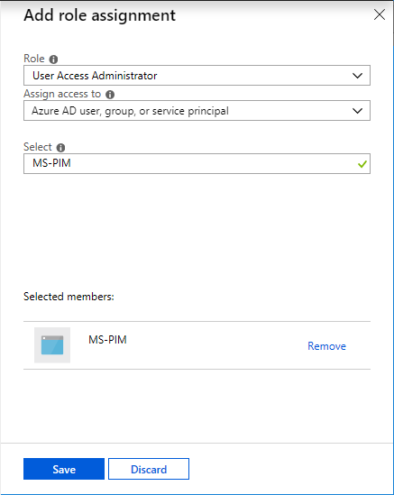

# Assign Azure AD roles in Privileged Identity Management

With Azure Active Directory (Azure AD), a Global administrator can make **permanent** Azure AD admin role assignments. These role assignments can be created using the [Azure portal](../users-groups-roles/directory-assign-admin-roles.md) or using [PowerShell commands](/powershell/module/azuread#directory_roles).

The Azure AD Privileged Identity Management (PIM) service also allows Privileged Role Administrators to make permanent admin role assignments. Additionally, Privileged Role Administrators can make users **eligible** for Azure AD admin roles. An eligible administrator can activate the role when they need it, and then their permissions expire once they're done.

## Make a user eligible for a role

Follow these steps to make a user eligible for an Azure AD admin role.

1. Sign in to [Azure portal](https://portal.azure.com/) with a user that is a member of the [Privileged Role Administrator](../users-groups-roles/directory-assign-admin-roles.md#privileged-role-administrator) role.

    For information about how to grant another administrator access to manage Privileged Identity Management, see [Grant access to other administrators to manage Privileged Identity Management](pim-how-to-give-access-to-pim.md).

1. Open **Azure AD Privileged Identity Management**.

    If you haven't started Privileged Identity Management in the Azure portal yet, go to [Start using Privileged Identity Management](pim-getting-started.md).

1. Select **Azure AD roles**.

1. Select **Roles** or **Members**.

    

1. Select **Add member** to open Add managed members.

1. Select **Select a role**, select a role you want to manage, and then select **Select**.

    

1. Select **Select members**, select the users you want to assign to the role, and then select **Select**.

    

1. In Add managed members, select **OK** to add the user to the role.

1. In the list of roles, select the role you just assigned to see the list of members.

     When the role is assigned, the user you selected will appear in the members list as **Eligible** for the role.

    

1. Now that the user is eligible for the role, let them know that they can activate it according to the instructions in [Activate my Azure AD roles in Privileged Identity Management](pim-how-to-activate-role.md).

    Eligible administrators are asked to register for Azure Multi-Factor Authentication (MFA) during activation. If a user cannot register for MFA, or is using a Microsoft account (usually @outlook.com), you need to make them permanent in all their roles.

## Make a role assignment permanent

By default, new users are only Eligible for an Azure AD admin role. Follow these steps if you want to make a role assignment permanent.

1. Open **Azure AD Privileged Identity Management**.

1. Select **Azure AD roles**.

1. Select **Members**.

    

1. Select an **Eligible** role that you want to make permanent.

1. Select **More** and then select **Make perm**.

    

    The role is now listed as **permanent**.

    

## Remove a user from a role

You can remove users from role assignments, but make sure there is always at least one user who is a permanent Global Administrator. If you're not sure which users still need their role assignments, you can [start an access review for the role](pim-how-to-start-security-review.md).

Follow these steps to remove a specific user from an Azure AD admin role.

1. Open **Azure AD Privileged Identity Management**.

1. Select **Azure AD roles**.

1. Select **Members**.

    

1. Select the role assignment you want to remove.

1. Select **More** and then **Remove**.

    

1. When you're asked to confirm the action, select **Yes**.

    

    The role assignment is removed.

## Authorization error when assigning roles

Scenario: As an active owner or user access administrator for an Azure resource, you are able to see your resource inside Privileged Identity Management but can't perform any actions such as making an eligible assignment or viewing a list of role assignments from the resource overview page. Any of these actions results in an authorization error.

To assign roles, the MS-PIM service principal must be assigned the [User Access Administrator role](../../role-based-access-control/built-in-roles.md#user-access-administrator) in Azure role-based access control for Azure resource access (as opposed to Azure AD administration roles). Instead of waiting until MS-PIM is assigned the User Access Administrator role, you can assign it manually.

The following steps assign the User Access Administrator role to the MS-PIM service principal for a subscription.

1. Sign into the [Azure portal](https://portal.azure.com) as a Global administrator in your Azure AD organization.

1. Choose **All services** and then **Subscriptions**.

1. Choose your subscription.

1. Choose **Access control (IAM)**.

1. Choose **Role assignments** to see the current list of role assignments at the subscription scope.

   

1. Check whether the **MS-PIM** service principal is assigned the **User Access Administrator** role.

1. If not, choose **Add role assignment** to open the **Add role assignment** pane.

1. In the **Role** drop-down list, select the **User Access Administrator** role.

1. In the **Select** list, find and select the **MS-PIM** service principal.

   

1. Choose **Save** to assign the role.

   After a few moments, the MS-PIM service principal is assigned the User Access Administrator role at the subscription scope.

   

## Next steps

- [Configure Azure AD admin role settings in Privileged Identity Management](pim-how-to-change-default-settings.md)
- [Assign Azure resource roles in Privileged Identity Management](pim-resource-roles-assign-roles.md)
