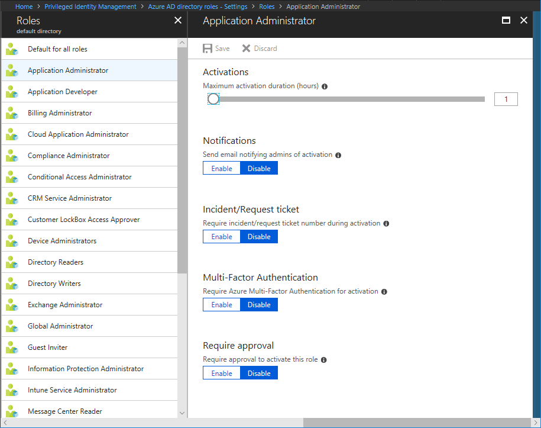

# Configure Azure AD role settings in Privileged Identity Management

A Privileged role administrator can customize Privileged Identity Management (PIM) in their Azure Active Directory (Azure AD) organization, including changing the experience for a user who is activating an eligible role assignment.

## Open role settings

Follow these steps to open the settings for an Azure AD role.

1. Open **Azure AD Privileged Identity Management**.

1. Click **Azure AD roles**.

1. Click **Settings**.

    

1. Click **Roles**.

1. Click the role whose settings you want to configure.

    

    On the settings page for each role, there are several settings you can configure. These settings only affect users who are **eligible** assignments, not **permanent** assignments.

## Activations

Use the **Activations** slider to set the maximum time, in hours, that a role stays active before it expires. This value can be between 1 and 72 hours.

## Notifications

Use the **Notifications** switch to specify whether administrators will receive email notifications when roles are activated. This notification can be useful for detecting unauthorized or illegitimate activations.

When set to **Enable**, notifications are sent to:

- Privileged role administrator
- Security administrator
- Global administrator

For more information, see [Email notifications in Privileged Identity Management](pim-email-notifications.md).

## Incident/Request ticket

Use the **Incident/Request ticket** switch to require eligible administrators to include a ticket number when they activate their role. This practice can make role access audits more effective.

## Multi-Factor Authentication

Use the **Multi-Factor Authentication** switch to specify whether to require users to verify their identity with MFA before they can activate their roles. They only have to verify their identity once per session, not every time they activate a role. There are two tips to keep in mind when you enable MFA:

- Users who have Microsoft accounts for their email addresses (typically @outlook.com, but not always) cannot register for Azure Multi-Factor Authentication. If you want to assign roles to users with Microsoft accounts, you should either make them permanent admins or disable multi-factor authentication for that role.
- You cannot disable Azure Multi-Factor Authentication for highly privileged roles for Azure AD and Office 365. This safety feature helps protect the following roles:  
  
  - Azure Information Protection administrator
  - Billing administrator
  - Cloud application administrator
  - Compliance administrator
  - Conditional access administrator
  - Dynamics 365 administrator
  - Customer LockBox access approver
  - Directory writers
  - Exchange administrator
  - Global administrator
  - Intune administrator
  - Power BI administrator
  - Privileged role administrator
  - Security administrator
  - SharePoint administrator
  - Skype for Business administrator
  - User administrator

For more information, see [Multi-factor authentication and Privileged Identity Management](pim-how-to-require-mfa.md).

## Require approval

If you want to delegate the required approval to activate a role, follow these steps.

1. Set the **Require approval** switch to **Enabled**. The pane expands with options to select approvers.

    

    If you don't specify any approvers, the Privileged role administrator becomes the default approver and is then required to approve all activation requests for this role.

1. To specify approvers, click **Select approvers**.

    

1. Select one or more approvers in addition to the Privileged role administrator and then click **Select**. You can select users or groups. We recommend at least two approvers is. Even if you add yourself as an approver, you can't self-approve a role activation. Your selections will appear in the list of selected approvers.

1. After you have specified your all your role settings, select **Save** to save your changes.

<!--PLACEHOLDER: Need an explanation of what the temporary Global Administrator setting is for.-->

## Next steps

- [Assign Azure AD roles in Privileged Identity Management](pim-how-to-add-role-to-user.md)
- [Configure security alerts for Azure AD roles in Privileged Identity Management](pim-how-to-configure-security-alerts.md)
