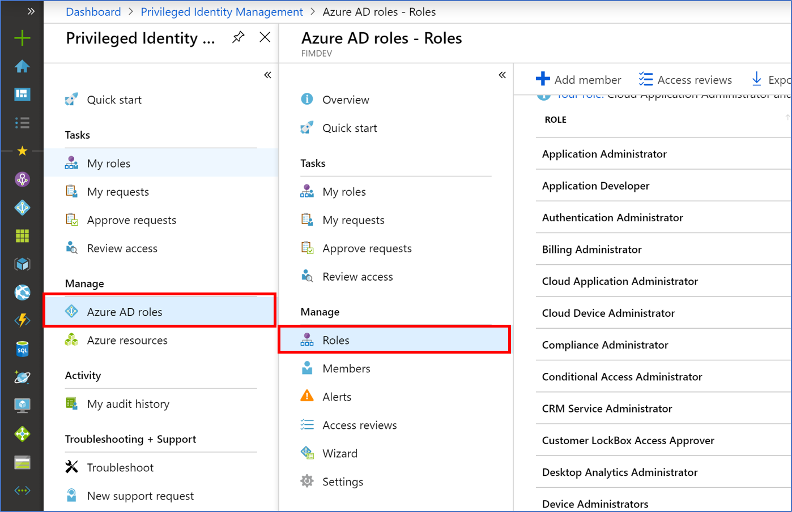

# Grant access to other administrators to manage Privileged Identity Management

The Global administrator who enables Privileged Identity Management (PIM) for an organization automatically get role assignments and access to Privileged Identity Management. No one else in your Azure Active Directory (Azure AD) organization gets write access by default, though, including other Global administrators. Other Global administrators, Security administrators, and Security readers have read-only access to Privileged Identity Management. To grant access to Privileged Identity Management, the first user can assign others to the **Privileged Role Administrator** role.

> [!NOTE]
> Managing Privileged Identity Management requires Azure Multi-Factor Authentication. Since Microsoft accounts cannot register for Azure Multi-Factor Authentication, a user who signs in with a Microsoft account cannot access Privileged Identity Management.

Make sure there are always at least two users in a Privileged Role Administrator role, in case one user is locked out or their account is deleted.

## Grant access to manage PIM

1. Sign in to the [Azure portal](https://portal.azure.com/).

1. In Azure AD, open **Privileged Identity Management**.

1. Select **Azure AD roles**.

1. Select **Roles**.

    

1. Select the **Privileged Role Administrator** role to open the members page.

    

1. Select **Add member**  to open the Add managed members pane.

1. Select **Select members** to open the Select members pane.

    

1. Select a member and then click **Select**.

1. Select **OK** to make the member eligible for the **Privileged Role Administrator** role.

    When you assign a new role to someone in Privileged Identity Management, they are automatically configured as **Eligible** to activate the role.

1. To make the member permanent, select the user in the Privileged Role Administrator member list.

1. Select **More** and then **Make permanent** to make the assignment permanent.

    

1. Send the user a link to [Start using Privileged Identity Management](pim-getting-started.md).

## Remove access to manage PIM

Before you remove someone from the Privileged Role Administrator role, always make sure there will still be at least two users assigned to it.

1. Sign in to the [Azure portal](https://portal.azure.com/).

1. Open **Azure AD Privileged Identity Management**.

1. Select **Azure AD roles**.

1. Select **Roles**.

1. Select the **Privileged Role Administrator** role to open the members page.

1. Select the checkbox next to the user you want to remove and then select **Remove member**.

    

1. When you are asked to confirm that you want to remove the member from the role, select **Yes**.

## Next steps

- [Start using Privileged Identity Management](pim-getting-started.md)
