# Invite guest users and assign Azure resource roles in Privileged Identity Management

Azure Active Directory (Azure AD) guest users are part of the business-to-business (B2B) collaboration capabilities within Azure AD so that you can manage external guest users and vendors as guests in Azure AD. When you combine B2B collaboration with Azure AD Privileged Identity Management (PIM), you can extend your compliance and governance requirements to guests. For example, you can use these Privileged Identity Management features for Azure identity tasks with guests:

- Assign access to specific Azure resources
- Enable just-in-time access
- Specify assignment duration and end date
- Require multi-factor authentication on active assignment or activation
- Perform access reviews
- Utilize alerts and audit logs

This article describes how to invite a guest to your organization and manage their access to Azure resources using Privileged Identity Management.

## When would you invite guests?

Here are a couple examples of when you might invite guests to your organization:

- Allow an external self-employed vendor that only has an email account to access your Azure resources for a project.
- Allow an external partner in a large organization that uses on-premises Active Directory Federation Services to access your expense application.
- Allow support engineers not in your organization (such as Microsoft support) to temporarily access your Azure resource to troubleshoot issues.

## How does collaboration using B2B guests work?

When you use B2B collaboration, you can invite an external user to your organization as a guest. The guest can be managed as a user in your organization, but a guest has to be authenticated in their home organization and not in your Azure AD organization. This means that if the guest no longer has access to their home organization, they also lose access to your organization. For example, if the guest leaves their organization, they automatically lose access to any resources you shared with them in Azure AD without you having to do anything. For more information about B2B collaboration, see [What is guest user access in Azure Active Directory B2B?](../b2b/what-is-b2b.md).

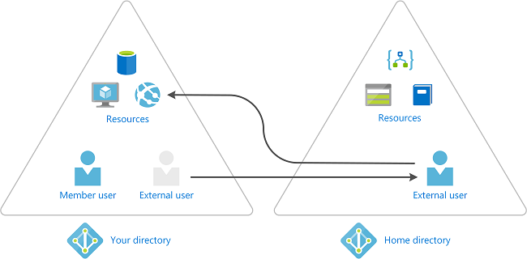

## Check guest collaboration settings

To make sure you can invite guests into your organization, you should check your guest collaboration settings.

1. Sign in to [Azure portal](https://portal.azure.com/).

1. Select **Azure Active Directory** > **User settings**.

1. Select **Manage external collaboration settings**.

    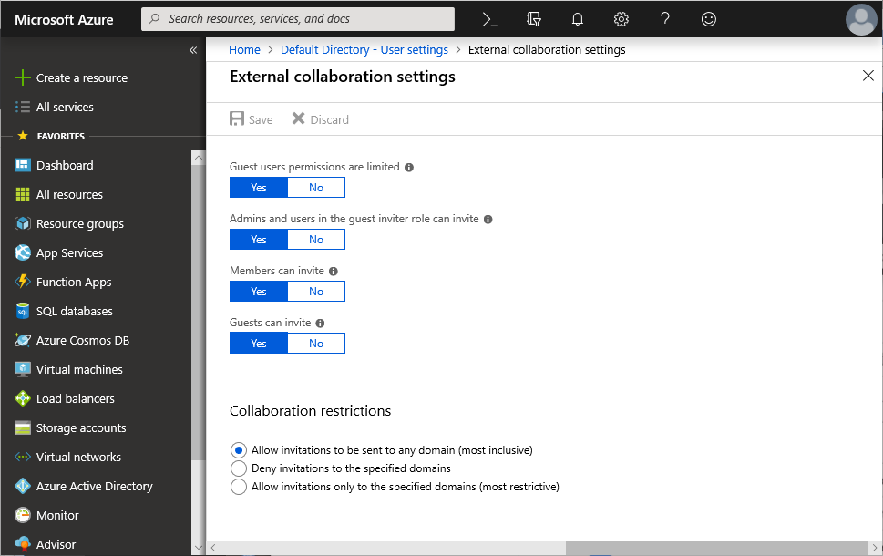

1. Ensure that the **Admins and users in the guest inviter role can invite** switch is set to **Yes**.

## Invite a guest and assign a role

Using Privileged Identity Management, you can invite a guest and make them eligible for an Azure resource role.

1. Sign in to [Azure portal](https://portal.azure.com/) with a user that is a member of the [Privileged Role Administrator](../users-groups-roles/directory-assign-admin-roles.md#privileged-role-administrator) or [User Administrator](../users-groups-roles/directory-assign-admin-roles.md#user-administrator) role.

1. Open **Azure AD Privileged Identity Management**.

1. Select **Azure resources**.

1. Use the **Resource filter** to filter the list of managed resources.

1. Select the resource you want to manage, such as a resource, resource group, subscription, or management group.

    You should set the scope to only what the guest needs.

1. Under Manage, select **Roles** to see the list of roles for Azure resources.

    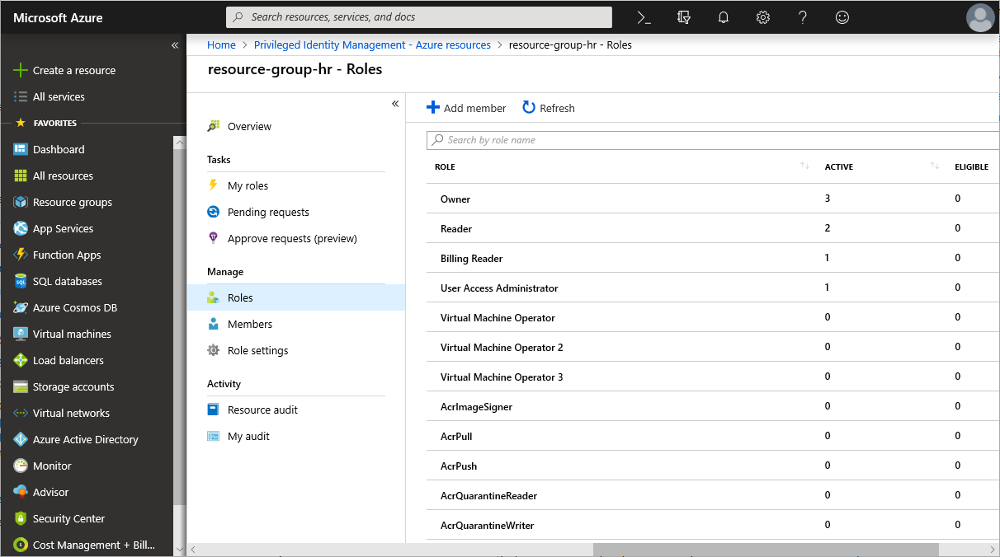

1. Select the minimum role that the user will need.

    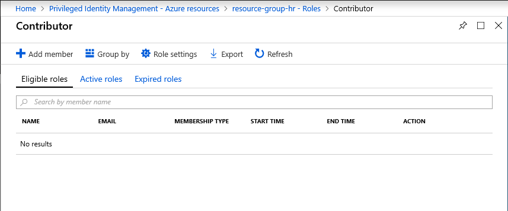

1. On the role page, select **Add member** to open the New assignment pane.

1. Click **Select a member or group**.

    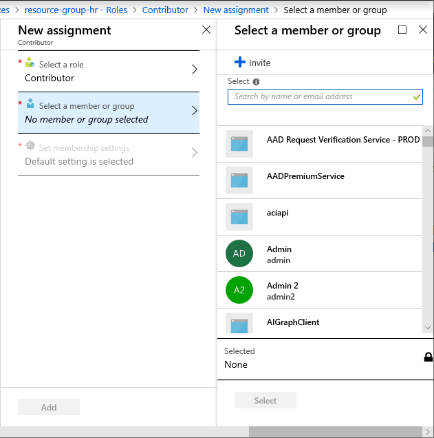

1. To invite a guest, click **Invite**.

    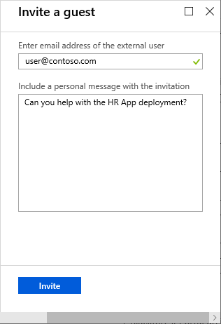

1. After you have selected a guest, click **Invite**.

    The guest should be added as a selected member.

1. In the **Select a member or group** pane, click **Select**.

1. In the **Membership settings** pane, select the assignment type and duration.

    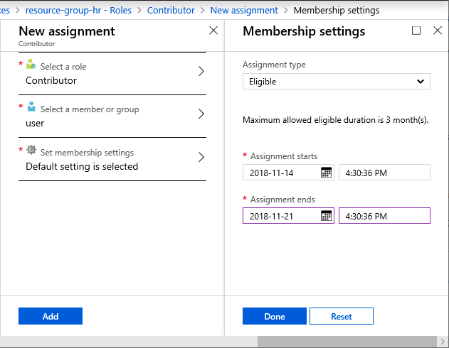

1. To complete the assignment, select **Done** and then **Add**.

    The guest role assignment will appear in your role list.

    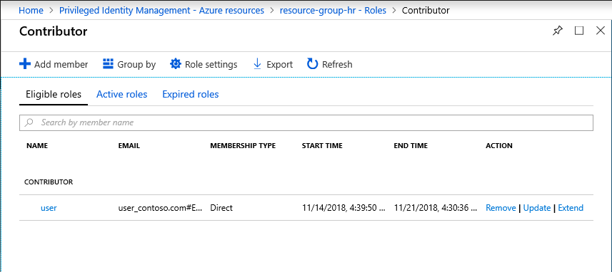

## Activate role as a guest

If you are an external user, you must accept the invite to be a guest in the Azure AD organization and possibly activate your role assignment.

1. Open the email with your invitation. The email will look similar to the following.

    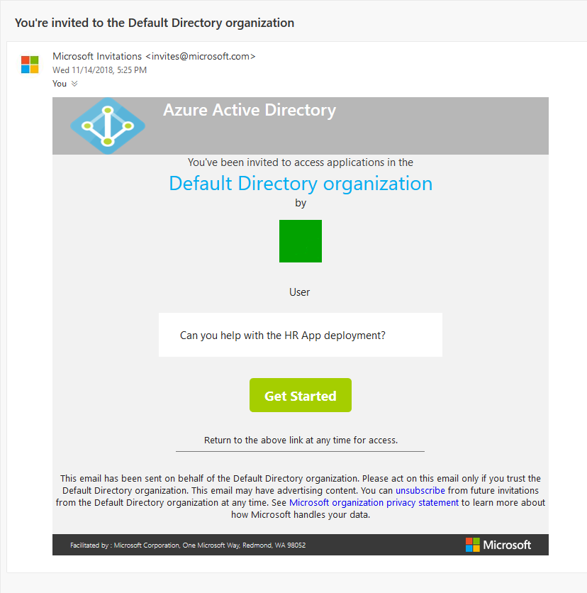

1. Select the **Get Started** link in the email.

1. After reviewing the permissions, click **Accept**.

    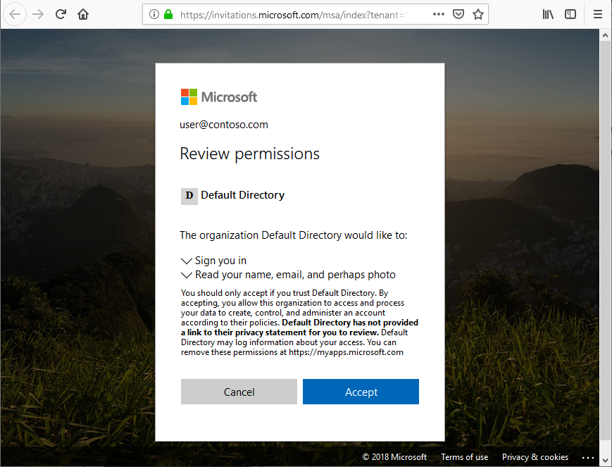

1. You might be asked to accept a terms of use and specify whether you want to stay signed in. In the Azure portal, if you are *eligible* for a role, you won't yet have access to resources.

1. To activate your role assignment, open the email with your activate role link. The email will look similar to the following.

    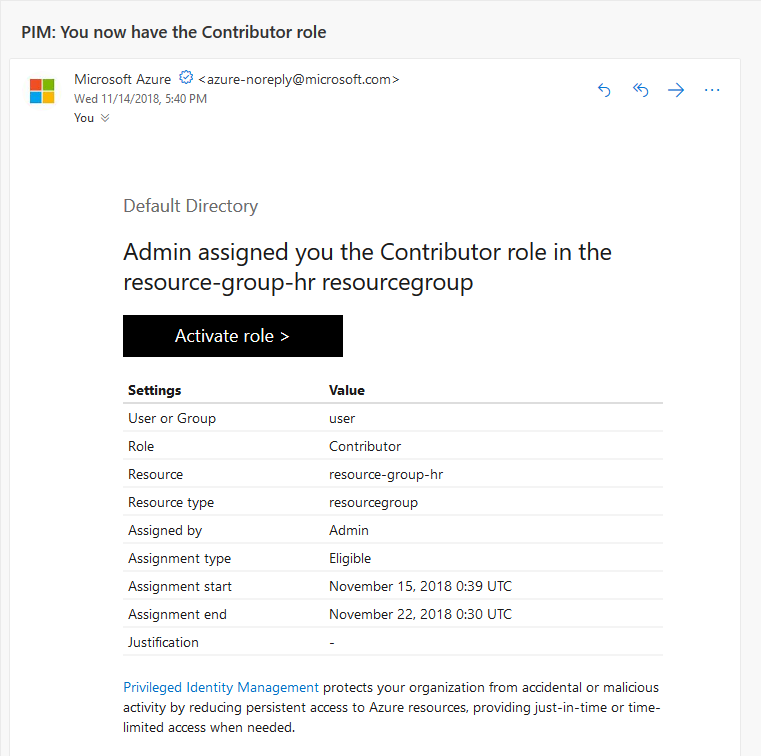

1. Select **Activate role** to open your eligible roles in Privileged Identity Management.

    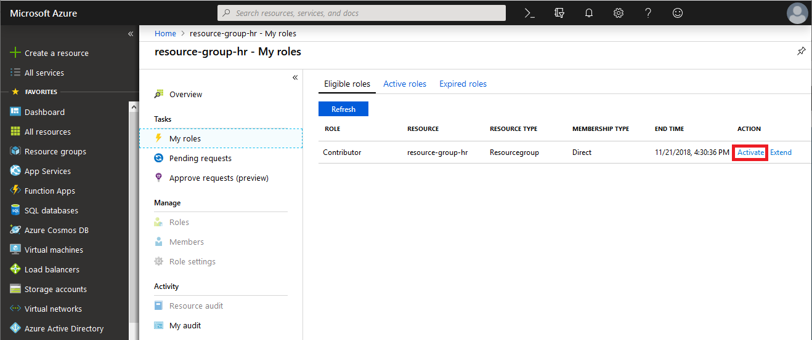

1. Under Action, select the **Activate** link.

    Depending on the role settings, you'll need to specify some information to activate the role.

1. Once you have specified the settings for the role, click **Activate** to activate the role.

    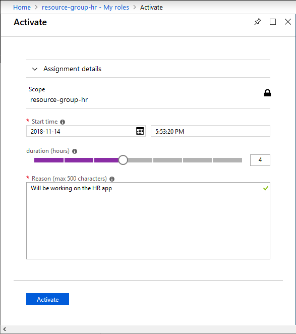

    Unless the administrator is required to approve your request, you should have access to the specified resources.

## View activity for a guest

You can view audit logs to keep track of what guests are doing.

1. As an administrator, open Privileged Identity Management and select the resource that has been shared.

1. Select **Resource audit** to view the activity for that resource. The following shows an example of the activity for a resource group.

    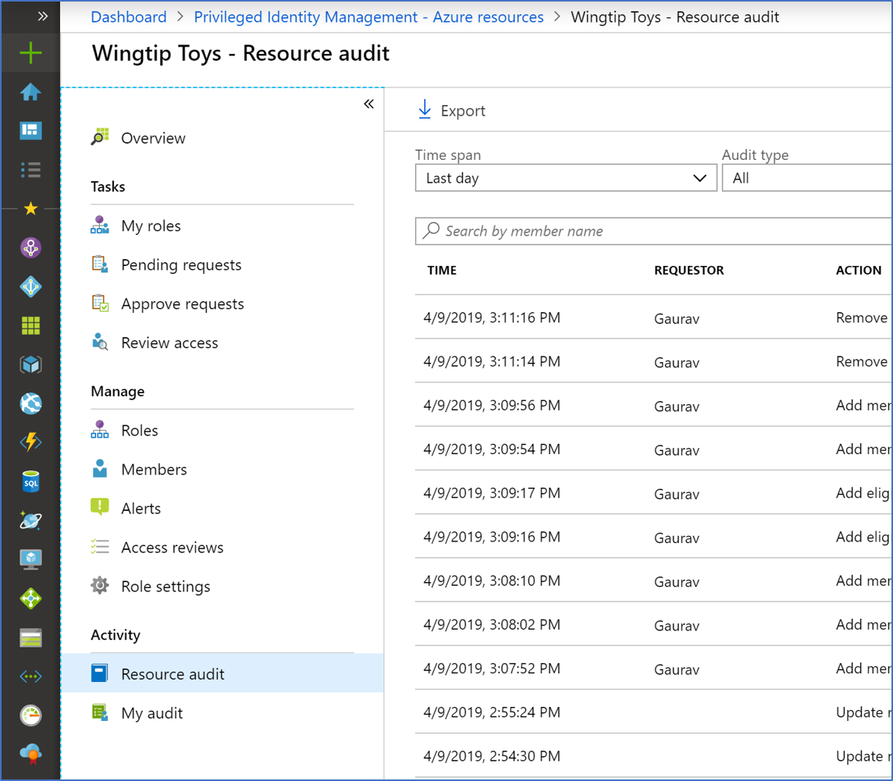

1. To view the activity for the guest, select **Azure Active Directory** > **Users** > *guest name*.

1. Select **Audit logs** to see the audit logs for the organization. If necessary, you can specify filters.

    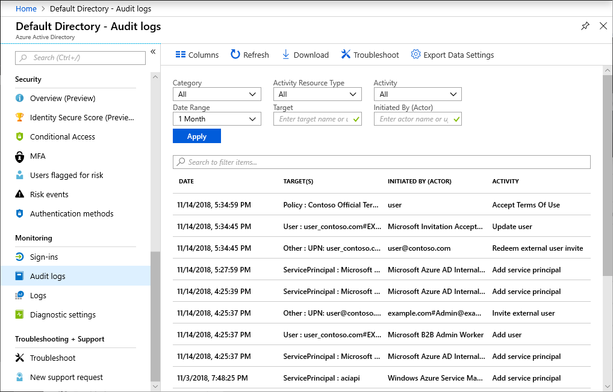

## Next steps

- [Assign Azure AD admin roles in Privileged Identity Management](pim-how-to-add-role-to-user.md)
- [What is guest user access in Azure AD B2B collaboration?](../b2b/what-is-b2b.md)
