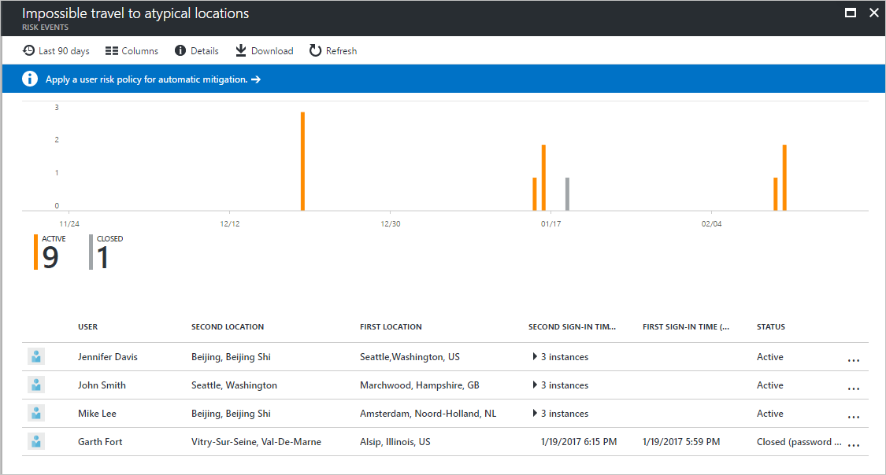
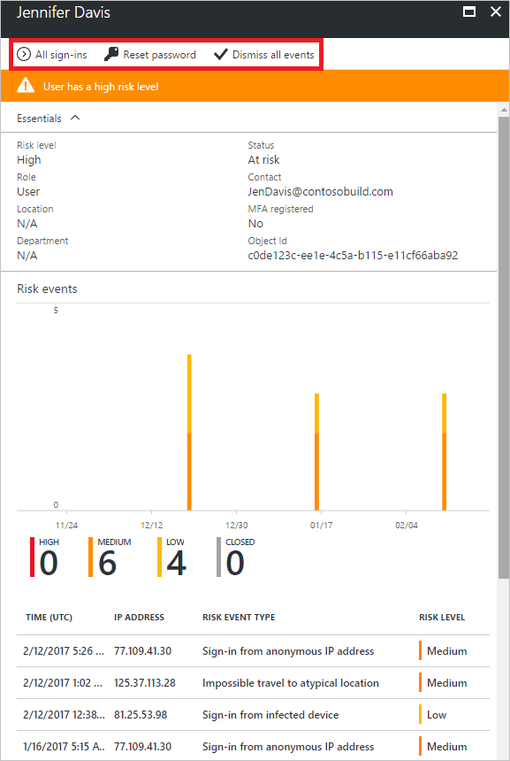
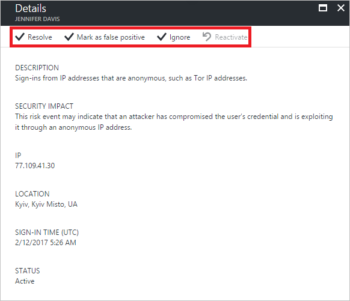

---

title: Risky sign-ins report in portal | Microsoft Docs
description: Learn about the risky sign-ins report in the Azure Active Directory portal
services: active-directory
author: MarkusVi
manager: daveba

ms.assetid: 7728fcd7-3dd5-4b99-a0e4-949c69788c0f
ms.service: active-directory
ms.devlang: na
ms.topic: conceptual
ms.tgt_pltfrm: na
ms.workload: identity
ms.subservice: report-monitor
ms.date: 10/28/2019
ms.author: markvi
ms.reviewer: dhanyahk

ms.collection: M365-identity-device-management
---
# Risky sign-ins report in the Azure Active Directory portal

Azure Active Directory (Azure AD) detects suspicious actions that are related to your user accounts. For each detected action, a record called a **risk detection** is created. For more details, see [Azure AD risk detections](concept-risk-events.md). 

You can access the security reports from the [Azure portal](https://portal.azure.com) by selecting the **Azure Active Directory** blade and then navigating to the **Security** section. 

There are two different security reports that are calculated based on the risk detections:

- **Risky sign-ins** - A risky sign-in is an indicator for a sign-in attempt that might have been performed by someone who is not the legitimate owner of a user account.

- **Users flagged for risk** - A risky user is an indicator for a user account that might have been compromised. 

To learn how to configure the policies that trigger these risk detections, see [How to configure the user risk policy](../identity-protection/howto-user-risk-policy.md).  

## Who can access the risky sign-ins report?

The risky sign-ins reports are available to users in the following roles:

- Security Administrator
- Global Administrator
- Security Reader

To learn how to assign administrative roles to a user in Azure Active Directory, see [View and assign administrator roles in Azure Active Directory](https://docs.microsoft.com/azure/active-directory/users-groups-roles/directory-manage-roles-portal).

## What Azure AD license do you need to access a security report?  

All editions of Azure AD provide you with risky sign-ins reports. However, the level of report granularity varies between the editions: 

- In the **Azure Active Directory Free and Basic editions**, you get a list of risky sign-ins. 

- In addition, the **Azure Active Directory Premium 1** edition allows you to examine some of the underlying risk detections that have been detected for each report. 

- The **Azure Active Directory Premium 2** edition provides you with the most detailed information about all underlying risk detections and it also enables you to configure security policies that automatically respond to configured risk levels.

## Risky sign-ins report for Azure AD free and basic edition

The Azure AD free and basic editions provide you with a list of risky sign-ins that have been detected for your users. Each record contains the following attributes:

- **User** - The name of the user that was used during the sign-in operation.
- **IP** - The IP address of the device that was used to connect to Azure Active Directory.
- **Location** - The location used to connect to Azure Active Directory. This is a best effort approximation based on traces, registry data, reverse look ups and other information.
- **Sign-in time** - The time when the sign-in was performed
- **Status** - The status of the sign-in

Based on your investigation of the risky sign-in, you can provide feedback to Azure AD by taking the following actions:

- Resolve
- Mark as false positive
- Ignore
- Reactivate

This report also provides you with an option to:

- Search resources
- Download the report data

## Risky sign-ins report for Azure AD premium editions

The risky sign-ins report in the Azure AD premium editions provides you with:

- Aggregated information about the [risk detection types](concept-risk-events.md) that have been detected. With the **Azure AD Premium P1 edition**, detections that are not covered by your license appear as the risk detection **Sign-in with additional risk detected**. With the **Azure AD Premium P2 edition**, you get the most detailed information about all underlying detections.

- An option to download the report

When you select a risk detection, you get a detailed report view for this risk detection that enables you to:

- An option to configure a [user risk remediation policy](../identity-protection/howto-user-risk-policy.md)  

- Review the detection timeline for the risk detection  

- Review a list of users for which this risk detection has been detected

- Manually close risk detections. 

> [!IMPORTANT]
> Sometimes, you may find a risk detection without a corresponding sign-in entry in the [sign-ins report](concept-sign-ins.md). This is because Identity Protection evaluates risk for both **interactive** and **non-interactive** sign-ins, whereas the sign-ins report shows only the interactive sign-ins.

When you select a user, you get a detailed report view for this user that enables you to:

- Open the All sign-ins view

- Reset the user's password

- Dismiss all events

- Investigate reported risk detections for the user. 

To investigate a risk detection, select one from the list.  
This opens the **Details** blade for this risk detection. On the **Details** blade, you have the option to either manually close a risk detection or reactivate a manually closed risk detection. 

## Next steps

- [How to configure the user risk policy](../identity-protection/howto-user-risk-policy.md)
- [How to configure the risk remediation policy](../identity-protection/howto-user-risk-policy.md)
- [Risk detection types](concept-risk-events.md)
