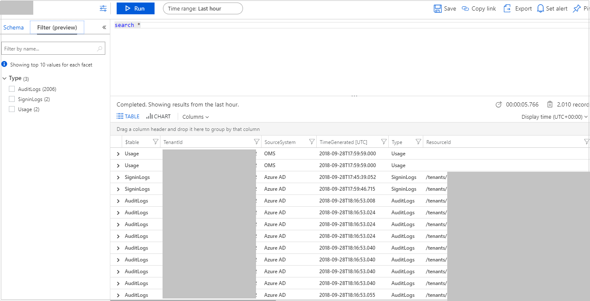
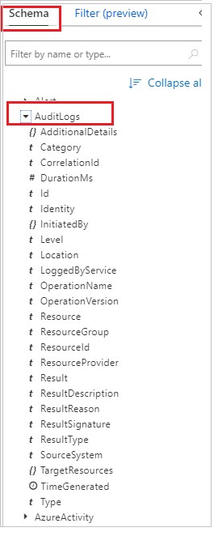
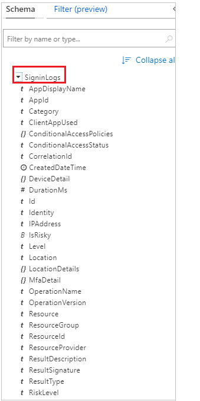
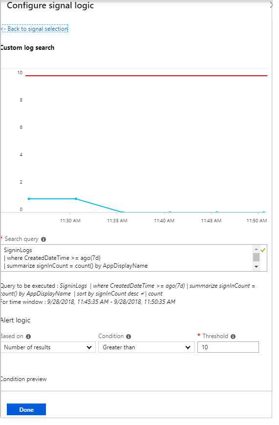

# Analyze Azure AD activity logs with Azure Monitor logs

After you [integrate Azure AD activity logs with Azure Monitor logs](howto-integrate-activity-logs-with-log-analytics.md), you can use the power of Azure Monitor logs to gain insights into your environment. You can also install the [Log analytics views for Azure AD activity logs](howto-install-use-log-analytics-views.md) to get access to pre-built reports around audit and sign-in events in your environment.

In this article, you learn how to analyze the Azure AD activity logs in your Log Analytics workspace. 

[!INCLUDE [azure-monitor-log-analytics-rebrand](../../../includes/azure-monitor-log-analytics-rebrand.md)]

## Prerequisites 

To follow along, you need:

* A Log Analytics workspace in your Azure subscription. Learn how to [create a Log Analytics workspace](../../azure-monitor/learn/quick-create-workspace.md).
* First, complete the steps to [route the Azure AD activity logs to your Log Analytics workspace](howto-integrate-activity-logs-with-log-analytics.md).
*  [Access](../../azure-monitor/platform/manage-access.md#manage-access-using-workspace-permissions) to the log analytics workspace
* The following roles in Azure Active Directory (if you are accessing Log Analytics through Azure Active Directory portal)
    - Security Admin
    - Security Reader
    - Report Reader
    - Global Admin
    
## Navigate to the Log Analytics workspace

1. Sign in to the [Azure portal](https://portal.azure.com). 

2. Select **Azure Active Directory**, and then select **Logs** from the **Monitoring** section to open your Log Analytics workspace. The workspace will open with a default query.

    


## View the schema for Azure AD activity logs

The logs are pushed to the **AuditLogs** and **SigninLogs** tables in the workspace. To view the schema for these tables:

1. From the default query view in the previous section, select **Schema** and expand the workspace. 

2. Expand the **Log Management** section and then expand either **AuditLogs** or **SigninLogs** to view the log schema.
    
    

## Query the Azure AD activity logs

Now that you have the logs in your workspace, you can now run queries against them. For example, to get the top applications used in the last week, replace the default query with the following and select **Run**

```
SigninLogs 
| where CreatedDateTime >= ago(7d)
| summarize signInCount = count() by AppDisplayName 
| sort by signInCount desc 
```

To get the top audit events over the last week, use the following query:

```
AuditLogs 
| where TimeGenerated >= ago(7d)
| summarize auditCount = count() by OperationName 
| sort by auditCount desc 
```
## Alert on Azure AD activity log data

You can also set up alerts on your query. For example, to configure an alert when more than 10 applications have been used in the last week:

1. From the workspace, select **Set alert** to open the **Create rule** page.

    

2. Select the default **alert criteria** created in the alert and update the **Threshold** in the default metric to 10.

    

3. Enter a name and description for the alert, and choose the severity level. For our example, we could set it to **Informational**.

4. Select the **Action Group** that will be alerted when the signal occurs. You can choose to notify your team via email or text message, or you could automate the action using webhooks, Azure functions or logic apps. Learn more about [creating and managing alert groups in the Azure portal](../../azure-monitor/platform/action-groups.md).

5. Once you have configured the alert, select **Create alert** to enable it. 

## Install and use pre-built views for Azure AD activity logs

You can also download the pre-built log analytics views for Azure AD activity logs. The views provide several reports related to common scenarios involving audit and sign-in events. You can also alert on any of the data provided in the reports, using the steps described in the previous section.

* **Azure AD Account Provisioning Events**: This view shows reports related to auditing provisioning activity, such as the number of new users provisioned and provisioning failures, number of users updated and update failures and the number of users de-provisioned and corresponding failures.    
* **Sign-ins Events**: This view shows the most relevant reports related to monitoring sign-in activity, such as sign-ins by application, user, device, as well as a summary view tracking the number of sign-ins over time.
* **Users Performing Consent**: This view shows reports related to user consent, such as the consent grants by user, sign-ins by users who granted consent as well as sign-ins by application for all consent-based applications. 

Learn how to [install and use log analytics views for Azure AD activity logs](howto-install-use-log-analytics-views.md). 


## Next steps

* [Get started with queries in Azure Monitor logs](../../azure-monitor/log-query/get-started-queries.md)
* [Create and manage alert groups in the Azure portal](../../azure-monitor/platform/action-groups.md)
* [Install and use the log analytics views for Azure Active Directory](howto-install-use-log-analytics-views.md)