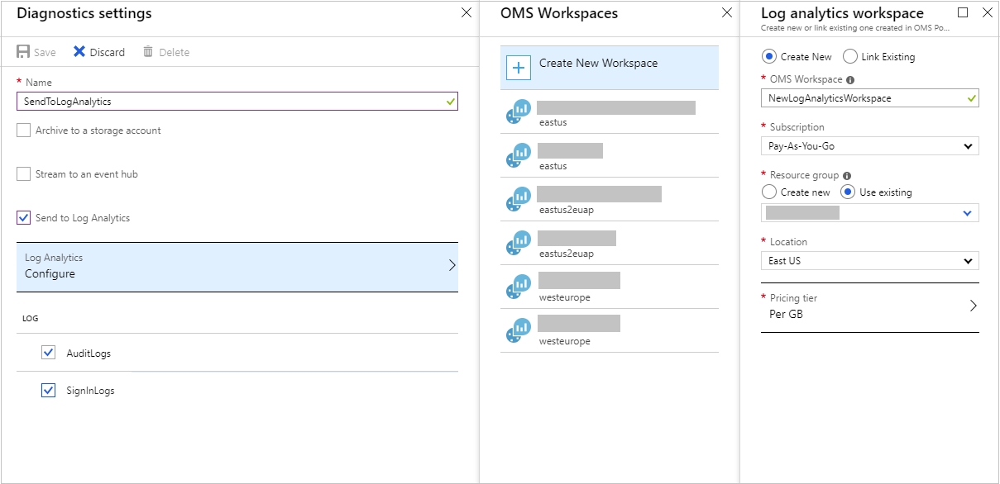

# Integrate Azure AD logs with Azure Monitor logs

[!INCLUDE [azure-monitor-log-analytics-rebrand](../../../includes/azure-monitor-log-analytics-rebrand.md)]

Azure Monitor logs allows you to query data to find particular events, analyze trends, and perform correlation across various data sources. With the integration of Azure AD activity logs in Azure Monitor logs, you can now perform tasks like:

 * Compare your Azure AD sign-in logs against security logs published by Azure Security Center

 * Troubleshoot performance bottlenecks on your application’s sign-in page by correlating application performance data from Azure Application Insights.  

The following video from an Ignite session demonstrates the benefits of using Azure Monitor logs for Azure AD logs in practical user scenarios.

> [!VIDEO https://www.youtube.com/embed/MP5IaCTwkQg?start=1894]

In this article, you learn how to integrate Azure Active Directory (Azure AD) logs with Azure Monitor.

## Supported reports

You can route audit activity logs and sign-in activity logs to Azure Monitor logs for further analysis. 

* **Audit logs**: The [audit logs activity report](concept-audit-logs.md) gives you access to the history of every task that's performed in your tenant.
* **Sign-in logs**: With the [sign-in activity report](concept-sign-ins.md), you can determine who performed the tasks that are reported in the audit logs.

> [!NOTE]
> B2C-related audit and sign-in activity logs are not supported at this time.
>

## Prerequisites 

To use this feature, you need:

* An Azure subscription. If you don't have an Azure subscription, you can [sign up for a free trial](https://azure.microsoft.com/free/).
* An Azure AD tenant.
* A user who's a *global administrator* or *security administrator* for the Azure AD tenant.
* A Log Analytics workspace in your Azure subscription. Learn how to [create a Log Analytics workspace](https://docs.microsoft.com/azure/log-analytics/log-analytics-quick-create-workspace).

## Send logs to Azure Monitor

1. Sign in to the [Azure portal](https://portal.azure.com). 

2. Select **Azure Active Directory** > **Diagnostic settings** -> **Add diagnostic setting**. You can also select **Export Settings** from the **Audit Logs** or **Sign-ins** page to get to the diagnostic settings configuration page.  
    
3. In the **Diagnostic settings** menu, select the **Send to Log Analytics workspace** check box, and then select **Configure**.

4. Select the Log Analytics workspace you want to send the logs to, or create a new workspace in the provided dialog box.  

5. Do either or both of the following:
    * To send audit logs to the Log Analytics workspace, select the **AuditLogs** check box. 
    * To send sign-in logs to the Log Analytics workspace, select the **SignInLogs** check box.

6. Select **Save** to save the setting.

    

7. After about 15 minutes, verify that events are streamed to your Log Analytics workspace.

## Next steps

* [Analyze Azure AD activity logs with Azure Monitor logs](howto-analyze-activity-logs-log-analytics.md)
* [Install and use the log analytics views for Azure Active Directory](howto-install-use-log-analytics-views.md)