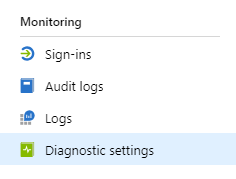

---

title: What is Azure Active Directory monitoring? | Microsoft Docs
description: Provides a general overview of Azure Active Directory monitoring.
services: active-directory
documentationcenter: ''
author: MarkusVi
manager: daveba
editor: ''

ms.assetid: e2b3d8ce-708a-46e4-b474-123792f35526
ms.service: active-directory
ms.devlang: na
ms.topic: overview
ms.tgt_pltfrm: na
ms.workload: identity
ms.subservice: report-monitor
ms.date: 04/18/2019
ms.author: markvi
ms.reviewer: dhanyahk  

# Customer intent: As an Azure AD administrator, I want to understand what monitoring solutions are available for Azure AD activity data and how they can help me manage my tenant.
ms.collection: M365-identity-device-management
---

# What is Azure Active Directory monitoring?

With Azure Active Directory (Azure AD) monitoring, you can now route your Azure AD activity logs to different endpoints. You can then either retain it for long-term use or integrate it with third-party Security Information and Event Management (SIEM) tools to gain insights into your environment.

Currently, you can route the logs to:

- An Azure storage account.
- An Azure event hub, so you can integrate with your Splunk and Sumologic instances.
- Azure Log Analytics workspace, wherein you can analyze the data, create dashboard and alert on specific events

**Prerequisite role**: Global Admin

> [!VIDEO https://www.youtube.com/embed/syT-9KNfug8]

[!INCLUDE [azure-monitor-log-analytics-rebrand](../../../includes/azure-monitor-log-analytics-rebrand.md)]

## Licensing and prerequisites for Azure AD reporting and monitoring

You'll need an Azure AD premium license to access the Azure AD sign in logs.

For detailed feature and licensing information in the [Azure Active Directory pricing guide](https://azure.microsoft.com/pricing/details/active-directory/).

To deploy Azure AD monitoring and reporting you'll need a user who is a global administrator or security administrator for the Azure AD tenant.

Depending on the final destination of your log data, you'll need one of the following:

* An Azure storage account that you have ListKeys permissions for. We recommend that you use a general storage account and not a Blob storage account. For storage pricing information, see the [Azure Storage pricing calculator](https://azure.microsoft.com/pricing/calculator/?service=storage).

* An Azure Event Hubs namespace to integrate with third-party SIEM solutions.

* An Azure Log Analytics workspace to send logs to Azure Monitor logs.

## Diagnostic settings configuration

To configure monitoring settings for Azure AD activity logs, first sign-in to the [Azure portal](https://portal.azure.com), then select **Azure Active Directory**. From here, you can access the diagnostic settings configuration page in two ways:

* Select **Diagnostic settings** from the **Monitoring** section.

    
    
* Select **Audit Logs** or **Sign-ins**, then select **Export settings**. 

    

## Route logs to storage account

By routing logs to an Azure storage account, you can retain it for longer than the default retention period outlined in our [retention policies](reference-reports-data-retention.md). Learn how to [route data to your storage account](quickstart-azure-monitor-route-logs-to-storage-account.md).

## Stream logs to event hub

Routing logs to an Azure event hub allows you to integrate with third-party SIEM tools like Sumologic and Splunk. This integration allows you to combine Azure AD activity log data with other data managed by your SIEM, to provide richer insights into your environment. Learn how to [stream logs to an event hub](tutorial-azure-monitor-stream-logs-to-event-hub.md).

## Send logs to Azure Monitor logs

[Azure Monitor logs](../../azure-monitor/logs/log-query-overview.md) is a solution that consolidates monitoring data from different sources and provides a query language and analytics engine that gives you insights into the operation of your applications and resources. By sending Azure AD activity logs to Azure Monitor logs, you can quickly retrieve, monitor and alert on collected data. Learn how to [send data to Azure Monitor logs](howto-integrate-activity-logs-with-log-analytics.md).

You can also install the pre-built views for Azure AD activity logs to monitor common scenarios involving sign-ins and audit events. Learn how to [install and use log analytics views for Azure AD activity logs](howto-install-use-log-analytics-views.md).

## Next steps

* [Activity logs in Azure Monitor](concept-activity-logs-azure-monitor.md)
* [Stream logs to event hub](tutorial-azure-monitor-stream-logs-to-event-hub.md)
* [Send logs to Azure Monitor logs](howto-integrate-activity-logs-with-log-analytics.md)
