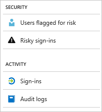

---

title: What are Azure Active Directory reports? | Microsoft Docs
description: Provides a general overview of Azure Active Directory reports.
services: active-directory
documentationcenter: ''
author: cawrites
manager: daveba
editor: ''

ms.assetid: 6141a333-38db-478a-927e-526f1e7614f4
ms.service: active-directory
ms.devlang: na
ms.topic: overview
ms.tgt_pltfrm: na
ms.workload: identity
ms.subservice: report-monitor
ms.date: 11/13/2018
ms.author: chadam
ms.reviewer: dhanyahk  

# Customer intent: As an Azure AD administrator, I want to understand what Azure AD reports are available and how I can use them to gain insights into my environment. 
ms.collection: M365-identity-device-management
---

# What are Azure Active Directory reports?

Azure Active Directory (Azure AD) reports provide a comprehensive view of activity in your environment. The provided data enables you to:

- Determine how your apps and services are utilized by your users
- Detect potential risks affecting the health of your environment
- Troubleshoot issues preventing your users from getting their work done  

The reporting architecture relies on two main pillars:

- [Security reports](#security-reports)
- [Activity reports](#activity-reports)

## Security reports

Security reports help you to protect your organization's identities. There are two types of security reports:

- **Users flagged for risk** - From the [users flagged for risk security report](concept-user-at-risk.md), you get an overview of user accounts that might have been compromised.

- **Risky sign-ins** - With the [risky sign-in security report](concept-risky-sign-ins.md), you get an indicator for sign-in attempts that might have been performed by someone who is not the legitimate owner of a user account. 

### What Azure AD license do you need to access a security report?  

All editions of Azure AD provide you with users flagged for risk and risky sign-ins reports. However, the level of report granularity varies between the editions: 

- In the **Azure Active Directory Free and Basic editions**, you get a list of users flagged for risk and risky sign-ins. 

- The **Azure Active Directory Premium 1** edition extends this model by also enabling you to examine some of the underlying risk detections that have been detected for each report. 

- The **Azure Active Directory Premium 2** edition provides you with the most detailed information about the underlying risk detections and it also enables you to configure security policies that automatically respond to configured risk levels.

## Activity reports

Activity reports help you understand the behavior of users in your organization. There are two types of activity reports in Azure AD:

- **Audit logs** - The [audit logs activity report](concept-audit-logs.md) provides you with access to the history of every task performed in your tenant.

- **Sign-ins** -  With the [sign-ins activity report](concept-sign-ins.md), you can determine, who has performed the tasks reported by the audit logs report.

### Audit logs report 

The [audit logs report](concept-audit-logs.md) provides you with records of system activities for compliance. This data enables you to address common scenarios such as:

- Someone in my tenant got access to an admin group. Who gave them access? 

- I want to know the list of users signing into a specific app since I recently onboarded the app and want to know if it’s doing well

- I want to know how many password resets are happening in my tenant

#### What Azure AD license do you need to access the audit logs report?  

The audit logs report is available for features for which you have licenses. If you have a license for a specific feature, you also have access to the audit log information for it. For more details, see [Azure Active Directory features and capabilities](https://www.microsoft.com/cloud-platform/azure-active-directory-features).   

### Sign-ins report

The [sign-ins report](concept-sign-ins.md) enables you to find answers to questions such as:

- What is the sign-in pattern of a user?
- How many users have users signed in over a week?
- What’s the status of these sign-ins?

#### What Azure AD license do you need to access the sign-ins activity report?  

To access the sign-ins activity report, your tenant must have an Azure AD Premium license associated with it.

## Programmatic access

In addition to the user interface, Azure AD also provides you with [programmatic access](concept-reporting-api.md) to the reports data, through a set of REST-based APIs. You can call these APIs from a variety of programming languages and tools. 

## Next steps

- [Risky sign-ins report](concept-risky-sign-ins.md)
- [Audit logs report](concept-audit-logs.md)
- [Sign-ins logs report](concept-sign-ins.md)
