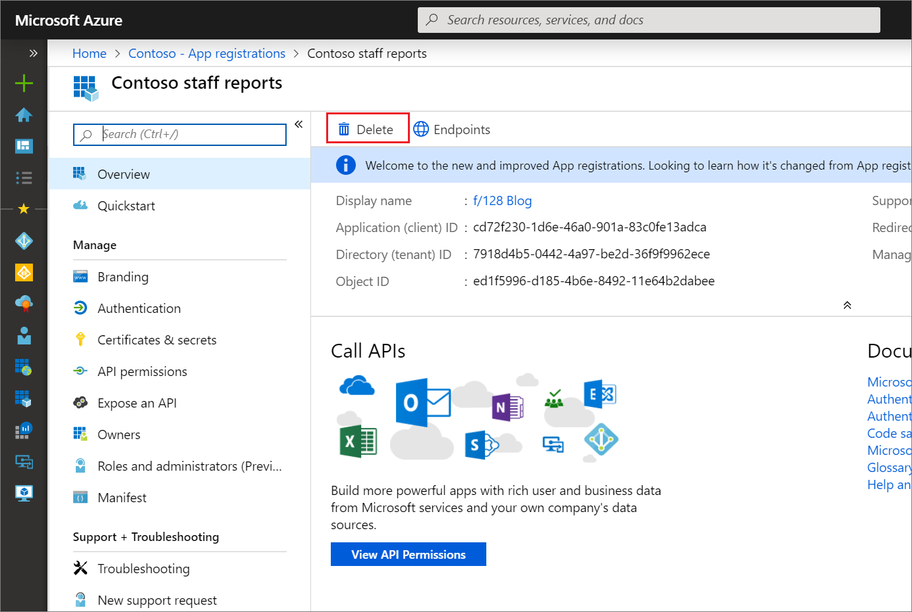
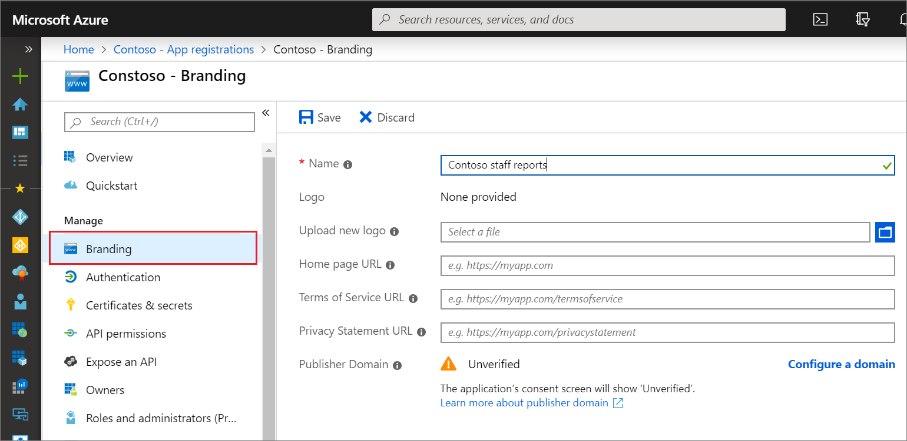
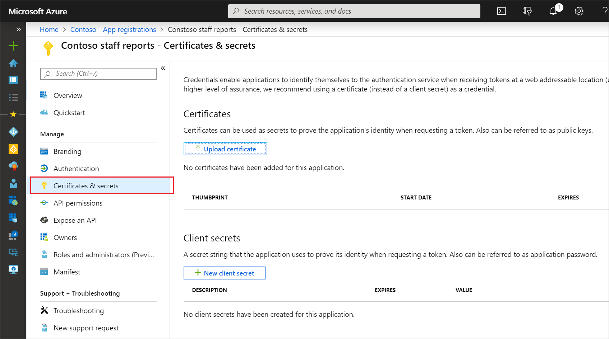
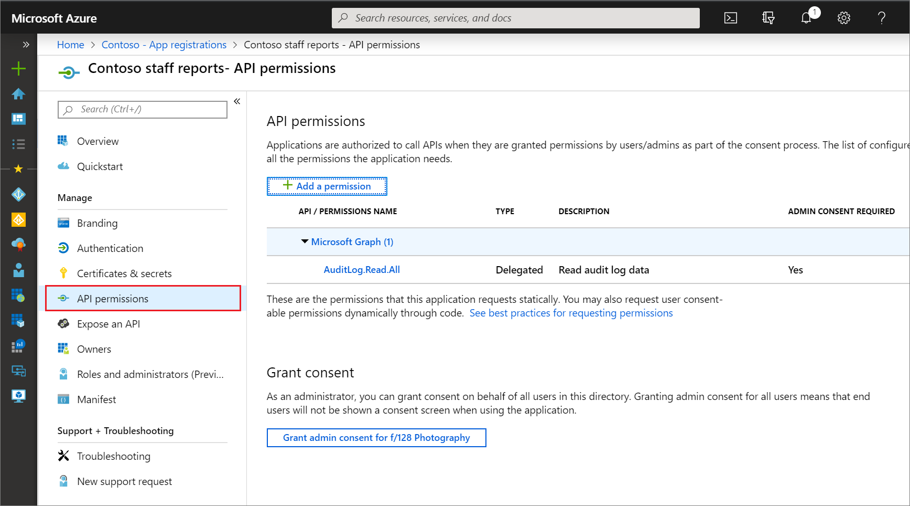
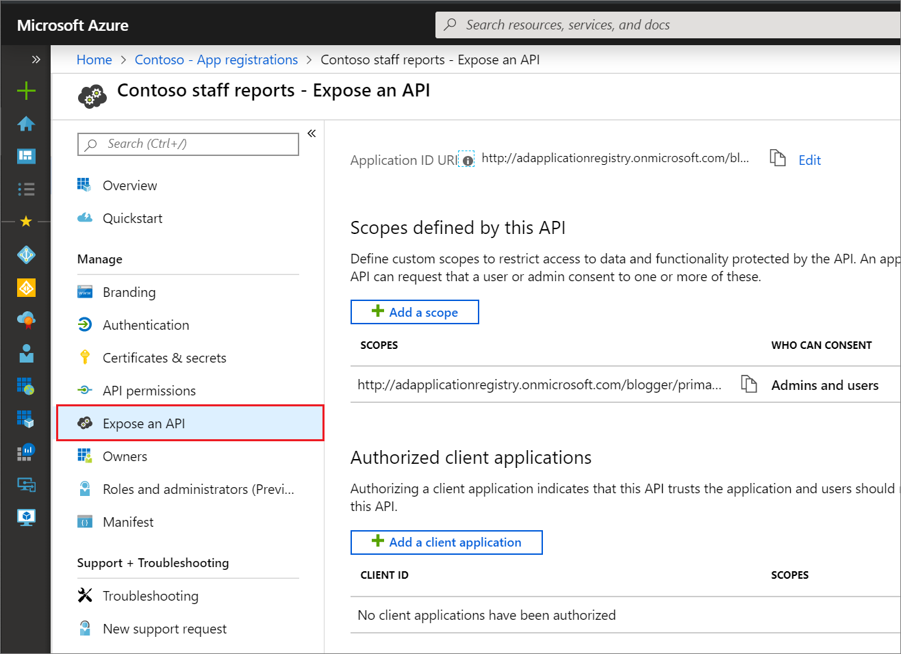

# Application registration permissions for custom roles in Azure Active Directory

This article contains the currently available app registration permissions for custom role definitions in Azure Active Directory (Azure AD).

## Permissions for managing single-tenant applications

When choosing the permissions for your custom role, you have the option to grant access to manage only single-tenant applications. single-tenant applications are available only to users in the Azure AD organization where the application is registered. single-tenant applications are defined as having **Supported account types** set to "Accounts in this organizational directory only." In the Graph API, single-tenant applications have the signInAudience property set to "AzureADMyOrg."

To grant access to manage only single-tenant applications, use the permissions below with the subtype **applications.myOrganization**. For example, microsoft.directory/applications.myOrganization/basic/update.

See the [custom roles overview](custom-overview.md) for an explanation of what the general terms subtype, permission, and property set mean. The following information is specific to application registrations.

### Create and delete

There are two permissions available for granting the ability to create application registrations, each with different behavior:

#### microsoft.directory/applications/createAsOwner

Assigning this permission results in the creator being added as the first owner of the created app registration, and the created app registration will count against the creator's 250 created objects quota.

#### microsoft.directory/applications/create

Assigning this permission results in the creator not being added as the first owner of the created app registration, and the created app registration will not count against the creator's 250 created objects quota. Use this permission carefully, because there is nothing preventing the assignee from creating app registrations until the directory-level quota is hit. If both permissions are assigned, this permission takes precedence.

If both permissions are assigned, the /create permission will take precedence. Though the /createAsOwner permission does not automatically add the creator as the first owner, owners can be specified during the creation of the app registration when using Graph APIs or PowerShell cmdlets.

Create permissions grant access to the **New registration** command.

[These permissions grant access to the New Registration portal command](./media/custom-available-permissions/new-custom-role.png)

There are two permissions available for granting the ability to delete app registrations:

#### microsoft.directory/applications/delete

Grants the ability to delete app registrations regardless of subtype; that is, both single-tenant and multi-tenant applications.

#### microsoft.directory/applications.myOrganization/delete

Grants the ability to delete app registrations restricted to those that are accessible only to accounts in your organization or single-tenant applications (myOrganization subtype).

> [!NOTE]
> When assigning a role that contains create permissions, the role assignment must be made at the directory scope. A create permission assigned at a resource scope does not grant the ability to create app registrations.

### Read

All member users in the organization can read app registration information by default. However, guest users and application service principals can't. If you plan to assign a role to a guest user or application, you must include the appropriate read permissions.

#### microsoft.directory/applications/allProperties/read

Ability to read all properties of single-tenant and multi-tenant applications outside of properties that cannot be read in any situation like credentials.

#### microsoft.directory/applications.myOrganization/allProperties/read

Grants the same permissions as microsoft.directory/applications/allProperties/read, but only for single-tenant applications.

#### microsoft.directory/applications/owners/read

Grants the ability to read owners property on single-tenant and multi-tenant applications. Grants access to all fields on the application registration owners page:

#### microsoft.directory/applications/standard/read

Grants access to read standard application registration properties. This includes properties across application registration pages.

#### microsoft.directory/applications.myOrganization/standard/read

Grants the same permissions as microsoft.directory/applications/standard/read, but for only single-tenant applications.

### Update

#### microsoft.directory/applications/allProperties/update

Ability to update all properties on single-tenant and multi-tenant applications.

#### microsoft.directory/applications.myOrganization/allProperties/update

Grants the same permissions as microsoft.directory/applications/allProperties/update, but only for single-tenant applications.

#### microsoft.directory/applications/audience/update

Ability to update the supported account type (signInAudience) property on single-tenant and multi-tenant applications.

#### microsoft.directory/applications.myOrganization/audience/update

Grants the same permissions as microsoft.directory/applications/audience/update, but only for single-tenant applications.

#### microsoft.directory/applications/authentication/update

Ability to update the reply URL, sign-out URL, implicit flow, and publisher domain properties on single-tenant and multi-tenant applications. Grants access to all fields on the application registration authentication page except supported account types:

#### microsoft.directory/applications.myOrganization/authentication/update

Grants the same permissions as microsoft.directory/applications/authentication/update, but only for single-tenant applications.

#### microsoft.directory/applications/basic/update

Ability to update the name, logo, homepage URL, terms of service URL, and privacy statement URL properties on single-tenant and multi-tenant applications. Grants access to all fields on the application registration branding page:

#### microsoft.directory/applications.myOrganization/basic/update

Grants the same permissions as microsoft.directory/applications/basic/update, but only for single-tenant applications.

#### microsoft.directory/applications/credentials/update

Ability to update the certificates and client secrets properties on single-tenant and multi-tenant applications. Grants access to all fields on the application registration certificates & secrets page:

#### microsoft.directory/applications.myOrganization/credentials/update

Grants the same permissions as microsoft.directory/applications/credentials/update, but only for single-tenant applications.

#### microsoft.directory/applications/owners/update

Ability to update the owner property on single-tenant and multi-tenant. Grants access to all fields on the application registration owners page:

#### microsoft.directory/applications.myOrganization/owners/update

Grants the same permissions as microsoft.directory/applications/owners/update, but only for single-tenant applications.

#### microsoft.directory/applications/permissions/update

Ability to update the delegated permissions, application permissions, authorized client applications, required permissions, and grant consent properties on single-tenant and multi-tenant applications. Does not grant the ability to perform consent. Grants access to all fields on the application registration API permissions and Expose an API pages:

#### microsoft.directory/applications.myOrganization/permissions/update

Grants the same permissions as microsoft.directory/applications/permissions/update, but only for single-tenant applications.

## Required license plan

[!INCLUDE [License requirement for using custom roles in Azure AD](../../../includes/active-directory-p1-license.md)]

## Next steps

- Create custom roles using [the Azure portal, Azure AD PowerShell, and Graph API](custom-create.md)
- [View the assignments for a custom role](custom-view-assignments.md)
