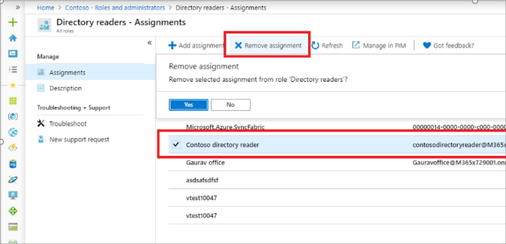

# Remove role assignments from a group in Azure Active Directory

This article describes how an IT admin can remove Azure AD roles assigned to groups. In the Azure portal, you can now remove both direct and indirect role assignments to a user. If a user is assigned a role by a group membership, remove the user from the group to remove the role assignment.

## Using Azure admin center

1. Sign in to the [Azure AD admin center](https://portal.azure.com/#blade/Microsoft_AAD_IAM/ActiveDirectoryMenuBlade/Overview) with Privileged role administrator or Global administrator permissions in the Azure AD organization.

1. Select **Roles and administrators** > ***role name***.

1. Select the group from which you want to remove the role assignment and select **Remove assignment**.

   

1. When asked to confirm your action, select **Yes**.

## Using PowerShell

### Create a group that can be assigned to role

```powershell
$group = New-AzureADMSGroup -DisplayName "Contoso_Helpdesk_Administrators" -Description "This group is assigned to Helpdesk Administrator built-in role in Azure AD." -MailEnabled $true -SecurityEnabled $true -MailNickName "contosohelpdeskadministrators" -IsAssignableToRole $true
```

### Get the role definition you want to assign the group to

```powershell
$roleDefinition = Get-AzureADMSRoleDefinition -Filter "displayName eq 'Helpdesk Administrator'"
```

### Create a role assignment

```powershell
$roleAssignment = New-AzureADMSRoleAssignment -ResourceScope '/' -RoleDefinitionId $roleDefinition.Id -PrincipalId $group.objectId
```

### Remove the role assignment

```powershell
Remove-AzureAdMSRoleAssignment -Id $roleAssignment.Id 
```

## Using Microsoft Graph API

### Create a group that can be assigned an Azure AD role

```powershell
POST https://graph.microsoft.com/beta/groups

{
"description": "This group is assigned to Helpdesk Administrator built-in role of Azure AD",
"displayName": "Contoso_Helpdesk_Administrators",
"groupTypes": [
"Unified"
],
"mailEnabled": true,
"securityEnabled": true
"mailNickname": "contosohelpdeskadministrators",
"isAssignableToRole": true,
}
```

### Get the role definition

```powershell
GET https://graph.microsoft.com/beta/roleManagement/directory/roleDefinitions?$filter = displayName eq ‘Helpdesk Administrator’
```

### Create the role assignment

```powershell
POST https://graph.microsoft.com/beta/roleManagement/directory/roleAssignments
{
"principalId":"<Object Id of Group>",
"roleDefinitionId":"<Id of role definition>",
"directoryScopeId":"/"
}
```

### Delete role assignment

```powershell
DELETE https://graph.microsoft.com/beta/roleManagement/directory/roleAssignments/<Id of role assignment>
```

## Next steps

- [Use cloud groups to manage role assignments](groups-concept.md)
- [Troubleshooting roles assigned to cloud groups](groups-faq-troubleshooting.md)
