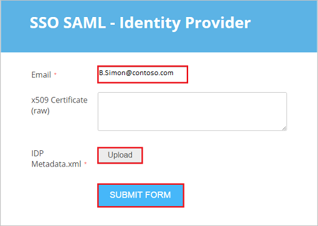
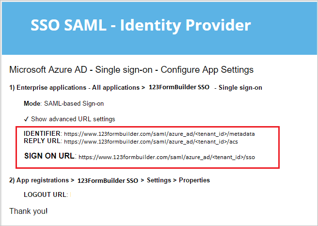

# Tutorial: Azure Active Directory single sign-on (SSO) integration with 123FormBuilder SSO

In this tutorial, you'll learn how to integrate 123FormBuilder SSO with Azure Active Directory (Azure AD). When you integrate 123FormBuilder SSO with Azure AD, you can:

* Control in Azure AD who has access to 123FormBuilder SSO.
* Enable your users to be automatically signed in to 123FormBuilder SSO with their Azure AD accounts.
* Manage your accounts in one central location - the Azure portal.

To learn more about SaaS app integration with Azure AD, see [What is application access and single sign-on with Azure Active Directory](https://docs.microsoft.com/azure/active-directory/manage-apps/what-is-single-sign-on).

## Prerequisites

To get started, you need the following items:

* An Azure AD subscription. If you don't have a subscription, you can get a [free account](https://azure.microsoft.com/free/).
* 123FormBuilder SSO single sign-on (SSO) enabled subscription.

## Scenario description

In this tutorial, you configure and test Azure AD SSO in a test environment.

* 123FormBuilder SSO supports **SP and IDP** initiated SSO.
* 123FormBuilder SSO supports **Just In Time** user provisioning.
* Once you configure 123FormBuilder SSO you can enforce session control, which protects exfiltration and infiltration of your organization’s sensitive data in real time. Session control extends from Conditional Access. [Learn how to enforce session control with Microsoft Cloud App Security](https://docs.microsoft.com/cloud-app-security/proxy-deployment-any-app).

## Adding 123FormBuilder SSO from the gallery

To configure the integration of 123FormBuilder SSO into Azure AD, you need to add 123FormBuilder SSO from the gallery to your list of managed SaaS apps.

1. Sign in to the [Azure portal](https://portal.azure.com) using either a work or school account, or a personal Microsoft account.
1. On the left navigation pane, select the **Azure Active Directory** service.
1. Navigate to **Enterprise Applications** and then select **All Applications**.
1. To add new application, select **New application**.
1. In the **Add from the gallery** section, type **123FormBuilder SSO** in the search box.
1. Select **123FormBuilder SSO** from results panel and then add the app. Wait a few seconds while the app is added to your tenant.

## Configure and test Azure AD single sign-on for 123FormBuilder SSO

Configure and test Azure AD SSO with 123FormBuilder SSO using a test user called **B.Simon**. For SSO to work, you need to establish a link relationship between an Azure AD user and the related user in 123FormBuilder SSO.

To configure and test Azure AD SSO with 123FormBuilder SSO, complete the following building blocks:

1. **[Configure Azure AD SSO](#configure-azure-ad-sso)** - to enable your users to use this feature.
    * **[Create an Azure AD test user](#create-an-azure-ad-test-user)** - to test Azure AD single sign-on with B.Simon.
    * **[Assign the Azure AD test user](#assign-the-azure-ad-test-user)** - to enable B.Simon to use Azure AD single sign-on.
1. **[Configure 123FormBuilder SSO](#configure-123formbuilder-sso)** - to configure the single sign-on settings on application side.
    * **[Create 123FormBuilder SSO test user](#create-123formbuilder-sso-test-user)** - to have a counterpart of B.Simon in 123FormBuilder SSO that is linked to the Azure AD representation of user.
1. **[Test SSO](#test-sso)** - to verify whether the configuration works.

## Configure Azure AD SSO

Follow these steps to enable Azure AD SSO in the Azure portal.

1. In the [Azure portal](https://portal.azure.com/), on the **123FormBuilder SSO** application integration page, find the **Manage** section and select **single sign-on**.
1. On the **Select a single sign-on method** page, select **SAML**.
1. On the **Set up single sign-on with SAML** page, click the edit/pen icon for **Basic SAML Configuration** to edit the settings.

   

4. On the **Basic SAML Configuration** section, If you wish to configure the application in **IDP** initiated mode, perform the following steps:

    a. In the **Identifier** text box, type a URL using the following pattern: `https://www.123formbuilder.com/saml/azure_ad/<tenant_id>/metadata`

    b. In the **Reply URL** text box, type a URL using the following pattern: `https://www.123formbuilder.com/saml/azure_ad/<tenant_id>/acs`

5. Click **Set additional URLs** and perform the following step if you wish to configure the application in **SP** initiated mode:

    In the **Sign-on URL** text box, type a URL using the following pattern: `https://www.123formbuilder.com/saml/azure_ad/<tenant_id>/sso`

	> [!NOTE]
	> These values are not real. You'll need to update these value from actual URLs and Identifier which is explained later in the tutorial.

1. On the **Setup single sign-on with SAML** page, in the **SAML Signing Certificate** section,  find **Federation Metadata XML** and select **Download** to download the certificate and save it on your computer.

	

1. On the **Set up 123FormBuilder SSO** section, copy the appropriate URL(s) based on your requirement.

	

### Create an Azure AD test user

In this section, you'll create a test user in the Azure portal called B.Simon.

1. From the left pane in the Azure portal, select **Azure Active Directory**, select **Users**, and then select **All users**.
1. Select **New user** at the top of the screen.
1. In the **User** properties, follow these steps:
   1. In the **Name** field, enter `B.Simon`.  
   1. In the **User name** field, enter the username@companydomain.extension. For example, `B.Simon@contoso.com`.
   1. Select the **Show password** check box, and then write down the value that's displayed in the **Password** box.
   1. Click **Create**.

### Assign the Azure AD test user

In this section, you'll enable B.Simon to use Azure single sign-on by granting access to 123FormBuilder SSO.

1. In the Azure portal, select **Enterprise Applications**, and then select **All applications**.
1. In the applications list, select **123FormBuilder SSO**.
1. In the app's overview page, find the **Manage** section and select **Users and groups**.

   

1. Select **Add user**, then select **Users and groups** in the **Add Assignment** dialog.

	

1. In the **Users and groups** dialog, select **B.Simon** from the Users list, then click the **Select** button at the bottom of the screen.
1. If you're expecting any role value in the SAML assertion, in the **Select Role** dialog, select the appropriate role for the user from the list and then click the **Select** button at the bottom of the screen.
1. In the **Add Assignment** dialog, click the **Assign** button.

## Configure 123FormBuilder SSO

1. To configure single sign-on on **123FormBuilder SSO** side, go to [https://www.123formbuilder.com/form-2709121/](https://www.123formbuilder.com/form-2709121/) and perform the following steps:

	 

	a. In the **Email** textbox, type the email of the user like `B.Simon@Contoso.com`.

	b. Click **Upload** and browse the downloaded Metadata XML file, which you have downloaded from Azure portal.

	c. Click **SUBMIT FORM**.

2. On the **Microsoft Azure AD - Single sign-on - Configure App Settings** perform the following steps:

	

	a. If you wish to configure the application in **IDP initiated mode**, copy the **IDENTIFIER** value for your instance and paste it in **Identifier** textbox in **Basic SAML Configuration** section on Azure portal.

	b. If you wish to configure the application in **IDP initiated mode**, copy the **REPLY URL** value for your instance and paste it in **Reply URL** textbox in **Basic SAML Configuration** section on Azure portal.

	c. If you wish to configure the application in **SP initiated mode**, copy the **SIGN ON URL** value for your instance and paste it in **Sign On URL** textbox in **Basic SAML Configuration** section on Azure portal.

### Create 123FormBuilder SSO test user

In this section, a user called Britta Simon is created in 123FormBuilder SSO. 123FormBuilder SSO supports just-in-time user provisioning, which is enabled by default. There is no action item for you in this section. If a user doesn't already exist in 123FormBuilder SSO, a new one is created after authentication.

## Test SSO 

In this section, you test your Azure AD single sign-on configuration using the Access Panel.

When you click the 123FormBuilder SSO tile in the Access Panel, you should be automatically signed in to the 123FormBuilder SSO for which you set up SSO. For more information about the Access Panel, see [Introduction to the Access Panel](https://docs.microsoft.com/azure/active-directory/active-directory-saas-access-panel-introduction).

## Additional resources

- [ List of Tutorials on How to Integrate SaaS Apps with Azure Active Directory ](https://docs.microsoft.com/azure/active-directory/active-directory-saas-tutorial-list)

- [What is application access and single sign-on with Azure Active Directory? ](https://docs.microsoft.com/azure/active-directory/manage-apps/what-is-single-sign-on)

- [What is conditional access in Azure Active Directory?](https://docs.microsoft.com/azure/active-directory/conditional-access/overview)

- [Try 123FormBuilder SSO with Azure AD](https://aad.portal.azure.com/)

- [What is session control in Microsoft Cloud App Security?](https://docs.microsoft.com/cloud-app-security/proxy-intro-aad)
