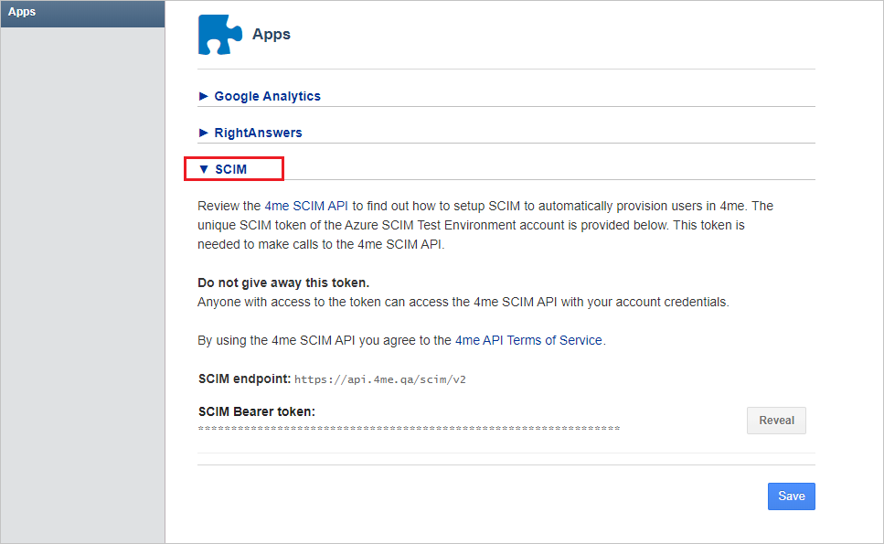
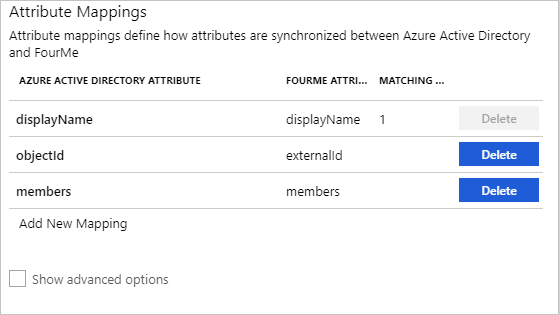

# Tutorial: Configure 4me for automatic user provisioning

The objective of this tutorial is to demonstrate the steps to be performed in 4me and Azure Active Directory (Azure AD) to configure Azure AD to automatically provision and de-provision users and/or groups to 4me.

> [!NOTE]
> This tutorial describes a connector built on top of the Azure AD User Provisioning Service. For important details on what this service does, how it works, and frequently asked questions, see [Automate user provisioning and deprovisioning to SaaS applications with Azure Active Directory](../app-provisioning/user-provisioning.md).
>
> This connector is currently in Public Preview. For more information on the general Microsoft Azure terms of use for Preview features, see [Supplemental Terms of Use for Microsoft Azure Previews](https://azure.microsoft.com/support/legal/preview-supplemental-terms/).

## Prerequisites

The scenario outlined in this tutorial assumes that you already have the following prerequisites:

* An Azure AD tenant
* [A 4me tenant](https://www.4me.com/trial/)
* A user account in 4me with Admin permissions.

## Add 4me from the gallery

Before configuring 4me for automatic user provisioning with Azure AD, you need to add 4me from the Azure AD application gallery to your list of managed SaaS applications.

**To add 4me from the Azure AD application gallery, perform the following steps:**

1. In the **[Azure portal](https://portal.azure.com)**, in the left navigation panel, select **Azure Active Directory**.

	

2. Go to **Enterprise applications**, and then select **All applications**.

	

3. To add a new application, select the **New application** button at the top of the pane.

	

4. In the search box, enter **4me**, select **4me** in the results panel, and then click the **Add** button to add the application.

	

## Assigning users to 4me

Azure Active Directory uses a concept called *assignments* to determine which users should receive access to selected apps. In the context of automatic user provisioning, only the users and/or groups that have been assigned to an application in Azure AD are synchronized.

Before configuring and enabling automatic user provisioning, you should decide which users and/or groups in Azure AD need access to 4me. Once decided, you can assign these users and/or groups to 4me by following the instructions here:

* [Assign a user or group to an enterprise app](../manage-apps/assign-user-or-group-access-portal.md)

### Important tips for assigning users to 4me

* It is recommended that a single Azure AD user is assigned to 4me to test the automatic user provisioning configuration. Additional users and/or groups may be assigned later.

* When assigning a user to 4me, you must select any valid application-specific role (if available) in the assignment dialog. Users with the **Default Access** role are excluded from provisioning.

## Configuring automatic user provisioning to 4me 

This section guides you through the steps to configure the Azure AD provisioning service to create, update, and disable users and/or groups in 4me based on user and/or group assignments in Azure AD.

> [!TIP]
> You may also choose to enable SAML-based single sign-on for 4me, following the instructions provided in the [4me single sign-on tutorial](4me-tutorial.md). Single sign-on can be configured independently of automatic user provisioning, though these two features compliment each other.

### To configure automatic user provisioning for 4me in Azure AD:

1. Sign in to the [Azure portal](https://portal.azure.com). Select **Enterprise Applications**, then select **All applications**.

	

2. In the applications list, select **4me**.

	

3. Select the **Provisioning** tab.

	

4. Set the **Provisioning Mode** to **Automatic**.

	

5. To retrieve the **Tenant URL** and **Secret Token** of your 4me account, follow the walkthrough as described in Step 6.

6. Sign in to your 4me Admin Console. Navigate to **Settings**.

	

	Type in **apps** in the search bar.

	

	Open the **SCIM** dropdown to retrieve the Secret Token and the SCIM endpoint.

	

7. Upon populating the fields shown in Step 5, click **Test Connection** to ensure Azure AD can connect to 4me. If the connection fails, ensure your 4me account has Admin permissions and try again.

	

8. In the **Notification Email** field, enter the email address of a person or group who should receive the provisioning error notifications and check the checkbox - **Send an email notification when a failure occurs**.

	

9. Click **Save**.

10. Under the **Mappings** section, select **Synchronize Azure Active Directory Users to 4me**.

	:::image type="content" source="media/4me-provisioning-tutorial/4me-user-mapping.png" alt-text="Screenshot of the Mappings page. Under Name, Synchronize Azure Active Directory Users to FourMe is highlighted." border="false":::
	
11. Review the user attributes that are synchronized from Azure AD to 4me in the **Attribute Mapping** section. The attributes selected as **Matching** properties are used to match the user accounts in 4me for update operations. Please ensure that [4me supports filtering](https://developer.4me.com/v1/scim/users/) on the matching attribute you have chosen. Select the **Save** button to commit any changes.

	:::image type="content" source="media/4me-provisioning-tutorial/4me-user-attributes.png" alt-text="Screenshot of the Attribute Mappings page. A table lists Azure Active Directory attributes, corresponding FourMe attributes, and the matching status." border="false":::
	
12. Under the **Mappings** section, select **Synchronize Azure Active Directory Groups to 4me**.

	:::image type="content" source="media/4me-provisioning-tutorial/4me-group-mapping.png" alt-text="Screenshot of the Mappings page. Under Name, Synchronize Azure Active Directory Groups to FourMe is highlighted." border="false":::
	
13. Review the group attributes that are synchronized from Azure AD to 4me in the **Attribute Mapping** section. The attributes selected as **Matching** properties are used to match the groups in 4me for update operations. Select the **Save** button to commit any changes.

	

14. To configure scoping filters, refer to the following instructions provided in the [Scoping filter tutorial](../app-provisioning/define-conditional-rules-for-provisioning-user-accounts.md).

15. To enable the Azure AD provisioning service for 4me, change the **Provisioning Status** to **On** in the **Settings** section.

	

16. Define the users and/or groups that you would like to provision to 4me by choosing the desired values in **Scope** in the **Settings** section.

	

17. When you are ready to provision, click **Save**.

	

This operation starts the initial synchronization of all users and/or groups defined in **Scope** in the **Settings** section. The initial sync takes longer to perform than subsequent syncs, which occur approximately every 40 minutes as long as the Azure AD provisioning service is running. You can use the **Synchronization Details** section to monitor progress and follow links to provisioning activity report, which describes all actions performed by the Azure AD provisioning service on 4me.

For more information on how to read the Azure AD provisioning logs, see [Reporting on automatic user account provisioning](../app-provisioning/check-status-user-account-provisioning.md).

## Connector Limitations

* 4me has different SCIM endpoint URLs for test and production environments. The former ends with **.qa** while the latter ends with **.com**
* 4me generated Secret Tokens have an expiration date of a month from generation.
* 4me doesn’t support **DELETE** operations

## Additional resources

* [Managing user account provisioning for Enterprise Apps](../app-provisioning/configure-automatic-user-provisioning-portal.md)
* [What is application access and single sign-on with Azure Active Directory?](../manage-apps/what-is-single-sign-on.md)

## Next steps

* [Learn how to review logs and get reports on provisioning activity](../app-provisioning/check-status-user-account-provisioning.md)
