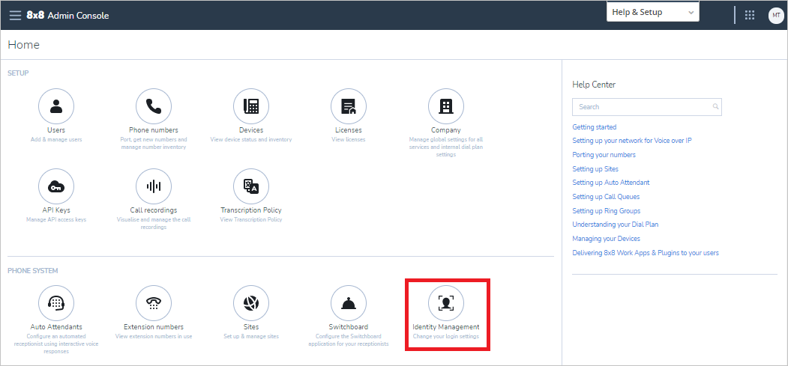
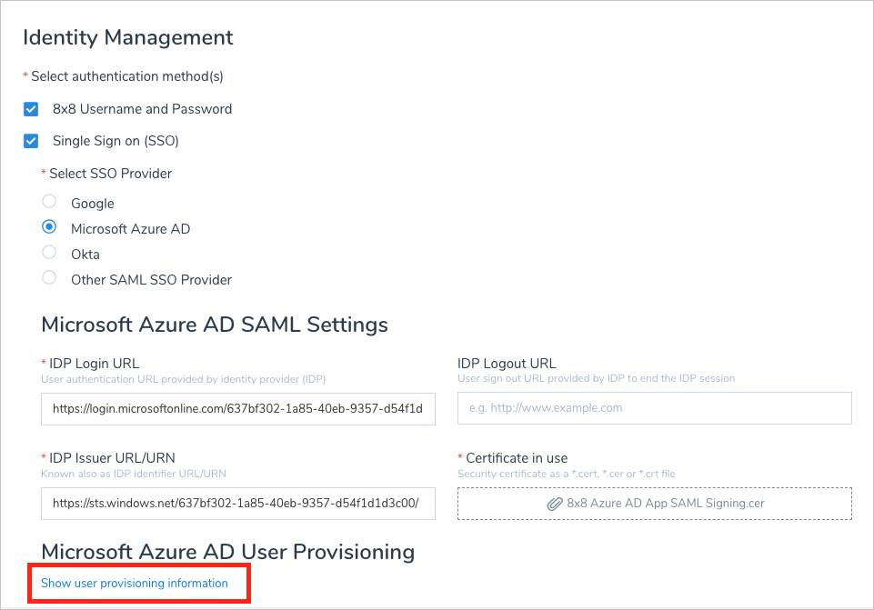
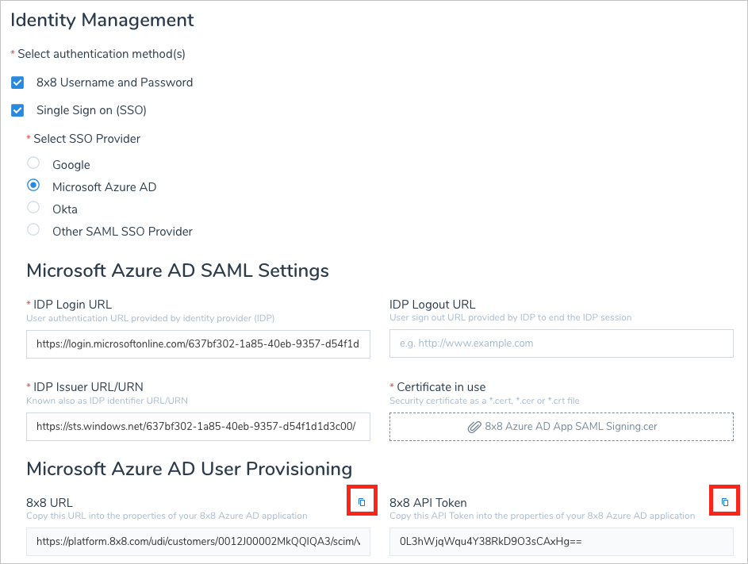

# Tutorial: Configure 8x8 for automatic user provisioning

This tutorial describes the steps you need to perform in both 8x8 Configuration Manager and Azure Active Directory (Azure AD) to configure automatic user provisioning. When configured, Azure AD automatically provisions and de-provisions users and groups to [8x8](https://www.8x8.com) using the Azure AD Provisioning service. For important details on what this service does, how it works, and frequently asked questions, see [Automate user provisioning and deprovisioning to SaaS applications with Azure Active Directory](../manage-apps/user-provisioning.md). 

## Capabilities supported
> [!div class="checklist"]
> * Create users in 8x8
> * Remove users in 8x8 when they do not require access anymore
> * Keep user attributes synchronized between Azure AD and 8x8
> * [Single sign-on](https://docs.microsoft.com/azure/active-directory/saas-apps/8x8virtualoffice-tutorial) to 8x8 (recommended)

## Prerequisites

The scenario outlined in this tutorial assumes that you already have the following prerequisites:

* [An Azure AD tenant](https://docs.microsoft.com/azure/active-directory/develop/quickstart-create-new-tenant) 
* A user account in Azure AD with [permission](https://docs.microsoft.com/azure/active-directory/users-groups-roles/directory-assign-admin-roles) to configure provisioning (e.g. Application Administrator, Cloud Application administrator, Application Owner, or Global Administrator).
* An 8x8 X series subscription of any level.
* An 8x8 user account with administrator permission in [Configuration Manager](https://vo-cm.8x8.com).
* [Single Sign-On with Azure AD](https://docs.microsoft.com/azure/active-directory/saas-apps/8x8virtualoffice-tutorial) has already been configured.

## Step 1. Plan your provisioning deployment
1. Learn about [how the provisioning service works](https://docs.microsoft.com/azure/active-directory/manage-apps/user-provisioning).
2. Determine who will be in [scope for provisioning](https://docs.microsoft.com/azure/active-directory/manage-apps/define-conditional-rules-for-provisioning-user-accounts).
3. Determine what data to [map between Azure AD and 8x8](https://docs.microsoft.com/azure/active-directory/manage-apps/customize-application-attributes).

## Step 2. Configure 8x8 to support provisioning with Azure AD

This section guides you through the steps to configure 8x8 to support provisioning with Azure AD.

### To configure a user provisioning access token in 8x8 Configuration Manager:

1. Sign in to [Configuration Manager](https://vo-cm.8x8.com). Select **Identity Management**.

   

2. Click the **Show user provisioning information** link to generate a token.

   

3. Copy the **8x8 URL** and **8x8 API Token** values. These values will be entered in the **Tenant URL** and **Secret Token** fields respectively in the Provisioning tab of your 8x8  application in the Azure portal.

   

## Step 3. Add 8x8 from the Azure AD application gallery

Add 8x8 from the Azure AD application gallery to start managing provisioning to 8x8. If you have previously setup 8x8 for SSO you can use the same application. However it is recommended that you create a separate app when testing out the integration initially. Learn more about adding an application from the gallery [here](https://docs.microsoft.com/azure/active-directory/manage-apps/add-gallery-app).

## Step 4. Define who will be in scope for provisioning

The Azure AD provisioning service allows you to scope who will be provisioned based on assignment to the application and or based on attributes of the user / group. If you choose to scope who will be provisioned to your app based on assignment, you can use the following [steps](../manage-apps/assign-user-or-group-access-portal.md) to assign users and groups to the application. This is the simpler option and is used by most people.

If you choose to scope who will be provisioned based solely on attributes of the user or group, you can use a scoping filter as described [here](https://docs.microsoft.com/azure/active-directory/manage-apps/define-conditional-rules-for-provisioning-user-accounts). 

* When assigning users and groups to 8x8, you must select a role other than **Default Access**. Users with the Default Access role are excluded from provisioning and will be marked as not effectively entitled in the provisioning logs. If the only role available on the application is the default access role, you can [update the application manifest](https://docs.microsoft.com/azure/active-directory/develop/howto-add-app-roles-in-azure-ad-apps) to add additional roles. 

* Start small. Test with a small set of users and groups before rolling out to everyone. When scope for provisioning is set to assigned users and groups, you can control this by assigning one or two users or groups to the app. When scope is set to all users and groups, you can specify an [attribute based scoping filter](https://docs.microsoft.com/azure/active-directory/manage-apps/define-conditional-rules-for-provisioning-user-accounts). 

## Step 5. Configure automatic user provisioning to 8x8 

This section guides you through the steps to configure the Azure AD provisioning service to create, update, and disable users and/or groups in 8x8 based on user and/or group assignments in Azure AD.

### To configure automatic user provisioning for 8x8 in Azure AD:

1. Sign in to the [Azure portal](https://portal.azure.com). Select **Enterprise Applications**, then select **All applications**.

	

	

2. In the applications list, select **8x8**.

	

3. Select the **Provisioning** tab. Click on **Get started**.

	

   

4. Set the **Provisioning Mode** to **Automatic**.

	

5. Under the **Admin Credentials** section, copy the **8x8 URL** from Configuration Manager into **Tenant URL**. Copy the **8x8 API Token** from Configuration Manager into **Secret Token**. Click **Test Connection** to ensure Azure AD can connect to 8x8. If the connection fails, ensure your 8x8 account has Admin permissions and try again.

	

6. In the **Notification Email** field, enter the email address of a person or group who should receive the provisioning error notifications and select the **Send an email notification when a failure occurs** check box.

	

7. Select **Save**.

8. Under the **Mappings** section, select **Provision Azure Active Directory Users**.

9. Review the user attributes that are synchronized from Azure AD to 8x8 in the **Attribute-Mapping** section. The attributes selected as **Matching** properties are used to match the user accounts in 8x8 for update operations. If you choose to change the [matching target attribute](https://docs.microsoft.com/azure/active-directory/manage-apps/customize-application-attributes), you will need to ensure that the 8x8 API supports filtering users based on that attribute. Select the **Save** button to commit any changes.

   |Attribute|Type|Notes|
   |---|---|---|
   |userName|String|Sets both Username and Federation ID|
   |externalId|String||
   |active|Boolean||
   |title|String||
   |emails[type eq "work"].value|String||
   |name.givenName|String||
   |name.familyName|String||
   |phoneNumbers[type eq "mobile"].value|String|Personal Contact Number|
   |phoneNumbers[type eq "work"].value|String|Personal Contact Number|
   |urn:ietf:params:scim:schemas:extension:enterprise:2.0:User:department|String||
   |urn:ietf:params:scim:schemas:extension:8x8:1.1:User:site|String|Cannot be updated after user creation|
   |locale|String|Not mapped by default|
   |timezone|String|Not mapped by default|

10. To configure scoping filters, refer to the following instructions provided in the [Scoping filter tutorial](../manage-apps/define-conditional-rules-for-provisioning-user-accounts.md).

11. To enable the Azure AD provisioning service for 8x8, change the **Provisioning Status** to **On** in the **Settings** section.

	

12. Define the users and/or groups that you would like to provision to 8x8 by choosing the desired values in **Scope** in the **Settings** section.

	

13. When you are ready to provision, click **Save**.

	

This operation starts the initial synchronization cycle of all users and groups defined in **Scope** in the **Settings** section. The initial cycle takes longer to perform than subsequent cycles, which occur approximately every 40 minutes as long as the Azure AD provisioning service is running. 

## Step 6. Monitor your deployment
Once you've configured provisioning, use the following resources to monitor your deployment:

1. Use the [provisioning logs](https://docs.microsoft.com/azure/active-directory/reports-monitoring/concept-provisioning-logs) to determine which users have been provisioned successfully or unsuccessfully.
2. Check the [progress bar](https://docs.microsoft.com/azure/active-directory/app-provisioning/application-provisioning-when-will-provisioning-finish-specific-user) to see the status of the provisioning cycle and how close it is to completion.
3. If the provisioning configuration seems to be in an unhealthy state, the application will go into quarantine. Learn more about quarantine states [here](https://docs.microsoft.com/azure/active-directory/manage-apps/application-provisioning-quarantine-status).

## Additional resources

* [Managing user account provisioning for Enterprise Apps](../manage-apps/configure-automatic-user-provisioning-portal.md)
* [What is application access and single sign-on with Azure Active Directory?](../manage-apps/what-is-single-sign-on.md)

## Next steps

* [Learn how to review logs and get reports on provisioning activity](../manage-apps/check-status-user-account-provisioning.md)
