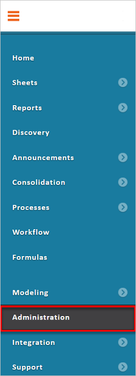
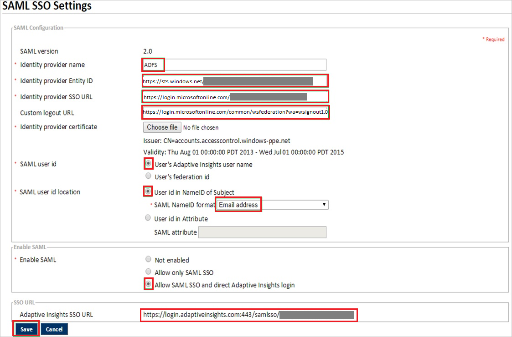

# Tutorial: Azure Active Directory integration with Adaptive Insights

In this tutorial, you learn how to integrate Adaptive Insights with Azure Active Directory (Azure AD).
Integrating Adaptive Insights with Azure AD provides you with the following benefits:

* You can control in Azure AD who has access to Adaptive Insights.
* You can enable your users to be automatically signed-in to Adaptive Insights (Single Sign-On) with their Azure AD accounts.
* You can manage your accounts in one central location - the Azure portal.

If you want to know more details about SaaS app integration with Azure AD, see [What is application access and single sign-on with Azure Active Directory](https://docs.microsoft.com/azure/active-directory/active-directory-appssoaccess-whatis).
If you don't have an Azure subscription, [create a free account](https://azure.microsoft.com/free/) before you begin.

## Prerequisites

To configure Azure AD integration with Adaptive Insights, you need the following items:

* An Azure AD subscription. If you don't have an Azure AD environment, you can get one-month trial [here](https://azure.microsoft.com/pricing/free-trial/)
* Adaptive Insights single sign-on enabled subscription

## Scenario description

In this tutorial, you configure and test Azure AD single sign-on in a test environment.

* Adaptive Insights supports **IDP** initiated SSO

## Adding Adaptive Insights from the gallery

To configure the integration of Adaptive Insights into Azure AD, you need to add Adaptive Insights from the gallery to your list of managed SaaS apps.

**To add Adaptive Insights from the gallery, perform the following steps:**

1. In the **[Azure portal](https://portal.azure.com)**, on the left navigation panel, click **Azure Active Directory** icon.

	

2. Navigate to **Enterprise Applications** and then select the **All Applications** option.

	

3. To add new application, click **New application** button on the top of dialog.

	

4. In the search box, type **Adaptive Insights**, select **Adaptive Insights** from result panel then click **Add** button to add the application.

	 

## Configure and test Azure AD single sign-on

In this section, you configure and test Azure AD single sign-on with Adaptive Insights based on a test user called **Britta Simon**.
For single sign-on to work, a link relationship between an Azure AD user and the related user in Adaptive Insights needs to be established.

To configure and test Azure AD single sign-on with Adaptive Insights, you need to complete the following building blocks:

1. **[Configure Azure AD Single Sign-On](#configure-azure-ad-single-sign-on)** - to enable your users to use this feature.
2. **[Configure Adaptive Insights Single Sign-On](#configure-adaptive-insights-single-sign-on)** - to configure the Single Sign-On settings on application side.
3. **[Create an Azure AD test user](#create-an-azure-ad-test-user)** - to test Azure AD single sign-on with Britta Simon.
4. **[Assign the Azure AD test user](#assign-the-azure-ad-test-user)** - to enable Britta Simon to use Azure AD single sign-on.
5. **[Create Adaptive Insights test user](#create-adaptive-insights-test-user)** - to have a counterpart of Britta Simon in Adaptive Insights that is linked to the Azure AD representation of user.
6. **[Test single sign-on](#test-single-sign-on)** - to verify whether the configuration works.

### Configure Azure AD single sign-on

In this section, you enable Azure AD single sign-on in the Azure portal.

To configure Azure AD single sign-on with Adaptive Insights, perform the following steps:

1. In the [Azure portal](https://portal.azure.com/), on the **Adaptive Insights** application integration page, select **Single sign-on**.

    

2. On the **Select a Single sign-on method** dialog, select **SAML/WS-Fed** mode to enable single sign-on.

    

3. On the **Set up Single Sign-On with SAML** page, click **Edit** icon to open **Basic SAML Configuration** dialog.

	

4. On the **Set up Single Sign-On with SAML** page, perform the following steps:

    

    a. In the **Identifier** text box, type a URL using the following pattern:
    `https://login.adaptiveinsights.com:443/samlsso/<unique-id>`

    b. In the **Reply URL** text box, type a URL using the following pattern:
    `https://login.adaptiveinsights.com:443/samlsso/<unique-id>`

	> [!NOTE]
	> You can get Identifier(Entity ID) and Reply URL values from the Adaptive Insights’s **SAML SSO Settings** page.

5. On the **Set up Single Sign-On with SAML** page, in the **SAML Signing Certificate** section, click **Download** to download the **Certificate (Base64)** from the given options as per your requirement and save it on your computer.

	

6. On the **Set up Adaptive Insights** section, copy the appropriate URL(s) as per your requirement.

	

	a. Login URL

	b. Azure AD Identifier

	c. Logout URL

### Configure Adaptive Insights Single Sign-On

1. In a different web browser window, sign in to your Adaptive Insights company site as an administrator.

2. Go to **Admin**.

	

3. In the **Users and Roles** section, click **Manage SAML SSO Settings**.

	

4. On the **SAML SSO Settings** page, perform the following steps:

	

	a. In the **Identity provider name** textbox, type a name for your configuration.

	b. Paste the **Azure Ad Identifier** value copied from Azure portal into the **Identity provider Entity ID** textbox.

	c. Paste the **Login URL** value copied from Azure portal into the **Identity provider SSO URL** textbox.

	d. Paste the **Logout URL** value copied from Azure portal into the **Custom logout URL** textbox.

	e. To upload your downloaded certificate, click **Choose file**.

	f. Select the following, for:

     * **SAML user id**, select **User’s Adaptive Insights user name**.

     * **SAML user id location**, select **User id in NameID of Subject**.

     * **SAML NameID format**, select **Email address**.

     * **Enable SAML**, select **Allow SAML SSO and direct Adaptive Insights login**.

	g. Copy **Adaptive Insights SSO URL** and paste into the **Identifier(Entity ID)** and **Reply URL** textboxes in the **Adaptive Insights Domain and URLs** section in the Azure portal.

	h. Click **Save**.

### Create an Azure AD test user

The objective of this section is to create a test user in the Azure portal called Britta Simon.

1. In the Azure portal, in the left pane, select **Azure Active Directory**, select **Users**, and then select **All users**.

    

2. Select **New user** at the top of the screen.

    

3. In the User properties, perform the following steps.

    

    a. In the **Name** field enter **BrittaSimon**.
  
    b. In the **User name** field type `brittasimon@yourcompanydomain.extension. For example, BrittaSimon@contoso.com.

    c. Select **Show password** check box, and then write down the value that's displayed in the Password box.

    d. Click **Create**.

### Assign the Azure AD test user

In this section, you enable Britta Simon to use Azure single sign-on by granting access to Adaptive Insights.

1. In the Azure portal, select **Enterprise Applications**, select **All applications**, then select **Adaptive Insights**.

	

2. In the applications list, select **Adaptive Insights**.

	

3. In the menu on the left, select **Users and groups**.

    

4. Click the **Add user** button, then select **Users and groups** in the **Add Assignment** dialog.

    

5. In the **Users and groups** dialog select **Britta Simon** in the Users list, then click the **Select** button at the bottom of the screen.

6. If you are expecting any role value in the SAML assertion then in the **Select Role** dialog select the appropriate role for the user from the list, then click the **Select** button at the bottom of the screen.

7. In the **Add Assignment** dialog click the **Assign** button.

### Create Adaptive Insights test user

To enable Azure AD users to sign in to Adaptive Insights, they must be provisioned into Adaptive Insights. In the case of Adaptive Insights, provisioning is a manual task.

**To configure user provisioning, perform the following steps:**

1. Sign in to your **Adaptive Insights** company site as an administrator.

2. Go to **Admin**.

   

3. In the **Users and Roles** section, click **Add User**.

   

4. In the **New User** section, perform the following steps:

   

   a. Type the **Name**, **Login**, **Email**, **Password** of a valid Azure Active Directory user you want to provision into the related textboxes.

   b. Select a **Role**.

   c. Click **Submit**.

> [!NOTE]
> You can use any other Adaptive Insights user account creation tools or APIs provided by Adaptive Insights to provision AAD user accounts.

### Test single sign-on

In this section, you test your Azure AD single sign-on configuration using the Access Panel.

When you click the Adaptive Insights tile in the Access Panel, you should be automatically signed in to the Adaptive Insights for which you set up SSO. For more information about the Access Panel, see [Introduction to the Access Panel](https://docs.microsoft.com/azure/active-directory/active-directory-saas-access-panel-introduction).

## Additional Resources

- [List of Tutorials on How to Integrate SaaS Apps with Azure Active Directory](https://docs.microsoft.com/azure/active-directory/active-directory-saas-tutorial-list)

- [What is application access and single sign-on with Azure Active Directory?](https://docs.microsoft.com/azure/active-directory/active-directory-appssoaccess-whatis)

- [What is Conditional Access in Azure Active Directory?](https://docs.microsoft.com/azure/active-directory/conditional-access/overview)