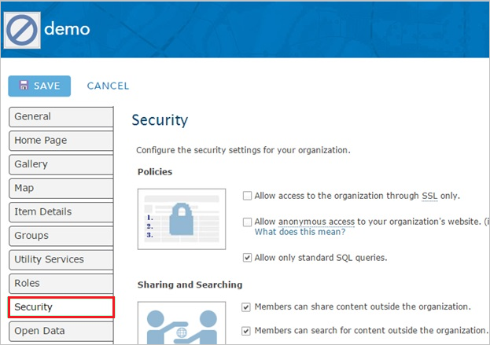
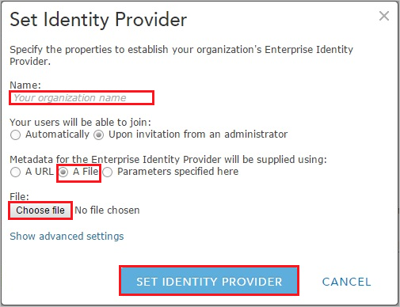
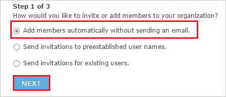
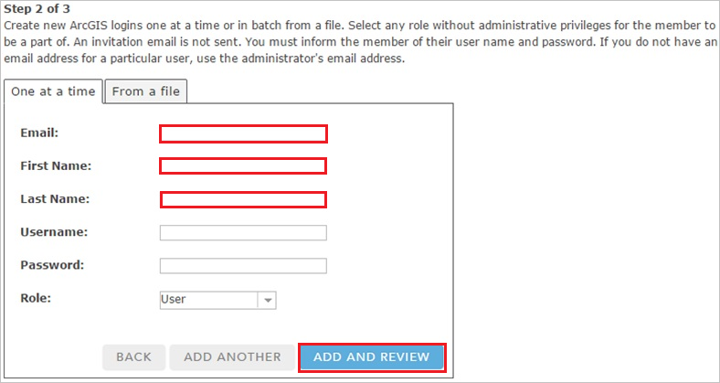

# Tutorial: Azure Active Directory integration with ArcGIS Online

In this tutorial, you learn how to integrate ArcGIS Online with Azure Active Directory (Azure AD).
Integrating ArcGIS Online with Azure AD provides you with the following benefits:

* You can control in Azure AD who has access to ArcGIS Online.
* You can enable your users to be automatically signed-in to ArcGIS Online (Single Sign-On) with their Azure AD accounts.
* You can manage your accounts in one central location - the Azure portal.

If you want to know more details about SaaS app integration with Azure AD, see [What is application access and single sign-on with Azure Active Directory](https://docs.microsoft.com/azure/active-directory/active-directory-appssoaccess-whatis).
If you don't have an Azure subscription, [create a free account](https://azure.microsoft.com/free/) before you begin.

## Prerequisites

To configure Azure AD integration with ArcGIS Online, you need the following items:

* An Azure AD subscription. If you don't have an Azure AD environment, you can get one-month trial [here](https://azure.microsoft.com/pricing/free-trial/)
* ArcGIS Online single sign-on enabled subscription

## Scenario description

In this tutorial, you configure and test Azure AD single sign-on in a test environment.

* ArcGIS Online supports **SP** initiated SSO

## Adding ArcGIS Online from the gallery

To configure the integration of ArcGIS Online into Azure AD, you need to add ArcGIS Online from the gallery to your list of managed SaaS apps.

**To add ArcGIS Online from the gallery, perform the following steps:**

1. In the **[Azure portal](https://portal.azure.com)**, on the left navigation panel, click **Azure Active Directory** icon.

	

2. Navigate to **Enterprise Applications** and then select the **All Applications** option.

	

3. To add new application, click **New application** button on the top of dialog.

	

4. In the search box, type **ArcGIS Online**, select **ArcGIS Online** from result panel then click **Add** button to add the application.

	 

## Configure and test Azure AD single sign-on

In this section, you configure and test Azure AD single sign-on with ArcGIS Online based on a test user called **Britta Simon**.
For single sign-on to work, a link relationship between an Azure AD user and the related user in ArcGIS Online needs to be established.

To configure and test Azure AD single sign-on with ArcGIS Online, you need to complete the following building blocks:

1. **[Configure Azure AD Single Sign-On](#configure-azure-ad-single-sign-on)** - to enable your users to use this feature.
2. **[Configure ArcGIS Online Single Sign-On](#configure-arcgis-online-single-sign-on)** - to configure the Single Sign-On settings on application side.
3. **[Create an Azure AD test user](#create-an-azure-ad-test-user)** - to test Azure AD single sign-on with Britta Simon.
4. **[Assign the Azure AD test user](#assign-the-azure-ad-test-user)** - to enable Britta Simon to use Azure AD single sign-on.
5. **[Create ArcGIS Online test user](#create-arcgis-online-test-user)** - to have a counterpart of Britta Simon in ArcGIS Online that is linked to the Azure AD representation of user.
6. **[Test single sign-on](#test-single-sign-on)** - to verify whether the configuration works.

### Configure Azure AD single sign-on

In this section, you enable Azure AD single sign-on in the Azure portal.

To configure Azure AD single sign-on with ArcGIS Online, perform the following steps:

1. In the [Azure portal](https://portal.azure.com/), on the **ArcGIS Online** application integration page, select **Single sign-on**.

    

2. On the **Select a Single sign-on method** dialog, select **SAML/WS-Fed** mode to enable single sign-on.

    

3. On the **Set up Single Sign-On with SAML** page, click **Edit** icon to open **Basic SAML Configuration** dialog.

	

4. On the **Basic SAML Configuration** section, perform the following steps:

    

	a. In the **Sign on URL** text box, type a URL using the following pattern:
    `https://<companyname>.maps.arcgis.com`

    b. In the **Identifier (Entity ID)** text box, type a URL using the following pattern:
    `<companyname>.maps.arcgis.com`

	> [!NOTE]
	> These values are not real. Update these values with the actual Sign on URL and Identifier. Contact [ArcGIS Online Client support team](https://support.esri.com/en/) to get these values. You can also refer to the patterns shown in the **Basic SAML Configuration** section in the Azure portal.

5. On the **Set up Single Sign-On with SAML** page, in the **SAML Signing Certificate** section, click **Download** to download the **Federation Metadata XML** from the given options as per your requirement and save it on your computer.

	

6. To automate the configuration within **ArcGIS Online**, you need to install **My Apps Secure Sign-in browser extension** by clicking **Install the extension**.

	

7. After adding extension to the browser, click on **setup ArcGIS Online** will direct you to the ArcGIS Online application. From there, provide the admin credentials to sign into ArcGIS Online. The browser extension will automatically configure the application for you and automate steps in section **Configure ArcGIS Online Single Sign-On**.

### Configure ArcGIS Online Single Sign-On

1. If you want to setup ArcGIS Online manually, open a new web browser window and log into your ArcGIS company site as an administrator and perform the following steps:

2. Click **EDIT SETTINGS**.

    

3. Click **Security**.

    

4. Under **Enterprise Logins**, click **SET IDENTITY PROVIDER**.

    

5. On the **Set Identity Provider** configuration page, perform the following steps:

    

    a. In the **Name** textbox, type your organization’s name.

    b. For **Metadata for the Enterprise Identity Provider will be supplied using**, select **A File**.

    c. To upload your downloaded metadata file, click **Choose file**.

    d. Click **SET IDENTITY PROVIDER**.

### Create an Azure AD test user 

The objective of this section is to create a test user in the Azure portal called Britta Simon.

1. In the Azure portal, in the left pane, select **Azure Active Directory**, select **Users**, and then select **All users**.

    

2. Select **New user** at the top of the screen.

    

3. In the User properties, perform the following steps.

    

    a. In the **Name** field enter **BrittaSimon**.
  
    b. In the **User name** field type **brittasimon\@yourcompanydomain.extension**  
    For example, BrittaSimon@contoso.com

    c. Select **Show password** check box, and then write down the value that's displayed in the Password box.

    d. Click **Create**.

### Assign the Azure AD test user

In this section, you enable Britta Simon to use Azure single sign-on by granting access to ArcGIS Online.

1. In the Azure portal, select **Enterprise Applications**, select **All applications**, then select **ArcGIS Online**.

	

2. In the applications list, type and select **ArcGIS Online**.

	

3. In the menu on the left, select **Users and groups**.

    

4. Click the **Add user** button, then select **Users and groups** in the **Add Assignment** dialog.

    

5. In the **Users and groups** dialog select **Britta Simon** in the Users list, then click the **Select** button at the bottom of the screen.

6. If you are expecting any role value in the SAML assertion then in the **Select Role** dialog select the appropriate role for the user from the list, then click the **Select** button at the bottom of the screen.

7. In the **Add Assignment** dialog click the **Assign** button.

### Create ArcGIS Online test user

In order to enable Azure AD users to log into ArcGIS Online, they must be provisioned into ArcGIS Online.  
In the case of ArcGIS Online, provisioning is a manual task.

**To provision a user account, perform the following steps:**

1. Log in to your **ArcGIS** tenant.

2. Click **INVITE MEMBERS**.
   
    

3. Select **Add members automatically without sending an email**, and then click **NEXT**.
   
    

4. On the **Members** dialog page, perform the following steps:
   
     
    
	 a. Enter the **Email**, **First Name**, and **Last Name** of a valid Azure AD account you want to provision.
  
     b. Click **ADD AND REVIEW**.
5. Review the data you have entered, and then click **ADD MEMBERS**.
   
    
		
	> [!NOTE]
    > The Azure Active Directory account holder will receive an email and follow a link to confirm their account before it becomes active.

### Test single sign-on 

In this section, you test your Azure AD single sign-on configuration using the Access Panel.

When you click the ArcGIS Online tile in the Access Panel, you should be automatically signed in to the ArcGIS Online for which you set up SSO. For more information about the Access Panel, see [Introduction to the Access Panel](https://docs.microsoft.com/azure/active-directory/active-directory-saas-access-panel-introduction).

## Additional Resources

- [List of Tutorials on How to Integrate SaaS Apps with Azure Active Directory](https://docs.microsoft.com/azure/active-directory/active-directory-saas-tutorial-list)

- [What is application access and single sign-on with Azure Active Directory?](https://docs.microsoft.com/azure/active-directory/active-directory-appssoaccess-whatis)

- [What is Conditional Access in Azure Active Directory?](https://docs.microsoft.com/azure/active-directory/conditional-access/overview)

