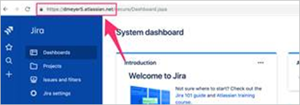
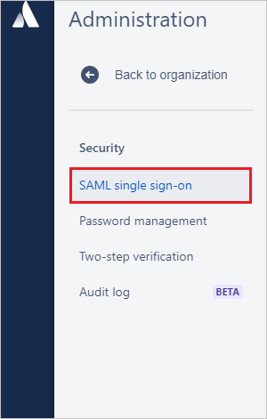
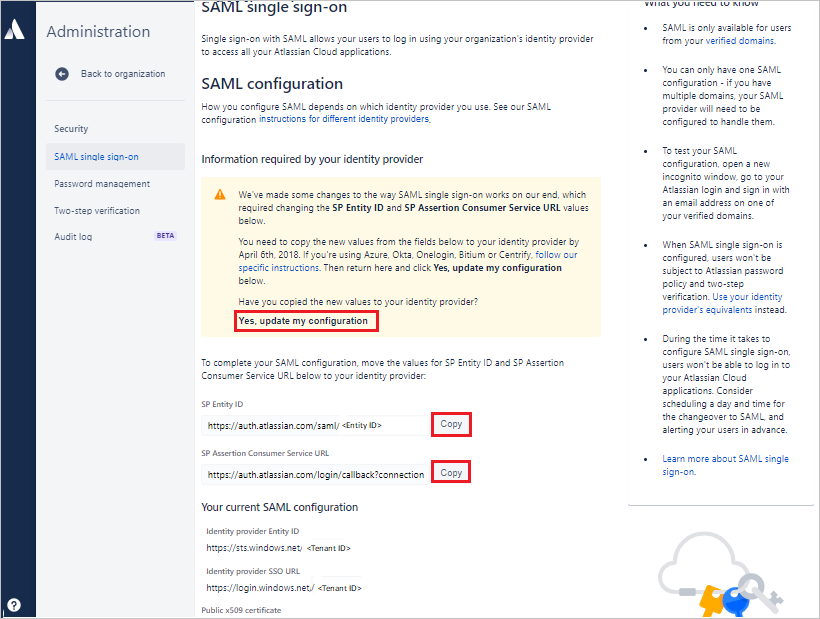

# Tutorial: Integrate Atlassian Cloud with Azure Active Directory

In this tutorial, you'll learn how to integrate Atlassian Cloud with Azure Active Directory (Azure AD). When you integrate Atlassian Cloud with Azure AD, you can:

* Control in Azure AD who has access to Atlassian Cloud.
* Enable your users to be automatically signed-in to Atlassian Cloud with their Azure AD accounts.
* Manage your accounts in one central location - the Azure portal.

To learn more about SaaS app integration with Azure AD, see [What is application access and single sign-on with Azure Active Directory](https://docs.microsoft.com/azure/active-directory/manage-apps/what-is-single-sign-on).

## Prerequisites

To get started, you need the following items:

* An Azure AD subscription. If you don't have a subscription, you can get one-month free trial [here](https://azure.microsoft.com/pricing/free-trial/).
* Atlassian Cloud single sign-on (SSO) enabled subscription.
* To enable Security Assertion Markup Language (SAML) single sign-on for Atlassian Cloud products, you need to set up Atlassian Access. Learn more about [Atlassian Access]( https://www.atlassian.com/enterprise/cloud/identity-manager).

## Scenario description

In this tutorial, you configure and test Azure AD SSO in a test environment. 

* Atlassian Cloud supports **SP and IDP** initiated SSO
* Atlassian Cloud supports [Automatic user provisioning and deprovisioning](atlassian-cloud-provisioning-tutorial.md)
* Once you configure Atlassian Cloud you can enforce session control, which protect exfiltration and infiltration of your organization’s sensitive data in real-time. Session control extend from Conditional Access. [Learn how to enforce session control with Microsoft Cloud App Security](https://docs.microsoft.com/cloud-app-security/proxy-deployment-any-app).
## Adding Atlassian Cloud from the gallery

To configure the integration of Atlassian Cloud into Azure AD, you need to add Atlassian Cloud from the gallery to your list of managed SaaS apps.

1. Sign in to the [Azure portal](https://portal.azure.com) using either a work or school account, or a personal Microsoft account.
1. On the left navigation pane, select the **Azure Active Directory** service.
1. Navigate to **Enterprise Applications** and then select **All Applications**.
1. To add new application, select **New application**.
1. In the **Add from the gallery** section, type **Atlassian Cloud** in the search box.
1. Select **Atlassian Cloud** from results panel and then add the app. Wait a few seconds while the app is added to your tenant.

## Configure and test Azure AD single sign-on

Configure and test Azure AD SSO with Atlassian Cloud using a test user called **B.Simon**. For SSO to work, you need to establish a link relationship between an Azure AD user and the related user in Atlassian Cloud.

To configure and test Azure AD SSO with Atlassian Cloud, complete the following building blocks:

1. **[Configure Azure AD SSO](#configure-azure-ad-sso)** - to enable your users to use this feature.
    * **[Create an Azure AD test user](#create-an-azure-ad-test-user)** - to test Azure AD single sign-on with B.Simon.
    * **[Assign the Azure AD test user](#assign-the-azure-ad-test-user)** - to enable B.Simon to use Azure AD single sign-on.
1. **[Configure Atlassian Cloud SSO](#configure-atlassian-cloud-sso)** - to configure the single sign-on settings on application side.
    * **[Create Atlassian Cloud test user](#create-atlassian-cloud-test-user)** - to have a counterpart of B.Simon in Atlassian Cloud that is linked to the Azure AD representation of user.
1. **[Test SSO](#test-sso)** - to verify whether the configuration works.

### Configure Azure AD SSO

Follow these steps to enable Azure AD SSO in the Azure portal.

1. In the [Azure portal](https://portal.azure.com/), on the **Atlassian Cloud** application integration page, find the **Manage** section and select **Single sign-on**.
1. On the **Select a Single sign-on method** page, select **SAML**.
1. On the **Set up Single Sign-On with SAML** page, click the edit/pen icon for **Basic SAML Configuration** to edit the settings.

   

1. On the **Basic SAML Configuration** section, if you wish to configure the application in **IDP** initiated mode, enter the values for the following fields:

    a. In the **Identifier** text box, type a URL using the following pattern: `https://auth.atlassian.com/saml/<unique ID>`

    b. In the **Reply URL** text box, type a URL using the following pattern:
    `https://auth.atlassian.com/login/callback?connection=saml-<unique ID>`

	c. Click **Set additional URLs**.

	d. In the **Relay State** text box, type a URL using the following pattern:
    `https://<instancename>.atlassian.net`

    > [!NOTE]
    > The preceding values are not real. Update these values with the actual identifier and reply URL. You will get these real values from the **Atlassian Cloud SAML Configuration** screen which is explained later at step 7 of **Configure Atlassian Cloud SSO** in the tutorial.

1. Click **Set additional URLs** and perform the following step if you wish to configure the application in **SP** initiated mode:

    In the **Sign-on URL** text box, type a URL using the following pattern:
    `https://<instancename>.atlassian.net`

    > [!NOTE]
	> The Sign on URL value is not real. Paste the  value from the instance which you use to signin to the Atlassian Cloud admin portal.

    

1. Your Atlassian Cloud application expects the SAML assertions in a specific format, which requires you to add custom attribute mappings to your SAML token attributes configuration. The following screenshot shows the list of default attributes, where as **nameidentifier** is mapped with **user.userprincipalname**. Atlassian Cloud application expects **nameidentifier** to be mapped with **user.mail**, so you need to edit the attribute mapping by clicking on **Edit** icon and change the attribute mapping.

	

1. On the **Set up Single Sign-On with SAML** page, in the **SAML Signing Certificate** section, find **Certificate (Base64)** and select **Download** to download the certificate and save it on your computer.

	

1. On the **Set up Atlassian Cloud** section, copy the appropriate URL(s) as per your requirement.

	

	a. Login URL

	b. Azure AD Identifier

	c. Logout URL

### Create an Azure AD test user

In this section, you'll create a test user in the Azure portal called B.Simon.

1. From the left pane in the Azure portal, select **Azure Active Directory**, select **Users**, and then select **All users**.
1. Select **New user** at the top of the screen.
1. In the **User** properties, follow these steps:
   1. In the **Name** field, enter `B.Simon`.  
   1. In the **User name** field, enter the username@companydomain.extension. For example, `B.Simon@contoso.com`.
   1. Select the **Show password** check box, and then write down the value that's displayed in the **Password** box.
   1. Click **Create**.

### Assign the Azure AD test user

In this section, you'll enable B.Simon to use Azure single sign-on by granting access to Atlassian Cloud.

1. In the Azure portal, select **Enterprise Applications**, and then select **All applications**.
1. In the applications list, select **Atlassian Cloud**.
1. In the app's overview page, find the **Manage** section and select **Users and groups**.

   

1. Select **Add user**, then select **Users and groups** in the **Add Assignment** dialog.

	

1. In the **Users and groups** dialog, select **B.Simon** from the Users list, then click the **Select** button at the bottom of the screen.
1. If you're expecting any role value in the SAML assertion, in the **Select Role** dialog, select the appropriate role for the user from the list and then click the **Select** button at the bottom of the screen.
1. In the **Add Assignment** dialog, click the **Assign** button.

## Configure Atlassian Cloud SSO

1. To automate the configuration within Atlassian Cloud, you need to install **My Apps Secure Sign-in browser extension** by clicking **Install the extension**.

	

1. After adding extension to the browser, click on **Setup Atlassian Cloud** will direct you to the Atlassian Cloud application. From there, provide the admin credentials to sign into Atlassian Cloud. The browser extension will automatically configure the application for you and automate steps 3-7.

	

1. If you want to setup Atlassian Cloud manually, open a new web browser window and sign into your Atlassian Cloud company site as an administrator and perform the following steps:

1. You need to verify your domain before going to configure single sign-on. For more information, see [Atlassian domain verification](https://confluence.atlassian.com/cloud/domain-verification-873871234.html) document.

1. In the left pane, select **Security** > **SAML single sign-on**. If you haven't already done so, subscribe to Atlassian Identity Manager.

	

1. In the **Add SAML configuration** window, do the following:

	

	a. In the **Identity provider Entity ID** box, paste the **Azure AD Identifier** that you copied from the Azure portal.

    b. In the **Identity provider SSO URL** box, paste the **Login URL** that you copied from the Azure portal.

    c. Open the downloaded certificate from the Azure portal in a .txt file, copy the value (without the *Begin Certificate* and *End Certificate* lines), and then paste it in the **Public X509 certificate** box.

    d. Click **Save Configuration**.

1. To ensure that you have set up the correct URLs, update the Azure AD settings by doing the following:

    

	a. In the SAML window, copy the **SP Identity ID** and then, in the Azure portal, under Atlassian Cloud **Basic SAML Configuration**, paste it in the **Identifier** box.

	b. In the SAML window, copy the **SP Assertion Consumer Service URL** and then, in the Azure portal, under Atlassian Cloud **Basic SAML Configuration**, paste it in the **Reply URL** box. The sign-on URL is the tenant URL of your Atlassian Cloud.

	> [!NOTE]
	> If you're an existing customer, after you update the **SP Identity ID** and **SP Assertion Consumer Service URL** values in the Azure portal, select **Yes, update configuration**. If you're a new customer, you can skip this step.

### Create Atlassian Cloud test user

To enable Azure AD users to sign in to Atlassian Cloud, provision the user accounts manually in Atlassian Cloud by doing the following:

1. In the **Administration** pane, select **Users**.

	

1. To create a user in Atlassian Cloud, select **Invite user**.

	

1. In the **Email address** box, enter the user's email address, and then assign the application access.

	

1. To send an email invitation to the user, select **Invite users**. An email invitation is sent to the user and, after accepting the invitation, the user is active in the system.

> [!NOTE]
> You can also bulk-create users by selecting the **Bulk Create** button in the **Users** section.

### Test SSO

When you select the Atlassian Cloud tile in the Access Panel, you should be automatically signed in to the Atlassian Cloud for which you set up SSO. For more information about the Access Panel, see [Introduction to the Access Panel](https://docs.microsoft.com/azure/active-directory/active-directory-saas-access-panel-introduction).

## Additional Resources

- [List of Tutorials on How to Integrate SaaS Apps with Azure Active Directory](https://docs.microsoft.com/azure/active-directory/active-directory-saas-tutorial-list)

- [What is application access and single sign-on with Azure Active Directory?](https://docs.microsoft.com/azure/active-directory/manage-apps/what-is-single-sign-on)

- [What is conditional access in Azure Active Directory?](https://docs.microsoft.com/azure/active-directory/conditional-access/overview)

- [Try Atlassian Cloud with Azure AD](https://aad.portal.azure.com/)

- [What is session control in Microsoft Cloud App Security?](https://docs.microsoft.com/cloud-app-security/proxy-intro-aad)

- [How to protect Atlassian Cloud with advanced visibility and controls](https://docs.microsoft.com/cloud-app-security/proxy-intro-aad)