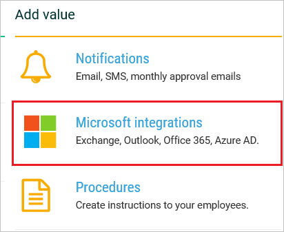
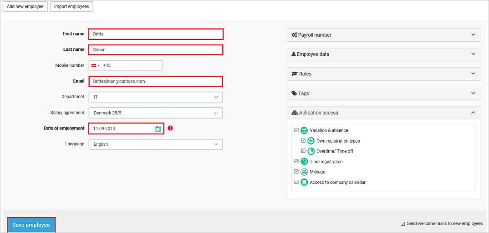

# Tutorial: Azure Active Directory integration with BitaBIZ

In this tutorial, you learn how to integrate BitaBIZ with Azure Active Directory (Azure AD).
Integrating BitaBIZ with Azure AD provides you with the following benefits:

* You can control in Azure AD who has access to BitaBIZ.
* You can enable your users to be automatically signed-in to BitaBIZ (Single Sign-On) with their Azure AD accounts.
* You can manage your accounts in one central location - the Azure portal.

If you want to know more details about SaaS app integration with Azure AD, see [What is application access and single sign-on with Azure Active Directory](https://docs.microsoft.com/azure/active-directory/active-directory-appssoaccess-whatis).
If you don't have an Azure subscription, [create a free account](https://azure.microsoft.com/free/) before you begin.

## Prerequisites

To configure Azure AD integration with BitaBIZ, you need the following items:

* An Azure AD subscription. If you don't have an Azure AD environment, you can get one-month trial [here](https://azure.microsoft.com/pricing/free-trial/)
* BitaBIZ single sign-on enabled subscription

## Scenario description

In this tutorial, you configure and test Azure AD single sign-on in a test environment.

* BitaBIZ supports **SP and IDP** initiated SSO

## Adding BitaBIZ from the gallery

To configure the integration of BitaBIZ into Azure AD, you need to add BitaBIZ from the gallery to your list of managed SaaS apps.

**To add BitaBIZ from the gallery, perform the following steps:**

1. In the **[Azure portal](https://portal.azure.com)**, on the left navigation panel, click **Azure Active Directory** icon.

	

2. Navigate to **Enterprise Applications** and then select the **All Applications** option.

	

3. To add new application, click **New application** button on the top of dialog.

	

4. In the search box, type **BitaBIZ**, select **BitaBIZ** from result panel then click **Add** button to add the application.

	 

## Configure and test Azure AD single sign-on

In this section, you configure and test Azure AD single sign-on with BitaBIZ based on a test user called **Britta Simon**.
For single sign-on to work, a link relationship between an Azure AD user and the related user in BitaBIZ needs to be established.

To configure and test Azure AD single sign-on with BitaBIZ, you need to complete the following building blocks:

1. **[Configure Azure AD Single Sign-On](#configure-azure-ad-single-sign-on)** - to enable your users to use this feature.
2. **[Configure BitaBIZ Single Sign-On](#configure-bitabiz-single-sign-on)** - to configure the Single Sign-On settings on application side.
3. **[Create an Azure AD test user](#create-an-azure-ad-test-user)** - to test Azure AD single sign-on with Britta Simon.
4. **[Assign the Azure AD test user](#assign-the-azure-ad-test-user)** - to enable Britta Simon to use Azure AD single sign-on.
5. **[Create BitaBIZ test user](#create-bitabiz-test-user)** - to have a counterpart of Britta Simon in BitaBIZ that is linked to the Azure AD representation of user.
6. **[Test single sign-on](#test-single-sign-on)** - to verify whether the configuration works.

### Configure Azure AD single sign-on

In this section, you enable Azure AD single sign-on in the Azure portal.

To configure Azure AD single sign-on with BitaBIZ, perform the following steps:

1. In the [Azure portal](https://portal.azure.com/), on the **BitaBIZ** application integration page, select **Single sign-on**.

    

2. On the **Select a Single sign-on method** dialog, select **SAML/WS-Fed** mode to enable single sign-on.

    

3. On the **Set up Single Sign-On with SAML** page, click **Edit** icon to open **Basic SAML Configuration** dialog.

	

4. On the **Basic SAML Configuration** section, If you wish to configure the application in **IDP** initiated mode, perform the following step:

    

    In the **Identifier** text box, type a URL using the following pattern:
    `https://www.bitabiz.com/<instanceId>`

    > [!NOTE]
    > The value in the above URL is for demonstration only. Update the value with the actual identifier, which is explained later in the tutorial.

5. Click **Set additional URLs** and perform the following step if you wish to configure the application in **SP** initiated mode:

    

    In the **Sign-on URL** text box, type the URL:
    `https://www.bitabiz.com/dashboard`

6. On the **Set up Single Sign-On with SAML** page, in the **SAML Signing Certificate** section, click **Download** to download the **Certificate (Base64)** from the given options as per your requirement and save it on your computer.

	

7. On the **Set up BitaBIZ** section, copy the appropriate URL(s) as per your requirement.

	

	a. Login URL

	b. Azure Ad Identifier

	c. Logout URL

### Configure BitaBIZ Single Sign-On

1. In a different web browser window, sign-on to your BitaBIZ tenant as an administrator.

2. Click on **SETUP ADMIN**.

	

3. Click on **Microsoft integrations** under **Add value** section.

	

4. Scroll down to the section **Microsoft Azure AD (Enable single sign on)** and perform following steps:

	

	a. Copy the value from the **Entity ID (”Identifier” in Azure AD)** textbox and paste it into the **Identifier** textbox on the **Basic SAML Configuration** section in Azure portal. 

	b. In the **Azure AD Single Sign-On Service URL** textbox, paste **Login URL**, which you have copied from Azure portal.

	c. In the **Azure AD SAML Entity ID** textbox, paste **Azure Ad Identifier**, which you have copied from Azure portal.

	d. Open your downloaded **Certificate(Base64)** file in notepad, copy the content of it into your clipboard, and then paste it to the **Azure AD Signing Certificate (Base64 encoded)** textbox.

	e. Add your business e-mail domain name that is, mycompany.com in **Domain name** textbox to assign SSO to the users in your company with this email domain (NOT MANDATORY).

	f. Mark **SSO enabled** the BitaBIZ account.

	g. Click **Save Azure AD configuration** to save and activate the SSO configuration.

### Create an Azure AD test user

The objective of this section is to create a test user in the Azure portal called Britta Simon.

1. In the Azure portal, in the left pane, select **Azure Active Directory**, select **Users**, and then select **All users**.

    

2. Select **New user** at the top of the screen.

    

3. In the User properties, perform the following steps.

    

    a. In the **Name** field enter **BrittaSimon**.
  
    b. In the **User name** field type **brittasimon\@yourcompanydomain.extension**  
    For example, BrittaSimon@contoso.com

    c. Select **Show password** check box, and then write down the value that's displayed in the Password box.

    d. Click **Create**.

### Assign the Azure AD test user

In this section, you enable Britta Simon to use Azure single sign-on by granting access to BitaBIZ.

1. In the Azure portal, select **Enterprise Applications**, select **All applications**, then select **BitaBIZ**.

	

2. In the applications list, select **BitaBIZ**.

	

3. In the menu on the left, select **Users and groups**.

    

4. Click the **Add user** button, then select **Users and groups** in the **Add Assignment** dialog.

    

5. In the **Users and groups** dialog select **Britta Simon** in the Users list, then click the **Select** button at the bottom of the screen.

6. If you are expecting any role value in the SAML assertion then in the **Select Role** dialog select the appropriate role for the user from the list, then click the **Select** button at the bottom of the screen.

7. In the **Add Assignment** dialog click the **Assign** button.

### Create BitaBIZ test user

To enable Azure AD users to log in to BitaBIZ, they must be provisioned into BitaBIZ.  
In the case of BitaBIZ, provisioning is a manual task.

**To provision a user account, perform the following steps:**

1. Log in to your BitaBIZ company site as an administrator.

2. Click on **SETUP ADMIN**.

	

3. Click on **Add users** under **Organization** section.

	

4. Click **Add new employee**.

	

5. On the **Add new employee** dialog page, perform the following steps:

	

	a. In the **First Name** textbox, type the first name of user like Britta.

	b. In the **Last Name** textbox, type the last name of user like Simon.

	c. In the **Email** textbox, type the email address of user like Brittasimon@contoso.com.

	d. Select a date in **Date of employment**.

	e. There are other non-mandatory user attributes which can be set up for the user. Please refer the [Employee Setup Doc](https://help.bitabiz.dk/manage-or-set-up-your-account/on-boarding-employees/new-employee) for more details.

	f. Click **Save employee**.

	> [!NOTE]
    > The Azure Active Directory account holder receives an email and follows a link to confirm their account before it becomes active.

### Test single sign-on

In this section, you test your Azure AD single sign-on configuration using the Access Panel.

When you click the BitaBIZ tile in the Access Panel, you should be automatically signed in to the BitaBIZ for which you set up SSO. For more information about the Access Panel, see [Introduction to the Access Panel](https://docs.microsoft.com/azure/active-directory/active-directory-saas-access-panel-introduction).

## Additional Resources

- [List of Tutorials on How to Integrate SaaS Apps with Azure Active Directory](https://docs.microsoft.com/azure/active-directory/active-directory-saas-tutorial-list)

- [What is application access and single sign-on with Azure Active Directory?](https://docs.microsoft.com/azure/active-directory/active-directory-appssoaccess-whatis)

- [What is Conditional Access in Azure Active Directory?](https://docs.microsoft.com/azure/active-directory/conditional-access/overview)
