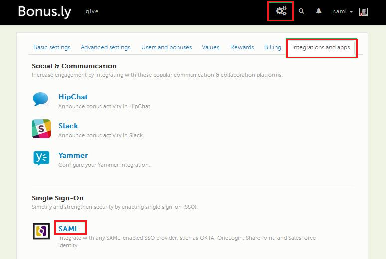
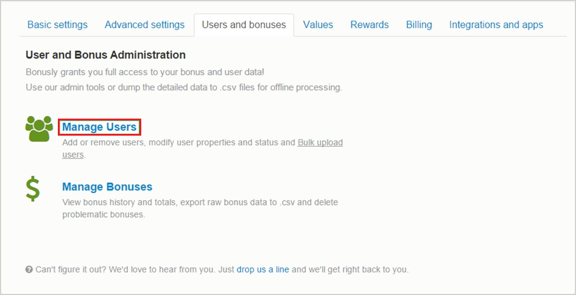
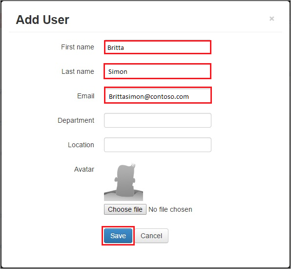

# Tutorial: Azure Active Directory integration with Bonusly

In this tutorial, you learn how to integrate Bonusly with Azure Active Directory (Azure AD).
Integrating Bonusly with Azure AD provides you with the following benefits:

* You can control in Azure AD who has access to Bonusly.
* You can enable your users to be automatically signed-in to Bonusly (Single Sign-On) with their Azure AD accounts.
* You can manage your accounts in one central location - the Azure portal.

If you want to know more details about SaaS app integration with Azure AD, see [What is application access and single sign-on with Azure Active Directory](https://docs.microsoft.com/azure/active-directory/active-directory-appssoaccess-whatis).
If you don't have an Azure subscription, [create a free account](https://azure.microsoft.com/free/) before you begin.

## Prerequisites

To configure Azure AD integration with Bonusly, you need the following items:

* An Azure AD subscription. If you don't have an Azure AD environment, you can get a [free account](https://azure.microsoft.com/free/)
* Bonusly single sign-on enabled subscription

## Scenario description

In this tutorial, you configure and test Azure AD single sign-on in a test environment.

* Bonusly supports **IDP** initiated SSO

## Adding Bonusly from the gallery

To configure the integration of Bonusly into Azure AD, you need to add Bonusly from the gallery to your list of managed SaaS apps.

**To add Bonusly from the gallery, perform the following steps:**

1. In the **[Azure portal](https://portal.azure.com)**, on the left navigation panel, click **Azure Active Directory** icon.

	

2. Navigate to **Enterprise Applications** and then select the **All Applications** option.

	

3. To add new application, click **New application** button on the top of dialog.

	

4. In the search box, type **Bonusly**, select **Bonusly** from result panel then click **Add** button to add the application.

	

## Configure and test Azure AD single sign-on

In this section, you configure and test Azure AD single sign-on with Bonusly based on a test user called **Britta Simon**.
For single sign-on to work, a link relationship between an Azure AD user and the related user in Bonusly needs to be established.

To configure and test Azure AD single sign-on with Bonusly, you need to complete the following building blocks:

1. **[Configure Azure AD Single Sign-On](#configure-azure-ad-single-sign-on)** - to enable your users to use this feature.
2. **[Configure Bonusly Single Sign-On](#configure-bonusly-single-sign-on)** - to configure the Single Sign-On settings on application side.
3. **[Create an Azure AD test user](#create-an-azure-ad-test-user)** - to test Azure AD single sign-on with Britta Simon.
4. **[Assign the Azure AD test user](#assign-the-azure-ad-test-user)** - to enable Britta Simon to use Azure AD single sign-on.
5. **[Create Bonusly test user](#create-bonusly-test-user)** - to have a counterpart of Britta Simon in Bonusly that is linked to the Azure AD representation of user.
6. **[Test single sign-on](#test-single-sign-on)** - to verify whether the configuration works.

### Configure Azure AD single sign-on

In this section, you enable Azure AD single sign-on in the Azure portal.

To configure Azure AD single sign-on with Bonusly, perform the following steps:

1. In the [Azure portal](https://portal.azure.com/), on the **Bonusly** application integration page, select **Single sign-on**.

    

2. On the **Select a Single sign-on method** dialog, select **SAML/WS-Fed** mode to enable single sign-on.

    

3. On the **Set up Single Sign-On with SAML** page, click **Edit** icon to open **Basic SAML Configuration** dialog.

	

4. On the **Basic SAML Configuration** section, perform the following steps:

    

    In the **Reply URL** text box, type a URL using the following pattern:
    `https://Bonus.ly/saml/<tenant-name>`

	> [!NOTE]
	> The value is not real. Update the value with the actual Reply URL. Contact [Bonusly Client support team](https://bonus.ly/contact) to get the value. You can also refer to the patterns shown in the **Basic SAML Configuration** section in the Azure portal.

5. In the **SAML Signing Certificate** section, click **Edit** button to open **SAML Signing Certificate** dialog.

	

6. In the **SAML Signing Certificate** section, copy the **THUMBPRINT** and save it on your computer.

    

7. On the **Set up Bonusly** section, copy the appropriate URL(s) as per your requirement.

	

	a. Login URL

	b. Azure AD Identifier

	c. Logout URL

### Configure Bonusly Single Sign-On

1. In a different browser window, sign in to your **Bonusly** tenant.

1. In the toolbar on the top, click **Settings** and then select **Integrations and apps**.

    
1. Under **Single Sign-On**, select **SAML**.

1. On the **SAML** dialog page, perform the following steps:

    

    a. In the **IdP SSO target URL** textbox, paste the value of **Login URL**, which you have copied from Azure portal.

    b. In the **IdP Login URL** textbox, paste the value of **Login URL**, which you have copied from Azure portal.

    c. In the **IdP Issuer** textbox, paste the value of **Azure AD Identifier**, which you have copied from Azure portal.
    
    d. Paste the **Thumbprint** value copied from Azure portal into the **Cert Fingerprint** textbox.
    
    e. Click **Save**.

### Create an Azure AD test user

The objective of this section is to create a test user in the Azure portal called Britta Simon.

1. In the Azure portal, in the left pane, select **Azure Active Directory**, select **Users**, and then select **All users**.

    

2. Select **New user** at the top of the screen.

    

3. In the User properties, perform the following steps.

    

    a. In the **Name** field enter **BrittaSimon**.
  
    b. In the **User name** field type `brittasimon@yourcompanydomain.extension`. For example, BrittaSimon@contoso.com

    c. Select **Show password** check box, and then write down the value that's displayed in the Password box.

    d. Click **Create**.

### Assign the Azure AD test user

In this section, you enable Britta Simon to use Azure single sign-on by granting access to Bonusly.

1. In the Azure portal, select **Enterprise Applications**, select **All applications**, then select **Bonusly**.

	

2. In the applications list, select **Bonusly**.

	

3. In the menu on the left, select **Users and groups**.

    

4. Click the **Add user** button, then select **Users and groups** in the **Add Assignment** dialog.

    

5. In the **Users and groups** dialog select **Britta Simon** in the Users list, then click the **Select** button at the bottom of the screen.

6. If you are expecting any role value in the SAML assertion then in the **Select Role** dialog select the appropriate role for the user from the list, then click the **Select** button at the bottom of the screen.

7. In the **Add Assignment** dialog click the **Assign** button.

### Create Bonusly test user

In order to enable Azure AD users to sign in to Bonusly, they must be provisioned into Bonusly. In the case of Bonusly, provisioning is a manual task.

> [!NOTE]
> You can use any other Bonusly user account creation tools or APIs provided by Bonusly to provision AAD user accounts. 

**To configure user provisioning, perform the following steps:**

1. In a web browser window, sign in to your Bonusly tenant.

1. Click **Settings**.

    

1. Click the **Users and bonuses** tab.

    

1. Click **Manage Users**.

    

1. Click **Add User**.

    

1. On the **Add User** dialog, perform the following steps:

      

    a. In the **First name** textbox, enter the first name of user like **Britta**.

    b. In the **Last name** textbox, enter the last name of user like **Simon**.

    c. In the **Email** textbox, enter the email of user like `brittasimon\@contoso.com`.

    d. Click **Save**.

    > [!NOTE]
    > The Azure AD account holder receives an email that includes a link to confirm the account before it becomes active.  

### Test single sign-on

In this section, you test your Azure AD single sign-on configuration using the Access Panel.

When you click the Bonusly tile in the Access Panel, you should be automatically signed in to the Bonusly for which you set up SSO. For more information about the Access Panel, see [Introduction to the Access Panel](https://docs.microsoft.com/azure/active-directory/active-directory-saas-access-panel-introduction).

## Additional Resources

- [List of Tutorials on How to Integrate SaaS Apps with Azure Active Directory](https://docs.microsoft.com/azure/active-directory/active-directory-saas-tutorial-list)

- [What is application access and single sign-on with Azure Active Directory?](https://docs.microsoft.com/azure/active-directory/active-directory-appssoaccess-whatis)

- [What is Conditional Access in Azure Active Directory?](https://docs.microsoft.com/azure/active-directory/conditional-access/overview)
