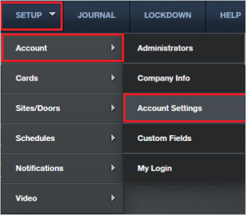
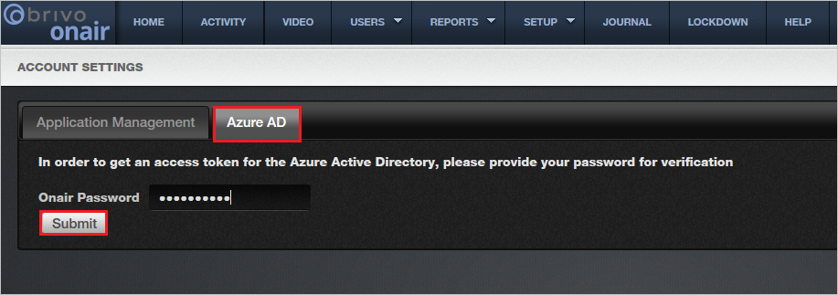
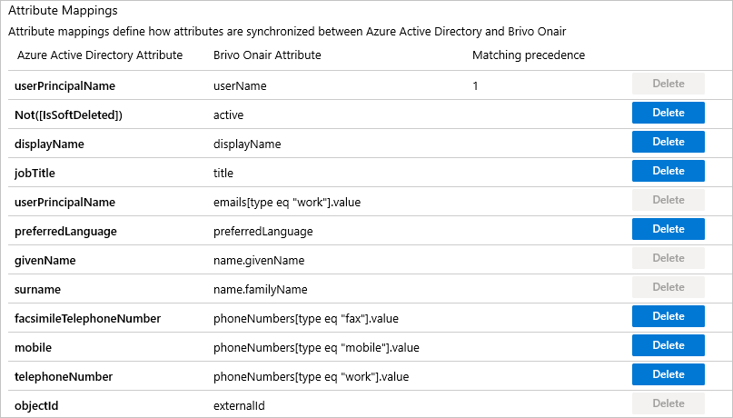

# Tutorial: Configure Brivo Onair Identity Connector for automatic user provisioning

The objective of this tutorial is to demonstrate the steps to be performed in Brivo Onair Identity Connector and Azure Active Directory (Azure AD) to configure Azure AD to automatically provision and de-provision users and/or groups to Brivo Onair Identity Connector.

> [!NOTE]
> This tutorial describes a connector built on top of the Azure AD User Provisioning Service. For important details on what this service does, how it works, and frequently asked questions, see [Automate user provisioning and deprovisioning to SaaS applications with Azure Active Directory](../app-provisioning/user-provisioning.md).
>
> This connector is currently in Public Preview. For more information on the general Microsoft Azure terms of use for Preview features, see [Supplemental Terms of Use for Microsoft Azure Previews](https://azure.microsoft.com/support/legal/preview-supplemental-terms/).

## Prerequisites

The scenario outlined in this tutorial assumes that you already have the following prerequisites:

* An Azure AD tenant
* [A Brivo Onair Identity Connector tenant](https://www.brivo.com/lp/quote)
* A user account in Brivo Onair Identity Connector with Senior Administrator permissions.

## Assigning users to Brivo Onair Identity Connector

Azure Active Directory uses a concept called *assignments* to determine which users should receive access to selected apps. In the context of automatic user provisioning, only the users and/or groups that have been assigned to an application in Azure AD are synchronized.

Before configuring and enabling automatic user provisioning, you should decide which users and/or groups in Azure AD need access to Brivo Onair Identity Connector. Once decided, you can assign these users and/or groups to Brivo Onair Identity Connector by following the instructions here:
* [Assign a user or group to an enterprise app](../manage-apps/assign-user-or-group-access-portal.md)

## Important tips for assigning users to Brivo Onair Identity Connector

* It is recommended that a single Azure AD user is assigned to Brivo Onair Identity Connector to test the automatic user provisioning configuration. Additional users and/or groups may be assigned later.

* When assigning a user to Brivo Onair Identity Connector, you must select any valid application-specific role (if available) in the assignment dialog. Users with the **Default Access** role are excluded from provisioning.

## Setup Brivo Onair Identity Connector for provisioning

1. Sign in to your [Brivo Onair Identity Connector Admin Console](https://acs.brivo.com/login/). Navigate to **Account > Account Settings**.

   

2. Click on **Azure AD** tab. On the **Azure AD** details page re-enter the password of your senior administrator account. Click on **Submit**.

   

3. Click on **Copy Token** button and save the **Secret Token**. This value will be entered in the Secret Token field in the Provisioning tab of your Brivo Onair Identity Connector application in the Azure portal.

   

## Add Brivo Onair Identity Connector from the gallery

Before configuring Brivo Onair Identity Connector for automatic user provisioning with Azure AD, you need to add Brivo Onair Identity Connector from the Azure AD application gallery to your list of managed SaaS applications.

**To add Brivo Onair Identity Connector from the Azure AD application gallery, perform the following steps:**

1. In the **[Azure portal](https://portal.azure.com)**, in the left navigation panel, select **Azure Active Directory**.

    

2. Go to **Enterprise applications**, and then select **All applications**.

    

3. To add a new application, select the **New application** button at the top of the pane.

    

4. In the search box, enter **Brivo Onair Identity Connector**, select **Brivo Onair Identity Connector** in the results panel, and then click the **Add** button to add the application.

    

## Configuring automatic user provisioning to Brivo Onair Identity Connector 

This section guides you through the steps to configure the Azure AD provisioning service to create, update, and disable users and/or groups in Brivo Onair Identity Connector based on user and/or group assignments in Azure AD.

### To configure automatic user provisioning for Brivo Onair Identity Connector in Azure AD:

1. Sign in to the [Azure portal](https://portal.azure.com). Select **Enterprise Applications**, then select **All applications**.

    

2. In the applications list, select **Brivo Onair Identity Connector**.

    

3. Select the **Provisioning** tab.

	

4. Set the **Provisioning Mode** to **Automatic**.

	

5. Under the **Admin Credentials** section, input `https://scim.brivo.com/ActiveDirectory/v2/` in **Tenant URL**. Input the **SCIM Authentication Token** value retrieved earlier in **Secret Token**. Click **Test Connection** to ensure Azure AD can connect to Brivo Onair Identity Connector. If the connection fails, ensure your Brivo Onair Identity Connector account has Admin permissions and try again.

    

6. In the **Notification Email** field, enter the email address of a person or group who should receive the provisioning error notifications and check the checkbox - **Send an email notification when a failure occurs**.

    

7. Click **Save**.

8. Under the **Mappings** section, select **Synchronize Azure Active Directory Users to Brivo Onair Identity Connector**.

    

9. Review the user attributes that are synchronized from Azure AD to Brivo Onair Identity Connector in the **Attribute Mapping** section. The attributes selected as **Matching** properties are used to match the user accounts in Brivo Onair Identity Connector for update operations. Select the **Save** button to commit any changes.

    

10. Under the **Mappings** section, select **Synchronize Azure Active Directory Groups to Brivo Onair Identity Connector**.

    

11. Review the group attributes that are synchronized from Azure AD to Brivo Onair Identity Connector in the **Attribute Mapping** section. The attributes selected as **Matching** properties are used to match the groups in Brivo Onair Identity Connector for update operations. Select the **Save** button to commit any changes.

    

12. To configure scoping filters, refer to the following instructions provided in the [Scoping filter tutorial](../app-provisioning/define-conditional-rules-for-provisioning-user-accounts.md).

13. To enable the Azure AD provisioning service for Brivo Onair Identity Connector, change the **Provisioning Status** to **On** in the **Settings** section.

    

14. Define the users and/or groups that you would like to provision to Brivo Onair Identity Connector by choosing the desired values in **Scope** in the **Settings** section.

    

15. When you are ready to provision, click **Save**.

    

This operation starts the initial synchronization of all users and/or groups defined in **Scope** in the **Settings** section. The initial sync takes longer to perform than subsequent syncs, which occur approximately every 40 minutes as long as the Azure AD provisioning service is running. You can use the **Synchronization Details** section to monitor progress and follow links to provisioning activity report, which describes all actions performed by the Azure AD provisioning service on Brivo Onair Identity Connector.

For more information on how to read the Azure AD provisioning logs, see [Reporting on automatic user account provisioning](../app-provisioning/check-status-user-account-provisioning.md).

## Additional resources

* [Managing user account provisioning for Enterprise Apps](../app-provisioning/configure-automatic-user-provisioning-portal.md)
* [What is application access and single sign-on with Azure Active Directory?](../manage-apps/what-is-single-sign-on.md)

## Next steps

* [Learn how to review logs and get reports on provisioning activity](../app-provisioning/check-status-user-account-provisioning.md)

