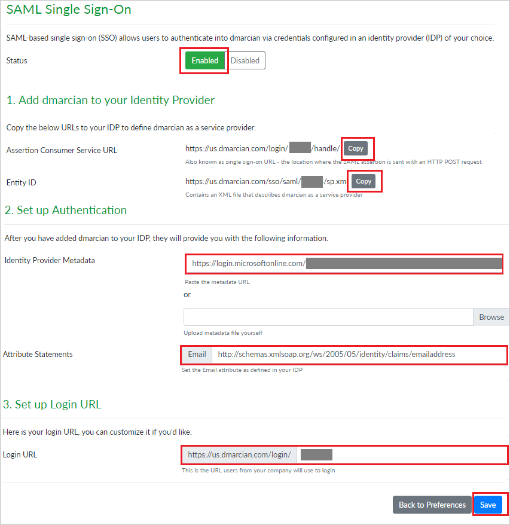
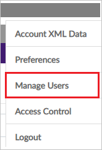

# Tutorial: Integrate dmarcian with Azure Active Directory

In this tutorial, you'll learn how to integrate dmarcian with Azure Active Directory (Azure AD). When you integrate dmarcian with Azure AD, you can:

* Control in Azure AD who has access to dmarcian.
* Enable your users to be automatically signed-in to dmarcian with their Azure AD accounts.
* Manage your accounts in one central location - the Azure portal.

To learn more about SaaS app integration with Azure AD, see [What is application access and single sign-on with Azure Active Directory](https://docs.microsoft.com/azure/active-directory/active-directory-appssoaccess-whatis).

## Prerequisites

To get started, you need the following items:

* An Azure AD subscription. If you don't have a subscription, you can get a [free account](https://azure.microsoft.com/free/).
* dmarcian single sign-on (SSO) enabled subscription.

## Scenario description

In this tutorial, you configure and test Azure AD SSO in a test environment.

* dmarcian supports **SP and IDP** initiated SSO

## Adding dmarcian from the gallery

To configure the integration of dmarcian into Azure AD, you need to add dmarcian from the gallery to your list of managed SaaS apps.

1. Sign in to the [Azure portal](https://portal.azure.com) using either a work or school account, or a personal Microsoft account.
1. On the left navigation pane, select the **Azure Active Directory** service.
1. Navigate to **Enterprise Applications** and then select **All Applications**.
1. To add new application, select **New application**.
1. In the **Add from the gallery** section, type **dmarcian** in the search box.
1. Select **dmarcian** from results panel and then add the app. Wait a few seconds while the app is added to your tenant.


## Configure and test Azure AD single sign-on

Configure and test Azure AD SSO with dmarcian using a test user called **B.Simon**. For SSO to work, you need to establish a link relationship between an Azure AD user and the related user in dmarcian.

To configure and test Azure AD SSO with dmarcian, complete the following building blocks:

1. **[Configure Azure AD SSO](#configure-azure-ad-sso)** - to enable your users to use this feature.
2. **[Configure dmarcian SSO](#configure-dmarcian-sso)** - to configure the Single Sign-On settings on application side.
3. **[Create an Azure AD test user](#create-an-azure-ad-test-user)** - to test Azure AD single sign-on with B.Simon.
4. **[Assign the Azure AD test user](#assign-the-azure-ad-test-user)** - to enable B.Simon to use Azure AD single sign-on.
5. **[Create dmarcian test user](#create-dmarcian-test-user)** - to have a counterpart of B.Simon in dmarcian that is linked to the Azure AD representation of user.
6. **[Test SSO](#test-sso)** - to verify whether the configuration works.

### Configure Azure AD SSO

Follow these steps to enable Azure AD SSO in the Azure portal.

1. In the [Azure portal](https://portal.azure.com/), on the **dmarcian** application integration page, find the **Manage** section and select **Single sign-on**.
1. On the **Select a Single sign-on method** page, select **SAML**.
1. On the **Set up Single Sign-On with SAML** page, click the edit/pen icon for **Basic SAML Configuration** to edit the settings.

   

4. On the **Basic SAML Configuration** section, If you wish to configure the application in **IDP** initiated mode, perform the following steps:

    a. In the **Identifier** text box, type a URL using the following pattern:

    ```http
    https://us.dmarcian.com/sso/saml/<ACCOUNT_ID>/sp.xml
    https://dmarcian-eu.com/sso/saml/<ACCOUNT_ID>/sp.xml
    https://dmarcian-ap.com/sso/saml/<ACCOUNT_ID>/sp.xml
    ```

    b. In the **Reply URL** text box, type a URL using the following pattern:

    ```http
    https://us.dmarcian.com/login/<ACCOUNT_ID>/handle/
    https://dmarcian-eu.com/login/<ACCOUNT_ID>/handle/
    https://dmarcian-ap.com/login/<ACCOUNT_ID>/handle/
    ```

5. Click **Set additional URLs** and perform the following step if you wish to configure the application in **SP** initiated mode:

    In the **Sign-on URL** text box, type a URL using the following pattern:
	
    ```http
    https://us.dmarcian.com/login/<ACCOUNT_ID>
    https://dmarcian-eu.com/login/<ACCOUNT_ID>
    https://dmarciam-ap.com/login/<ACCOUNT_ID>
    ```
	 
	> [!NOTE] 
	> These values are not real. You will update these values with the actual Identifier, Reply URL and Sign-On URL which is explained later in the tutorial.

4. On the **Set up Single Sign-On with SAML** page, In the **SAML Signing Certificate** section, click copy button to copy **App Federation Metadata Url** and save it on your computer.

	

### Configure dmarcian SSO

1. To automate the configuration within dmarcian, you need to install **My Apps Secure Sign-in browser extension** by clicking **Install the extension**.

	

2. After adding extension to the browser, click on **Setup dmarcian** will direct you to the dmarcian application. From there, provide the admin credentials to sign into dmarcian. The browser extension will automatically configure the application for you and automate steps 3-6.

	

3. If you want to setup dmarcian manually, open a new web browser window and sign into your dmarcian company site as an administrator and perform the following steps:

4. Click on **Profile** on the top-right corner and navigate to **Preferences**.

	

5. Scroll down and click on **Single Sign-On** section, then click on **Configure**.

	

6. On the **SAML Single Sign-On** page set the **Status** as **Enabled** and perform the following steps:

	

	* Under **Add dmarcian to your Identity Provider** section, click **COPY** to copy the **Assertion Consumer Service URL** for your instance and paste it in **Reply URL** textbox in **Basic SAML Configuration section** on Azure portal.

	* Under **Add dmarcian to your Identity Provider** section, click **COPY** to copy the **Entity ID** for your instance and paste it in **Identifier** textbox in **Basic SAML Configuration section** on Azure portal.

	* Under **Set up Authentication** section, in the **Identity Provider Metadata** textbox paste the **App Federation Metadata Url**, which you have copied from Azure portal.

	* Under **Set up Authentication** section, in the **Attribute Statements** textbox paste the url `http://schemas.xmlsoap.org/ws/2005/05/identity/claims/emailaddress`

	* Under **Set up Login URL** section, copy the **Login URL** for your instance and paste it in **Sign-on URL** textbox in **Basic SAML Configuration section** on Azure portal.

		> [!Note]
		> You can modify the **Login URL** according to your organization.

	* Click **Save**.

### Create an Azure AD test user

In this section, you'll create a test user in the Azure portal called B.Simon.

1. From the left pane in the Azure portal, select **Azure Active Directory**, select **Users**, and then select **All users**.
1. Select **New user** at the top of the screen.
1. In the **User** properties, follow these steps:
   1. In the **Name** field, enter `B.Simon`.  
   1. In the **User name** field, enter the username@companydomain.extension. For example, `B.Simon@contoso.com`.
   1. Select the **Show password** check box, and then write down the value that's displayed in the **Password** box.
   1. Click **Create**.

### Assign the Azure AD test user

In this section, you'll enable B.Simon to use Azure single sign-on by granting access to dmarcian.

1. In the Azure portal, select **Enterprise Applications**, and then select **All applications**.
1. In the applications list, select **dmarcian**.
1. In the app's overview page, find the **Manage** section and select **Users and groups**.

   

1. Select **Add user**, then select **Users and groups** in the **Add Assignment** dialog.

	

1. In the **Users and groups** dialog, select **B.Simon** from the Users list, then click the **Select** button at the bottom of the screen.
1. If you're expecting any role value in the SAML assertion, in the **Select Role** dialog, select the appropriate role for the user from the list and then click the **Select** button at the bottom of the screen.
1. In the **Add Assignment** dialog, click the **Assign** button.

### Create dmarcian test user

To enable Azure AD users to sign in to dmarcian, they must be provisioned into dmarcian. In dmarcian, provisioning is a manual task.

**To provision a user account, perform the following steps:**

1. Sign in to dmarcian as a Security Administrator.

2. Click on **Profile** on the top right-corner and navigate to **Manage Users**.

	

3. On the right side of **SSO Users** section, click on **Add New User**.

	

4. On the **Add New User** popup, perform the following steps:

	

	a. In the **New User Email** textbox, enter the email of user like **brittasimon\@contoso.com**.

	b. If you want to give admin rights to the user, select **Make User an Admin**.

	c. Click **Add User**.

### Test SSO 

In this section, you test your Azure AD single sign-on configuration using the Access Panel.

When you click the dmarcian tile in the Access Panel, you should be automatically signed in to the dmarcian for which you set up SSO. For more information about the Access Panel, see [Introduction to the Access Panel](https://docs.microsoft.com/azure/active-directory/active-directory-saas-access-panel-introduction).

## Additional Resources

- [ List of Tutorials on How to Integrate SaaS Apps with Azure Active Directory ](https://docs.microsoft.com/azure/active-directory/active-directory-saas-tutorial-list)

- [What is application access and single sign-on with Azure Active Directory? ](https://docs.microsoft.com/azure/active-directory/active-directory-appssoaccess-whatis)

- [What is conditional access in Azure Active Directory?](https://docs.microsoft.com/azure/active-directory/conditional-access/overview)

