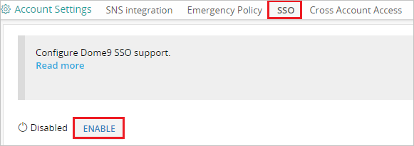
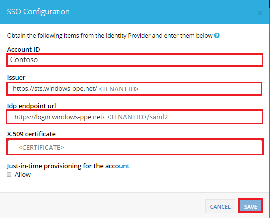
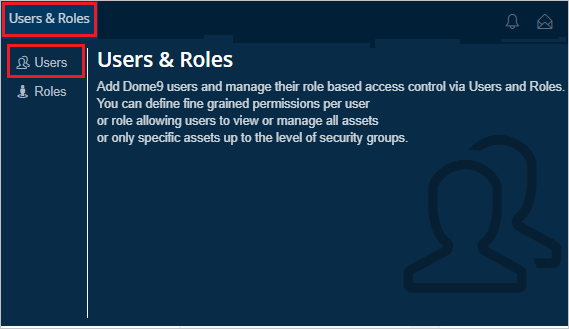

# Tutorial: Azure Active Directory single sign-on (SSO) integration with Check Point CloudGuard Dome9 Arc

In this tutorial, you'll learn how to integrate Check Point CloudGuard Dome9 Arc with Azure Active Directory (Azure AD). When you integrate Check Point CloudGuard Dome9 Arc with Azure AD, you can:

* Control in Azure AD who has access to Check Point CloudGuard Dome9 Arc.
* Enable your users to be automatically signed-in to Check Point CloudGuard Dome9 Arc with their Azure AD accounts.
* Manage your accounts in one central location - the Azure portal.

To learn more about SaaS app integration with Azure AD, see [What is application access and single sign-on with Azure Active Directory](https://docs.microsoft.com/azure/active-directory/active-directory-appssoaccess-whatis).

## Prerequisites

To get started, you need the following items:

* An Azure AD subscription. If you don't have a subscription, you can get a [free account](https://azure.microsoft.com/free/).
* Check Point CloudGuard Dome9 Arc single sign-on (SSO) enabled subscription.

## Scenario description

In this tutorial, you configure and test Azure AD SSO in a test environment.

* Check Point CloudGuard Dome9 Arc supports **SP and IDP** initiated SSO

> [!NOTE]
> Identifier of this application is a fixed string value so only one instance can be configured in one tenant.

## Adding Check Point CloudGuard Dome9 Arc from the gallery

To configure the integration of Check Point CloudGuard Dome9 Arc into Azure AD, you need to add Check Point CloudGuard Dome9 Arc from the gallery to your list of managed SaaS apps.

1. Sign in to the [Azure portal](https://portal.azure.com) using either a work or school account, or a personal Microsoft account.
1. On the left navigation pane, select the **Azure Active Directory** service.
1. Navigate to **Enterprise Applications** and then select **All Applications**.
1. To add new application, select **New application**.
1. In the **Add from the gallery** section, type **Check Point CloudGuard Dome9 Arc** in the search box.
1. Select **Check Point CloudGuard Dome9 Arc** from results panel and then add the app. Wait a few seconds while the app is added to your tenant.

## Configure and test Azure AD single sign-on for Check Point CloudGuard Dome9 Arc

Configure and test Azure AD SSO with Check Point CloudGuard Dome9 Arc using a test user called **B.Simon**. For SSO to work, you need to establish a link relationship between an Azure AD user and the related user in Check Point CloudGuard Dome9 Arc.

To configure and test Azure AD SSO with Check Point CloudGuard Dome9 Arc, complete the following building blocks:

1. **[Configure Azure AD SSO](#configure-azure-ad-sso)** - to enable your users to use this feature.
    1. **[Create an Azure AD test user](#create-an-azure-ad-test-user)** - to test Azure AD single sign-on with B.Simon.
    1. **[Assign the Azure AD test user](#assign-the-azure-ad-test-user)** - to enable B.Simon to use Azure AD single sign-on.
1. **[Configure Check Point CloudGuard Dome9 Arc SSO](#configure-check-point-cloudguard-dome9-arc-sso)** - to configure the single sign-on settings on application side.
    1. **[Create Check Point CloudGuard Dome9 Arc test user](#create-check-point-cloudguard-dome9-arc-test-user)** - to have a counterpart of B.Simon in Check Point CloudGuard Dome9 Arc that is linked to the Azure AD representation of user.
1. **[Test SSO](#test-sso)** - to verify whether the configuration works.

## Configure Azure AD SSO

Follow these steps to enable Azure AD SSO in the Azure portal.

1. In the [Azure portal](https://portal.azure.com/), on the **Check Point CloudGuard Dome9 Arc** application integration page, find the **Manage** section and select **single sign-on**.
1. On the **Select a single sign-on method** page, select **SAML**.
1. On the **Set up single sign-on with SAML** page, click the edit/pen icon for **Basic SAML Configuration** to edit the settings.

   

1. On the **Basic SAML Configuration** section, if you wish to configure the application in **IDP** initiated mode, enter the values for the following fields:

    a. In the **Identifier** text box, type a URL:
    `https://secure.dome9.com/`

    b. In the **Reply URL** text box, type a URL using the following pattern:
    `https://secure.dome9.com/sso/saml/<yourcompanyname>`

1. Click **Set additional URLs** and perform the following step if you wish to configure the application in **SP** initiated mode:

    In the **Sign-on URL** text box, type a URL using the following pattern:
    `https://secure.dome9.com/sso/saml/<yourcompanyname>`

	> [!NOTE]
	> These values are not real. Update these values with the actual Reply URL and Sign-on URL. You will get the `<company name>` value from the **Configure Check Point CloudGuard Dome9 Arc SSO** section, which is explained later in the tutorial. You can also refer to the patterns shown in the **Basic SAML Configuration** section in the Azure portal.

1. Check Point CloudGuard Dome9 Arc application expects the SAML assertions in a specific format, which requires you to add custom attribute mappings to your SAML token attributes configuration. The following screenshot shows the list of default attributes.

	

1. In addition to above, Check Point CloudGuard Dome9 Arc application expects few more attributes to be passed back in SAML response which are shown below. These attributes are also pre populated but you can review them as per your requirement.
	
	| Name |  Source Attribute|
	| ---------------| --------------- |
	| memberof | user.assignedroles |

	>[!NOTE]
	>Click [here](https://docs.microsoft.com/en-us/azure/active-directory/saas-apps/apptio-tutorial) to know how to create roles in Azure AD.

1. On the **Set up single sign-on with SAML** page, in the **SAML Signing Certificate** section,  find **Certificate (Base64)** and select **Download** to download the certificate and save it on your computer.

	

1. On the **Set up Check Point CloudGuard Dome9 Arc** section, copy the appropriate URL(s) based on your requirement.

	

### Create an Azure AD test user

In this section, you'll create a test user in the Azure portal called B.Simon.

1. From the left pane in the Azure portal, select **Azure Active Directory**, select **Users**, and then select **All users**.
1. Select **New user** at the top of the screen.
1. In the **User** properties, follow these steps:
   1. In the **Name** field, enter `B.Simon`.  
   1. In the **User name** field, enter the username@companydomain.extension. For example, `B.Simon@contoso.com`.
   1. Select the **Show password** check box, and then write down the value that's displayed in the **Password** box.
   1. Click **Create**.

### Assign the Azure AD test user

In this section, you'll enable B.Simon to use Azure single sign-on by granting access to Check Point CloudGuard Dome9 Arc.

1. In the Azure portal, select **Enterprise Applications**, and then select **All applications**.
1. In the applications list, select **Check Point CloudGuard Dome9 Arc**.
1. In the app's overview page, find the **Manage** section and select **Users and groups**.

   

1. Select **Add user**, then select **Users and groups** in the **Add Assignment** dialog.

	

1. In the **Users and groups** dialog, select **B.Simon** from the Users list, then click the **Select** button at the bottom of the screen.
1. If you're expecting any role value in the SAML assertion, in the **Select Role** dialog, select the appropriate role for the user from the list and then click the **Select** button at the bottom of the screen.
1. In the **Add Assignment** dialog, click the **Assign** button.

## Configure Check Point CloudGuard Dome9 Arc SSO

1. To automate the configuration within Check Point CloudGuard Dome9 Arc, you need to install **My Apps Secure Sign-in browser extension** by clicking **Install the extension**.

	

2. After adding extension to the browser, click on **Setup Check Point CloudGuard Dome9 Arc** will direct you to the Check Point CloudGuard Dome9 Arc application. From there, provide the admin credentials to sign into Check Point CloudGuard Dome9 Arc. The browser extension will automatically configure the application for you and automate steps 3-6.

	

3. If you want to setup Check Point CloudGuard Dome9 Arc manually, open a new web browser window and sign into your Check Point CloudGuard Dome9 Arc company site as an administrator and perform the following steps:

2. Click on the **Profile Settings** on the right top corner and then click **Account Settings**. 

	

3. Navigate to **SSO** and then click **ENABLE**.

	

4. In the SSO Configuration section, perform the following steps:

	

	a. Enter company name in the **Account ID** textbox. This value is to be used in the **Reply** and **Sign on** URL mentioned in **Basic SAML Configuration** section of Azure portal.

	b. In the **Issuer** textbox, paste the value of **Azure AD Identifier**, which you have copied form the Azure portal.

	c. In the **Idp endpoint url** textbox, paste the value of **Login URL**, which you have copied form the Azure portal.

	d. Open your downloaded Base64 encoded certificate in notepad, copy the content of it into your clipboard, and then paste it to the **X.509 certificate** textbox.

	e. Click **Save**.

### Create Check Point CloudGuard Dome9 Arc test user

To enable Azure AD users to sign in to Check Point CloudGuard Dome9 Arc, they must be provisioned into application. Check Point CloudGuard Dome9 Arc supports just-in-time provisioning but for that to work properly, user have to select particular **Role** and assign the same to the user.

   >[!Note]
   >For **Role** creation and other details contact [Check Point CloudGuard Dome9 Arc Client support team](mailto:Dome9@checkpoint.com).

**To provision a user account manually, perform the following steps:**

1. Sign in to your Check Point CloudGuard Dome9 Arc company site as an administrator.

2. Click on the **Users & Roles** and then click **Users**.

	

3. Click **ADD USER**.

	

4. In the **Create User** section, perform the following steps:

	

	a. In the **Email** textbox, type the email of user like B.Simon@contoso.com.

	b. In the **First Name** textbox, type first name of the user like B.

	c. In the **Last Name** textbox, type last name of the user like Simon.

	d. Make **SSO User** as **On**.

	e. Click **CREATE**.

## Test SSO 

In this section, you test your Azure AD single sign-on configuration using the Access Panel.

When you click the Check Point CloudGuard Dome9 Arc tile in the Access Panel, you should be automatically signed in to the Check Point CloudGuard Dome9 Arc for which you set up SSO. For more information about the Access Panel, see [Introduction to the Access Panel](https://docs.microsoft.com/azure/active-directory/active-directory-saas-access-panel-introduction).

## Additional resources

- [ List of Tutorials on How to Integrate SaaS Apps with Azure Active Directory ](https://docs.microsoft.com/azure/active-directory/active-directory-saas-tutorial-list)

- [What is application access and single sign-on with Azure Active Directory? ](https://docs.microsoft.com/azure/active-directory/active-directory-appssoaccess-whatis)

- [What is conditional access in Azure Active Directory?](https://docs.microsoft.com/azure/active-directory/conditional-access/overview)

- [Try Check Point CloudGuard Dome9 Arc with Azure AD](https://aad.portal.azure.com/)