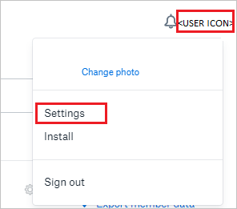
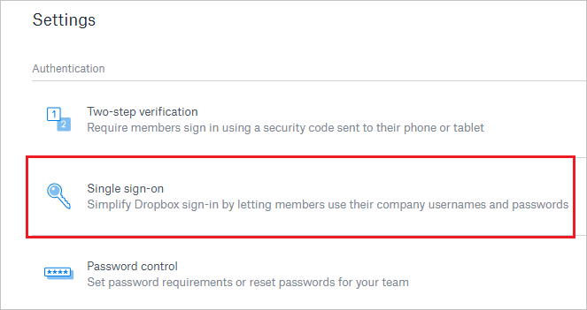
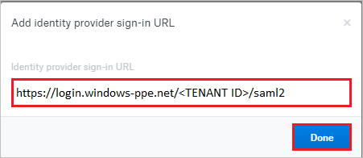

# Tutorial: Integrate Dropbox for Business with Azure Active Directory

In this tutorial, you'll learn how to integrate Dropbox for Business with Azure Active Directory (Azure AD). When you integrate Dropbox for Business with Azure AD, you can:

* Control in Azure AD who has access to Dropbox for Business.
* Enable your users to be automatically signed-in to Dropbox for Business with their Azure AD accounts.
* Manage your accounts in one central location - the Azure portal.

To learn more about SaaS app integration with Azure AD, see [What is application access and single sign-on with Azure Active Directory](https://docs.microsoft.com/azure/active-directory/active-directory-appssoaccess-whatis).

## Prerequisites

To get started, you need the following items:

* An Azure AD subscription. If you don't have a subscription, you can get one-month free trial [here](https://azure.microsoft.com/pricing/free-trial/).
* Dropbox for Business single sign-on (SSO) enabled subscription.

## Scenario description

* In this tutorial, you configure and test Azure AD SSO in a test environment. Dropbox for Business supports **SP** initiated SSO

* Dropbox for Business supports [Automated user provisioning and deprovisioning](dropboxforbusiness-tutorial.md)
* Once you configure Dropbox you can enforce Session Control, which protect exfiltration and infiltration of your organization’s sensitive data in real-time. Session Control extend from Conditional Access. [Learn how to enforce session control with Microsoft Cloud App Security](https://docs.microsoft.com/cloud-app-security/proxy-deployment-aad)

## Adding Dropbox for Business from the gallery

To configure the integration of Dropbox for Business into Azure AD, you need to add Dropbox for Business from the gallery to your list of managed SaaS apps.

1. Sign in to the [Azure portal](https://portal.azure.com) using either a work or school account, or a personal Microsoft account.
1. On the left navigation pane, select the **Azure Active Directory** service.
1. Navigate to **Enterprise Applications** and then select **All Applications**.
1. To add new application, select **New application**.
1. In the **Add from the gallery** section, type **Dropbox for Business** in the search box.
1. Select **Dropbox for Business** from results panel and then add the app. Wait a few seconds while the app is added to your tenant.

## Configure and test Azure AD single sign-on

Configure and test Azure AD SSO with Dropbox for Business using a test user called **Britta Simon**. For SSO to work, you need to establish a link relationship between an Azure AD user and the related user in Dropbox for Business.

To configure and test Azure AD SSO with Dropbox for Business, complete the following building blocks:

1. **[Configure Azure AD SSO](#configure-azure-ad-sso)** - to enable your users to use this feature.    
    1. **[Create an Azure AD test user](#create-an-azure-ad-test-user)** - to test Azure AD single sign-on with Britta Simon.
    1. **[Assign the Azure AD test user](#assign-the-azure-ad-test-user)** - to enable Britta Simon to use Azure AD single sign-on.
1. **[Configure Dropbox for Business SSO](#configure-dropbox-for-business-sso)** - to configure the Single Sign-On settings on application side.
    1. **[Create Dropbox for Business test user](#create-dropbox-for-business-test-user)** - to have a counterpart of Britta Simon in Dropbox for Business that is linked to the Azure AD representation of user.
1. **[Test SSO](#test-sso)** - to verify whether the configuration works.

## Configure Azure AD SSO

Follow these steps to enable Azure AD SSO in the Azure portal.

1. In the [Azure portal](https://portal.azure.com/), on the **Dropbox for Business** application integration page, find the **Manage** section and select **Single sign-on**.
1. On the **Select a Single sign-on method** page, select **SAML**.
1. On the **Set up Single Sign-On with SAML** page, click the edit/pen icon for **Basic SAML Configuration** to edit the settings.

   

1. On the **Basic SAML Configuration** page, enter the values for the following fields:

	a. In the **Sign on URL** text box, type a URL using the following pattern:
    `https://www.dropbox.com/sso/<id>`

    b. In the **Identifier (Entity ID)** text box, type a value:
    `Dropbox`

	> [!NOTE]
	> The preceding Sign-on URL value is not real value. You will update the value with the actual Sign-on URL, which is explained later in the tutorial.

1. On the **Set up Single Sign-On with SAML** page, in the **SAML Signing Certificate** section, click **Download** to download the **Certificate (Base64)** from the given options as per your requirement and save it on your computer.

	

1. On the **Set up Dropbox for Business** section, copy the appropriate URL(s) as per your requirement.

	

	a. Login URL

	b. Azure AD Identifier

	c. Logout URL

### Create an Azure AD test user

In this section, you'll create a test user in the Azure portal called Britta Simon.

1. From the left pane in the Azure portal, select **Azure Active Directory**, select **Users**, and then select **All users**.
1. Select **New user** at the top of the screen.
1. In the **User** properties, follow these steps:
   1. In the **Name** field, enter `Britta Simon`.  
   1. In the **User name** field, enter the username@companydomain.extension. For example, `BrittaSimon@contoso.com`.
   1. Select the **Show password** check box, and then write down the value that's displayed in the **Password** box.
   1. Click **Create**.

### Assign the Azure AD test user

In this section, you'll enable Britta Simon to use Azure single sign-on by granting access to Dropbox for Business.

1. In the Azure portal, select **Enterprise Applications**, and then select **All applications**.
1. In the applications list, select **Dropbox for Business**.
1. In the app's overview page, find the **Manage** section and select **Users and groups**.

   

1. Select **Add user**, then select **Users and groups** in the **Add Assignment** dialog.

	

1. In the **Users and groups** dialog, select **Britta Simon** from the Users list, then click the **Select** button at the bottom of the screen.
1. If you're expecting any role value in the SAML assertion, in the **Select Role** dialog, select the appropriate role for the user from the list and then click the **Select** button at the bottom of the screen.
1. In the **Add Assignment** dialog, click the **Assign** button.

## Configure Dropbox for Business SSO

1. To automate the configuration within Dropbox for Business, you need to install **My Apps Secure Sign-in browser extension** by clicking **Install the extension**.

	

2. After adding extension to the browser, click on **Setup Dropbox for Business** will direct you to the Dropbox for Business application. From there, provide the admin credentials to sign into Dropbox for Business. The browser extension will automatically configure the application for you and automate steps 3-8.

	

3. If you want to setup Dropbox for Business manually, open a new web browser window and go on your Dropbox for Business tenant and sign on to your Dropbox for business tenant. and perform the following steps:

	

4. Click on the **User Icon** and select **Settings** tab.

	

5. In the navigation pane on the left side, click **Admin console**.

	

6. On the **Admin console**, click **Settings** in the left navigation pane.

	

7. Select **Single sign-on** option under the **Authentication** section.

	

8. In the **Single sign-on** section, perform the following steps:  

	

	a. Select **Required** as an option from the dropdown for the **Single sign-on**.

	b. Click on **Add sign-in URL** and in the **Identity provider sign-in URL** textbox, paste the **Login URL** value which you have copied from the Azure portal and then select **Done**.

	

	c. Click **Upload certificate**, and then browse to your **Base64 encoded certificate file** which you have downloaded from the Azure portal.

	d. Click on **Copy link** and paste the copied value into the **Sign-on URL** textbox of **Dropbox for Business Domain and URLs** section on Azure portal.

	e. Click **Save**.

### Create Dropbox for Business test user

In this section, a user called Britta Simon is created in Dropbox for Business. Dropbox for Business supports just-in-time user provisioning, which is enabled by default. There is no action item for you in this section. If a user doesn't already exist in Dropbox for Business, a new one is created after authentication.

>[!Note]
>If you need to create a user manually, Contact [Dropbox for Business Client support team](https://www.dropbox.com/business/contact)

### Test SSO

When you select the Dropbox for Business tile in the Access Panel, you should be automatically signed in to the Dropbox for Business for which you set up SSO. For more information about the Access Panel, see [Introduction to the Access Panel](https://docs.microsoft.com/azure/active-directory/active-directory-saas-access-panel-introduction).

## Additional Resources

- [List of Tutorials on How to Integrate SaaS Apps with Azure Active Directory](https://docs.microsoft.com/azure/active-directory/active-directory-saas-tutorial-list)

- [What is application access and single sign-on with Azure Active Directory?](https://docs.microsoft.com/azure/active-directory/active-directory-appssoaccess-whatis)

- [What is Conditional Access in Azure Active Directory?](https://docs.microsoft.com/cloud-app-security/proxy-intro-aad)

- [How to protect Dropbox with advanced visibility and controls](https://docs.microsoft.com/cloud-app-security/protect-dropbox)