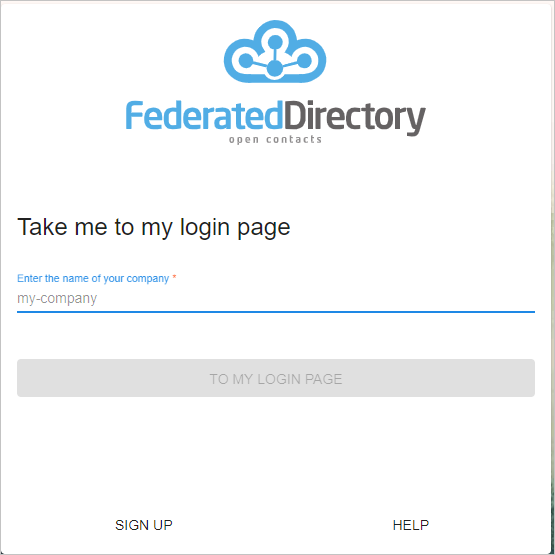
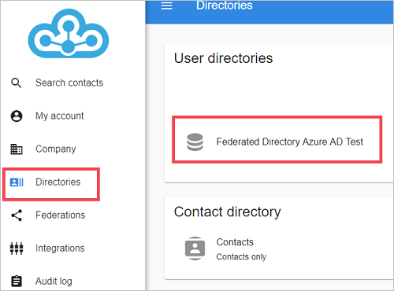
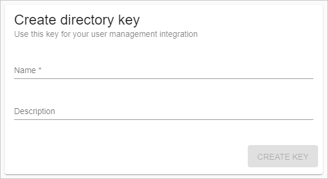
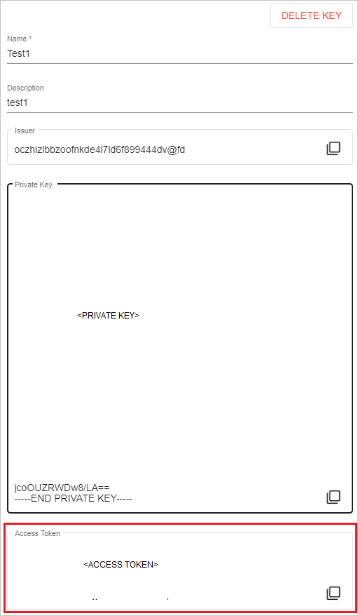
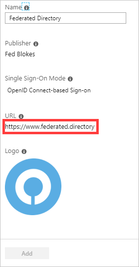
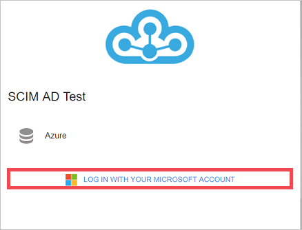
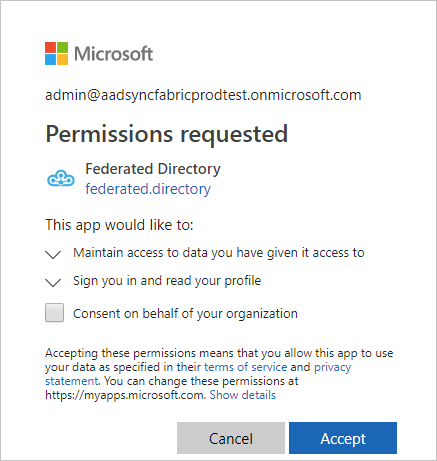

# Tutorial: Configure Federated Directory for automatic user provisioning

The objective of this tutorial is to demonstrate the steps to be performed in Federated Directory and Azure Active Directory (Azure AD) to configure Azure AD to automatically provision and de-provision users and/or groups to Federated Directory.

> [!NOTE]
>  This tutorial describes a connector built on top of the Azure AD User Provisioning Service. For important details on what this service does, how it works, and frequently asked questions, see [Automate user provisioning and deprovisioning to SaaS applications with Azure Active Directory](../app-provisioning/user-provisioning.md).
>
> This connector is currently in Public Preview. For more information on the general Microsoft Azure terms of use for Preview features, see [Supplemental Terms of Use for Microsoft Azure Previews](https://azure.microsoft.com/support/legal/preview-supplemental-terms/).

## Prerequisites

The scenario outlined in this tutorial assumes that you already have the following prerequisites:

* An Azure AD tenant.
* [A Federated Directory](https://www.federated.directory/pricing).
* A user account in Federated Directory with Admin permissions.

## Assign Users to Federated Directory
Azure Active Directory uses a concept called assignments to determine which users should receive access to selected apps. In the context of automatic user provisioning, only the users and/or groups that have been assigned to an application in Azure AD are synchronized.

Before configuring and enabling automatic user provisioning, you should decide which users and/or groups in Azure AD need access to Federated Directory. Once decided, you can assign these users and/or groups to Federated Directory by following the instructions here:

 * [Assign a user or group to an enterprise app](../manage-apps/assign-user-or-group-access-portal.md) 
 
 ## Important tips for assigning users to Federated Directory
 * It is recommended that a single Azure AD user is assigned to Federated Directory to test the automatic user provisioning configuration. Additional users and/or groups may be assigned later.

* When assigning a user to Federated Directory, you must select any valid application-specific role (if available) in the assignment dialog. Users with the Default Access role are excluded from provisioning.
	
 ## Set up Federated Directory for provisioning

Before configuring Federated Directory for automatic user provisioning with Azure AD, you will need to enable SCIM provisioning on Federated Directory.

1. Sign in to your [Federated Directory Admin Console](https://federated.directory/of)

	

2. Navigate to **Directories > User directories** and select your tenant. 

	

3. 	To generate a permanent bearer token, navigate to **Directory Keys > Create New Key.** 

	

4. Create a directory key. 

	
	

5. Copy the **Access Token** value. This value will be entered in the **Secret Token** field in the Provisioning tab of your Federated Directory application in the Azure portal. 

	
	
## Add Federated Directory from the gallery

To configure Federated Directory for automatic user provisioning with Azure AD, you need to add Federated Directory from the Azure AD application gallery to your list of managed SaaS applications.

**To add Federated Directory from the Azure AD application gallery, perform the following steps:**

1. In the **[Azure portal](https://portal.azure.com)**, in the left navigation panel, select **Azure Active Directory**.

	

2. Go to **Enterprise applications**, and then select **All applications**.

	

3. To add a new application, select the **New application** button at the top of the pane.

	

4. In the search box, enter **Federated Directory**, select **Federated Directory** in the results panel.

	

5. Navigate to the **URL** highlighted below in a separate browser. 

	

6. Click **LOG IN**.

	

7.  As Federated Directory is an OpenIDConnect app, choose to login to Federated Directory using your Microsoft work account.
	
	
 
8. After a successful authentication, accept the consent prompt for the consent page. The application will then be automatically added to your tenant and you will be redirected to your Federated Directory account.

	

## Configuring automatic user provisioning to Federated Directory 

This section guides you through the steps to configure the Azure AD provisioning service to create, update, and disable users and/or groups in Federated Directory based on user and/or group assignments in Azure AD.

### To configure automatic user provisioning for Federated Directory in Azure AD:

1. Sign in to the [Azure portal](https://portal.azure.com). Select **Enterprise Applications**, then select **All applications**.

	

2. In the applications list, select **Federated Directory**.

	

3. Select the **Provisioning** tab.

	

4. Set the **Provisioning Mode** to **Automatic**.

	

5. Under the **Admin Credentials** section, input `https://api.federated.directory/v2/` in Tenant URL. Input the value that you retrieved and saved earlier from Federated Directory in **Secret Token**. Click **Test Connection** to ensure Azure AD can connect to Federated Directory. If the connection fails, ensure your Federated Directory account has Admin permissions and try again.

	

8. In the **Notification Email** field, enter the email address of a person or group who should receive the provisioning error notifications and check the checkbox - **Send an email notification when a failure occurs**.

	

9. Click **Save**.

10. Under the **Mappings** section, select **Synchronize Azure Active Directory Users to Federated Directory**.

	
	
	
11. Review the user attributes that are synchronized from Azure AD to Federated Directory in the **Attribute Mapping** section. The attributes selected as **Matching** properties are used to match the user accounts in Federated Directory for update operations. Select the **Save** button to commit any changes.

	
	

12. To configure scoping filters, refer to the following instructions provided in the [Scoping filter tutorial](../app-provisioning/define-conditional-rules-for-provisioning-user-accounts.md).

13. To enable the Azure AD provisioning service for Federated Directory, change the **Provisioning Status** to **On** in the **Settings** section.

	

14. Define the users and/or groups that you would like to provision to Federated Directory by choosing the desired values in **Scope** in the **Settings** section.

	

15. When you are ready to provision, click **Save**.

	

This operation starts the initial synchronization of all users and/or groups defined in **Scope** in the **Settings** section. The initial sync takes longer to perform than subsequent syncs, which occur approximately every 40 minutes as long as the Azure AD provisioning service is running. You can use the **Synchronization Details** section to monitor progress and follow links to provisioning activity report, which describes all actions performed by the Azure AD provisioning service on Federated Directory.

For more information on how to read the Azure AD provisioning logs, see [Reporting on automatic user account provisioning](../app-provisioning/check-status-user-account-provisioning.md)
## Additional resources

* [Managing user account provisioning for Enterprise Apps](../app-provisioning/configure-automatic-user-provisioning-portal.md)
* [What is application access and single sign-on with Azure Active Directory?](../manage-apps/what-is-single-sign-on.md)

## Next steps

* [Learn how to review logs and get reports on provisioning activity](../app-provisioning/check-status-user-account-provisioning.md)
