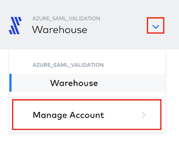
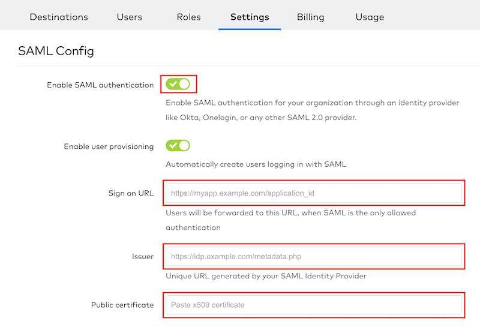

# Tutorial: Azure Active Directory single sign-on (SSO) integration with Fivetran

In this tutorial, you'll learn how to integrate Fivetran with Azure Active Directory (Azure AD). When you integrate Fivetran with Azure AD, you can:

* Control in Azure AD who has access to Fivetran.
* Enable your users to be automatically signed-in to Fivetran with their Azure AD accounts.
* Manage your accounts in one central location - the Azure portal.

## Prerequisites

To get started, you need the following items:

* An Azure AD subscription. If you don't have a subscription, you can get a [free account](https://azure.microsoft.com/free/).
* A Fivetran account.

## Scenario description

In this tutorial, you configure and test Azure AD SSO in a test environment.

* Fivetran supports **IDP** initiated SSO
* Fivetran supports **Just In Time** user provisioning

> [!NOTE]
> Identifier of this application is a fixed string value so only one instance can be configured in one tenant.

## Add Fivetran from the gallery

To configure the integration of Fivetran into Azure AD, you need to add Fivetran from the gallery to your list of managed SaaS apps.

1. Sign in to the Azure portal using either a work or school account, or a personal Microsoft account.
1. On the left navigation pane, select the **Azure Active Directory** service.
1. Navigate to **Enterprise Applications** and then select **All Applications**.
1. To add new application, select **New application**.
1. In the **Add from the gallery** section, type **Fivetran** in the search box.
1. Select **Fivetran** from results panel and then add the app. Wait a few seconds while the app is added to your tenant.

## Configure and test Azure AD SSO for Fivetran

Configure and test Azure AD SSO with Fivetran using a test user called **B.Simon**. For SSO to work, you need to establish a link relationship between an Azure AD user and the related user in Fivetran.

To configure and test Azure AD SSO with Fivetran, perform the following steps:

1. **[Configure Azure AD SSO](#configure-azure-ad-sso)** - to enable your users to use this feature.
    1. **[Create an Azure AD test user](#create-an-azure-ad-test-user)** - to test Azure AD single sign-on with B.Simon.
    1. **[Assign the Azure AD test user](#assign-the-azure-ad-test-user)** - to enable B.Simon to use Azure AD single sign-on.
1. **[Configure Fivetran SSO](#configure-fivetran-sso)** - to configure the single sign-on settings on application side.
    1. **[Create Fivetran test user](#create-fivetran-test-user)** - to have a counterpart of B.Simon in Fivetran that is linked to the Azure AD representation of user.
1. **[Test SSO](#test-sso)** - to verify whether the configuration works.

## Configure Azure AD SSO

Follow these steps to enable Azure AD SSO in the Azure portal.

1. In the Azure portal, on the **Fivetran** application integration page, find the **Manage** section and select **single sign-on**.
1. On the **Select a single sign-on method** page, select **SAML**.
1. On the **Set up single sign-on with SAML** page, click the edit/pen icon for **Basic SAML Configuration** to edit the settings.

   

1. On the **Basic SAML Configuration** section, the application is pre-configured and the necessary URLs are already pre-populated with Azure. The user needs to save the configuration by clicking the **Save** button.

1. Fivetran application expects the SAML assertions in a specific format, which requires you to add custom attribute mappings to your SAML token attributes configuration. The following screenshot shows the list of default attributes.

	

1. In addition to above, Fivetran application expects few more attributes to be passed back in SAML response which are shown below. These attributes are also pre populated but you can review them as per your requirements.
	
	| Name |  Source Attribute|
	| -------------- | --------- |
	| FirstName | user.givenname |
	| LastName | user.surname |

1. On the **Set up single sign-on with SAML** page, in the **SAML Signing Certificate** section,  find **Certificate (Base64)** and select **Download** to download the certificate and save it on your computer.

	

1. On the **Set up Fivetran** section, copy the **Login URL** and **Azure Ad Identifier** values.

	

### Create an Azure AD test user

In this section, you'll create a test user in the Azure portal called B.Simon.

1. From the left pane in the Azure portal, select **Azure Active Directory**, select **Users**, and then select **All users**.
1. Select **New user** at the top of the screen.
1. In the **User** properties, follow these steps:
   1. In the **Name** field, enter `B.Simon`.  
   1. In the **User name** field, enter the username@companydomain.extension. For example, `B.Simon@contoso.com`.
   1. Select the **Show password** check box, and then write down the value that's displayed in the **Password** box.
   1. Click **Create**.

### Assign the Azure AD test user

In this section, you'll enable B.Simon to use Azure single sign-on by granting access to Fivetran.

1. In the Azure portal, select **Enterprise Applications**, and then select **All applications**.
1. In the applications list, select **Fivetran**.
1. In the app's overview page, find the **Manage** section and select **Users and groups**.
1. Select **Add user**, then select **Users and groups** in the **Add Assignment** dialog.
1. In the **Users and groups** dialog, select **B.Simon** from the Users list, then click the **Select** button at the bottom of the screen.
1. If you are expecting a role to be assigned to the users, you can select it from the **Select a role** dropdown. If no role has been setup for this app, you see "Default Access" role selected.
1. In the **Add Assignment** dialog, click the **Assign** button.

## Configure Fivetran SSO

In this section, you'll configure single sign-on on the **Fivetran** side.

1. In a different web browser window, sign in to your Fivetran account as the account owner.
1. Select the arrow in the top left corner of the window, and then select **Manage Account** from the drop-down list.

   

1. Go to the **SAML Config** section of the **Settings** page.

   

   1. For **Enable SAML authentication**, select **ON**.
   1. In **Sign on URL**, paste the value of **Login URL**, which you copied from the Azure portal.
   1. In **Issuer**, paste the value of **Azure Ad Identifier**, which you copied from the Azure portal.
   1. Open your downloaded certificate file in a text editor, copy the certificate into your clipboard, and then paste it to in the **Public certificate** text box.
   1. Select **SAVE CONFIG**.

### Create Fivetran test user

In this section, a user called B.Simon is created in Fivetran. Fivetran supports just-in-time user provisioning, which is enabled by default. There is no action item for you in this section. If a user doesn't already exist in Fivetran, a new one is created after authentication.

## Test SSO 

In this section, you test your Azure AD single sign-on configuration with following options. 

1. Click on **Test this application** in Azure portal and you should be automatically signed in to the Fivetran for which you set up the SSO 

2. You can use Microsoft Access Panel. When you click the Fivetran tile in the Access Panel, you should be automatically signed in to the Fivetran for which you set up the SSO. For more information about the Access Panel, see [Introduction to the Access Panel](https://docs.microsoft.com/azure/active-directory/active-directory-saas-access-panel-introduction).

## Next steps

Once you configure Fivetran you can enforce session control, which protects exfiltration and infiltration of your organization’s sensitive data in real time. Session control extends from Conditional Access. [Learn how to enforce session control with Microsoft Cloud App Security](https://docs.microsoft.com/cloud-app-security/proxy-deployment-any-app).

