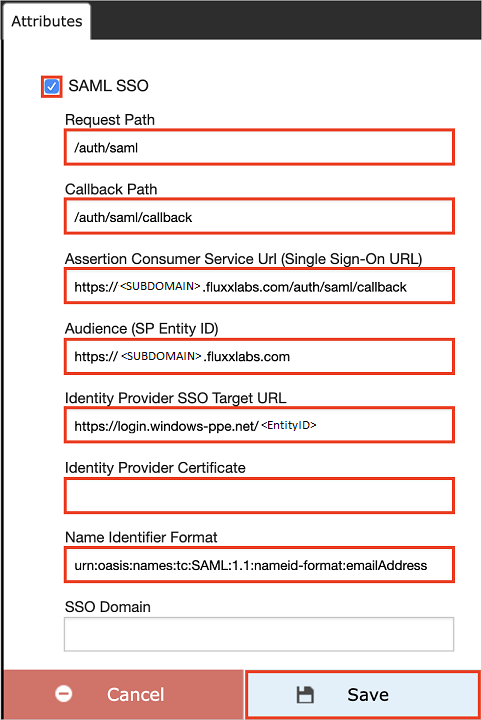
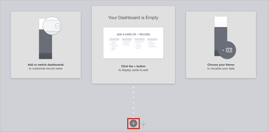
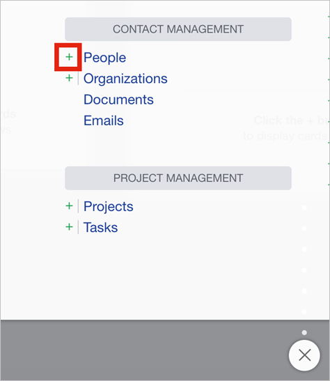

# Tutorial: Azure Active Directory single sign-on (SSO) integration with Fluxx Labs

In this tutorial, you'll learn how to integrate Fluxx Labs with Azure Active Directory (Azure AD). When you integrate Fluxx Labs with Azure AD, you can:

* Control in Azure AD who has access to Fluxx Labs.
* Enable your users to be automatically signed-in to Fluxx Labs with their Azure AD accounts.
* Manage your accounts in one central location - the Azure portal.

To learn more about SaaS app integration with Azure AD, see [What is application access and single sign-on with Azure Active Directory](https://docs.microsoft.com/azure/active-directory/manage-apps/what-is-single-sign-on).

## Prerequisites

To get started, you need the following items:

* An Azure AD subscription. If you don't have a subscription, you can get a [free account](https://azure.microsoft.com/free/).
* Fluxx Labs single sign-on (SSO) enabled subscription.

## Scenario description

In this tutorial, you configure and test Azure AD SSO in a test environment.

* Fluxx Labs supports **IDP** initiated SSO
* Once you configure Fluxx Labs you can enforce session control, which protect exfiltration and infiltration of your organization’s sensitive data in real-time. Session control extend from Conditional Access. [Learn how to enforce session control with Microsoft Cloud App Security](https://docs.microsoft.com/cloud-app-security/proxy-deployment-any-app).

## Adding Fluxx Labs from the gallery

To configure the integration of Fluxx Labs into Azure AD, you need to add Fluxx Labs from the gallery to your list of managed SaaS apps.

1. Sign in to the [Azure portal](https://portal.azure.com) using either a work or school account, or a personal Microsoft account.
1. On the left navigation pane, select the **Azure Active Directory** service.
1. Navigate to **Enterprise Applications** and then select **All Applications**.
1. To add new application, select **New application**.
1. In the **Add from the gallery** section, type **Fluxx Labs** in the search box.
1. Select **Fluxx Labs** from results panel and then add the app. Wait a few seconds while the app is added to your tenant.

## Configure and test Azure AD single sign-on for Fluxx Labs

Configure and test Azure AD SSO with Fluxx Labs using a test user called **B.Simon**. For SSO to work, you need to establish a link relationship between an Azure AD user and the related user in Fluxx Labs.

To configure and test Azure AD SSO with Fluxx Labs, complete the following building blocks:

1. **[Configure Azure AD SSO](#configure-azure-ad-sso)** - to enable your users to use this feature.
    1. **[Create an Azure AD test user](#create-an-azure-ad-test-user)** - to test Azure AD single sign-on with B.Simon.
    1. **[Assign the Azure AD test user](#assign-the-azure-ad-test-user)** - to enable B.Simon to use Azure AD single sign-on.
1. **[Configure Fluxx Labs SSO](#configure-fluxx-labs-sso)** - to configure the single sign-on settings on application side.
    1. **[Create Fluxx Labs test user](#create-fluxx-labs-test-user)** - to have a counterpart of B.Simon in Fluxx Labs that is linked to the Azure AD representation of user.
1. **[Test SSO](#test-sso)** - to verify whether the configuration works.

## Configure Azure AD SSO

Follow these steps to enable Azure AD SSO in the Azure portal.

1. In the [Azure portal](https://portal.azure.com/), on the **Fluxx Labs** application integration page, find the **Manage** section and select **single sign-on**.
1. On the **Select a single sign-on method** page, select **SAML**.
1. On the **Set up single sign-on with SAML** page, click the edit/pen icon for **Basic SAML Configuration** to edit the settings.

   

1. On the **Set up Single Sign-On with SAML** page, perform the following steps:

    a. In the **Identifier** text box, type a URL using the following pattern:

    | Environment | URL Pattern|
	|-------------|------------|
	| Production | `https://<subdomain>.fluxx.io` |
	| Pre production | `https://<subdomain>.preprod.fluxxlabs.com`|

    b. In the **Reply URL** text box, type a URL using the following pattern:

    | Environment | URL Pattern|
	|-------------|------------|
	| Production | `https://<subdomain>.fluxx.io/auth/saml/callback` |
	| Pre production | `https://<subdomain>.preprod.fluxxlabs.com/auth/saml/callback`|

	> [!NOTE]
	> These values are not real. Update these values with the actual Identifier and Reply URL. Contact [Fluxx Labs Client support team](https://fluxx.zendesk.com) to get these values. You can also refer to the patterns shown in the **Basic SAML Configuration** section in the Azure portal.

1. On the **Set up single sign-on with SAML** page, in the **SAML Signing Certificate** section,  find **Certificate (Base64)** and select **Download** to download the certificate and save it on your computer.

	

1. On the **Set up Fluxx Labs** section, copy the appropriate URL(s) based on your requirement.

	

### Create an Azure AD test user

In this section, you'll create a test user in the Azure portal called B.Simon.

1. From the left pane in the Azure portal, select **Azure Active Directory**, select **Users**, and then select **All users**.
1. Select **New user** at the top of the screen.
1. In the **User** properties, follow these steps:
   1. In the **Name** field, enter `B.Simon`.  
   1. In the **User name** field, enter the username@companydomain.extension. For example, `B.Simon@contoso.com`.
   1. Select the **Show password** check box, and then write down the value that's displayed in the **Password** box.
   1. Click **Create**.

### Assign the Azure AD test user

In this section, you'll enable B.Simon to use Azure single sign-on by granting access to Fluxx Labs.

1. In the Azure portal, select **Enterprise Applications**, and then select **All applications**.
1. In the applications list, select **Fluxx Labs**.
1. In the app's overview page, find the **Manage** section and select **Users and groups**.

   

1. Select **Add user**, then select **Users and groups** in the **Add Assignment** dialog.

	

1. In the **Users and groups** dialog, select **B.Simon** from the Users list, then click the **Select** button at the bottom of the screen.
1. If you're expecting any role value in the SAML assertion, in the **Select Role** dialog, select the appropriate role for the user from the list and then click the **Select** button at the bottom of the screen.
1. In the **Add Assignment** dialog, click the **Assign** button.

## Configure Fluxx Labs SSO

1. In a different web browser window, sign in to your Fluxx Labs company site as administrator.

2. Select **Admin** below the **Settings** section.

	

3. In the Admin Panel, Select **Plug-ins** > **Integrations** and then select **SAML SSO-(Disabled)**

	

4. In the attribute section, perform the following steps:

	

	a. Select the **SAML SSO** checkbox.

	b. In the **Request Path** textbox, type **/auth/saml**.

	c. In the **Callback Path** textbox, type **/auth/saml/callback**.

	d. In the **Assertion Consumer Service Url(Single Sign-On URL)** textbox, enter the **Reply URL** value, which you have entered in the Azure portal.

	e. In the **Audience(SP Entity ID)** textbox, enter the **Identifier** value, which you have entered in the Azure portal.

	f. In the **Identity Provider SSO Target URL** textbox, paste the **Login URL** value, which you have copied from the Azure portal.

	g. Open your base-64 encoded certificate in notepad, copy the content of it into your clipboard, and then paste it to the **Identity Provider Certificate** textbox.

	h. In **Name identifier Format** textbox, enter the value `urn:oasis:names:tc:SAML:1.1:nameid-format:emailAddress`.

	i. Click **Save**.

	> [!NOTE]
	> Once the content saved, the field will appear blank for security, but the value has been saved in the configuration.

### Create Fluxx Labs test user

To enable Azure AD users to sign in to Fluxx Labs, they must be provisioned into Fluxx Labs. In the case of Fluxx Labs, provisioning is a manual task.

**To provision a user account, perform the following steps:**

1. Sign in to your Fluxx Labs company site as an administrator.

2. Click on the  below displayed **icon**.

	

3. On the dashboard, click on the below displayed icon to open the **New PEOPLE** card.

    

4. On the **NEW PEOPLE** section, perform the following steps:

	

	a. Fluxx Labs use email as the unique identifier for SSO logins. Populate the **SSO UID** field with the user’s email address, that matches the email address, which they are using as login with SSO.

	b. Click **Save**.

## Test SSO

In this section, you test your Azure AD single sign-on configuration using the Access Panel.

When you click the Fluxx Labs tile in the Access Panel, you should be automatically signed in to the Fluxx Labs for which you set up SSO. For more information about the Access Panel, see [Introduction to the Access Panel](https://docs.microsoft.com/azure/active-directory/active-directory-saas-access-panel-introduction).

## Additional resources

- [ List of Tutorials on How to Integrate SaaS Apps with Azure Active Directory ](https://docs.microsoft.com/azure/active-directory/active-directory-saas-tutorial-list)

- [What is application access and single sign-on with Azure Active Directory? ](https://docs.microsoft.com/azure/active-directory/manage-apps/what-is-single-sign-on)

- [What is conditional access in Azure Active Directory?](https://docs.microsoft.com/azure/active-directory/conditional-access/overview)

- [Try Fluxx Labs with Azure AD](https://aad.portal.azure.com/)

- [What is session control in Microsoft Cloud App Security?](https://docs.microsoft.com/cloud-app-security/proxy-intro-aad)

- [How to protect Fluxx Labs with advanced visibility and controls](https://docs.microsoft.com/cloud-app-security/proxy-intro-aad)