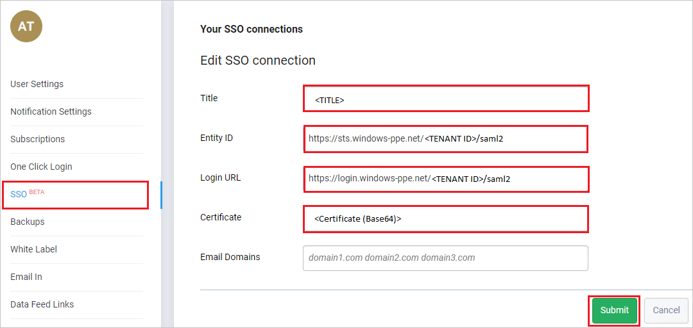
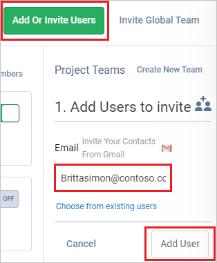

# Tutorial: Integrate Freedcamp with Azure Active Directory

In this tutorial, you'll learn how to integrate Freedcamp with Azure Active Directory (Azure AD). When you integrate Freedcamp with Azure AD, you can:

* Control in Azure AD who has access to Freedcamp.
* Enable your users to be automatically signed-in to Freedcamp with their Azure AD accounts.
* Manage your accounts in one central location - the Azure portal.

To learn more about SaaS app integration with Azure AD, see [What is application access and single sign-on with Azure Active Directory](https://docs.microsoft.com/azure/active-directory/active-directory-appssoaccess-whatis).

## Prerequisites

To get started, you need the following items:

* An Azure AD subscription. If you don't have a subscription, you can get a [free account](https://azure.microsoft.com/free/).
* Freedcamp single sign-on (SSO) enabled subscription.

## Scenario description

In this tutorial, you configure and test Azure AD SSO in a test environment. Freedcamp supports **SP and IDP** initiated SSO.

## Adding Freedcamp from the gallery

To configure the integration of Freedcamp into Azure AD, you need to add Freedcamp from the gallery to your list of managed SaaS apps.

1. Sign in to the [Azure portal](https://portal.azure.com) using either a work or school account, or a personal Microsoft account.
1. On the left navigation pane, select the **Azure Active Directory** service.
1. Navigate to **Enterprise Applications** and then select **All Applications**.
1. To add new application, select **New application**.
1. In the **Add from the gallery** section, type **Freedcamp** in the search box.
1. Select **Freedcamp** from results panel and then add the app. Wait a few seconds while the app is added to your tenant.

## Configure and test Azure AD single sign-on

Configure and test Azure AD SSO with Freedcamp using a test user called **Britta Simon**. For SSO to work, you need to establish a link relationship between an Azure AD user and the related user in Freedcamp.

To configure and test Azure AD SSO with Freedcamp, complete the following building blocks:

1. **[Configure Azure AD SSO](#configure-azure-ad-sso)** to enable your users to use this feature.
2. **[Configure Freedcamp](#configure-freedcamp)** to configure the SSO settings on application side.
3. **[Create an Azure AD test user](#create-an-azure-ad-test-user)** to test Azure AD single sign-on with Britta Simon.
4. **[Assign the Azure AD test user](#assign-the-azure-ad-test-user)** to enable Britta Simon to use Azure AD single sign-on.
5. **[Create Freedcamp test user](#create-freedcamp-test-user)** to have a counterpart of Britta Simon in Freedcamp that is linked to the Azure AD representation of user.
6. **[Test SSO](#test-sso)** to verify whether the configuration works.

### Configure Azure AD SSO

Follow these steps to enable Azure AD SSO in the Azure portal.

1. In the [Azure portal](https://portal.azure.com/), on the **Freedcamp** application integration page, find the **Manage** section and select **Single sign-on**.
1. On the **Select a Single sign-on method** page, select **SAML**.
1. On the **Set up Single Sign-On with SAML** page, click the edit/pen icon for **Basic SAML Configuration** to edit the settings.

   

1. On the **Basic SAML Configuration** section, if you wish to configure the application in **IDP** initiated mode, perform the following steps:

    1. In the **Identifier** text box, type a URL using the following pattern:
    `https://<SUBDOMAIN>.freedcamp.com/sso/<UNIQUEID>`

    2. In the **Reply URL** text box, type a URL using the following pattern:
    `https://<SUBDOMAIN>.freedcamp.com/sso/acs/<UNIQUEID>`

1. Click **Set additional URLs** and perform the following step if you wish to configure the application in **SP** initiated mode:

    In the **Sign-on URL** text box, type a URL using the following pattern:
    `https://<SUBDOMAIN>.freedcamp.com/login`

	> [!NOTE]
	> These values are not real. Update these values with the actual Identifier, Reply URL and Sign-on URL. Users can also enter the url values with respect to their own customer domain and they may not be necessarily of the pattern `freedcamp.com`, they can enter any customer domain specific value, specific to their application instance. Also you can contact [Freedcamp Client support team](mailto:devops@freedcamp.com) for further information on url patterns.

1. On the **Set up Single Sign-On with SAML** page, in the **SAML Signing Certificate** section, find **Certificate (Base64)** and select **Download** to download the certificate and save it on your computer.

   

1. On the **Set up Freedcamp** section, copy the appropriate URL(s) based on your requirement.

   

### Configure Freedcamp

1. To automate the configuration within Freedcamp, you need to install **My Apps Secure Sign-in browser extension** by clicking **Install the extension**.

	

2. After adding extension to the browser, click on **Setup Freedcamp** will direct you to the Freedcamp application. From there, provide the admin credentials to sign into Freedcamp. The browser extension will automatically configure the application for you and automate steps 3-5.

	

3. If you want to setup Freedcamp manually, open a new web browser window and sign into your Freedcamp company site as an administrator and perform the following steps:

4. On the top-right corner of the page, click on **profile** and then navigate to **My Account**.

	

5. From the left side of the menu bar, click on **SSO** and on the **Your SSO connections** page perform the following steps:

	

	a. In the **Title** text box, type the title.

	b. In the **Entity ID** text box, Paste the **Azure AD Identifier** value, which you have copied from the Azure portal.

	c. In the **Login URL** text box, Paste the **Login URL** value, which you have copied from the Azure portal.

	d. Open the Base64 encoded certificate in notepad, copy its content and paste it into the **Certificate** text box.

	e. Click **Submit**.

### Create an Azure AD test user

In this section, you'll create a test user in the Azure portal called Britta Simon.

1. From the left pane in the Azure portal, select **Azure Active Directory**, select **Users**, and then select **All users**.
1. Select **New user** at the top of the screen.
1. In the **User** properties, follow these steps:
   1. In the **Name** field, enter `Britta Simon`.  
   1. In the **User name** field, enter the username@companydomain.extension. For example, `BrittaSimon@contoso.com`.
   1. Select the **Show password** check box, and then write down the value that's displayed in the **Password** box.
   1. Click **Create**.

### Assign the Azure AD test user

In this section, you'll enable Britta Simon to use Azure single sign-on by granting access to Freedcamp.

1. In the Azure portal, select **Enterprise Applications**, and then select **All applications**.
1. In the applications list, select **Freedcamp**.
1. In the app's overview page, find the **Manage** section and select **Users and groups**.

   

1. Select **Add user**, then select **Users and groups** in the **Add Assignment** dialog.

	

1. In the **Users and groups** dialog, select **Britta Simon** from the Users list, then click the **Select** button at the bottom of the screen.
1. If you're expecting any role value in the SAML assertion, in the **Select Role** dialog, select the appropriate role for the user from the list and then click the **Select** button at the bottom of the screen.
1. In the **Add Assignment** dialog, click the **Assign** button.

### Create Freedcamp test user

To enable Azure AD users, sign in to Freedcamp, they must be provisioned into Freedcamp. In Freedcamp, provisioning is a manual task.

**To provision a user account, perform the following steps:**

1. In a different web browser window, sign in to Freedcamp as a Security Administrator.

2. On the top-right corner of the page, click on **profile** and then navigate to **Manage System**.

	

3. On the right side of the Manage System page, perform the following steps:

	

	a. Click on **Add or invite Users**.

	b. In the **Email** text box, enter the email of user like `Brittasimon@contoso.com`.

	c. Click **Add User**.

### Test SSO

When you select the Freedcamp tile in the Access Panel, you should be automatically signed in to the Freedcamp for which you set up SSO. For more information about the Access Panel, see [Introduction to the Access Panel](https://docs.microsoft.com/azure/active-directory/active-directory-saas-access-panel-introduction).

## Additional Resources

- [List of Tutorials on How to Integrate SaaS Apps with Azure Active Directory](https://docs.microsoft.com/azure/active-directory/active-directory-saas-tutorial-list)

- [What is application access and single sign-on with Azure Active Directory?](https://docs.microsoft.com/azure/active-directory/active-directory-appssoaccess-whatis)

- [What is Conditional Access in Azure Active Directory?](https://docs.microsoft.com/azure/active-directory/conditional-access/overview)