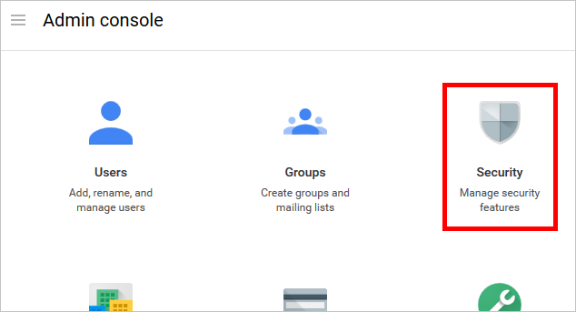
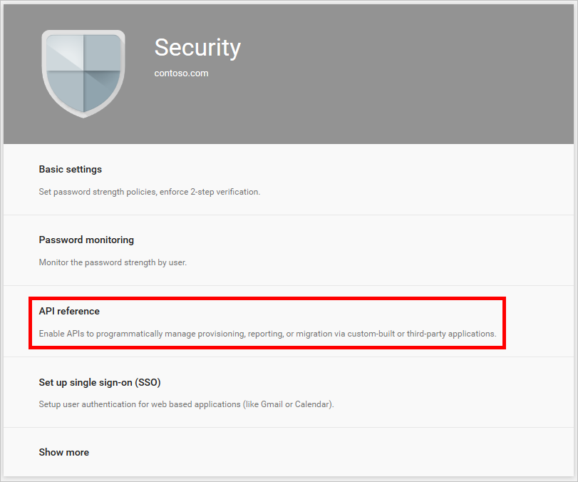
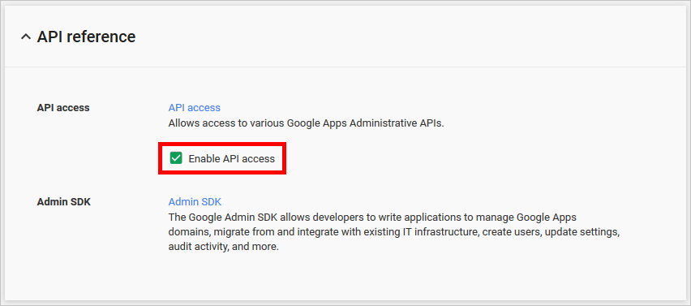
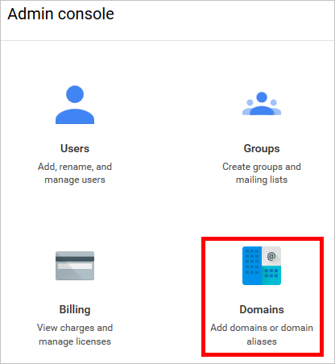
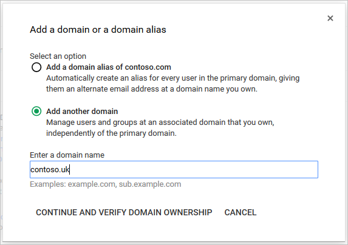
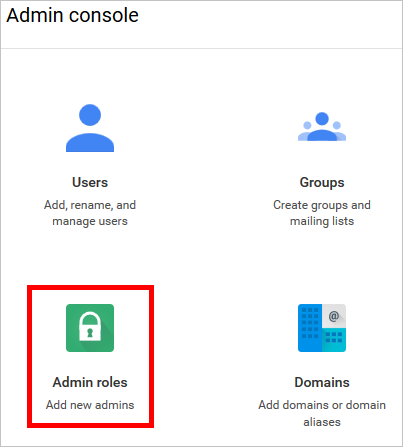
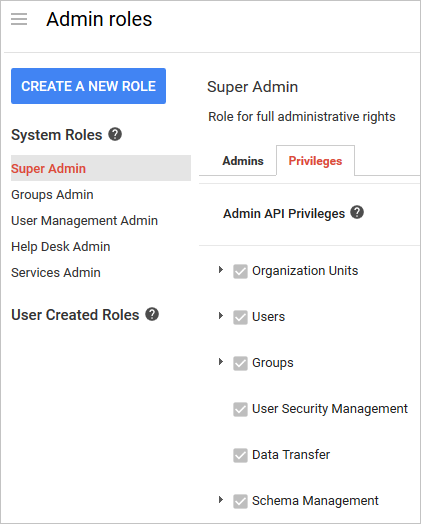
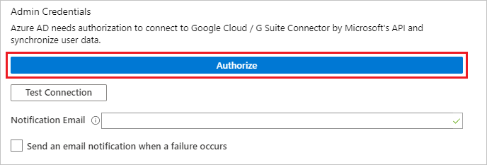
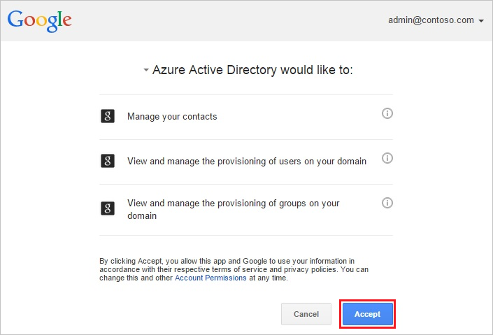

# Tutorial: Configure G Suite for automatic user provisioning

This tutorial describes the steps you need to perform in both G Suite and Azure Active Directory (Azure AD) to configure automatic user provisioning. When configured, Azure AD automatically provisions and de-provisions users and groups to [G Suite](https://gsuite.google.com/) using the Azure AD Provisioning service. For important details on what this service does, how it works, and frequently asked questions, see [Automate user provisioning and deprovisioning to SaaS applications with Azure Active Directory](../app-provisioning/user-provisioning.md). 

> [!NOTE]
> This tutorial describes a connector built on top of the Azure AD User Provisioning Service. For important details on what this service does, how it works, and frequently asked questions, see [Automate user provisioning and deprovisioning to SaaS applications with Azure Active Directory](../app-provisioning/user-provisioning.md).

> [!NOTE]
> This article contains references to the term *whitelist*, a term that Microsoft no longer uses. When the term is removed from the software, we'll remove it from this article.

## Capabilities supported
> [!div class="checklist"]
> * Create users in G Suite
> * Remove users in G Suite when they do not require access anymore
> * Keep user attributes synchronized between Azure AD and G Suite
> * Provision groups and group memberships in G Suite
> * [Single sign-on](./google-apps-tutorial.md) to G Suite (recommended)

## Prerequisites

The scenario outlined in this tutorial assumes that you already have the following prerequisites:

* [An Azure AD tenant](../develop/quickstart-create-new-tenant.md) 
* A user account in Azure AD with [permission](../roles/permissions-reference.md) to configure provisioning (e.g. Application Administrator, Cloud Application administrator, Application Owner, or Global Administrator). 
* [A G Suite tenant](https://gsuite.google.com/pricing.html)
* A user account on a G Suite with Admin permissions.

## Step 1. Plan your provisioning deployment
1. Learn about [how the provisioning service works](../app-provisioning/user-provisioning.md).
2. Determine who will be in [scope for provisioning](../app-provisioning/define-conditional-rules-for-provisioning-user-accounts.md).
3. Determine what data to [map between Azure AD and G Suite](../app-provisioning/customize-application-attributes.md). 

## Step 2. Configure G Suite to support provisioning with Azure AD

Before configuring G Suite for automatic user provisioning with Azure AD, you will need to enable SCIM provisioning on G Suite.

1. Sign in to the [G Suite Admin console](https://admin.google.com/) with your administrator account, and then select **Security**. If you don't see the link, it might be hidden under the **More Controls** menu at the bottom of the screen.

    

2. On the **Security** page, select **API Reference**.

    

3. Select **Enable API access**.

    

    > [!IMPORTANT]
   > For every user that you intend to provision to G Suite, their user name in Azure AD **must** be tied to a custom domain. For example, user names that look like bob@contoso.onmicrosoft.com are not accepted by G Suite. On the other hand, bob@contoso.com is accepted. You can change an existing user's domain by following the instructions [here](../fundamentals/add-custom-domain.md).

4. Once you have added and verified your desired custom domains with Azure AD, you must verify them again with G Suite. To verify domains in G Suite, refer to the following steps:

    a. In the [G Suite Admin Console](https://admin.google.com/), select **Domains**.

    

    b. Select **Add a domain or a domain alias**.

    

    c. Select **Add another domain**, and then type in the name of the domain that you want to add.

    

    d. Select **Continue and verify domain ownership**. Then follow the steps to verify that you own the domain name. For comprehensive instructions on how to verify your domain with Google, see [Verify your site ownership](https://support.google.com/webmasters/answer/35179).

    e. Repeat the preceding steps for any additional domains that you intend to add to G Suite.

5. Next, determine which admin account you want to use to manage user provisioning in G Suite. Navigate to **Admin Roles**.

    

6. For the **Admin role** of that account, edit the **Privileges** for that role. Make sure to enable all **Admin API Privileges** so that this account can be used for provisioning.

    

## Step 3. Add G Suite from the Azure AD application gallery

Add G Suite from the Azure AD application gallery to start managing provisioning to G Suite. If you have previously setup G Suite for SSO you can use the same application. However it is recommended that you create a separate app when testing out the integration initially. Learn more about adding an application from the gallery [here](../manage-apps/add-application-portal.md). 

## Step 4. Define who will be in scope for provisioning 

The Azure AD provisioning service allows you to scope who will be provisioned based on assignment to the application and or based on attributes of the user / group. If you choose to scope who will be provisioned to your app based on assignment, you can use the following [steps](../manage-apps/assign-user-or-group-access-portal.md) to assign users and groups to the application. If you choose to scope who will be provisioned based solely on attributes of the user or group, you can use a scoping filter as described [here](../app-provisioning/define-conditional-rules-for-provisioning-user-accounts.md). 

* When assigning users and groups to G Suite, you must select a role other than **Default Access**. Users with the Default Access role are excluded from provisioning and will be marked as not effectively entitled in the provisioning logs. If the only role available on the application is the default access role, you can [update the application manifest](../develop/howto-add-app-roles-in-azure-ad-apps.md) to add additional roles. 

* Start small. Test with a small set of users and groups before rolling out to everyone. When scope for provisioning is set to assigned users and groups, you can control this by assigning one or two users or groups to the app. When scope is set to all users and groups, you can specify an [attribute based scoping filter](../app-provisioning/define-conditional-rules-for-provisioning-user-accounts.md). 

## Step 5. Configure automatic user provisioning to G Suite 

This section guides you through the steps to configure the Azure AD provisioning service to create, update, and disable users and/or groups in TestApp based on user and/or group assignments in Azure AD.

> [!NOTE]
> To learn more about G Suite's Directory API endpoint, refer to [Directory API](https://developers.google.com/admin-sdk/directory).

### To configure automatic user provisioning for G Suite in Azure AD:

1. Sign in to the [Azure portal](https://portal.azure.com). Select **Enterprise Applications**, then select **All applications**. Users will need to login to portal.azure.com and will not be able to use aad.portal.azure.com

	

	

2. In the applications list, select **G Suite**.

	

3. Select the **Provisioning** tab. Click on **Get started**.

	

      

4. Set the **Provisioning Mode** to **Automatic**.

	

5. Under the **Admin Credentials** section, click on **Authorize**. You will be redirected to a Google authorization dialog box in a new browser window.

      

6. Confirm that you want to give Azure AD permissions to make changes to your G Suite tenant. Select **Accept**.

     

7. In the Azure portal, click **Test Connection** to ensure Azure AD can connect to G Suite. If the connection fails, ensure your G Suite account has Admin permissions and try again. Then try the **Authorize** step again.

6. In the **Notification Email** field, enter the email address of a person or group who should receive the provisioning error notifications and select the **Send an email notification when a failure occurs** check box.

	

7. Select **Save**.

8. Under the **Mappings** section, select **Provision Azure Active Directory Users**.

9. Review the user attributes that are synchronized from Azure AD to G Suite in the **Attribute-Mapping** section. The attributes selected as **Matching** properties are used to match the user accounts in G Suite for update operations. If you choose to change the [matching target attribute](../app-provisioning/customize-application-attributes.md), you will need to ensure that the G Suite API supports filtering users based on that attribute. Select the **Save** button to commit any changes.

   |Attribute|Type|
   |---|---|
   |primaryEmail|String|
   |relations.[type eq "manager"].value|String|
   |name.familyName|String|
   |name.givenName|String|
   |suspended|String|
   |externalIds.[type eq "custom"].value|String|
   |externalIds.[type eq "organization"].value|String|
   |addresses.[type eq "work"].country|String|
   |addresses.[type eq "work"].streetAddress|String|
   |addresses.[type eq "work"].region|String|
   |addresses.[type eq "work"].locality|String|
   |addresses.[type eq "work"].postalCode|String|
   |emails.[type eq "work"].address|String|
   |organizations.[type eq "work"].department|String|
   |organizations.[type eq "work"].title|String|
   |phoneNumbers.[type eq "work"].value|String|
   |phoneNumbers.[type eq "mobile"].value|String|
   |phoneNumbers.[type eq "work_fax"].value|String|
   |emails.[type eq "work"].address|String|
   |organizations.[type eq "work"].department|String|
   |organizations.[type eq "work"].title|String|
   |phoneNumbers.[type eq "work"].value|String|
   |phoneNumbers.[type eq "mobile"].value|String|
   |phoneNumbers.[type eq "work_fax"].value|String|
   |addresses.[type eq "home"].country|String|
   |addresses.[type eq "home"].formatted|String|
   |addresses.[type eq "home"].locality|String|
   |addresses.[type eq "home"].postalCode|String|
   |addresses.[type eq "home"].region|String|
   |addresses.[type eq "home"].streetAddress|String|
   |addresses.[type eq "other"].country|String|
   |addresses.[type eq "other"].formatted|String|
   |addresses.[type eq "other"].locality|String|
   |addresses.[type eq "other"].postalCode|String|
   |addresses.[type eq "other"].region|String|
   |addresses.[type eq "other"].streetAddress|String|
   |addresses.[type eq "work"].formatted|String|
   |changePasswordAtNextLogin|String|
   |emails.[type eq "home"].address|String|
   |emails.[type eq "other"].address|String|
   |externalIds.[type eq "account"].value|String|
   |externalIds.[type eq "custom"].customType|String|
   |externalIds.[type eq "customer"].value|String|
   |externalIds.[type eq "login_id"].value|String|
   |externalIds.[type eq "network"].value|String|
   |gender.type|String|
   |GeneratedImmutableId|String|
   |Identifier|String|
   |ims.[type eq "home"].protocol|String|
   |ims.[type eq "other"].protocol|String|
   |ims.[type eq "work"].protocol|String|
   |includeInGlobalAddressList|String|
   |ipWhitelisted|String|
   |organizations.[type eq "school"].costCenter|String|
   |organizations.[type eq "school"].department|String|
   |organizations.[type eq "school"].domain|String|
   |organizations.[type eq "school"].fullTimeEquivalent|String|
   |organizations.[type eq "school"].location|String|
   |organizations.[type eq "school"].name|String|
   |organizations.[type eq "school"].symbol|String|
   |organizations.[type eq "school"].title|String|
   |organizations.[type eq "work"].costCenter|String|
   |organizations.[type eq "work"].domain|String|
   |organizations.[type eq "work"].fullTimeEquivalent|String|
   |organizations.[type eq "work"].location|String|
   |organizations.[type eq "work"].name|String|
   |organizations.[type eq "work"].symbol|String|
   |OrgUnitPath|String|
   |phoneNumbers.[type eq "home"].value|String|
   |phoneNumbers.[type eq "other"].value|String|
   |websites.[type eq "home"].value|String|
   |websites.[type eq "other"].value|String|
   |websites.[type eq "work"].value|String|
   

10. Under the **Mappings** section, select **Provision Azure Active Directory Groups**.

11. Review the group attributes that are synchronized from Azure AD to G Suite in the **Attribute-Mapping** section. The attributes selected as **Matching** properties are used to match the groups in G Suite for update operations. Select the **Save** button to commit any changes.

      |Attribute|Type|
      |---|---|
      |email|String|
      |Members|String|
      |name|String|
      |description|String|

12. To configure scoping filters, refer to the following instructions provided in the [Scoping filter tutorial](../app-provisioning/define-conditional-rules-for-provisioning-user-accounts.md).

13. To enable the Azure AD provisioning service for G Suite, change the **Provisioning Status** to **On** in the **Settings** section.

	

14. Define the users and/or groups that you would like to provision to G Suite by choosing the desired values in **Scope** in the **Settings** section.

	

15. When you are ready to provision, click **Save**.

	

This operation starts the initial synchronization cycle of all users and groups defined in **Scope** in the **Settings** section. The initial cycle takes longer to perform than subsequent cycles, which occur approximately every 40 minutes as long as the Azure AD provisioning service is running.

> [!NOTE]
> If the users already have an existing personal/consumer account using the email address of the Azure AD user, then it may cause some issue which could be resolved by using the Google Transfer Tool prior to performing the directory sync.

## Step 6. Monitor your deployment
Once you've configured provisioning, use the following resources to monitor your deployment:

1. Use the [provisioning logs](../reports-monitoring/concept-provisioning-logs.md) to determine which users have been provisioned successfully or unsuccessfully
2. Check the [progress bar](../app-provisioning/application-provisioning-when-will-provisioning-finish-specific-user.md) to see the status of the provisioning cycle and how close it is to completion
3. If the provisioning configuration seems to be in an unhealthy state, the application will go into quarantine. Learn more about quarantine states [here](../app-provisioning/application-provisioning-quarantine-status.md).  

## Change log

* 10/17/2020 - Added support for additional G Suite user and group attributes.
* 10/17/2020 - Updated G Suite target attribute names to match what is defined [here](https://developers.google.com/admin-sdk/directory).
* 10/17/2020 - Updated default attribute mappings.

## Additional resources

* [Managing user account provisioning for Enterprise Apps](../app-provisioning/configure-automatic-user-provisioning-portal.md)
* [What is application access and single sign-on with Azure Active Directory?](../manage-apps/what-is-single-sign-on.md)

## Next steps

* [Learn how to review logs and get reports on provisioning activity](../app-provisioning/check-status-user-account-provisioning.md)