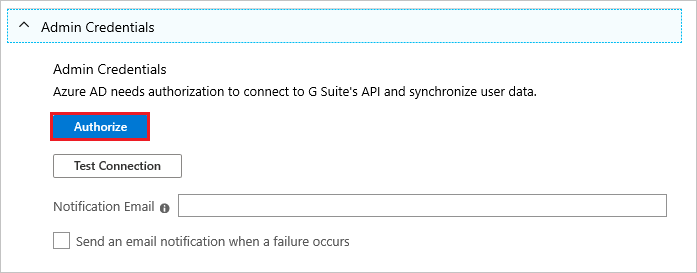
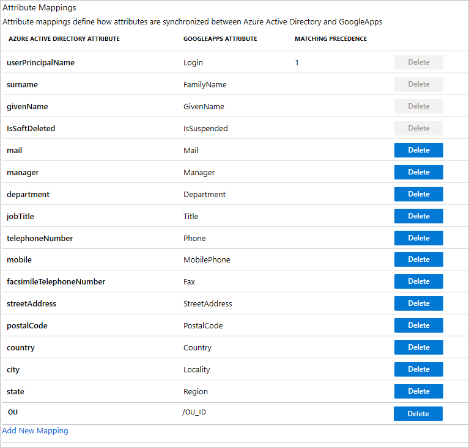

# Tutorial: Configure G Suite for automatic user provisioning

The objective of this tutorial is to demonstrate the steps to be performed in G Suite and Azure Active Directory (Azure AD) to configure Azure AD to automatically provision and de-provision users and/or groups to G Suite.

> [!NOTE]
> This tutorial describes a connector built on top of the Azure AD User Provisioning Service. For important details on what this service does, how it works, and frequently asked questions, see [Automate user provisioning and deprovisioning to SaaS applications with Azure Active Directory](../manage-apps/user-provisioning.md).

> [!NOTE]
> The G Suite connector was recently updated on October 2019. Changes made to the G Suite connector include:
- Added support for additional G Suite user and group attributes. 
- Updated G Suite target attribute names to match what is defined [here](/azure/active-directory/manage-apps/customize-application-attributes).
- Updated default attribute mappings.

## Prerequisites

To configure Azure AD integration with G Suite, you need the following items:

- An Azure AD tenant
- [A G Suite tenant](https://gsuite.google.com/pricing.html)
- A user account on a G Suite with Admin permissions.

## Assign users to G Suite

Azure Active Directory uses a concept called assignments to determine which users should receive access to selected apps. In the context of automatic user provisioning, only the users and/or groups that have been assigned to an application in Azure AD are synchronized.

Before configuring and enabling automatic user provisioning, you should decide which users and/or groups in Azure AD need access to G Suite. Once decided, you can assign these users and/or groups to G Suite by following the instructions here:

* [Assign a user or group to an enterprise app](../manage-apps/assign-user-or-group-access-portal.md)

### Important tips for assigning users to G Suite

* It is recommended that a single Azure AD user is assigned to G Suite to test the automatic user provisioning configuration. Additional users and/or groups may be assigned later.

* When assigning a user to G Suite, you must select any valid application-specific role (if available) in the assignment dialog. Users with the **Default Access** role are excluded from provisioning.

## Setup G Suite for provisioning

Before configuring G Suite for automatic user provisioning with Azure AD, you will need to enable SCIM provisioning on G Suite.

1. Sign in to the [G Suite Admin console](https://admin.google.com/) with your administrator account, and then select **Security**. If you don't see the link, it might be hidden under the **More Controls** menu at the bottom of the screen.

    ![Select security.][10]

2. On the **Security** page, select **API Reference**.

    ![Select API Reference.][15]

3. Select **Enable API access**.

    ![Select API Reference.][16]

   > [!IMPORTANT]
   > For every user that you intend to provision to G Suite, their user name in Azure AD **must** be tied to a custom domain. For example, user names that look like bob@contoso.onmicrosoft.com are not accepted by G Suite. On the other hand, bob@contoso.com is accepted. You can change an existing user's domain by following the instructions [here](https://docs.microsoft.com/azure/active-directory/fundamentals/add-custom-domain).

4.  Once you have added and verified your desired custom domains with Azure AD, you must verify them again with G Suite. To verify domains in G Suite, refer to the following steps:

    a. In the [G Suite Admin Console](https://admin.google.com/), select **Domains**.

    ![Select Domains][20]

    b. Select **Add a domain or a domain alias**.

    ![Add a new domain][21]

    c. Select **Add another domain**, and then type in the name of the domain that you want to add.

    ![Type in your domain name][22]

    d. Select **Continue and verify domain ownership**. Then follow the steps to verify that you own the domain name. For comprehensive instructions on how to verify your domain with Google, see [Verify your site ownership](https://support.google.com/webmasters/answer/35179).

    e. Repeat the preceding steps for any additional domains that you intend to add to G Suite.

5. Next, determine which admin account you want to use to manage user provisioning in G Suite. Navigate to **Admin Roles**.

    ![Select Google Apps][26]
    
6. For the **Admin role** of that account, edit the **Privileges** for that role. Make sure to enable all **Admin API Privileges** so that this account can be used for provisioning.

    ![Select Google Apps][27]

## Add G Suite from the gallery

To configure G Suite for automatic user provisioning with Azure AD, you will need to add G Suite from the Azure AD application gallery to your list of managed SaaS applications. 

1. In the **[Azure portal](https://portal.azure.com)**, in the left navigation panel, select **Azure Active Directory**.

	

2. Go to **Enterprise applications**, and then select **All applications**.

	

3. To add a new application, select the **New application** button at the top of the pane.

	

4. In the search box, enter **G Suite**, select **G Suite** in the results panel, and then click the **Add** button to add the application.

	

## Configuring automatic user provisioning to G Suite 

This section guides you through the steps to configure the Azure AD provisioning service to create, update, and disable users and/or groups in G Suite based on user and/or group assignments in Azure AD.

> [!TIP]
> You may also choose to enable SAML-based single sign-on for G Suite , following the instructions provided in the [G Suite Single sign-on tutorial](https://docs.microsoft.com/azure/active-directory/saas-apps/google-apps-tutorial). Single sign-on can be configured independently of automatic user provisioning, though these two features compliment each other.

### To configure automatic user provisioning for G Suite in Azure AD:

1. Sign in to the [Azure portal](https://portal.azure.com). Select **Enterprise Applications**, then select **All applications**.

	

2. In the applications list, select **G Suite**.

	

3. Select the **Provisioning** tab.

	

4. Set the **Provisioning Mode** to **Automatic**.

	

5. Under the **Admin Credentials** section, select **Authorize**. It opens a Google authorization dialog box in a new browser window.

    

6. Confirm that you want to give Azure AD permissions to make changes to your G Suite tenant. Select **Accept**.

    ![Confirm permissions.][28]

7. In the Azure portal, select **Test Connection** to ensure that Azure AD can connect to your app. If the connection fails, ensure that your G Suite account has Team Admin permissions. Then try the **Authorize** step again.

8. In the **Notification Email** field, enter the email address of a person or group who should receive the provisioning error notifications and check the checkbox - **Send an email notification when a failure occurs**.

	

8. Click **Save**.

9. Under the **Mappings** section, select **Synchronize Azure Active Directory Users to G Suite**.

	

10. Review the user attributes that are synchronized from Azure AD to G Suite in the **Attribute Mapping** section. The attributes selected as **Matching** properties are used to match the user accounts in G Suite for update operations. Select the **Save** button to commit any changes.

	

11. Under the **Mappings** section, select **Synchronize Azure Active Directory Groups to G Suite**.

	

12. Review the group attributes that are synchronized from Azure AD to G Suite in the **Attribute Mapping** section. The attributes selected as **Matching** properties are used to match the groups in G Suite for update operations. Select the **Save** button to commit any changes.

    

13. To configure scoping filters, refer to the following instructions provided in the [Scoping filter tutorial](../manage-apps/define-conditional-rules-for-provisioning-user-accounts.md).

14. To enable the Azure AD provisioning service for G Suite, change the **Provisioning Status** to **On** in the **Settings** section.

	

15. Define the users and/or groups that you would like to provision to G Suite by choosing the desired values in **Scope** in the **Settings** section.

	

16. When you are ready to provision, click **Save**.

	

This operation starts the initial synchronization of all users and/or groups defined in **Scope** in the **Settings** section. The initial sync takes longer to perform than subsequent syncs, which occur approximately every 40 minutes as long as the Azure AD provisioning service is running. You can use the **Synchronization Details** section to monitor progress and follow links to provisioning activity report, which describes all actions performed by the Azure AD provisioning service on G Suite.

For more information on how to read the Azure AD provisioning logs, see [Reporting on automatic user account provisioning](../manage-apps/check-status-user-account-provisioning.md).

> [!NOTE]
> Another viable option for automating user provisioning to G Suite is to use [Google Cloud Directory Sync](https://support.google.com/a/answer/106368?hl=en). This option provisions your on-premises Active Directory identities to G Suite.

## Additional resources

* [Managing user account provisioning for Enterprise Apps](../manage-apps/configure-automatic-user-provisioning-portal.md)
* [What is application access and single sign-on with Azure Active Directory?](../manage-apps/what-is-single-sign-on.md)

## Next steps

* [Learn how to review logs and get reports on provisioning activity](../manage-apps/check-status-user-account-provisioning.md)

<!--Image references-->

[10]: ./media/google-apps-provisioning-tutorial/gapps-security.png
[15]: ./media/google-apps-provisioning-tutorial/gapps-api.png
[16]: ./media/google-apps-provisioning-tutorial/gapps-api-enabled.png
[20]: ./media/google-apps-provisioning-tutorial/gapps-domains.png
[21]: ./media/google-apps-provisioning-tutorial/gapps-add-domain.png
[22]: ./media/google-apps-provisioning-tutorial/gapps-add-another.png
[24]: ./media/google-apps-provisioning-tutorial/gapps-provisioning.png
[25]: ./media/google-apps-provisioning-tutorial/gapps-provisioning-auth.png
[26]: ./media/google-apps-provisioning-tutorial/gapps-admin.png
[27]: ./media/google-apps-provisioning-tutorial/gapps-admin-privileges.png
[28]: ./media/google-apps-provisioning-tutorial/gapps-auth.png
