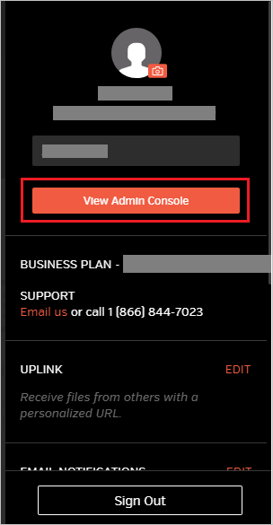
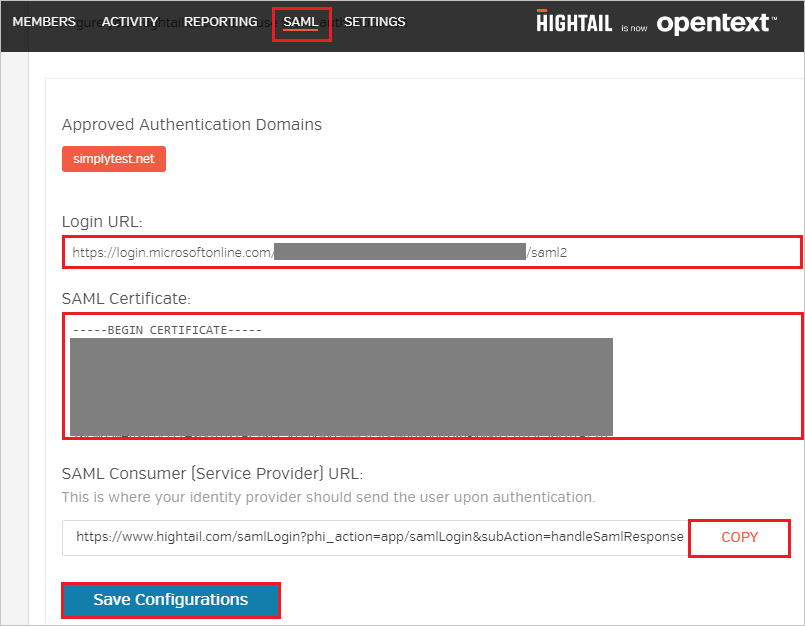

# Tutorial: Azure Active Directory single sign-on (SSO) integration with Hightail

In this tutorial, you'll learn how to integrate Hightail with Azure Active Directory (Azure AD). When you integrate Hightail with Azure AD, you can:

* Control in Azure AD who has access to Hightail.
* Enable your users to be automatically signed-in to Hightail with their Azure AD accounts.
* Manage your accounts in one central location - the Azure portal.

To learn more about SaaS app integration with Azure AD, see [What is application access and single sign-on with Azure Active Directory](../manage-apps/what-is-single-sign-on.md).

## Prerequisites

To get started, you need the following items:

* An Azure AD subscription. If you don't have a subscription, you can get a [free account](https://azure.microsoft.com/free/).
* Hightail single sign-on (SSO) enabled subscription.

## Scenario description

In this tutorial, you configure and test Azure AD SSO in a test environment.

* Hightail supports **SP and IDP** initiated SSO
* Hightail supports **Just In Time** user provisioning

> [!NOTE]
> Identifier of this application is a fixed string value so only one instance can be configured in one tenant.

## Adding Hightail from the gallery

To configure the integration of Hightail into Azure AD, you need to add Hightail from the gallery to your list of managed SaaS apps.

1. Sign in to the [Azure portal](https://portal.azure.com) using either a work or school account, or a personal Microsoft account.
1. On the left navigation pane, select the **Azure Active Directory** service.
1. Navigate to **Enterprise Applications** and then select **All Applications**.
1. To add new application, select **New application**.
1. In the **Add from the gallery** section, type **Hightail** in the search box.
1. Select **Hightail** from results panel and then add the app. Wait a few seconds while the app is added to your tenant.

## Configure and test Azure AD single sign-on for Hightail

Configure and test Azure AD SSO with Hightail using a test user called **B.Simon**. For SSO to work, you need to establish a link relationship between an Azure AD user and the related user in Hightail.

To configure and test Azure AD SSO with Hightail, complete the following building blocks:

1. **[Configure Azure AD SSO](#configure-azure-ad-sso)** - to enable your users to use this feature.
    * **[Create an Azure AD test user](#create-an-azure-ad-test-user)** - to test Azure AD single sign-on with B.Simon.
    * **[Assign the Azure AD test user](#assign-the-azure-ad-test-user)** - to enable B.Simon to use Azure AD single sign-on.
1. **[Configure Hightail SSO](#configure-hightail-sso)** - to configure the single sign-on settings on application side.
    * **[Create Hightail test user](#create-hightail-test-user)** - to have a counterpart of B.Simon in Hightail that is linked to the Azure AD representation of user.
1. **[Test SSO](#test-sso)** - to verify whether the configuration works.

## Configure Azure AD SSO

Follow these steps to enable Azure AD SSO in the Azure portal.

1. In the [Azure portal](https://portal.azure.com/), on the **Hightail** application integration page, find the **Manage** section and select **single sign-on**.
1. On the **Select a single sign-on method** page, select **SAML**.
1. On the **Set up single sign-on with SAML** page, click the edit/pen icon for **Basic SAML Configuration** to edit the settings.

   

1. On the **Basic SAML Configuration** section, if you wish to configure the application in **IDP** initiated mode, enter the values for the following fields:

    In the **Reply URL** text box, type a URL:
    `https://www.hightail.com/samlLogin?phi_action=app/samlLogin&subAction=handleSamlResponse`

1. Click **Set additional URLs** and perform the following step if you wish to configure the application in **SP** initiated mode:

    In the **Sign-on URL** text box, type a URL:
    `https://www.hightail.com/loginSSO`

1. Hightail application expects the SAML assertions in a specific format, which requires you to add custom attribute mappings to your SAML token attributes configuration. The following screenshot shows the list of default attributes.

	

1. In addition to above, Hightail application expects few more attributes to be passed back in SAML response which are shown below. These attributes are also pre populated but you can review them as per your requirements.

	| Name | Source Attribute|
	| -------- |-------- |
	| FirstName | user.givenname |
	| LastName | user.surname |
	| Email | user.mail |
	| UserIdentity | user.mail |

1. On the **Set up single sign-on with SAML** page, in the **SAML Signing Certificate** section,  find **Certificate (Base64)** and select **Download** to download the certificate and save it on your computer.

	

1. On the **Set up Hightail** section, copy the appropriate URL(s) based on your requirement.

	

> [!NOTE]
> Before configuring the Single Sign On at Hightail app, please add your email domain to the allowed list with Hightail team so that all the users who are using this domain can use Single Sign On functionality.

### Create an Azure AD test user

In this section, you'll create a test user in the Azure portal called B.Simon.

1. From the left pane in the Azure portal, select **Azure Active Directory**, select **Users**, and then select **All users**.
1. Select **New user** at the top of the screen.
1. In the **User** properties, follow these steps:
   1. In the **Name** field, enter `B.Simon`.  
   1. In the **User name** field, enter the username@companydomain.extension. For example, `B.Simon@contoso.com`.
   1. Select the **Show password** check box, and then write down the value that's displayed in the **Password** box.
   1. Click **Create**.

### Assign the Azure AD test user

In this section, you'll enable B.Simon to use Azure single sign-on by granting access to Hightail.

1. In the Azure portal, select **Enterprise Applications**, and then select **All applications**.
1. In the applications list, select **Hightail**.
1. In the app's overview page, find the **Manage** section and select **Users and groups**.

   

1. Select **Add user**, then select **Users and groups** in the **Add Assignment** dialog.

	

1. In the **Users and groups** dialog, select **B.Simon** from the Users list, then click the **Select** button at the bottom of the screen.
1. If you're expecting any role value in the SAML assertion, in the **Select Role** dialog, select the appropriate role for the user from the list and then click the **Select** button at the bottom of the screen.
1. In the **Add Assignment** dialog, click the **Assign** button.

## Configure Hightail SSO

1. To automate the configuration within Hightail, you need to install **My Apps Secure Sign-in browser extension** by clicking **Install the extension**.

	

1. After adding extension to the browser, click on **Set up Hightail** will direct you to the Hightail application. From there, provide the admin credentials to sign into Hightail. The browser extension will automatically configure the application for you and automate steps 3-6.

	

1. If you want to setup Hightail manually, in another browser window, open the **Hightail** admin portal.

1. Click on **User icon** from the top right corner of the page. 

	

1. Click **View Admin Console** tab.

	

1. In the menu on the top, click the **SAML** tab and perform the following steps:

	

	a. In the **Login URL** textbox, paste the value of **Login URL** copied from Azure portal.

    b. Open your base-64 encoded certificate in notepad downloaded from Azure portal, copy the content of it into your clipboard, and then paste it to the **SAML Certificate** textbox.

	c. Click **COPY** to copy the SAML consumer URL for your instance and paste it in **Reply URL** textbox in **Basic SAML Configuration** section on Azure portal.

    d. Click **Save Configurations**.

### Create Hightail test user

In this section, a user called Britta Simon is created in Hightail. Hightail supports just-in-time user provisioning, which is enabled by default. There is no action item for you in this section. If a user doesn't already exist in Hightail, a new one is created after authentication.

> [!NOTE]
> If you need to create a user manually, you need to contact the [Hightail support team](mailto:support@hightail.com).

## Test SSO 

In this section, you test your Azure AD single sign-on configuration using the Access Panel.

When you click the Hightail tile in the Access Panel, you should be automatically signed in to the Hightail for which you set up SSO. For more information about the Access Panel, see [Introduction to the Access Panel](../user-help/my-apps-portal-end-user-access.md).

## Additional resources

- [ List of Tutorials on How to Integrate SaaS Apps with Azure Active Directory ](./tutorial-list.md)

- [What is application access and single sign-on with Azure Active Directory? ](../manage-apps/what-is-single-sign-on.md)

- [What is conditional access in Azure Active Directory?](../conditional-access/overview.md)

- [Try Hightail with Azure AD](https://aad.portal.azure.com/)