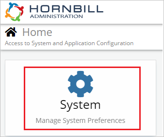
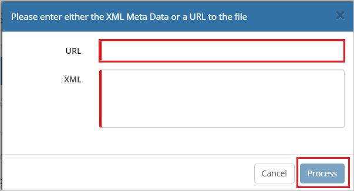
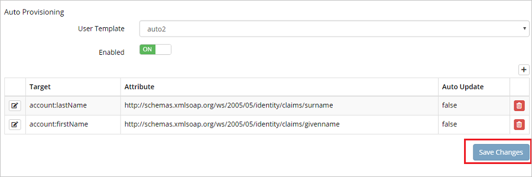

# Tutorial: Azure Active Directory integration with Hornbill

In this tutorial, you learn how to integrate Hornbill with Azure Active Directory (Azure AD).
Integrating Hornbill with Azure AD provides you with the following benefits:

* You can control in Azure AD who has access to Hornbill.
* You can enable your users to be automatically signed-in to Hornbill (Single Sign-On) with their Azure AD accounts.
* You can manage your accounts in one central location - the Azure portal.

If you want to know more details about SaaS app integration with Azure AD, see [What is application access and single sign-on with Azure Active Directory](https://docs.microsoft.com/azure/active-directory/active-directory-appssoaccess-whatis).
If you don't have an Azure subscription, [create a free account](https://azure.microsoft.com/free/) before you begin.

## Prerequisites

To configure Azure AD integration with Hornbill, you need the following items:

* An Azure AD subscription. If you don't have an Azure AD environment, you can get one-month trial [here](https://azure.microsoft.com/pricing/free-trial/)
* Hornbill single sign-on enabled subscription

## Scenario description

In this tutorial, you configure and test Azure AD single sign-on in a test environment.

* Hornbill supports **SP** initiated SSO
* Hornbill supports **Just In Time** user provisioning

## Adding Hornbill from the gallery

To configure the integration of Hornbill into Azure AD, you need to add Hornbill from the gallery to your list of managed SaaS apps.

**To add Hornbill from the gallery, perform the following steps:**

1. In the **[Azure portal](https://portal.azure.com)**, on the left navigation panel, click **Azure Active Directory** icon.

	

2. Navigate to **Enterprise Applications** and then select the **All Applications** option.

	

3. To add new application, click **New application** button on the top of dialog.

	

4. In the search box, type **Hornbill**, select **Hornbill** from result panel then click **Add** button to add the application.

	 

## Configure and test Azure AD single sign-on

In this section, you configure and test Azure AD single sign-on with Hornbill based on a test user called **Britta Simon**.
For single sign-on to work, a link relationship between an Azure AD user and the related user in Hornbill needs to be established.

To configure and test Azure AD single sign-on with Hornbill, you need to complete the following building blocks:

1. **[Configure Azure AD Single Sign-On](#configure-azure-ad-single-sign-on)** - to enable your users to use this feature.
2. **[Configure Hornbill Single Sign-On](#configure-hornbill-single-sign-on)** - to configure the Single Sign-On settings on application side.
3. **[Create an Azure AD test user](#create-an-azure-ad-test-user)** - to test Azure AD single sign-on with Britta Simon.
4. **[Assign the Azure AD test user](#assign-the-azure-ad-test-user)** - to enable Britta Simon to use Azure AD single sign-on.
5. **[Create Hornbill test user](#create-hornbill-test-user)** - to have a counterpart of Britta Simon in Hornbill that is linked to the Azure AD representation of user.
6. **[Test single sign-on](#test-single-sign-on)** - to verify whether the configuration works.

### Configure Azure AD single sign-on

In this section, you enable Azure AD single sign-on in the Azure portal.

To configure Azure AD single sign-on with Hornbill, perform the following steps:

1. In the [Azure portal](https://portal.azure.com/), on the **Hornbill** application integration page, select **Single sign-on**.

    

2. On the **Select a Single sign-on method** dialog, select **SAML/WS-Fed** mode to enable single sign-on.

    

3. On the **Set-up Single Sign-On with SAML** page, click **Edit** icon to open **Basic SAML Configuration** dialog.

	

4. On the **Basic SAML Configuration** section, perform the following steps:

    

	a. In the **Sign on URL** text box, type a URL using the following pattern:
    `https://<SUBDOMAIN>.hornbill.com/<INSTANCE_NAME>/`

    b. In the **Identifier (Entity ID)** text box, type a URL using the following pattern:
    `https://<SUBDOMAIN>.hornbill.com/<INSTANCE_NAME>/lib/saml/auth/simplesaml/module.php/saml/sp/metadata.php/saml`

	> [!NOTE]
	> These values are not real. Update these values with the actual Sign on URL and Identifier. Contact [Hornbill Client support team](https://www.hornbill.com/support/?request/) to get these values. You can also refer to the patterns shown in the **Basic SAML Configuration** section in the Azure portal.

5. On the **Set up Single Sign-On with SAML** page, In the **SAML Signing Certificate** section, click copy button to copy **App Federation Metadata Url** and save it on your computer.

	

### Configure Hornbill Single Sign-On

1. In a different web browser window, log in to Hornbill as a Security Administrator.

2. On the Home page, click **System**.

	

3. Navigate to **Security**.

	

4. Click **SSO Profiles**.

	

5. On the right side of the page, click on **Add logo**.

	

6. On the **Profile Details** bar, click on **Import SAML Meta logo**.

	

7. On the Pop-up page in the **URL** text box, paste the **App Federation Metadata Url**, which you have copied from Azure portal and click **Process**.

	

8. After clicking process the values get auto populated automatically under **Profile Details** section.

	

	

	

9. Click **Save Changes**.

### Create an Azure AD test user

The objective of this section is to create a test user in the Azure portal called Britta Simon.

1. In the Azure portal, in the left pane, select **Azure Active Directory**, select **Users**, and then select **All users**.

    

2. Select **New user** at the top of the screen.

    

3. In the User properties, perform the following steps.

    

    a. In the **Name** field, enter **BrittaSimon**.
  
    b. In the **User name** field, type **brittasimon\@yourcompanydomain.extension**  
    For example, BrittaSimon@contoso.com

    c. Select **Show password** check box, and then write down the value that's displayed in the Password box.

    d. Click **Create**.

### Assign the Azure AD test user

In this section, you enable Britta Simon to use Azure single sign-on by granting access to Hornbill.

1. In the Azure portal, select **Enterprise Applications**, select **All applications**, then select **Hornbill**.

	

2. In the applications list, select **Hornbill**.

	

3. In the menu on the left, select **Users and groups**.

    

4. Click the **Add user** button, then select **Users and groups** in the **Add Assignment** dialog.

    

5. In the **Users and groups** dialog, select **Britta Simon** in the Users list, then click the **Select** button at the bottom of the screen.

6. If you are expecting any role value in the SAML assertion then in the **Select Role** dialog select the appropriate role for the user from the list, then click the **Select** button at the bottom of the screen.

7. In the **Add Assignment** dialog, click the **Assign** button.

### Create Hornbill test user

In this section, a user called Britta Simon is created in Hornbill. Hornbill supports just-in-time user provisioning, which is enabled by default. There is no action item for you in this section. If a user doesn't already exist in Hornbill, a new one is created after authentication.

> [!Note]
> If you need to create a user manually, contact [Hornbill Client support team](https://www.hornbill.com/support/?request/).

### Test single sign-on

In this section, you test your Azure AD single sign-on configuration using the Access Panel.

When you click the Hornbill tile in the Access Panel, you should be automatically signed in to the Hornbill for which you set up SSO. For more information about the Access Panel, see [Introduction to the Access Panel](https://docs.microsoft.com/azure/active-directory/active-directory-saas-access-panel-introduction).

## Additional Resources

- [List of Tutorials on How to Integrate SaaS Apps with Azure Active Directory](https://docs.microsoft.com/azure/active-directory/active-directory-saas-tutorial-list)

- [What is application access and single sign-on with Azure Active Directory?](https://docs.microsoft.com/azure/active-directory/active-directory-appssoaccess-whatis)

- [What is conditional access in Azure Active Directory?](https://docs.microsoft.com/azure/active-directory/conditional-access/overview)

