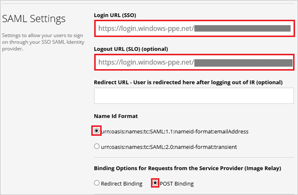
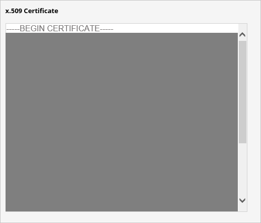
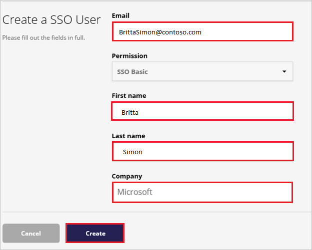

# Tutorial: Azure Active Directory integration with Image Relay

In this tutorial, you learn how to integrate Image Relay with Azure Active Directory (Azure AD).
Integrating Image Relay with Azure AD provides you with the following benefits:

* You can control in Azure AD who has access to Image Relay.
* You can enable your users to be automatically signed-in to Image Relay (Single Sign-On) with their Azure AD accounts.
* You can manage your accounts in one central location - the Azure portal.

If you want to know more details about SaaS app integration with Azure AD, see [What is application access and single sign-on with Azure Active Directory](https://docs.microsoft.com/azure/active-directory/active-directory-appssoaccess-whatis).
If you don't have an Azure subscription, [create a free account](https://azure.microsoft.com/free/) before you begin.

## Prerequisites

To configure Azure AD integration with Image Relay, you need the following items:

* An Azure AD subscription. If you don't have an Azure AD environment, you can get one-month trial [here](https://azure.microsoft.com/pricing/free-trial/)
* Image Relay single sign-on enabled subscription

## Scenario description

In this tutorial, you configure and test Azure AD single sign-on in a test environment.

* Image Relay supports **SP** initiated SSO

## Adding Image Relay from the gallery

To configure the integration of Image Relay into Azure AD, you need to add Image Relay from the gallery to your list of managed SaaS apps.

**To add Image Relay from the gallery, perform the following steps:**

1. In the **[Azure portal](https://portal.azure.com)**, on the left navigation panel, click **Azure Active Directory** icon.

	

2. Navigate to **Enterprise Applications** and then select the **All Applications** option.

	

3. To add new application, click **New application** button on the top of dialog.

	

4. In the search box, type **Image Relay**, select **Image Relay** from result panel then click **Add** button to add the application.

	

## Configure and test Azure AD single sign-on

In this section, you configure and test Azure AD single sign-on with Image Relay based on a test user called **Britta Simon**.
For single sign-on to work, a link relationship between an Azure AD user and the related user in Image Relay needs to be established.

To configure and test Azure AD single sign-on with Image Relay, you need to complete the following building blocks:

1. **[Configure Azure AD Single Sign-On](#configure-azure-ad-single-sign-on)** - to enable your users to use this feature.
2. **[Configure Image Relay Single Sign-On](#configure-image-relay-single-sign-on)** - to configure the Single Sign-On settings on application side.
3. **[Create an Azure AD test user](#create-an-azure-ad-test-user)** - to test Azure AD single sign-on with Britta Simon.
4. **[Assign the Azure AD test user](#assign-the-azure-ad-test-user)** - to enable Britta Simon to use Azure AD single sign-on.
5. **[Create Image Relay test user](#create-image-relay-test-user)** - to have a counterpart of Britta Simon in Image Relay that is linked to the Azure AD representation of user.
6. **[Test single sign-on](#test-single-sign-on)** - to verify whether the configuration works.

### Configure Azure AD single sign-on

In this section, you enable Azure AD single sign-on in the Azure portal.

To configure Azure AD single sign-on with Image Relay, perform the following steps:

1. In the [Azure portal](https://portal.azure.com/), on the **Image Relay** application integration page, select **Single sign-on**.

    

2. On the **Select a Single sign-on method** dialog, select **SAML/WS-Fed** mode to enable single sign-on.

    

3. On the **Set up Single Sign-On with SAML** page, click **Edit** icon to open **Basic SAML Configuration** dialog.

	

4. On the **Basic SAML Configuration** section, perform the following steps:

    

	a. In the **Sign on URL** text box, type a URL using the following pattern:
    `https://<companyname>.imagerelay.com/`

    b. In the **Identifier (Entity ID)** text box, type a URL using the following pattern:
    `https://<companyname>.imagerelay.com/sso/metadata`

	> [!NOTE]
	> These values are not real. Update these values with the actual Sign on URL and Identifier. Contact [Image Relay Client support team](http://support.imagerelay.com/) to get these values. You can also refer to the patterns shown in the **Basic SAML Configuration** section in the Azure portal.

4. On the **Set up Single Sign-On with SAML** page, in the **SAML Signing Certificate** section, click **Download** to download the **Certificate (Base64)** from the given options as per your requirement and save it on your computer.

	

6. On the **Set up Image Relay** section, copy the appropriate URL(s) as per your requirement.

	

	a. Login URL

	b. Azure Ad Identifier

	c. Logout URL

### Configure Image Relay Single Sign-On

1. In another browser window, sign in to your Image Relay company site as an administrator.

2. In the toolbar on the top, click the **Users & Permissions** workload.

     

3. Click **Create New Permission**.

    

4. In the **Single Sign On Settings** workload, select the **This Group can only sign-in via Single Sign On** check box, and then click **Save**.

     

5. Go to **Account Settings**.

     

6. Go to the **Single Sign On Settings** workload.

    

7. On the **SAML Settings** dialog, perform the following steps:

	

    a. In **Login URL** textbox, paste the value of **Login URL** which you have copied from Azure portal.

    b. In **Logout URL**  textbox, paste the value of **Logout URL** which you have copied from Azure portal.

    c. As **Name Id Format**, select **urn:oasis:names:tc:SAML:1.1:nameid-format:emailAddress**.

    d. As **Binding Options for Requests from the Service Provider (Image Relay)**, select **POST Binding**.

    e. Under **x.509 Certificate**, click **Update Certificate**.

    

    f. Open the downloaded certificate in notepad, copy the content, and then paste it into the **x.509 Certificate** textbox.

    

    g. In **Just-In-Time User Provisioning** section, select the **Enable Just-In-Time User Provisioning**.

    

    h. Select the permission group (for example, **SSO Basic**) which is allowed to sign in only through single sign-on.

    

    i. Click **Save**.

### Create an Azure AD test user

The objective of this section is to create a test user in the Azure portal called Britta Simon.

1. In the Azure portal, in the left pane, select **Azure Active Directory**, select **Users**, and then select **All users**.

    

2. Select **New user** at the top of the screen.

    

3. In the User properties, perform the following steps.

    

    a. In the **Name** field enter **BrittaSimon**.
  
    b. In the **User name** field type **brittasimon\@yourcompanydomain.extension**  
    For example, BrittaSimon@contoso.com

    c. Select **Show password** check box, and then write down the value that's displayed in the Password box.

    d. Click **Create**.

### Assign the Azure AD test user

In this section, you enable Britta Simon to use Azure single sign-on by granting access to Image Relay.

1. In the Azure portal, select **Enterprise Applications**, select **All applications**, then select **Image Relay**.

	

2. In the applications list, select **Image Relay**.

	

3. In the menu on the left, select **Users and groups**.

    

4. Click the **Add user** button, then select **Users and groups** in the **Add Assignment** dialog.

    

5. In the **Users and groups** dialog select **Britta Simon** in the Users list, then click the **Select** button at the bottom of the screen.

6. If you are expecting any role value in the SAML assertion then in the **Select Role** dialog select the appropriate role for the user from the list, then click the **Select** button at the bottom of the screen.

7. In the **Add Assignment** dialog click the **Assign** button.

### Create Image Relay test user

The objective of this section is to create a user called Britta Simon in Image Relay.

**To create a user called Britta Simon in Image Relay, perform the following steps:**

1. Sign-on to your Image Relay company site as an administrator.

2. Go to **Users & Permissions**     and select **Create SSO User**.

     

3. Enter the **Email**, **First Name**, **Last Name**, and **Company** of the user you want to provision and select the permission group (for example, SSO Basic) which is the group that can sign in only through single sign-on.

    

4. Click **Create**.

### Test single sign-on

In this section, you test your Azure AD single sign-on configuration using the Access Panel.

When you click the Image Relay tile in the Access Panel, you should be automatically signed in to the Image Relay for which you set up SSO. For more information about the Access Panel, see [Introduction to the Access Panel](https://docs.microsoft.com/azure/active-directory/active-directory-saas-access-panel-introduction).

## Additional Resources

- [List of Tutorials on How to Integrate SaaS Apps with Azure Active Directory](https://docs.microsoft.com/azure/active-directory/active-directory-saas-tutorial-list)

- [What is application access and single sign-on with Azure Active Directory?](https://docs.microsoft.com/azure/active-directory/active-directory-appssoaccess-whatis)

- [What is conditional access in Azure Active Directory?](https://docs.microsoft.com/azure/active-directory/conditional-access/overview)