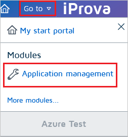
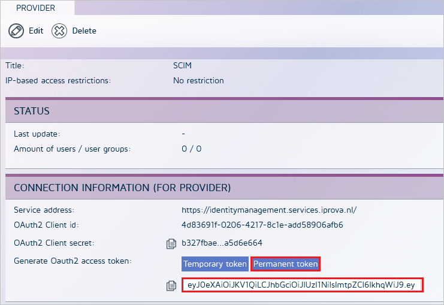

# Tutorial: Configure iProva for automatic user provisioning

The objective of this tutorial is to demonstrate the steps to be performed in iProva and Azure Active Directory (Azure AD) to configure Azure AD to automatically provision and de-provision users and/or groups to [iProva](https://www.iProva.com/). For important details on what this service does, how it works, and frequently asked questions, see [Automate user provisioning and deprovisioning to SaaS applications with Azure Active Directory](../app-provisioning/user-provisioning.md). 

> [!NOTE]
> This connector is currently in Public Preview. For more information on the general Microsoft Azure terms of use for Preview features, see [Supplemental Terms of Use for Microsoft Azure Previews](https://azure.microsoft.com/support/legal/preview-supplemental-terms/).

## Capabilities supported
> [!div class="checklist"]
> * Create users in iProva
> * Remove users in iProva when they do not require access anymore
> * Keep user attributes synchronized between Azure AD and iProva
> * Provision groups and group memberships in iProva
> * [Single sign-on](./iprova-tutorial.md) to iProva (recommended)

## Prerequisites

The scenario outlined in this tutorial assumes that you already have the following prerequisites:

* [An Azure AD tenant](../develop/quickstart-create-new-tenant.md).
* A user account in Azure AD with [permission](../users-groups-roles/directory-assign-admin-roles.md) to configure provisioning (e.g. Application Administrator, Cloud Application administrator, Application Owner, or Global Administrator).
* [An iProva tenant](https://www.iProva.com/).
* A user account in iProva with Admin permissions.

## Step 1. Plan your provisioning deployment
1. Learn about [how the provisioning service works](../app-provisioning/user-provisioning.md).
2. Determine who will be in [scope for provisioning](../app-provisioning/define-conditional-rules-for-provisioning-user-accounts.md).
3. Determine what data to [map between Azure AD and iProva](../app-provisioning/customize-application-attributes.md). 

## Step 2. Configure iProva to support provisioning with Azure AD

1. Sign in to your [iProva Admin Console](https://www.iProva.com/). Navigate to **Go to > Application Management**.

	

2.	Click on **External user management**.

	

3. To add a new provider, Click on the **plus** icon. In the new **Add provider** dialog box, provide a **Title**. You can choose to add **IP-based access restriction**. Click on **OK** button.

	

	

4.	Click on **Permanent token** button. Copy the **Permanent token** and save it as this will be the only time you can view it. This value will be entered in the Secret Token field in the Provisioning tab of your iProva application in the Azure portal.

	

## Step 3. Add iProva from the Azure AD application gallery

Add iProva from the Azure AD application gallery to start managing provisioning to iProva. If you have previously setup iProva for SSO you can use the same application. However it is recommended that you create a separate app when testing out the integration initially. Learn more about adding an application from the gallery [here](../manage-apps/add-application-portal.md). 

## Step 4. Define who will be in scope for provisioning 

The Azure AD provisioning service allows you to scope who will be provisioned based on assignment to the application and or based on attributes of the user / group. If you choose to scope who will be provisioned to your app based on assignment, you can use the following [steps](../manage-apps/assign-user-or-group-access-portal.md) to assign users and groups to the application. If you choose to scope who will be provisioned based solely on attributes of the user or group, you can use a scoping filter as described [here](../app-provisioning/define-conditional-rules-for-provisioning-user-accounts.md). 

* When assigning users and groups to iProva, you must select a role other than **Default Access**. Users with the Default Access role are excluded from provisioning and will be marked as not effectively entitled in the provisioning logs. If the only role available on the application is the default access role, you can [update the application manifest](../develop/howto-add-app-roles-in-azure-ad-apps.md) to add additional roles. 

* Start small. Test with a small set of users and groups before rolling out to everyone. When scope for provisioning is set to assigned users and groups, you can control this by assigning one or two users or groups to the app. When scope is set to all users and groups, you can specify an [attribute based scoping filter](../app-provisioning/define-conditional-rules-for-provisioning-user-accounts.md). 

## Step 5. Configure automatic user provisioning to iProva 

This section guides you through the steps to configure the Azure AD provisioning service to create, update, and disable users and/or groups in iProva based on user and/or group assignments in Azure AD.

### To configure automatic user provisioning for iProva in Azure AD:

1. Sign in to the [Azure portal](https://portal.azure.com). Select **Enterprise Applications**, then select **All applications**.

	

2. In the applications list, select **iProva**.

	

3. Select the **Provisioning** tab.

	

4. Set the **Provisioning Mode** to **Automatic**.

	

5. Under the **Admin Credentials** section, input the **SCIM 2.0 base URL and Permanent Token** values retrieved earlier in the **Tenant URL** and **Secret Token** fields respectively. Click **Test Connection** to ensure Azure AD can connect to iProva. If the connection fails, ensure your iProva account has Admin permissions and try again.

	

6. In the **Notification Email** field, enter the email address of a person or group who should receive the provisioning error notifications and check the checkbox - **Send an email notification when a failure occurs**.

	

7. Click **Save**.

8. Under the **Mappings** section, select **Synchronize Azure Active Directory Users to iProva**.

9. Review the user attributes that are synchronized from Azure AD to iProva in the **Attribute Mapping** section. The attributes selected as **Matching** properties are used to match the user accounts in iProva for update operations. Select the **Save** button to commit any changes.

   |Attribute|Type|
   |---|---|
   |active|Boolean|
   |displayName|String|
   |title|String|
   |emails[type eq "work"].value|String|
   |preferredLanguage|String|
   |userName|String|
   |addresses[type eq "work"].country|String|
   |addresses[type eq "work"].locality|String|
   |addresses[type eq "work"].postalCode|String|
   |addresses[type eq "work"].formatted|String|
   |addresses[type eq "work"].region|String|
   |addresses[type eq "work"].streetAddress|String|
   |addresses[type eq "other"].formatted|String|
   |name.givenName|String|
   |name.familyName|String|
   |name.formatted|String|
   |phoneNumbers[type eq "fax"].value|String|
   |phoneNumbers[type eq "mobile"].value|String|
   |phoneNumbers[type eq "work"].value|String|
   |externalId|String|
   |roles[primary eq "True"].display|String|
   |roles[primary eq "True"].type|String|
   |roles[primary eq "True"].value|String|
   |urn:ietf:params:scim:schemas:extension:enterprise:2.0:User:department|String|
   |urn:ietf:params:scim:schemas:extension:enterprise:2.0:User:division|String|
   |urn:ietf:params:scim:schemas:extension:enterprise:2.0:User:costCenter|String|
   |urn:ietf:params:scim:schemas:extension:enterprise:2.0:User:organization|String|
   |urn:ietf:params:scim:schemas:extension:enterprise:2.0:User:employeeNumber|String|

10. Under the **Mappings** section, select **Synchronize Azure Active Directory Groups to iProva**.

11. Review the group attributes that are synchronized from Azure AD to iProva in the **Attribute Mapping** section. The attributes selected as **Matching** properties are used to match the groups in iProva for update operations. Select the **Save** button to commit any changes.

      |Attribute|Type|
      |---|---|
      |displayName|String|
      |members|Reference|

12. To configure scoping filters, refer to the following instructions provided in the [Scoping filter tutorial](../app-provisioning/define-conditional-rules-for-provisioning-user-accounts.md).

13. To enable the Azure AD provisioning service for iProva, change the **Provisioning Status** to **On** in the **Settings** section.

	

14. Define the users and/or groups that you would like to provision to iProva by choosing the desired values in **Scope** in the **Settings** section.

	

15. When you are ready to provision, click **Save**.

	

This operation starts the initial synchronization of all users and/or groups defined in **Scope** in the **Settings** section. The initial sync takes longer to perform than subsequent syncs, which occur approximately every 40 minutes as long as the Azure AD provisioning service is running. 

## Step 6. Monitor your deployment
Once you've configured provisioning, use the following resources to monitor your deployment:

1. Use the [provisioning logs](../reports-monitoring/concept-provisioning-logs.md) to determine which users have been provisioned successfully or unsuccessfully
2. Check the [progress bar](../app-provisioning/application-provisioning-when-will-provisioning-finish-specific-user.md) to see the status of the provisioning cycle and how close it is to completion
3. If the provisioning configuration seems to be in an unhealthy state, the application will go into quarantine. Learn more about quarantine states [here](../app-provisioning/application-provisioning-quarantine-status.md).  

## Change log

* 06/17/2020 - Enterprise extension attribute "Manager" has been removed.

## Additional resources

* [Managing user account provisioning for Enterprise Apps](../app-provisioning/configure-automatic-user-provisioning-portal.md)
* [What is application access and single sign-on with Azure Active Directory?](../manage-apps/what-is-single-sign-on.md)

## Next steps

* [Learn how to review logs and get reports on provisioning activity](../app-provisioning/check-status-user-account-provisioning.md)