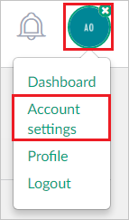
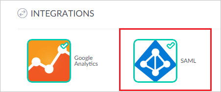
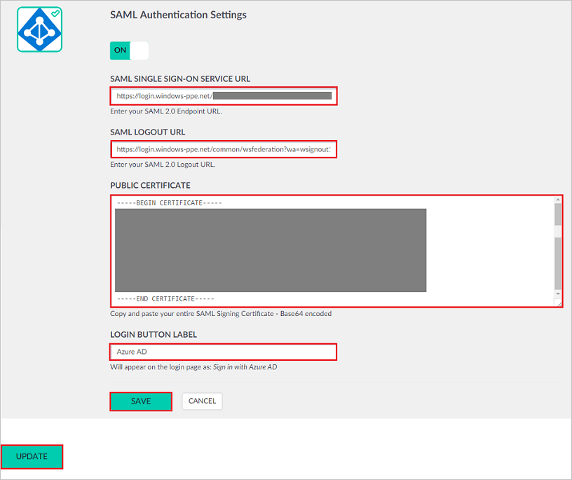
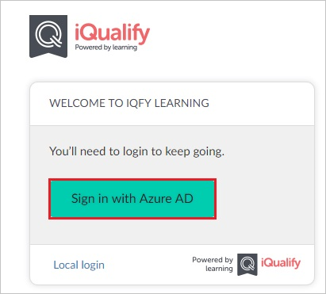

# Tutorial: Azure Active Directory integration with iQualify LMS

In this tutorial, you learn how to integrate iQualify LMS with Azure Active Directory (Azure AD).
Integrating iQualify LMS with Azure AD provides you with the following benefits:

* You can control in Azure AD who has access to iQualify LMS.
* You can enable your users to be automatically signed-in to iQualify LMS (Single Sign-On) with their Azure AD accounts.
* You can manage your accounts in one central location - the Azure portal.

If you want to know more details about SaaS app integration with Azure AD, see [What is application access and single sign-on with Azure Active Directory](https://docs.microsoft.com/azure/active-directory/active-directory-appssoaccess-whatis).
If you don't have an Azure subscription, [create a free account](https://azure.microsoft.com/free/) before you begin.

## Prerequisites

To configure Azure AD integration with iQualify LMS, you need the following items:

* An Azure AD subscription. If you don't have an Azure AD environment, you can get one-month trial [here](https://azure.microsoft.com/pricing/free-trial/)
* iQualify LMS single sign-on enabled subscription

## Scenario description

In this tutorial, you configure and test Azure AD single sign-on in a test environment.

* iQualify LMS supports **SP and IDP** initiated SSO
* iQualify LMS supports **Just In Time** user provisioning

## Adding iQualify LMS from the gallery

To configure the integration of iQualify LMS into Azure AD, you need to add iQualify LMS from the gallery to your list of managed SaaS apps.

**To add iQualify LMS from the gallery, perform the following steps:**

1. In the **[Azure portal](https://portal.azure.com)**, on the left navigation panel, click **Azure Active Directory** icon.

	

2. Navigate to **Enterprise Applications** and then select the **All Applications** option.

	

3. To add new application, click **New application** button on the top of dialog.

	

4. In the search box, type **iQualify LMS**, select **iQualify LMS** from result panel then click **Add** button to add the application.

	 

## Configure and test Azure AD single sign-on

In this section, you configure and test Azure AD single sign-on with iQualify LMS based on a test user called **Britta Simon**.
For single sign-on to work, a link relationship between an Azure AD user and the related user in iQualify LMS needs to be established.

To configure and test Azure AD single sign-on with iQualify LMS, you need to complete the following building blocks:

1. **[Configure Azure AD Single Sign-On](#configure-azure-ad-single-sign-on)** - to enable your users to use this feature.
2. **[Configure iQualify LMS Single Sign-On](#configure-iqualify-lms-single-sign-on)** - to configure the Single Sign-On settings on application side.
3. **[Create an Azure AD test user](#create-an-azure-ad-test-user)** - to test Azure AD single sign-on with Britta Simon.
4. **[Assign the Azure AD test user](#assign-the-azure-ad-test-user)** - to enable Britta Simon to use Azure AD single sign-on.
5. **[Create iQualify LMS test user](#create-iqualify-lms-test-user)** - to have a counterpart of Britta Simon in iQualify LMS that is linked to the Azure AD representation of user.
6. **[Test single sign-on](#test-single-sign-on)** - to verify whether the configuration works.

### Configure Azure AD single sign-on

In this section, you enable Azure AD single sign-on in the Azure portal.

To configure Azure AD single sign-on with iQualify LMS, perform the following steps:

1. In the [Azure portal](https://portal.azure.com/), on the **iQualify LMS** application integration page, select **Single sign-on**.

    

2. On the **Select a Single sign-on method** dialog, select **SAML/WS-Fed** mode to enable single sign-on.

    

3. On the **Set up Single Sign-On with SAML** page, click **Edit** icon to open **Basic SAML Configuration** dialog.

	

4. On the **Basic SAML Configuration** section, If you wish to configure the application in **IDP** initiated mode, perform the following steps:

    

    a. In the **Identifier** text box, type a URL using the following pattern:
	| |
	|--|--|
	| Production Environment: `https://<yourorg>.iqualify.com/`|
	| Test Environment: `https://<yourorg>.iqualify.io`|

    b. In the **Reply URL** text box, type a URL using the following pattern:
	| |
	|--|--|
	| Production Environment: `https://<yourorg>.iqualify.com/auth/saml2/callback` |
	| Test Environment: `https://<yourorg>.iqualify.io/auth/saml2/callback` |

5. Click **Set additional URLs** and perform the following step if you wish to configure the application in **SP** initiated mode:

    

    In the **Sign-on URL** text box, type a URL using the following pattern:
	| |
	|--|--|
	| Production Environment: `https://<yourorg>.iqualify.com/login` |
	| Test Environment: `https://<yourorg>.iqualify.io/login` |

	> [!NOTE]
	> These values are not real. Update these values with the actual Identifier, Reply URL and Sign-on URL. Contact [iQualify LMS Client support team](https://www.iqualify.com/) to get these values. You can also refer to the patterns shown in the **Basic SAML Configuration** section in the Azure portal.

6. Your iQualify LMS application expects the SAML assertions in a specific format, which requires you to add custom attribute mappings to your SAML token attributes configuration. The following screenshot shows the list of default attributes. Click **Edit** icon to open **User Attributes** dialog.

	

7. In the **User Claims** section on the **User Attributes** dialog, edit the claims by using **Edit icon** or add the claims by using **Add new claim** to configure SAML token attribute as shown in the image above and perform the following steps:

	| Name | Source Attribute|
	| --- | --- |
	| email | user.userprincipalname |
	| first_name | user.givenname |
	| last_name | user.surname |
	| person_id | "your attribute" |

	a. Click **Add new claim** to open the **Manage user claims** dialog.

	

	

	b. In the **Name** textbox, type the attribute name shown for that row.

	c. Leave the **Namespace** blank.

	d. Select Source as **Attribute**.

	e. From the **Source attribute** list, type the attribute value shown for that row.

	f. Click **Ok**

	g. Click **Save**.

	> [!Note]
	> The **person_id** attribute is **Optional**

8. On the **Set up Single Sign-On with SAML** page, in the **SAML Signing Certificate** section, click **Download** to download the **Certificate (Base64)** from the given options as per your requirement and save it on your computer.

	

9. On the **Set up iQualify LMS** section, copy the appropriate URL(s) as per your requirement.

	

	a. Login URL

	b. Azure AD Identifier

	c. Logout URL

### Configure iQualify LMS Single Sign-On

1. Open a new browser window, and then sign in to your iQualify environment as an administrator.

1. Once you are logged in, click on your avatar at the top right, then click on **Account settings**

	

1. In the account settings area, click on the ribbon menu on the left and click on **INTEGRATIONS**

	

1. Under INTEGRATIONS, click on the **SAML** icon.

	

1. In the **SAML Authentication Settings** dialog box, perform the following steps:

    

	a. In the **SAML SINGLE SIGN-ON SERVICE URL** box, paste the **Login URL** value copied from the Azure AD application configuration window.

	b. In the **SAML LOGOUT URL** box, paste the **Logout URL** value copied from the Azure AD application configuration window.

	c. Open the downloaded certificate file in notepad, copy the content, and then paste it in the **PUBLIC CERTIFICATE** box.

	d. In **LOGIN BUTTON LABEL** enter the name for the button to be displayed on login page.

	e. Click **SAVE**.

	f. Click **UPDATE**.

### Create an Azure AD test user

The objective of this section is to create a test user in the Azure portal called Britta Simon.

1. In the Azure portal, in the left pane, select **Azure Active Directory**, select **Users**, and then select **All users**.

    

2. Select **New user** at the top of the screen.

    

3. In the User properties, perform the following steps.

    

    a. In the **Name** field enter **BrittaSimon**.
  
    b. In the **User name** field type **brittasimon@yourcompanydomain.extension**  
    For example, BrittaSimon@contoso.com

    c. Select **Show password** check box, and then write down the value that's displayed in the Password box.

    d. Click **Create**.

### Assign the Azure AD test user

In this section, you enable Britta Simon to use Azure single sign-on by granting access to iQualify LMS.

1. In the Azure portal, select **Enterprise Applications**, select **All applications**, then select **iQualify LMS**.

	

2. In the applications list, select **iQualify LMS**.

	

3. In the menu on the left, select **Users and groups**.

    

4. Click the **Add user** button, then select **Users and groups** in the **Add Assignment** dialog.

    

5. In the **Users and groups** dialog select **Britta Simon** in the Users list, then click the **Select** button at the bottom of the screen.

6. If you are expecting any role value in the SAML assertion then in the **Select Role** dialog select the appropriate role for the user from the list, then click the **Select** button at the bottom of the screen.

7. In the **Add Assignment** dialog click the **Assign** button.

### Create iQualify LMS test user

In this section, a user called Britta Simon is created in iQualify LMS. iQualify LMS supports just-in-time user provisioning, which is enabled by default. There is no action item for you in this section. If a user doesn't already exist in iQualify LMS, a new one is created after authentication.

### Test single sign-on

In this section, you test your Azure AD single sign-on configuration using the Access Panel.

When you click the iQualify LMS tile in the Access Panel, you should get login page of your iQualify LMS application. 

    

Click **Sign in with Azure AD** button and you should get automatically signed-on to your iQualify LMS application.

For more information about the Access Panel, see [Introduction to the Access Panel](../user-help/active-directory-saas-access-panel-introduction.md). 

## Additional Resources

- [List of Tutorials on How to Integrate SaaS Apps with Azure Active Directory](https://docs.microsoft.com/azure/active-directory/active-directory-saas-tutorial-list)

- [What is application access and single sign-on with Azure Active Directory?](https://docs.microsoft.com/azure/active-directory/active-directory-appssoaccess-whatis)

- [What is Conditional Access in Azure Active Directory?](https://docs.microsoft.com/azure/active-directory/conditional-access/overview)