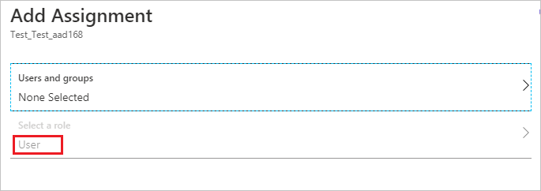
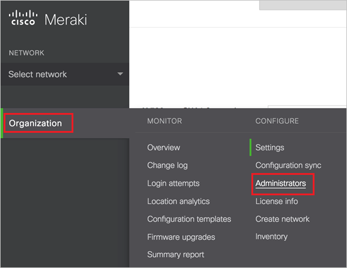
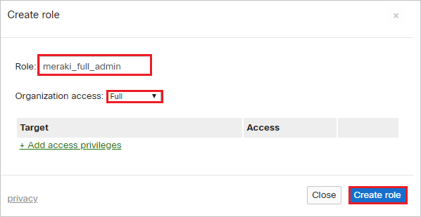

# Tutorial: Azure Active Directory single sign-on (SSO) integration with Meraki Dashboard

In this tutorial, you'll learn how to integrate Meraki Dashboard with Azure Active Directory (Azure AD). When you integrate Meraki Dashboard with Azure AD, you can:

* Control in Azure AD who has access to Meraki Dashboard.
* Enable your users to be automatically signed-in to Meraki Dashboard with their Azure AD accounts.
* Manage your accounts in one central location - the Azure portal.

## Prerequisites

To get started, you need the following items:

* An Azure AD subscription. If you don't have a subscription, you can get a [free account](https://azure.microsoft.com/free/).
* Meraki Dashboard single sign-on (SSO) enabled subscription.

## Scenario description

In this tutorial, you configure and test Azure AD SSO in a test environment.

* Meraki Dashboard supports **IDP** initiated SSO

> [!NOTE]
> Identifier of this application is a fixed string value so only one instance can be configured in one tenant.

## Adding Meraki Dashboard from the gallery

To configure the integration of Meraki Dashboard into Azure AD, you need to add Meraki Dashboard from the gallery to your list of managed SaaS apps.

1. Sign in to the Azure portal using either a work or school account, or a personal Microsoft account.
1. On the left navigation pane, select the **Azure Active Directory** service.
1. Navigate to **Enterprise Applications** and then select **All Applications**.
1. To add new application, select **New application**.
1. In the **Add from the gallery** section, type **Meraki Dashboard** in the search box.
1. Select **Meraki Dashboard** from results panel and then add the app. Wait a few seconds while the app is added to your tenant.

## Configure and test Azure AD SSO for Meraki Dashboard

Configure and test Azure AD SSO with Meraki Dashboard using a test user called **B.Simon**. For SSO to work, you need to establish a link relationship between an Azure AD user and the related user in Meraki Dashboard.

To configure and test Azure AD SSO with Meraki Dashboard, perform the following steps:

1. **[Configure Azure AD SSO](#configure-azure-ad-sso)** - to enable your users to use this feature.
    1. **[Create an Azure AD test user](#create-an-azure-ad-test-user)** - to test Azure AD single sign-on with B.Simon.
    1. **[Assign the Azure AD test user](#assign-the-azure-ad-test-user)** - to enable B.Simon to use Azure AD single sign-on.
1. **[Configure Meraki Dashboard SSO](#configure-meraki-dashboard-sso)** - to configure the single sign-on settings on application side.
    1. **[Create Meraki Dashboard test user](#create-meraki-dashboard-test-user)** - to have a counterpart of B.Simon in Meraki Dashboard that is linked to the Azure AD representation of user.
1. **[Test SSO](#test-sso)** - to verify whether the configuration works.

## Configure Azure AD SSO

Follow these steps to enable Azure AD SSO in the Azure portal.

1. In the Azure portal, on the **Meraki Dashboard** application integration page, find the **Manage** section and select **single sign-on**.
1. On the **Select a single sign-on method** page, select **SAML**.
1. On the **Set up single sign-on with SAML** page, click the edit/pen icon for **Basic SAML Configuration** to edit the settings.

   

1. On the **Basic SAML Configuration** section, perform the following steps:
     
    In the **Reply URL** textbox, type a URL using the following pattern:
    `https://n27.meraki.com/saml/login/m9ZEgb/< UNIQUE ID >`

    > [!NOTE]
    > The Reply URL value is not real. Update this value with the actual Reply URL value, which is explained later in the tutorial.

1. Click the **Save** button.

1. Meraki Dashboard application expects the SAML assertions in a specific format, which requires you to add custom attribute mappings to your SAML token attributes configuration. The following screenshot shows the list of default attributes.

	

1. In addition to above, Meraki Dashboard application expects few more attributes to be passed back in SAML response which are shown below. These attributes are also pre populated but you can review them as per your requirements.
	
	| Name | Source Attribute|
	| ---------------| --------- |
	| `https://dashboard.meraki.com/saml/attributes/username` | user.userprincipalname |
	| `https://dashboard.meraki.com/saml/attributes/role` | user.assignedroles |

    > [!NOTE]
    > To understand how to configure roles in Azure AD, see [here](https://docs.microsoft.com/azure/active-directory/develop/howto-add-app-roles-in-azure-ad-apps#app-roles-ui).

1. In the **SAML Signing Certificate** section, click **Edit** button to open **SAML Signing Certificate** dialog.

	

1. In the **SAML Signing Certificate** section, copy the **Thumbprint Value** and save it on your computer.

    

1. On the **Set up Meraki Dashboard** section, copy the Logout URL value and save it on your computer.

	

### Create an Azure AD test user

In this section, you'll create a test user in the Azure portal called B.Simon.

1. From the left pane in the Azure portal, select **Azure Active Directory**, select **Users**, and then select **All users**.
1. Select **New user** at the top of the screen.
1. In the **User** properties, follow these steps:
   1. In the **Name** field, enter `B.Simon`.  
   1. In the **User name** field, enter the username@companydomain.extension. For example, `B.Simon@contoso.com`.
   1. Select the **Show password** check box, and then write down the value that's displayed in the **Password** box.
   1. Click **Create**.

### Assign the Azure AD test user

In this section, you'll enable B.Simon to use Azure single sign-on by granting access to Meraki Dashboard.

1. In the Azure portal, select **Enterprise Applications**, and then select **All applications**.
1. In the applications list, select **Meraki Dashboard**.
1. In the app's overview page, find the **Manage** section and select **Users and groups**.
1. Select **Add user**, then select **Users and groups** in the **Add Assignment** dialog.
1. In the **Users and groups** dialog, select **B.Simon** from the Users list, then click the **Select** button at the bottom of the screen.
1. If you are expecting a role to be assigned to the users, you can select it from the **Select a role** dropdown. If no role has been set up for this app, you see "Default Access" role selected.

    

    > [!NOTE]
    > **Select a role** option will be disabled and default role is USER for selected user.

1. In the **Add Assignment** dialog, click the **Assign** button.

## Configure Meraki Dashboard SSO

1. To automate the configuration within Meraki Dashboard, you need to install **My Apps Secure Sign-in browser extension** by clicking **Install the extension**.

	

2. After adding extension to the browser, click on **Set up Meraki Dashboard** will direct you to the Meraki Dashboard application. From there, provide the admin credentials to sign into Meraki Dashboard. The browser extension will automatically configure the application for you and automate steps 3-7.

	

3. If you want to setup Meraki Dashboard manually, in a different web browser window, sign in to your Meraki Dashboard company site as an administrator.

1. Navigate to **Organization** -> **Settings**.

    

1. Under Authentication, change **SAML SSO** to **SAML SSO enabled**.

    

1. Click **Add a SAML IdP**.

    

1. Paste the **Thumbprint** Value, which you have copied from the Azure portal into **X.590 cert SHA1 fingerprint** textbox. Then click **Save**. After saving, the Consumer URL will show up. Copy Consumer URL value and paste this into **Reply URL** textbox in the **Basic SAML Configuration Section** in the Azure portal.

    

### Create Meraki Dashboard test user

1. In a different web browser window, sign into meraki dashboard as an administrator.

1. Navigate to **Organization** -> **Administrators**.

    

1. In the SAML administrator roles section, click the **Add SAML role** button.

    

1. Enter the Role **meraki_full_admin**, mark **Organization access** as **Full** and click **Create role**. Repeat the process for **meraki_readonly_admin**, this time mark **Organization access** as **Read-only** box.
 
    

## Test SSO 

In this section, you test your Azure AD single sign-on configuration with following options.

* Click on Test this application in Azure portal and you should be automatically signed in to the Meraki Dashboard for which you set up the SSO

* You can use Microsoft My Apps. When you click the Meraki Dashboard tile in the My Apps, you should be automatically signed in to the Meraki Dashboard for which you set up the SSO. For more information about the My Apps, see [Introduction to the My Apps](https://docs.microsoft.com/azure/active-directory/active-directory-saas-access-panel-introduction).

## Next steps

Once you configure Meraki Dashboard you can enforce session control, which protects exfiltration and infiltration of your organization’s sensitive data in real time. Session control extends from Conditional Access. [Learn how to enforce session control with Microsoft Cloud App Security](/cloud-app-security/proxy-deployment-any-app).